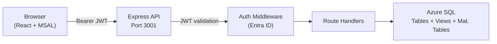

# API Reference Overview

## Introduction

The Identity Atlas UI is backed by a Node.js + Express REST API that queries the PostgreSQL database. All endpoints are prefixed with `/api/` and require Entra ID JWT authentication unless explicitly noted below.

The backend runs on **port 3001** and connects to PostgreSQL using a connection pool. In development, it can run against mock data (set `USE_MOCK=true`).



---

## Authentication

Every request must include a valid Entra ID JWT in the `Authorization` header:

```http
Authorization: Bearer <entra-id-jwt>
```

Two endpoints are exempt and do not require a token:

| Endpoint | Description |
|---|---|
| `GET /api/health` | Health check. Returns `{ status: "ok", mode: "sql" \| "mock" }` |
| `GET /api/auth-config` | MSAL configuration for the frontend. Returns `{ enabled, clientId?, tenantId? }` |

### Security Features

| Feature | Detail |
|---|---|
| Tenant ID validation | Every token is validated against the configured `TENANT_ID` env var |
| Role-based access control | Optional — set `AUTH_REQUIRED_ROLES` env var to a comma-separated list of required Entra ID app roles |
| Rate limiting | 30 requests/min per IP on pre-auth endpoints |
| Security headers | `helmet` middleware applies CSP, HSTS, X-Frame-Options, and Referrer-Policy on all responses |
| Request body size | Capped at 100 KB (`express.json({ limit: '100kb' })`) |

### Environment Variables

| Variable | Required | Description |
|---|---|---|
| `TENANT_ID` | Yes (auth mode) | Entra ID tenant ID — used to validate JWT `tid` claim |
| `CLIENT_ID` | Yes (auth mode) | App registration client ID — returned to frontend via `/api/auth-config` |
| `AUTH_ENABLED` | Yes | Set to `true` to enable JWT validation. A startup warning is logged if unset in production. |
| `AUTH_REQUIRED_ROLES` | No | Comma-separated list of required app roles (e.g. `IdentityAtlas.Read`) |
| `ALLOWED_ORIGINS` | No | Comma-separated allowed CORS origins. Defaults to same-origin in production. |
| `USE_MOCK` | No | Set to `true` to use mock data instead of PostgreSQL (local dev only) |

---

## Endpoint Groups

| Group | Prefix | Description | Reference |
|---|---|---|---|
| Matrix & Permissions | `/api/permissions`, `/api/access-package-groups`, `/api/*-columns` | Permission matrix data, column discovery, sync log | [matrix.md](matrix.md) |
| Entity Detail — Users | `/api/users`, `/api/user/:id` | User list, attributes, memberships, history | [entities.md](entities.md#users) |
| Entity Detail — Resources | `/api/groups`, `/api/resources`, `/api/resources/:id` | Resource list, attributes, members, history | [entities.md](entities.md#resources) |
| Entity Detail — Business Roles | `/api/access-package/:id` | Business role detail, assignments, reviews, requests | [entities.md](entities.md#business-role-detail) |
| Systems & OrgUnits | `/api/systems`, `/api/org-units` | Connected systems and org unit hierarchy | [entities.md](entities.md#systems--orgunits) |
| Identity Correlation | `/api/identities` | Correlated identities across systems | [entities.md](entities.md#identity-correlation) |
| User Preferences | `/api/preferences` | Per-user tab visibility | [entities.md](entities.md#user-preferences) |
| Governance & Business Roles | `/api/access-packages`, `/api/categories` | Business role list and category management | [governance.md](governance.md) |
| Tags | `/api/tags` | Tag CRUD and assignment | [governance.md](governance.md#tag-management) |
| Risk Scores | `/api/risk-scores` | Risk scoring data and analyst overrides | [risk-scores.md](risk-scores.md) |
| Org Chart | `/api/org-chart` | Manager hierarchy tree with risk propagation | [risk-scores.md](risk-scores.md#org-chart) |
| Performance Metrics | `/api/perf` | Request timing and SQL query breakdowns | [entities.md](entities.md#operations) |

---

## Common Conventions

### Pagination

Paginated endpoints accept `limit` and `offset` query parameters and return a `total` field:

```json
{
  "data": [ ... ],
  "total": 1042
}
```

### Error Responses

All errors return a JSON body with a `message` field. SQL schema details are never exposed in error responses.

```json
{
  "message": "Not found"
}
```

| HTTP Status | Meaning |
|---|---|
| `400` | Bad request — invalid parameter value or body |
| `401` | Missing or invalid JWT |
| `403` | Valid JWT but missing required role |
| `404` | Entity not found |
| `429` | Rate limit exceeded |
| `500` | Internal server error |

### Version History Format

Endpoints that return version history (e.g. `GET /api/user/:id/history`) query the `_history` audit table. Each entry includes a `changedAt` timestamp and a `diff` object showing which columns changed from the previous version.

```json
{
  "history": [
    {
      "SysStartTime": "2026-01-15T10:23:00Z",
      "SysEndTime": "2026-02-01T08:00:00Z",
      "displayName": "Jane Doe",
      "department": "Finance",
      "diff": { "department": { "from": "HR", "to": "Finance" } }
    }
  ]
}
```
