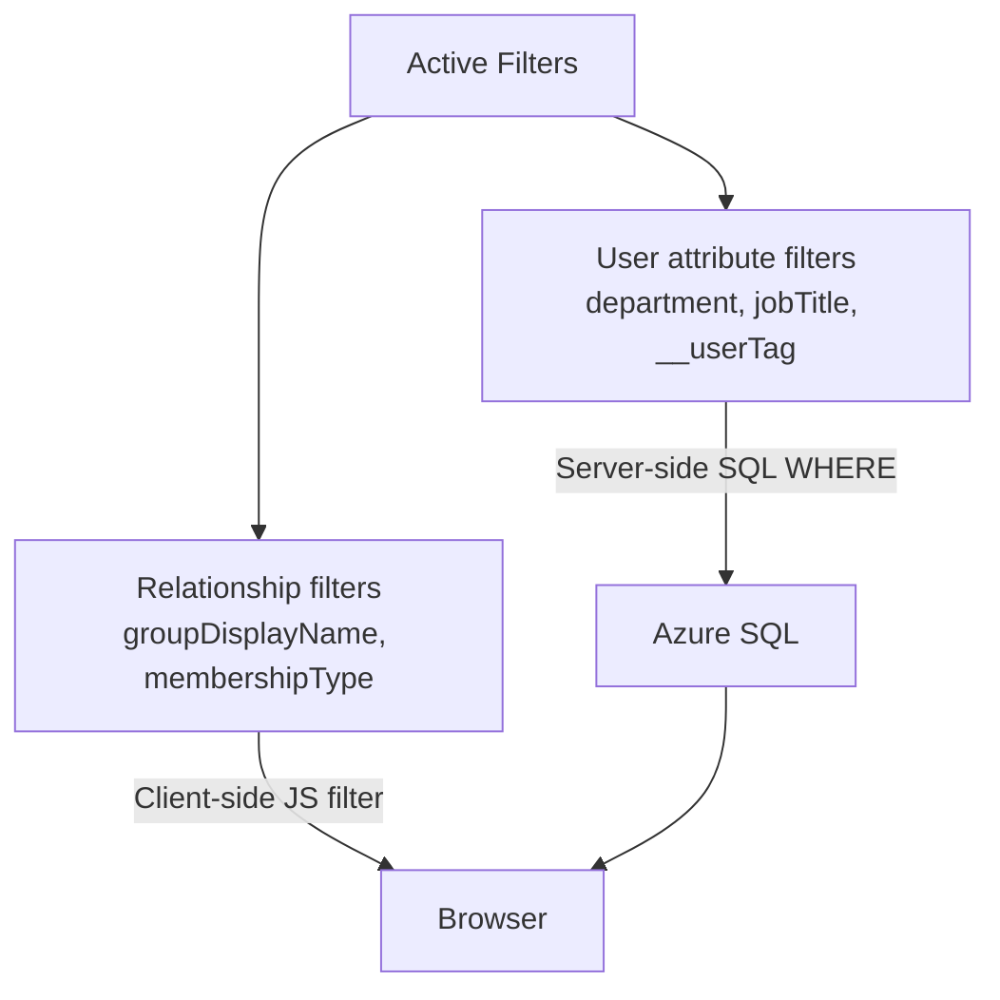

# Matrix & Permissions API

These endpoints power the Matrix view — the permission heatmap showing which users (rows) have access to which resources (columns). All endpoints require `Authorization: Bearer <JWT>`.

---

## Endpoints

### GET /api/permissions

Main matrix data. Returns all permission assignments enriched with user attributes and business role (SOLL) mappings. This is the primary data source for the Matrix view.

**Query Parameters**

| Parameter | Type | Description |
|---|---|---|
| `userLimit` | int | Limit to top N users by assignment count. `0` = return all users. Default: `25`. |
| `filters` | JSON string | Server-side attribute filters applied at the SQL level. See [Filter Architecture](#filter-architecture). Example: `{"department":"HR","__userTag":"VIP"}` |

**Response**

```json
{
  "data": [
    {
      "groupId": "uuid",
      "groupDisplayName": "SG-Finance-Base",
      "memberId": "uuid",
      "memberDisplayName": "Jane Doe",
      "memberupn": "jane.doe@contoso.com",
      "membershipType": "Direct",
      "department": "Finance",
      "jobTitle": "Analyst",
      "managedByAccessPackage": true
    }
  ],
  "totalUsers": 156,
  "managedByPackages": [
    {
      "memberId": "uuid",
      "groupId": "uuid",
      "accessPackageIds": ["ap-001", "ap-007"]
    }
  ]
}
```

**Response Fields**

| Field | Type | Description |
|---|---|---|
| `data` | array | Flat list of membership rows. One row per (user, resource, membershipType) combination. |
| `data[].membershipType` | string | `Direct`, `Indirect`, `Eligible`, or `Owner` |
| `data[].managedByAccessPackage` | boolean | Whether this resource is included in any business role (SOLL column) |
| `totalUsers` | int | Total distinct users before the `userLimit` was applied |
| `managedByPackages` | array | SOLL mapping — which business role IDs govern each (member, group) pair |

**Reads From:** `mat_UserPermissionAssignments` materialized view → `Principals` + `Resources`

---

### GET /api/access-package-groups

Business role → resource mappings used to build SOLL columns in the Matrix. Returns the list of business roles and the resources each one contains, together with catalog and category metadata.

**Response**

```json
{
  "accessPackages": [
    {
      "accessPackageId": "ap-001",
      "accessPackageDisplayName": "Finance Base Access",
      "catalogId": "cat-001",
      "catalogDisplayName": "Corporate Catalog",
      "groupId": "uuid",
      "groupDisplayName": "SG-Finance-Base",
      "roleName": "Member"
    }
  ]
}
```

**Reads From:** `ResourceRelationships` (`relationshipType='Contains'`) + `Resources` (`resourceType='BusinessRole'`) + `GovernanceCatalogs`

---

### GET /api/user-columns

Column discovery for Matrix user-side filters. Queries the `Principals` table to find all non-null columns and returns up to 500 distinct values per column so the frontend can render filter dropdowns.

Also returns virtual columns:

| Virtual Column | Description |
|---|---|
| `__userTag` | Injects a tag filter subquery when used in `filters`. Values are tag names. |
| `__groupTag` | Injects a group-side tag filter subquery. Values are tag names. |

**Response**

```json
{
  "columns": [
    {
      "name": "department",
      "label": "Department",
      "type": "string",
      "values": ["Finance", "HR", "IT", "Legal"]
    },
    {
      "name": "__userTag",
      "label": "User Tag",
      "type": "tag",
      "values": ["VIP", "External", "Contractor"]
    }
  ]
}
```

---

### GET /api/resource-columns

Column discovery for the Resources table. Same response format as `/api/user-columns`. Used to build resource-side filter dropdowns on the Resources page.

**Reads From:** `Resources` table — discovers populated columns dynamically via `db/columnCache.js` (5-minute TTL cache).

---

### GET /api/sync-log

Recent sync log entries from the `GraphSyncLog` table. Used by the Sync Log page.

**Query Parameters**

| Parameter | Type | Default | Description |
|---|---|---|---|
| `limit` | int | 20 | Number of entries to return. Maximum: 100. |

**Response**

```json
{
  "data": [
    {
      "SyncType": "Principals",
      "Status": "Success",
      "StartTime": "2026-03-27T04:00:01Z",
      "EndTime": "2026-03-27T04:01:45Z",
      "RecordsProcessed": 3421,
      "Message": null
    }
  ]
}
```

---

## Filter Architecture

The UI uses a hybrid filtering approach to balance performance and flexibility:



### Server-Side Filters

Applied as SQL `WHERE` clauses before data reaches the browser. Efficient for large environments. Supported sources:

- All columns in the `Principals` table (discovered dynamically)
- `__userTag` — translates to a subquery against `GraphTagAssignments`
- `__groupTag` — translates to a group-side tag subquery

**Example filter JSON:**

```json
{
  "department": "Finance",
  "jobTitle": "Analyst",
  "__userTag": "VIP"
}
```

Multiple filters are combined with `AND`. Values are parameterized — no string interpolation.

### Client-Side Filters

Applied in the browser after data loads. Used for fields that are properties of the relationship row rather than the user:

| Filter Field | Source |
|---|---|
| `membershipType` | `mat_UserPermissionAssignments.membershipType` |
| `groupDisplayName` | `mat_UserPermissionAssignments.groupDisplayName` |
| IST/SOLL toggle | Derived from `managedByAccessPackage` flag |

### The `(Blank)` Sentinel

Tag filter dropdowns include a `(Blank)` option (internal sentinel: `BLANK_TAG`). When selected, the SQL filter becomes `NOT EXISTS (SELECT 1 FROM GraphTagAssignments ...)` — showing entities with no tags at all.

---

## Matrix Rendering Notes

The frontend builds the matrix from the flat `/api/permissions` response:

1. **Row deduplication** — multiple rows for the same user (e.g. `Direct` + `Owner`) are merged into a single user row with multi-type badges per cell.
2. **Owner rows** — `membershipType='Owner'` rows are separated into synthetic rows with suffix `(Owner)` and `id: groupId__owner`.
3. **SOLL columns** — built from `/api/access-package-groups`. Each business role becomes a column. Resources within a role determine which cells are "managed".
4. **AP coloring** — each business role column gets a color from a 15-color palette defined in `MatrixColumnHeaders.jsx`.
5. **Staircase sort** — default row order groups users by their leftmost AP bucket. Custom drag order persists via versioned localStorage.
