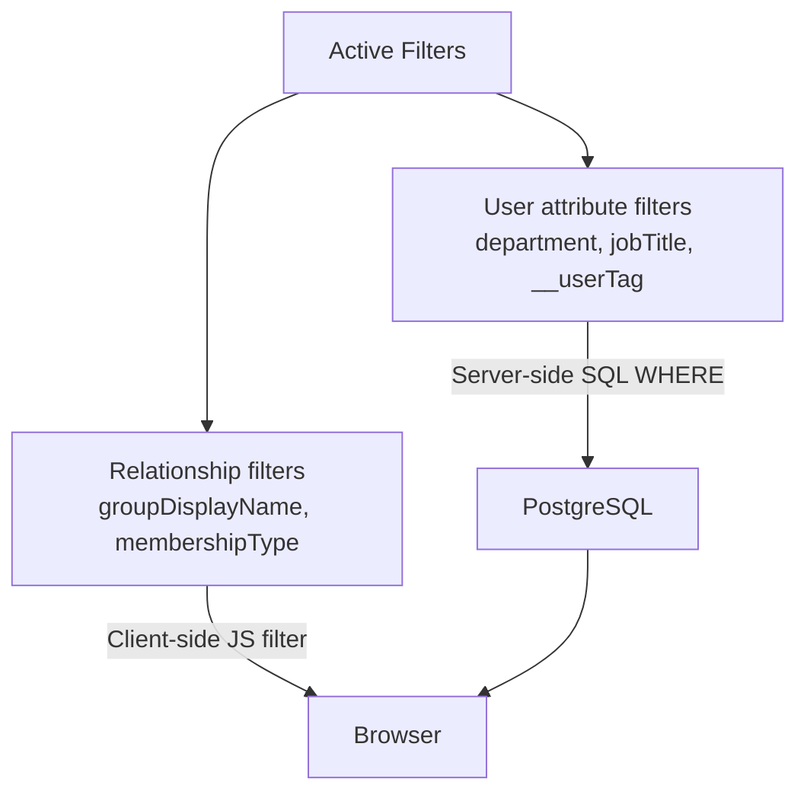

# Matrix & Permissions API

These endpoints power the Matrix view — the permission heatmap showing which users (rows) have access to which resources (columns). All endpoints require `Authorization: Bearer <JWT>`.

---

## Endpoints

### GET /api/permissions

Main matrix data. Returns all permission assignments enriched with user attributes and business role (SOLL) mappings. This is the primary data source for the Matrix view.

**Query Parameters**

| Parameter | Type | Description |
|---|---|---|
| `userLimit` | int | Limit to top N users by assignment count. `0` = return all users. Default: `25`. |
| `filters` | JSON string | Server-side attribute filters applied at the SQL level. See [Filter Architecture](#filter-architecture). Example: `{"department":"HR","__userTag":"VIP"}` |

**Response**

```json
{
  "data": [
    {
      "groupId": "uuid",
      "groupDisplayName": "SG-Finance-Base",
      "memberId": "uuid",
      "memberDisplayName": "Jane Doe",
      "memberupn": "jane.doe@contoso.com",
      "membershipType": "Direct",
      "department": "Finance",
      "jobTitle": "Analyst",
      "managedByAccessPackage": true
    }
  ],
  "totalUsers": 156,
  "managedByPackages": [
    {
      "memberId": "uuid",
      "groupId": "uuid",
      "accessPackageIds": ["ap-001", "ap-007"]
    }
  ]
}
```

**Response Fields**

| Field | Type | Description |
|---|---|---|
| `data` | array | Flat list of membership rows. One row per (user, resource, membershipType) combination. |
| `data[].membershipType` | string | `Direct`, `Indirect`, or `Eligible` |
| `data[].managedByAccessPackage` | boolean | Whether this resource is included in any business role (SOLL column) |
| `totalUsers` | int | Total distinct users before the `userLimit` was applied |
| `managedByPackages` | array | SOLL mapping — which business role IDs govern each (member, group) pair |

**Reads From:** `vw_ResourceUserPermissionAssignments` materialized view → `Principals` + `Resources`

---

### GET /api/access-package-groups

Business role → resource mappings used to build SOLL columns in the Matrix. Returns the list of business roles and the resources each one contains, together with catalog and category metadata.

**Response**

```json
{
  "accessPackages": [
    {
      "accessPackageId": "ap-001",
      "accessPackageDisplayName": "Finance Base Access",
      "catalogId": "cat-001",
      "catalogDisplayName": "Corporate Catalog",
      "groupId": "uuid",
      "groupDisplayName": "SG-Finance-Base",
      "roleName": "Member"
    }
  ]
}
```

**Reads From:** `ResourceRelationships` (`relationshipType='Contains'`) + `Resources` (`resourceType='BusinessRole'`) + `GovernanceCatalogs`

---

### GET /api/matrix/columns

Column discovery for the matrix wizard. Returns every filterable column of the requested entity, plus the scalar `extendedAttributes` keys as `ext.<key>` entries.

**Query Parameters**

| Parameter | Type | Description |
|---|---|---|
| `entity` | string | `Principal`, `Identity` or `Resource`. Required. |
| `schema` | bool | `true` returns column names/types only (no value discovery) — the wizard's fast first paint. |

**Response**

```json
[
  { "column": "resourceType", "type": "text", "values": ["Application", "Group"], "truncated": false },
  { "column": "description",  "type": "text", "values": ["A…", "B…"],             "truncated": true  },
  { "column": "ext.costCenter", "type": "text", "values": ["EU-1"],               "truncated": false }
]
```

`values` is the **alphabetically first page** (max 500) of the column's distinct values — never an arbitrary subset. `truncated: true` means the column has more values than the page holds; use `/api/matrix/column-values` to reach them.

---

### GET /api/matrix/column-values

Substring search across **all** distinct values of one column — the escape hatch for a `truncated` column, so any stored value can still be picked as a filter.

**Query Parameters**

| Parameter | Type | Description |
|---|---|---|
| `entity` | string | `Principal`, `Identity` or `Resource`. Required. |
| `column` | string | A column name or `ext.<key>` from `/api/matrix/columns`. Required; anything else returns `400`. |
| `q` | string | Case-insensitive substring to match (max 200 chars). Wildcards are literal characters. Omit it to get the same preloaded page `/api/matrix/columns` serves. |

**Response**

```json
{ "column": "description", "values": ["Finance team — payroll"], "truncated": false }
```

At most 50 matches are returned; `truncated: true` means the search itself hit that limit and the term should be narrowed.

---

### GET /api/user-columns

Column discovery for Matrix user-side filters. Queries the `Principals` table to find all non-null columns and returns the alphabetically first 500 distinct values per column so the frontend can render filter dropdowns.

Also returns virtual columns:

| Virtual Column | Description |
|---|---|
| `__userTag` | Injects a tag filter subquery when used in `filters`. Values are tag names. |
| `__groupTag` | Injects a group-side tag filter subquery. Values are tag names. |

**Response**

```json
{
  "columns": [
    {
      "name": "department",
      "label": "Department",
      "type": "string",
      "values": ["Finance", "HR", "IT", "Legal"]
    },
    {
      "name": "__userTag",
      "label": "User Tag",
      "type": "tag",
      "values": ["VIP", "External", "Contractor"]
    }
  ]
}
```

---

### GET /api/resource-columns

Column discovery for the Resources table. Same response format as `/api/user-columns`. Used to build resource-side filter dropdowns on the Resources page.

**Reads From:** `Resources` table — discovers populated columns dynamically via `db/columnCache.js` (5-minute TTL cache).

---

### GET /api/sync-log

Recent sync log entries from the `GraphSyncLog` table. Used by the Sync Log page.

**Query Parameters**

| Parameter | Type | Default | Description |
|---|---|---|---|
| `limit` | int | 20 | Number of entries to return. Maximum: 100. |

**Response**

```json
{
  "data": [
    {
      "SyncType": "Principals",
      "Status": "Success",
      "StartTime": "2026-03-27T04:00:01Z",
      "EndTime": "2026-03-27T04:01:45Z",
      "RecordsProcessed": 3421,
      "Message": null
    }
  ]
}
```

---

## Effective Access

These endpoints answer "*can this principal reach this resource, and how?*" — resolving direct grants plus everything reached through group membership (P1) and containment inheritance via `Contains` (P2). They are read-only, bounded (every expansion is capped and reports truncation explicitly rather than dropping results silently), and cached per completed sync. All three require `Authorization: Bearer <JWT>`.

The engine ships **P1** (direct grants + grants reached via group membership) and **P2** (capabilities inherited from ancestor nodes through containment). **P3** (deny-aware / contested resolution) and **P4** (bulk export) are deferred, so today every result comes from a grant-only `AdditiveAllow` policy — there is no `deny` outcome yet.

### GET /api/resource/:id/effective-access

Effective access **at a resource node** for one principal, including capabilities inherited from ancestor nodes via `Contains`. One row per capability the principal effectively holds at the node.

**Path / Query Parameters**

| Parameter | In | Required | Description |
|---|---|---|---|
| `id` | path | yes | The focus resource (node) id. |
| `principalId` | query | yes | The principal to resolve. Returns `400` if omitted. |
| `policy` | query | no | Resolution policy name. Defaults to `AdditiveAllow` (the only policy shipped). An unknown name returns `400`. |

**Response**

```json
{
  "nodeId": "uuid",
  "principalId": "uuid",
  "capabilities": [
    {
      "capabilityId": "read",
      "capabilityResourceId": "uuid",
      "effective": "allow",
      "badge": "Direct"
    }
  ],
  "truncated": null
}
```

| Field | Type | Description |
|---|---|---|
| `capabilities[].effective` | string | `allow` when the principal holds the capability at the node (`none` capabilities are omitted). |
| `capabilities[].badge` | string \| null | Reachability: `Direct`, `Indirect`, or `Eligible`. `Direct` only when the grant is declared at the focus node and held without a group hop; otherwise `Indirect`. |
| `truncated` | object \| null | Non-null when a bound was hit. `{ "holders": N }` if the group-membership expansion was capped, `{ "ancestors": N }` if the containment ascent was capped (either key may be present). `null` when the result is complete. |

### GET /api/principal/:id/effective-access

The principal-centric mirror of the above — same resolution and response shape, with the principal in the path and the focus node in the query.

**Path / Query Parameters**

| Parameter | In | Required | Description |
|---|---|---|---|
| `id` | path | yes | The principal to resolve. |
| `node` | query | yes | The focus resource (node) id. Returns `400` if omitted. |
| `policy` | query | no | As above. |

Response is identical to `GET /api/resource/:id/effective-access` (`{ nodeId, principalId, capabilities[], truncated }`).

### GET /api/effective-access/resolve

The single-pair resolution primitive: the effective access of **one principal on one resource** (direct grants + grants reached via group membership). Lighter than the at-node forms — it does not walk containment.

**Query Parameters**

| Parameter | Required | Description |
|---|---|---|
| `resourceId` | yes | The resource. Returns `400` if omitted. |
| `principalId` | yes | The principal. Returns `400` if omitted. |
| `policy` | no | Resolution policy name. Defaults to `AdditiveAllow`. Unknown name returns `400`. |

**Response**

```json
{
  "resourceId": "uuid",
  "principalId": "uuid",
  "effective": "allow",
  "badge": "Direct",
  "decisiveAce": { "effect": "allow", "distance": 0, "explicit": true, "viaGroupId": null },
  "truncated": null
}
```

| Field | Type | Description |
|---|---|---|
| `effective` | string | `allow` or `none`. (No `deny` — deny-aware resolution is P3.) |
| `badge` | string \| null | `Direct` / `Indirect` / `Eligible`, or `null` when `effective` is `none`. |
| `decisiveAce` | object \| null | The grant that drove the result — `explicit: true` and `viaGroupId: null` mean the principal holds it directly; a non-null `viaGroupId` is the group hop it was reached through. |
| `truncated` | object \| null | `{ "holders": N }` when the group-membership expansion was capped, else `null`. |

**Note:** the cache is keyed on the sync data version, so a completed sync invalidates every cached result at once.

---

## Filter Architecture

The UI uses a hybrid filtering approach to balance performance and flexibility:


```mermaid
flowchart TD
    F[Active Filters] --> US[User attribute filters\ndepartment, jobTitle, __userTag]
    F --> RS[Relationship filters\ngroupDisplayName, membershipType]
    US -->|Server-side SQL WHERE| DB[PostgreSQL]
    RS -->|Client-side JS filter| Browser[Browser]
    DB --> Browser
```

### Server-Side Filters

Applied as SQL `WHERE` clauses before data reaches the browser. Efficient for large environments. Supported sources:

- All columns in the `Principals` table (discovered dynamically)
- `__userTag` — translates to a subquery against `GraphTagAssignments`
- `__groupTag` — translates to a group-side tag subquery

**Example filter JSON:**

```json
{
  "department": "Finance",
  "jobTitle": "Analyst",
  "__userTag": "VIP"
}
```

Multiple filters are combined with `AND`. Values are parameterized — no string interpolation.

### Client-Side Filters

Applied in the browser after data loads. Used for fields that are properties of the relationship row rather than the user:

| Filter Field | Source |
|---|---|
| `membershipType` | `vw_ResourceUserPermissionAssignments.membershipType` |
| `groupDisplayName` | `vw_ResourceUserPermissionAssignments.groupDisplayName` |
| IST/SOLL toggle | Derived from `managedByAccessPackage` flag |

### The `(Blank)` Sentinel

Tag filter dropdowns include a `(Blank)` option (internal sentinel: `BLANK_TAG`). When selected, the SQL filter becomes `NOT EXISTS (SELECT 1 FROM GraphTagAssignments ...)` — showing entities with no tags at all.

---

## Matrix Rendering Notes

The frontend builds the matrix from the flat `/api/permissions` response:

1. **Row deduplication** — multiple rows for the same user (e.g. `Direct` + `Eligible`) are merged into a single user row with multi-type badges per cell.
2. **Ownership rows** — group ownership is its own resource (`resourceType='GroupOwnership'`), so an owner appears as a `Direct` membership on that ownership resource — a normal row, not a synthetic `Owner`-type split.
3. **SOLL columns** — built from `/api/access-package-groups`. Each business role becomes a column. Resources within a role determine which cells are "managed".
4. **AP coloring** — each business role column gets a color from a 15-color palette defined in `MatrixColumnHeaders.jsx`.
5. **Staircase sort** — default row order groups users by their leftmost AP bucket. Custom drag order persists via versioned localStorage.
