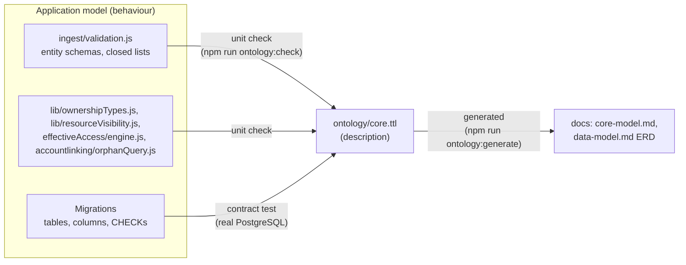

# Core Ontology

Identity Atlas stores a graph in PostgreSQL: five node tables (Systems, Principals, Resources,
Identities, Contexts) and five edge tables (ResourceAssignments, ResourceRelationships,
PrincipalRelationships, IdentityMembers, ContextMembers). Until now that graph had no written-down
schema. The tables were in the migrations, the allowed values in the ingest validation, the
meaning in comments and in several documentation pages, and they had drifted apart.

The **core ontology** is that written-down schema: an OWL ontology in Turtle,
[`ontology/core.ttl`](https://github.com/Fortigi/IdentityAtlas/blob/main/ontology/core.ttl), in the
namespace `https://identityatlas.io/ontology#`. It describes the model. It does not drive it:
PostgreSQL stays the store, and no query, ingest path or screen reads the ontology at runtime.

The human-readable version is the generated [Core Model Reference](../reference/core-model.md).
How to change it: [Maintaining the Core Ontology](../contributing/maintaining-the-ontology.md).

---

## Three representations, one direction of truth

- **The implementation decides behaviour.** When code and ontology disagree, the check fails and a
  human decides which one is wrong. The ontology never silently changes what the application does.
- **The ontology is the single description.** Every table, column, type value and relationship type
  of the core model is in it, with a meaning.
- **Documentation is generated from the ontology** where it describes the core model, and checked
  where it is hand-drawn. Nobody keeps a third copy in sync by hand.

The checks read the code's own constants (`SCHEMAS`, `RELATIONSHIP_TYPES`, `OWNERSHIP_RESOURCE_TYPES`,
…) — they never keep their own list of types. Where a list only existed inline, it was extracted to
an exported constant that the code itself uses (`CONTEXT_VARIANTS`, `CONTEXT_TARGET_TYPES`,
`CONTEXT_MEMBER_ADDED_BY` in `validation.js`, now also used by `routes/contexts/shared.js`).

---

## How the model maps to OWL

| Implementation | Ontology | Example |
|---|---|---|
| Node table | `owl:Class`, subclass of `ia:Node`, `ia:table` | `ia:Principal` ↔ `Principals` |
| Edge table (a row with its own columns) | `owl:Class`, subclass of `ia:Edge`, with `ia:sourceProperty` / `ia:targetProperty` | `ia:ResourceAssignment` ↔ `ResourceAssignments` |
| Row identifier (`id`) | the instance IRI — not a property (`ia:identifierColumn`, `ia:identifierSqlType`) | |
| Column | property **named exactly like the column**, `ia:sqlType` = its PostgreSQL type | `Principals.accountEnabled` → `ia:accountEnabled` |
| Same column name on several tables | one property, `rdfs:domain` is the `owl:unionOf` those classes | `ia:displayName` |
| Foreign-key column | `owl:ObjectProperty`, range = the referenced class | `ia:managerId` → `ia:Principal` |
| Other column | `owl:DatatypeProperty`, range from the SQL type (text → `xsd:string`, jsonb → `rdf:JSON`, …) | `ia:governed` → `xsd:boolean` |
| `principalType` (closed) / `resourceType` (open) | subclasses with `ia:typeValue`; the parent has `ia:discriminator` (and `ia:openVocabulary true` when any value is accepted) | `ia:AIAgent` ⊑ `ia:Principal` |
| `relationshipType` value | `owl:ObjectProperty` named lowerCamel of the value, with `ia:typeValue`, `ia:storedIn` the edge class, and the classes it connects as domain / range | `ia:hasAppRole`: `ia:Application` → `ia:AppRole` |
| Closed value list (`assignmentType`, `origin`, `effect`, `variant`, …) | a class whose `owl:NamedIndividual`s are the values, named `<List>_<value>`; the column points at it with `ia:valueScheme` | `ia:AssignmentType_Direct` |
| Ownership resources (`lib/ownershipTypes.js`) | subclasses of `ia:OwnershipResource` | `ia:GroupOwnership` |

Every term carries `rdfs:label`, `rdfs:comment` and `rdfs:isDefinedBy <https://identityatlas.io/ontology>`.
The mapping annotations (`ia:table`, `ia:sqlType`, `ia:typeValue`, …) are `owl:AnnotationProperty`,
so OWL reasoners ignore them and standard tools load the file unchanged.

**Why edges are classes.** An assignment has fields (`assignmentType`, `governed`, `origin`, …). In
RDF that means the edge becomes a node of its own — the "edge-with-fields" pattern. The
relationship-type properties (`ia:contains`, `ia:owner`, …) are the direct shortcut between the two
end nodes and say which classes each type connects; the edge class says where the row is stored.

**What the ontology does not say.** Nullability, keys, indexes, materialised views, history and
soft-delete mechanics, which keys appear inside `extendedAttributes`, and which `contextType` values
exist. Those are either physical design (the migrations own them) or data-dependent (a future
per-install layer, below).

---

## Scope

**In:** the five node and five edge tables above, every column of them, every closed value list
the ingest or the database enforces on them, every relationship type, every principal type, and the
resource types the application's own code branches on (ownership, business role, group, the Entra
application family, directory roles).

**Out, for now** — each is declared with a reason in
[`ontology/validation.json`](https://github.com/Fortigi/IdentityAtlas/blob/main/ontology/validation.json),
so a *new* ingest entity type cannot silently fall outside the model:

- the governance satellite tables (GovernanceCatalogs, AssignmentPolicies, AssignmentRequests,
  CertificationDecisions) — business roles themselves *are* in the core, as Resources;
- PrincipalActivity and RiskScores;
- resource types that only one crawler emits (`Entitlement`, `Service`, Omada's `Resource`,
  Azure RM types, whatever a CSV or SQL source calls things) and every `contextType` value — these are
  exactly what the dynamic layer is for.

---

## What is checked, and where

| # | Check | Compared with | Runs in |
|---|---|---|---|
| 1 | Turtle syntax | N3.js parser | `ontology:check` (unit job) |
| 2 | Every ingest entity type is a class or declared out of scope | `SCHEMAS` / `ENTITY_TABLE_MAP` in `validation.js` | `ontology:check` |
| 3 | Every closed list the ingest enforces equals the ontology's — relationship types, principal types, assignment types, origins, context variant / target / member type, addedBy — **both directions** | the `enum` of each `SCHEMAS` field | `ontology:check` |
| 3 | Resource / principal types the code branches on are declared | `OWNERSHIP_RESOURCE_TYPES`, `HIDDEN_BY_DEFAULT_RESOURCE_TYPES`, `GROUP_RESOURCE_TYPES`, `NON_HUMAN_PRINCIPAL_TYPES` | `ontology:check` |
| 4 | Relationship types connect what their edge table connects; ownership relationships point at ownership resources and match `OWNERSHIP_RELATIONSHIP_TYPES`; a polymorphic target (`memberId`) matches its kind column; a foreign key has its target's identifier type | the ontology's own edge definitions and `lib/ownershipTypes.js` | `ontology:check` |
| 5 | Every ingest field of a core entity is a column or a declared alias, with a compatible type | `SCHEMAS` fields | `ontology:check` |
| 5 | Every column of every core table is described, with the same type; nothing described is missing; every `IN (…)` CHECK constraint equals the ontology's list | `information_schema.columns`, `pg_constraint` of a database migrated from scratch | contract test (`Contract Tests` job) |
| 6 | No term declared twice or as two kinds, no conflicting annotations, no case-only clashes, no undeclared references, naming conventions | the ontology itself | `ontology:check` |
| — | Data-model diagrams in the docs are generated, validated or marked out of scope; the generated reference page is current | the docs | `ontology:check` |

**Not automated, deliberately:** whether a description is *right*; the prose type tables in
`CLAUDE.md`, `docs/concepts/data-model.md` and `docs/architecture/ingest-api.md`; the literal values
crawlers emit (the existing `assignmentTypes.guard.test.js` / `resourceTypes.guard.test.js` scans
cover the retired ones); the relationship lines of hand-drawn diagrams; and the
report-generator catalog (`nlreports/catalog.js`), which keeps its own column list for the LLM
prompt and is the strongest candidate to be generated from the ontology next.

### Diagram inventory

Only `erDiagram` and `classDiagram` can draw a data model, so only those are in scope; each must be
generated, validated or explicitly out of scope (an unmarked one fails the check).

| Diagram | Status |
|---|---|
| `concepts/data-model.md` — Entity Relationship Diagram | **generated** (`core-erd`) |
| `reference/core-model.md` — type hierarchy and relationship types | **generated** (`core-classes`) |
| `concepts/data-model.md` — satellite tables (PrincipalActivity, RiskScores) | validated |
| `concepts/governance-model.md` — Governance Entity Diagram | validated (its Resources / ResourceAssignments / ResourceRelationships attributes are checked against the ontology) |
| `concepts/risk-scoring-model.md` — risk tables | out of scope |
| `architecture/ingest-api.md` — crawler credential tables | out of scope |
| every flowchart, graph, sequence, state and gantt diagram (in `api/`, `architecture/`, `concepts/governance-model.md`, `process/`, `risk-scoring/`, `sync/`, `ui/`, and this page) | out of scope by type: process and architecture, not the data model |

---

## Inconsistencies found

Found while writing the ontology. None is fixed here — this feature describes, it does not change
behaviour — except stale documentation. The implementation-side ones are recorded as known gaps in
`ontology/validation.json`, so the check passes today and fails when one is fixed without removing
its entry (the list only shrinks).

1. **`contextId` is still accepted by the ingest on principals, resources and identities**, but the
   columns were dropped by the v6 Contexts redesign (migration 018). The value ends up in
   `extendedAttributes`.
2. **Contexts have no manager columns.** `validation.js`, `normalization.js` and the data-model page
   say a context carries `managerId` / `managerIdentityId`; the table has neither, so
   `managerExternalId` / `managerIdentityExternalId` on a context never resolve.
   `routes/riskScores/list.js` (the `contexts` entity type) still selects `Contexts.managerId`,
   `department` and `memberCount`, none of which exist — that query fails at runtime.
3. **`ContextMembers.memberId` is a uuid, `Systems.id` an integer**, yet `memberType` / `targetType`
   admit `System`. A System member cannot reference its system; `routes/contexts/read.js` compares the
   two as text, which never matches.
4. **`policyId`** is validated as free text by the ingest but is a `uuid` column, so a non-uuid
   policy id passes validation and fails at insert.
5. **`IdentityMembers` has no `extendedAttributes` column**, but the ingest accepts the field.
6. **`ResourceRelationships.relationshipType` has no CHECK constraint** — only the ingest enforces
   the list — while `assignmentType`, `origin` and `PrincipalRelationships.relationshipType` are
   enforced by both. `principalType` likewise has no CHECK.
7. **`GrantsAccessTo` is called "reserved / not yet emitted"** in `CLAUDE.md` and the ingest API page,
   but the CSV and SQL connectors emit it and the demo dataset uses it.
8. **`Systems.resourceTypes` / `assignmentTypes`** exist and are never read or written.
9. **The same lists are kept by hand in crawler code**: `tools/crawlers/mssql/wizardLogic.js`
   (`PRINCIPAL_TYPES`, `RELATIONSHIP_TYPES`, `CONTEXT_TARGET_TYPES`), `SqlCrawler.Functions.ps1`
   (`$SqlRelTypes`, `$SqlContextTargetTypes`) and the SQL crawler's `crawler.json` enum. They are
   subsets today and nothing keeps them in step.
10. **Stale documentation, fixed here:** the data-model ERD showed `linkedAt` on IdentityMembers (it is
    on Identities only), typed `extendedAttributes` as TEXT and `riskScore` as decimal (they are jsonb
    and integer), and omitted PrincipalRelationships; the PrincipalActivity section named columns
    (`lastActivityDateTime`, `activityCount`, a `systemId` key) the table does not have.

---

## Future: dynamic ontology extensions

Not built. The core is designed so that it never has to change for them.

**Two layers, never mixed.**

| | Core | Dynamic extensions |
|---|---|---|
| Lives in | `ontology/core.ttl`, in Git | the database (one Turtle document per extension, with status and provenance) |
| Namespace | `https://identityatlas.io/ontology#` | per install, e.g. `https://identityatlas.io/ext/<installId>#` |
| Changed by | a pull request, gated by CI | a user approving a proposal (from a wizard or a local LLM) |
| Defined by | `rdfs:isDefinedBy <https://identityatlas.io/ontology>` | `rdfs:isDefinedBy` the extension's own ontology IRI, which `owl:imports` the core version it was made against |

**What an extension may say.** New subclasses of core classes (`ext:SAPRole rdfs:subClassOf
ia:Resource ; ia:typeValue "SAP Role"`), new contextType classes under `ia:Context`, properties for
keys inside `extendedAttributes` (an annotation such as `ia:jsonKey "risk"` would map them), labels
and descriptions of its own terms. **What it may not:** declare a term in the core namespace, or add
any triple whose subject is a core term. The same integrity checks plus that one rule gate every
proposal before a user can approve it, so an approved extension cannot alter the core.

**Effective ontology** = core ∪ approved extensions, merged as RDF graphs. Core-only, dynamic-only and
combined views fall out of filtering on `rdfs:isDefinedBy`; the Mermaid and reference generators
already take a parsed model, so they draw any of the three without change. An effective-ontology
export (Turtle, plus RDF/XML for tools that need it) would be the first API endpoint, behind the
existing data-export permission. The background proposal's "type registry" (ingest recording which
resource types, context types and attribute keys each system produced) is the natural data source
for the proposals.

---

## Export

The artifact is the Turtle file in the repository, readable by Protégé, rdflib, Apache Jena or any
RDF/OWL tool, also linked from the reference page as a raw download. There is deliberately no API
endpoint yet: the core ontology is the same for every install, so serving it from the app adds
nothing until per-install extensions exist. The namespace IRI is not dereferenceable today;
publishing `core.ttl` at `https://identityatlas.io/ontology` is an open decision.
