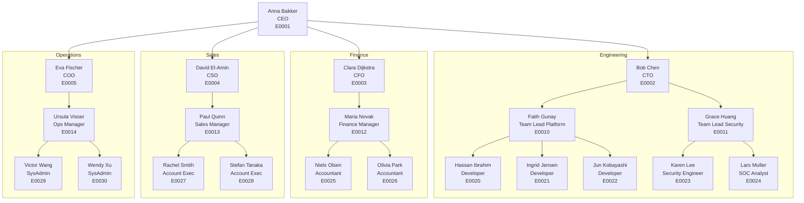

# Demo Dataset & End-to-End Validation

A purpose-built synthetic dataset for testing every feature of Identity Atlas. Fully controlled — every record, relationship, and edge case is intentional, so tests can assert on exact values.

---

## The Company: Fortigi Demo Corp

A mid-size technology consultancy with 50 employees across 4 departments. Small enough to reason about, large enough to exercise all features.

### Org Chart



### Edge Cases Built Into the Dataset

| Scenario | Employee | Why It Matters |
|---|---|---|
| CEO with no manager | E0001 Anna Bakker | Root of org tree; manager reference is null |
| External contractor | E0040 Yuki Zhao | `principalType: ExternalUser`; no identity correlation |
| Disabled account | E0041 Alex Former | `accountEnabled: false`; left the company; should still show in history |
| Service principal | SVC-001 Deploy Pipeline | Non-human; `principalType: ServicePrincipal`; member of admin groups |
| AI agent | AI-001 Copilot Assistant | `principalType: AIAgent`; member of data access groups |
| Multi-system identity | E0020 Hassan Ibrahim | Has accounts in both EntraID and Omada; identity correlation links them |
| Shared mailbox | SM-001 info@fortigidemo.com | `principalType: SharedMailbox`; owned by E0027 |
| Manager in different dept | E0014 Ursula Visser | Reports to COO but manages Operations — tests cross-dept context |
| Employee with no assignments | E0031 Intern | Principal exists but has zero resource assignments |

### Systems

| System | Type | Content |
|---|---|---|
| Fortigi Demo EntraID | `EntraID` | Principals (users, SPs, AI agents), groups, directory roles |
| Fortigi Demo HR | `HR` | Identities, org units (HR department tree), employment |
| Fortigi Demo Omada | `Omada` | Business roles, governed assignments, certifications |

### Context Trees (Independent)

**HR Department Tree** (linked to Identities):

```
Fortigi Demo Corp
├── Engineering
│   ├── Platform Team
│   └── Security Team
├── Finance
├── Sales
└── Operations
```

**EntraID Admin Units** (linked to Principals):

```
AU-Netherlands
AU-Germany
AU-Contractors
```

### Resources

| Resource | Type | System | Purpose |
|---|---|---|---|
| SG-AllEmployees | EntraGroup | EntraID | All active employees |
| SG-Engineering | EntraGroup | EntraID | Engineering department |
| SG-Finance | EntraGroup | EntraID | Finance department |
| SG-VPN-Access | EntraGroup | EntraID | VPN access group |
| SG-Admin-Tier0 | EntraGroup | EntraID | Tier 0 admin — high risk |
| SG-PAM-Users | EntraGroup | EntraID | PAM access |
| Global Administrator | EntraDirectoryRole | EntraID | Entra directory role |
| SharePoint Admin | EntraDirectoryRole | EntraID | Entra directory role |
| FortigiGraph-App | EntraAppRole | EntraID | App role for this product |
| SAP-Finance-Role | EntraAppRole | EntraID | SAP financial access |
| BR-Employee-Base | BusinessRole | Omada | Base employee access package |
| BR-Engineering-Tools | BusinessRole | Omada | Dev tools access package |
| BR-Finance-Systems | BusinessRole | Omada | Financial systems access |
| BR-Admin-Privileged | BusinessRole | Omada | Privileged admin access |

### Assignments (Who Has What)

| Principal | Resource | Type | Notes |
|---|---|---|---|
| All 30 employees | SG-AllEmployees | Direct | |
| E0010-E0024 (Engineering) | SG-Engineering | Direct | |
| E0025-E0026 (Finance) | SG-Finance | Direct | |
| E0029, E0030 (SysAdmins) | SG-VPN-Access | Direct | |
| E0002 (CTO) | SG-Admin-Tier0 | Owner | CTO owns the admin group |
| E0029 (SysAdmin) | SG-Admin-Tier0 | Direct | Member of high-risk group |
| SVC-001 (Deploy Pipeline) | SG-Admin-Tier0 | Direct | Service principal in admin group |
| E0002 (CTO) | Global Administrator | Direct | Directory role assignment |
| All 30 employees | BR-Employee-Base | Governed | Via business role |
| E0010-E0024 | BR-Engineering-Tools | Governed | Via business role |
| E0029 (SysAdmin) | BR-Admin-Privileged | Eligible | PIM-eligible, not active |

### Resource Relationships

| Parent | Child | Type | Notes |
|---|---|---|---|
| BR-Employee-Base | SG-AllEmployees | Contains | Business role grants group |
| BR-Employee-Base | FortigiGraph-App | Contains | Business role grants app role |
| BR-Engineering-Tools | SG-Engineering | Contains | |
| BR-Engineering-Tools | SG-VPN-Access | Contains | |
| BR-Finance-Systems | SG-Finance | Contains | |
| BR-Finance-Systems | SAP-Finance-Role | Contains | |
| BR-Admin-Privileged | SG-Admin-Tier0 | Contains | |
| BR-Admin-Privileged | SG-PAM-Users | Contains | |
| SG-Engineering | SG-AllEmployees | GrantsAccessTo | Nested group |

### Governance

| Entity | Data |
|---|---|
| Catalog: "Employee Access" | Contains BR-Employee-Base, BR-Engineering-Tools, BR-Finance-Systems |
| Catalog: "Privileged Access" | Contains BR-Admin-Privileged |
| Policy: "Auto-assign all employees" | On BR-Employee-Base, scope: all, auto-approve |
| Policy: "Manager approval" | On BR-Engineering-Tools, requires manager approval |
| Policy: "Dual approval" | On BR-Admin-Privileged, requires manager + security team |
| Certification: Q1 2026 Review | Reviewed E0029's access to BR-Admin-Privileged — decision: Approve |
| Certification: Q1 2026 Review | Reviewed E0041's access to BR-Employee-Base — decision: Deny (left company) |

### Identity Correlation

| Identity | Principals | Correlation |
|---|---|---|
| Anna Bakker (ID-001) | E0001 (EntraID), E0001-omada (Omada) | employeeId match |
| Hassan Ibrahim (ID-020) | E0020 (EntraID), E0020-omada (Omada) | employeeId match |
| Yuki Zhao (Contractor) | E0040 (EntraID) | No identity — external, uncorrelated |
| Deploy Pipeline | SVC-001 (EntraID) | No identity — non-human |

---

## Dataset Format

The dataset is a single JSON file that maps directly to the Ingest API endpoints. The nightly test script reads it and POSTs each section to the appropriate endpoint.

**File:** `_Test/DemoDataset/demo-company.json`

```json
{
  "metadata": {
    "company": "Fortigi Demo Corp",
    "version": "1.0",
    "description": "Synthetic dataset for E2E testing",
    "entityCounts": {
      "systems": 3,
      "principals": 35,
      "resources": 14,
      "resourceAssignments": 85,
      "resourceRelationships": 9,
      "identities": 32,
      "identityMembers": 34,
      "contexts": 8,
      "governanceCatalogs": 2,
      "assignmentPolicies": 3,
      "certificationDecisions": 2
    }
  },
  "systems": [ ... ],
  "principals": [ ... ],
  "resources": [ ... ],
  "resourceAssignments": [ ... ],
  "resourceRelationships": [ ... ],
  "identities": [ ... ],
  "identityMembers": [ ... ],
  "contexts": [ ... ],
  "governanceCatalogs": [ ... ],
  "assignmentPolicies": [ ... ],
  "certificationDecisions": [ ... ]
}
```

---

## Verification Tests

After ingesting the demo dataset, the nightly runner executes these verification checks. Every check has an expected value derived from the dataset definition above.

### Table Row Counts

| Table | Expected | Query |
|---|---|---|
| Systems | 3 | `SELECT COUNT(*) FROM Systems WHERE ValidTo = '9999-12-31...'` |
| Principals | 35 | Includes: 30 employees + 1 contractor + 1 disabled + 1 SP + 1 AI + 1 shared mailbox |
| Resources | 14 | 6 groups + 2 directory roles + 2 app roles + 4 business roles |
| ResourceAssignments | ~85 | Direct + Owner + Eligible + Governed |
| ResourceRelationships | 9 | 8 Contains + 1 GrantsAccessTo |
| Identities | 32 | 30 active employees + 1 disabled + 1 multi-system |
| IdentityMembers | 34 | 32 primary links + 2 secondary (multi-system) |
| Contexts | 8 | 1 root + 4 departments + 2 teams + 1 admin unit |
| GovernanceCatalogs | 2 | Employee + Privileged |
| AssignmentPolicies | 3 | Auto-assign + Manager approval + Dual approval |
| CertificationDecisions | 2 | 1 approve + 1 deny |

### Relationship Integrity

| Check | Expected |
|---|---|
| Every principal has a `systemId` that exists in Systems | 0 orphans |
| Every resource has a `systemId` that exists in Systems | 0 orphans |
| Every assignment's `resourceId` exists in Resources | 0 orphans |
| Every assignment's `principalId` exists in Principals | 0 orphans |
| Every identity member's `identityId` exists in Identities | 0 orphans |
| Every identity member's `principalId` exists in Principals | 0 orphans |
| Every context's `parentContextId` (if set) exists in Contexts | 0 orphans |
| Every principal's `managerId` (if set) exists in Principals | 0 orphans |

### Specific Business Logic

| Check | Expected |
|---|---|
| CTO (E0002) has `assignmentType='Owner'` on SG-Admin-Tier0 | True |
| CTO (E0002) has `assignmentType='Direct'` on Global Administrator role | True |
| SysAdmin (E0029) has `assignmentType='Eligible'` on BR-Admin-Privileged | True |
| Contractor (E0040) has NO entry in Identities | True |
| Service principal (SVC-001) has `principalType='ServicePrincipal'` | True |
| AI agent (AI-001) has `principalType='AIAgent'` | True |
| Disabled account (E0041) has `accountEnabled=0` | True |
| Intern (E0031) has 0 resource assignments | True |
| BR-Employee-Base contains SG-AllEmployees (relationship) | True |
| BR-Admin-Privileged is in catalog "Privileged Access" | True |
| Engineering context has parent = "Fortigi Demo Corp" | True |
| Platform Team context has parent = "Engineering" | True |
| Anna Bakker's identity links to 2 principals (EntraID + Omada) | True |

### UI Verification (Playwright)

| Check | How |
|---|---|
| Resources page shows 14 resources (excluding BusinessRoles) | Count rows, filter by non-BusinessRole |
| Business Roles page shows 4 business roles | Count rows |
| Users page shows 35 principals | Count visible or total indicator |
| Matrix shows data (not "0 users x 0 resources") | Assert text not present |
| Click CTO user → detail page opens | Navigate, check heading |
| CTO detail shows "Global Administrator" in memberships | Assert membership listed |
| Click SG-Admin-Tier0 group → detail page shows 2 members | Navigate, count members |
| BR-Employee-Base detail shows 2 resource grants (Contains) | Check relationships section |
| Org chart shows Fortigi Demo Corp as root | Check tree root |
| Swagger UI loads at /api/docs | HTTP 200 |
| Crawlers page loads (admin tab) | Navigate, check heading |
| Sync log shows entries from the demo ingest | Check table has rows |

---

## Implementation

### Step 1: Generate the Dataset

**Script:** `_Test/DemoDataset/Generate-DemoDataset.ps1`

Generates `demo-company.json` with all entities. Uses deterministic GUIDs so the same IDs are generated every time, allowing tests to assert on specific values.

### Step 2: Ingest Script

**Script:** `_Test/DemoDataset/Ingest-DemoDataset.ps1`

Reads `demo-company.json` and POSTs each section to the Ingest API in dependency order:
1. Systems
2. Contexts
3. Principals
4. Resources
5. ResourceAssignments
6. ResourceRelationships
7. Identities + IdentityMembers
8. Governance (catalogs, policies, certifications)
9. Refresh views

### Step 3: Verification Script

**Script:** `_Test/DemoDataset/Verify-DemoDataset.ps1`

Runs all row count, relationship integrity, business logic, and API verification checks. Returns pass/fail per check with details.

### Step 4: Playwright E2E Specs

**Specs:** `UI/frontend/e2e/demo-dataset/`

Browser-based checks that verify the ingested data shows up correctly in the UI.

### Step 5: Integration into Nightly Runner

Add to `Run-NightlyLocal.ps1` between the Docker provisioning and Playwright phases:
1. Generate dataset
2. Ingest via API
3. Run verification script
4. Run demo-specific Playwright specs
