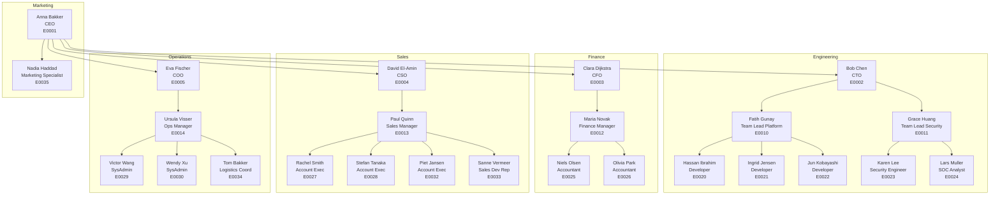

# Demo Dataset & End-to-End Validation

!!! danger "This whole page is a spoiler"
    It documents the dataset in full — including the records that exist only to be the wrong answer. If you want to play [Capture the Flag](../demo/capture-the-flag.md), go there instead and don't read on. (The answer key itself is collapsed further down, but the tables above it give plenty away.)

A purpose-built synthetic dataset for testing every feature of Identity Atlas. Fully controlled — every record, relationship, and edge case is intentional, so tests can assert on exact values.

It also backs the **public demo environment** and hides the **Capture-the-Flag** scenarios from issue #705 — see [Capture-the-Flag scenarios](#capture-the-flag-scenarios) below. That is why several records exist purely as distractors: a flag is only interesting if a plausible wrong answer sits next to the right one.

## How it's generated

`test/demo-dataset/Generate-DemoDataset.ps1` is a thin orchestrator. Each domain lives in its own file under `parts/`, dot-sourced in order and appending into one shared state object via record builders (`Add-DemoResource`, `Add-DemoAssignment`, …), so the shape of each record is defined once:

| Part | Owns |
|---|---|
| `DemoState.ps1` | `New-DemoGuid`, the state accumulator, the record builders |
| `DemoOrg.ps1` | Systems, the context tree, people, identities |
| `DemoEntraBase.ps1` | Entra groups / directory roles / app roles / group ownership |
| `DemoGovernance.ps1` | IGA catalogs, business roles, policies, certifications |
| `DemoSalesScenario.ps1` | The Sales role-mining scenario (flags 1–7) |
| `DemoRoleDrift.ps1` | Role holders with fewer / more access than their business role assigns |
| `DemoSharedGrants.ps1` | The overlap between two business roles — one group and one app role granted by both |
| `DemoConsent.ps1` | OAuth consent + shadow IT (flags 11–12) |
| `DemoSap.ps1` | The SAP ERP system (flag 8) |
| `DemoAzure.ps1` | The AzureRM system (flag 10) |

GUIDs are a pure function of a seed string (`New-DemoGuid`), so any part can reference another part's record without an ordering contract, and the whole dataset is byte-stable across runs.

> **`demo-company.json` is a build artifact, not a source file.** It is gitignored — always regenerate rather than relying on a copy on disk.

---

## The Company: Fortigi Demo Corp

A mid-size technology consultancy with 26 employees across 6 departments. Small enough to reason about, large enough to exercise all features.

### Org Chart


```mermaid
graph TB
    CEO["Anna Bakker<br/>CEO<br/>E0001"]
    CTO["Bob Chen<br/>CTO<br/>E0002"]
    CFO["Clara Dijkstra<br/>CFO<br/>E0003"]
    CSO["David El-Amin<br/>CSO<br/>E0004"]
    COO["Eva Fischer<br/>COO<br/>E0005"]

    CEO --> CTO
    CEO --> CFO
    CEO --> CSO
    CEO --> COO

    subgraph Engineering
        CTO --> TL1["Fatih Gunay<br/>Team Lead Platform<br/>E0010"]
        CTO --> TL2["Grace Huang<br/>Team Lead Security<br/>E0011"]
        TL1 --> DEV1["Hassan Ibrahim<br/>Developer<br/>E0020"]
        TL1 --> DEV2["Ingrid Jensen<br/>Developer<br/>E0021"]
        TL1 --> DEV3["Jun Kobayashi<br/>Developer<br/>E0022"]
        TL2 --> SEC1["Karen Lee<br/>Security Engineer<br/>E0023"]
        TL2 --> SEC2["Lars Muller<br/>SOC Analyst<br/>E0024"]
    end

    subgraph Finance
        CFO --> FM["Maria Novak<br/>Finance Manager<br/>E0012"]
        FM --> ACC1["Niels Olsen<br/>Accountant<br/>E0025"]
        FM --> ACC2["Olivia Park<br/>Accountant<br/>E0026"]
    end

    subgraph Sales
        CSO --> SM["Paul Quinn<br/>Sales Manager<br/>E0013"]
        SM --> SR1["Rachel Smith<br/>Account Exec<br/>E0027"]
        SM --> SR2["Stefan Tanaka<br/>Account Exec<br/>E0028"]
        SM --> SR3["Piet Jansen<br/>Account Exec<br/>E0032"]
        SM --> SR4["Sanne Vermeer<br/>Sales Dev Rep<br/>E0033"]
    end

    subgraph Operations
        COO --> OM["Ursula Visser<br/>Ops Manager<br/>E0014"]
        OM --> OPS1["Victor Wang<br/>SysAdmin<br/>E0029"]
        OM --> OPS2["Wendy Xu<br/>SysAdmin<br/>E0030"]
        OM --> OPS3["Tom Bakker<br/>Logistics Coord<br/>E0034"]
    end

    subgraph Marketing
        CEO --> MK1["Nadia Haddad<br/>Marketing Specialist<br/>E0035"]
    end
```

### Edge Cases Built Into the Dataset

| Scenario | Employee | Why It Matters |
|---|---|---|
| CEO with no manager | E0001 Anna Bakker | Root of org tree; manager reference is null |
| External contractor | E0040 Yuki Zhao | `principalType: ExternalUser`; no identity correlation |
| Disabled account | E0041 Alex Former | `accountEnabled: false`; left the company; should still show in history |
| Service principal | SVC-001 Deploy Pipeline | Non-human; `principalType: ServicePrincipal`; member of admin groups |
| AI agent | AI-001 Copilot Assistant | `principalType: AIAgent`; member of data access groups |
| Multi-system identity | E0020 Hassan Ibrahim | Has accounts in EntraID, the IGA system and SAP; identity correlation links them |
| Shared mailbox | SM-001 info@fortigidemo.com | `principalType: SharedMailbox`; owned by E0027 |
| Manager in different dept | E0014 Ursula Visser | Reports to COO but manages Operations — tests cross-dept context |
| Employee with no assignments | E0031 Zara Intern | A new hire not yet provisioned: flagged `noAccess` in the generator, so she is excluded from every department group and business-role grant. She still exists as a principal and appears in the Engineering context, but holds **zero** resource assignments — the deliberate zero-assignment edge case |
| Never-revoked role after a transfer | E0034 Tom Bakker | Moved from Sales to Operations but kept his `BR-Sales` assignment — the "nobody cleaned it up" case |
| Worst-case identity | E0032 Piet Jansen | Role-inherited CRM access, a never-expiring password, and consent to a risky app. Deliberately threads through flags 4, 9, 11 and 12 |
| Provisioning gap | Everyone | `BR-Employee-Base` **Contains** `FortigiGraph-App`, but nobody holds an effective assignment on it — so it renders as a gap under the matrix's Gaps toggle rather than as access. Deliberate; do not "fix" it |

### Systems

| System | Type | Content |
|---|---|---|
| Fortigi Demo EntraID | `EntraID` | Principals (users, SPs, AI agents), groups, directory roles, app consent |
| Fortigi Demo HR | `HR` | Identities, the department context tree, employment |
| Fortigi Demo IGA | `IGA` | Business roles, governed assignments, certifications |
| Fortigi Demo SAP ERP | `SAP` | SAP accounts + roles, correlated to identities |
| Fortigi Demo Azure | `AzureRM` | Azure scope tree + RBAC role assignments, region-tagged |

> **Why `IGA` and not `Omada`.** A business role is the same concept whether it comes from Omada, midPoint or SailPoint, so the demo names the source generically — the CTF is identical in every case (issue #705, Rob's review). This is demo data only; the real Omada crawler under `tools/crawlers/omada/` is a separate thing and is unaffected.

> **System ids are placeholders.** `Systems.id` is a `SERIAL`, so the ids the database hands out are only 1..N on a pristine database. The generator emits placeholders plus a `metadata.systemKeys` index; `Ingest-DemoDataset.ps1` posts Systems first, reads the real ids back from the API response, and remaps every reference before posting anything else. Rows are then posted **per system**, because a full sync reconciles against the envelope's `systemId`.

### Context Trees (Independent)

**HR Department Tree** (linked to Identities):

```
Fortigi Demo Corp
├── Engineering
│   ├── Platform Team
│   └── Security Team
├── Finance
├── Sales
└── Operations
```

**EntraID Admin Units** (linked to Principals):

```
AU-Netherlands
```

### Resources

| Resource | Type | System | Purpose |
|---|---|---|---|
| SG-AllEmployees | Group | EntraID | All active employees |
| SG-Engineering | Group | EntraID | Engineering department |
| SG-Finance | Group | EntraID | Finance department |
| SG-VPN-Access | Group | EntraID | VPN access group |
| SG-Admin-Tier0 | Group | EntraID | Tier 0 admin — high risk |
| SG-PAM-Users | Group | EntraID | PAM access |
| Global Administrator | EntraDirectoryRole | EntraID | Entra directory role |
| SharePoint Admin | EntraDirectoryRole | EntraID | Entra directory role |
| FortigiGraph-App | AppRole | EntraID | App role for this product. (Name predates the Identity Atlas rename; the generator still emits `FortigiGraph-App`.) |
| SAP-Finance-Role | AppRole | EntraID | SAP financial access |
| BR-Employee-Base | BusinessRole | IGA | Base employee access package |
| BR-Engineering-Tools | BusinessRole | IGA | Dev tools access package |
| BR-Finance-Systems | BusinessRole | IGA | Financial systems access |
| BR-Admin-Privileged | BusinessRole | IGA | Privileged admin access |
| BR-Sales | BusinessRole | IGA | Sales role — Contains SG-Sales + SG-CRM-Users |
| BR-Service-Desk | BusinessRole | IGA | Service desk role — Contains the two service desk groups as a membership, SG-Servicedesk-Admin as *eligibility only*, and the Ticketing-Agent app role it shares with BR-IT-Operations. The role-drift scenario hangs off it |
| SG-Engineering | GroupOwnership | EntraID | Owners of the Engineering group (a GroupOwnership resource is named after the group it owns) |
| SG-Finance | GroupOwnership | EntraID | Owners of the Finance group |
| SG-Admin-Tier0 | GroupOwnership | EntraID | Owners of the Tier-0 admin group |
| SG-Sales | Group | EntraID | Sales department group — granted **by** BR-Sales |
| SG-CRM-Users | Group | EntraID | CRM access — granted **by** BR-Sales (flag 4) |
| SG-Sales-SharePoint | Group | EntraID | Ad-hoc grant held directly by 5 of 6 Sales — the role candidate (flag 6) |
| SG-Finance-Reports | Group | EntraID | Sensitive cross-department finance access — the over-privileged trap (flag 7) |
| SG-Servicedesk-Tools | Group | EntraID | Granted **by** BR-Service-Desk as a membership |
| SG-Servicedesk-KB | Group | EntraID | Granted **by** BR-Service-Desk as a membership — the one two holders never got (fewer than the role assigns) |
| SG-Servicedesk-Admin | Group | EntraID | Granted **by** BR-Service-Desk as *eligibility*; one holder has it as a standing membership (more than the role assigns) |
| BR-IT-Operations | BusinessRole | IGA | IT operations role — overlaps BR-Service-Desk on two resources. The shared-grant scenario hangs off it |
| Ticketing-Agent | AppRole | EntraID | Granted **by** BR-Service-Desk *and* BR-IT-Operations — the app role in two business roles |
| SG-Monitoring-Tools | Group | EntraID | Granted **by** BR-IT-Operations alone, so folding that role still takes a row away |
| FileSync Pro | Application | EntraID | Third-party app, unverified publisher — the risky one |
| Files.ReadWrite.All | DelegatedPermission | EntraID | The risky consent scope (flags 11–12) |
| Contoso Timesheets | Application | EntraID | Approved app, verified publisher — the control |
| User.Read | DelegatedPermission | EntraID | Low-risk scope on the control app |
| SAP_FI_ACCOUNTANT / SAP_SD_SALES / SAP_MM_VIEWER / SAP_BASIS_ADMIN | SAPRole | SAP ERP | SAP role per module |
| Fortigi Demo Tenant | AzureScope | AzureRM | Azure scope-tree root |
| rg-prod-eastus / rg-prod-westeurope | AzureResourceGroup | AzureRM | Region-tagged (`azureLocation`) resource groups |
| stprodeastus01 / stprodweu01 | AzureResource | AzureRM | Storage accounts under each RG |
| `<Role> @ <scope>` (×4) | AzureRoleAssignment | AzureRM | The synthetic "role at scope" capability RBAC hangs off (flag 10) |

### Assignments (Who Has What)

| Principal | Resource | Type | Notes |
|---|---|---|---|
| Every employee except the intern (25) | SG-AllEmployees | Direct | E0031 is the deliberate zero-assignment case — see Edge Cases |
| Engineering employees except the intern (8) | SG-Engineering | Direct | By `department` (includes the CTO E0002); the unprovisioned intern E0031 is excluded |
| Every Finance employee (4) | SG-Finance | Direct | By `department` |
| E0029, E0030 (SysAdmins) | SG-VPN-Access | Direct | |
| E0002 (CTO) | SG-Admin-Tier0 | Direct | CTO is a member of the critical Tier-0 admin group |
| E0029 (SysAdmin) | SG-Admin-Tier0 | Direct | Member of high-risk group |
| SVC-001 (Deploy Pipeline) | SG-Admin-Tier0 | Direct | Service principal in admin group |
| E0002 (CTO) | Global Administrator | Direct | Directory role assignment |
| Every employee except the intern (25) | BR-Employee-Base | Direct (`governed=true`) | Via business role — governance is the `governed` flag, not an assignment type |
| Engineering employees except the intern (8) | BR-Engineering-Tools | Direct (`governed=true`) | Via business role |
| E0029 (SysAdmin) | BR-Admin-Privileged | Eligible | PIM-eligible, not active |
| E0010 → SG-Engineering; E0012 → SG-Finance; E0002 + E0029 → SG-Admin-Tier0 | GroupOwnership | Direct | Ownership is a Direct assignment on a synthetic GroupOwnership resource, never an `Owner` type |
| The 6 Sales members **+ E0034 Tom Bakker + E0035 Nadia Haddad** | BR-Sales | Direct (`governed=true`) | The two outsiders are flag 3's answer — a role assignment that survived a transfer / a project |
| Everyone holding BR-Sales (8) | SG-Sales, SG-CRM-Users | Indirect | The materialised role-derived access. The `Contains` edge supplies the *why*; this row is the access itself |
| 5 of the 6 Sales members (not E0033) | SG-Sales-SharePoint | Direct | Ad-hoc — the role candidate (flag 6). Held by most, not all, which is what keeps it out of flag 2's shared set |
| E0013, E0027, E0028, E0032 + all 4 Finance | SG-Finance-Reports | Direct | The over-privileged trap (flag 7) |
| E0032, E0027, E0020, E0030, E0025 | Files.ReadWrite.All | Direct | OAuth consent (flag 11). Migration 045 rewrote `OAuth2Grant` → `Direct`, so consent is a Direct assignment |
| E0029, E0021, E0022, E0024 | User.Read | Direct | Consent to the clean control app — E0029 is flag 12's trap |
| 10 SAP accounts | SAP roles | Direct | Skewed Finance 4 / Sales 3 / Ops 2 / Eng 1 (flag 8) |
| E0029 + SVC-001 → eastus; E0030 → eastus storage; E0020, E0010, E0029 → westeurope | AzureRoleAssignment | Direct | Flag 10. E0029 spans both regions on purpose |
| E0014, E0029, E0030, E0034 | BR-Service-Desk | Direct (`governed=true`) | The role-drift cast — see [Fewer and more than the role assigns](#fewer-and-more-than-the-role-assigns) |
| E0014, E0029 | SG-Servicedesk-Tools, SG-Servicedesk-KB (Indirect) + SG-Servicedesk-Admin (Eligible) | Indirect / Eligible | Exactly what the role assigns — the control |
| E0034 (Tom Bakker) | SG-Servicedesk-Tools only | Indirect | **Fewer** than the role assigns: never provisioned into the KB or the admin eligibility |
| E0030 (Wendy Xu) | SG-Servicedesk-Tools (Indirect), SG-Servicedesk-Admin (**Direct**) | Indirect / Direct | Both directions at once: no KB (**fewer**) and a standing membership where the role only grants eligibility (**more**) |
| E0024 (Lars Muller) | SG-Servicedesk-Tools | Direct | Holds one of the role's resources without holding the role — access the role does not account for |
| E0010, E0029, E0030 | BR-IT-Operations | Direct (`governed=true`) | The shared-grant cast — E0010 holds this role only, E0029/E0030 hold both roles. See [One resource, two business roles](#one-resource-two-business-roles) |
| E0010, E0029, E0030 | SG-Monitoring-Tools | Indirect | What only BR-IT-Operations grants |
| E0010, E0014, E0029, E0030 | Ticketing-Agent | Indirect | The shared app role. E0034 is left out — one more thing his role assigns that he never got |
| E0010 | SG-Servicedesk-Tools | Indirect | The shared group. E0029/E0030 already hold it through BR-Service-Desk — a second role covering a membership adds coverage, **not** a second assignment |

### Resource Relationships

| Parent | Child | Type | Notes |
|---|---|---|---|
| BR-Employee-Base | SG-AllEmployees | Contains | Business role grants group |
| BR-Employee-Base | FortigiGraph-App | Contains | Business role grants app role — deliberately with no effective assignment, so it renders as a provisioning gap |
| BR-Engineering-Tools | SG-Engineering | Contains | |
| BR-Engineering-Tools | SG-VPN-Access | Contains | |
| BR-Finance-Systems | SG-Finance | Contains | |
| BR-Finance-Systems | SAP-Finance-Role | Contains | |
| BR-Admin-Privileged | SG-Admin-Tier0 | Contains | |
| BR-Admin-Privileged | SG-PAM-Users | Contains | |
| BR-Sales | SG-Sales | Contains | Business role grants the Sales group |
| BR-Sales | SG-CRM-Users | Contains | Business role grants CRM — this edge is flag 4's answer |
| BR-Service-Desk | SG-Servicedesk-Tools | Contains (`roleName='Member'`) | A standing membership |
| BR-Service-Desk | SG-Servicedesk-KB | Contains (`roleName='Member'`) | A standing membership |
| BR-Service-Desk | SG-Servicedesk-Admin | Contains (`roleName='Eligible Member'`) | Just-in-time only — `roleName` is what makes a standing membership on it read as *more than the role assigns* |
| BR-Service-Desk | Ticketing-Agent | Contains (`roleName='Member'`) | The app role it shares with BR-IT-Operations |
| BR-IT-Operations | Ticketing-Agent | Contains (`roleName='Member'`) | The second grant of the same app role |
| BR-IT-Operations | SG-Servicedesk-Tools | Contains (`roleName='Member'`) | The second grant of the same group |
| BR-IT-Operations | SG-Monitoring-Tools | Contains (`roleName='Member'`) | Granted by this role alone |
| FileSync Pro | Files.ReadWrite.All | DelegatesScope | App → the scope consented to it |
| Contoso Timesheets | User.Read | DelegatesScope | The control app |
| Fortigi Demo Tenant → rg-prod-eastus / rg-prod-westeurope → their storage accounts | Contains | Contains | The Azure scope tree (4 edges) |
| SG-Engineering | SG-AllEmployees | GrantsAccessTo | Nested group |
| SG-Engineering | SG-Engineering (ownership) | HasOwnership | Group → its GroupOwnership resource |
| SG-Finance | SG-Finance (ownership) | HasOwnership | |
| SG-Admin-Tier0 | SG-Admin-Tier0 (ownership) | HasOwnership | |

### Governance

| Entity | Data |
|---|---|
| Catalog: "Employee Access" | Contains BR-Employee-Base, BR-Engineering-Tools, BR-Finance-Systems, BR-Sales, BR-Service-Desk, BR-IT-Operations |
| Catalog: "Privileged Access" | Contains BR-Admin-Privileged |
| Policy: "Auto-assign all employees" | On BR-Employee-Base, scope: all, auto-approve |
| Policy: "Manager approval" | On BR-Engineering-Tools, requires manager approval |
| Policy: "Dual approval" | On BR-Admin-Privileged, requires manager + security team |
| Policy: "Sales role — manager approval" | On BR-Sales, requires manager approval |
| Certification: Q1 2026 Review | Reviewed E0029's access to BR-Admin-Privileged — decision: Approve |
| Certification: Q1 2026 Review | Reviewed E0041's access to BR-Employee-Base — decision: Deny (left company) |
| Certification: Q1 2026 Review | Reviewed E0013's access to SG-Finance-Reports — decision: Approve, "Sales Manager needs pipeline revenue reporting; approved for this role only". This is the evidence for flag 7's *why* |

### Identity Correlation

| Identity | Principals | Correlation |
|---|---|---|
| Hassan Ibrahim (E0020) | E0020 (EntraID), E0020-iga (IGA), HIBRAHIM (SAP) | employeeId match — the three-system case |
| Clara Dijkstra (E0003) | E0003 (EntraID), CDIJKSTRA (SAP) | employeeId match |
| Yuki Zhao (Contractor) | E0040 (EntraID) | No identity — external, uncorrelated |
| Deploy Pipeline | SVC-001 (EntraID) | No identity — non-human |

**SAP accounts carry no department and no friendly name** — just an SAP user id like `CDIJKSTRA`. That is what a real ERP account list looks like, and it is what makes flag 8 hard from a raw export: the only route from an SAP account to a department is through the identity. Ten employees have one, skewed Finance 4 / Sales 3 / Operations 2 / Engineering 1.

---

## Capture-the-Flag scenarios

The dataset carries the twelve CTF scenarios from [issue #705](https://github.com/Fortigi/IdentityAtlas/issues/705). The design principle: **every flag must be hard from a raw export and easy in Identity Atlas.** Answers are asserted in two places, so a dataset change can never silently move one:

* **`test/unit/DemoDataset.Tests.ps1`** — over the generated JSON.
* **`test/demo-dataset/Verify-DemoDataset.ps1`** — over the ingested database (the `CTF*` checks).

!!! warning "Player-facing page is [Capture the Flag](../demo/capture-the-flag.md)"
    That page publishes the **questions and hints only**. This page is the engineering reference and spells out the answers. If you intend to play, stop here.

??? danger "Spoilers — the answer key"

    | # | Question | Answer | Where it's answered |
    |---|---|---|---|
    | 1 | How many identities does Sales have? | **6** active | Sales scope resolves to 7 — the 7th (Alex Former) is disabled |
    | 2 | How many assignments do all Sales users share? | **5** | ⚠️ no shared-by-all statistic exists yet — data-complete, product gap |
    | 3 | Which two users outside Sales share that set? | **Tom Bakker, Nadia Haddad** | ⚠️ same gap as flag 2 |
    | 4 | Why does Piet have the CRM permission? | Inherited via **BR-Sales** | Matrix cell: `Indirect` badge + access-package overlay |
    | 5 | Which shared assignments are role-based? | **SG-Sales, SG-CRM-Users** | Matrix Governed / Non-governed toggle |
    | 6 | Which assignment could be added to the role? | **SG-Sales-SharePoint** | Non-governed toggle on the Sales scope |
    | 7 | Which looks addable but should NOT be? | **SG-Finance-Reports** — sensitive, cross-department, only the manager is certified for it | Same toggle; the certification + description supply the *why* |
    | 8 | Which department has the most SAP users? | **Finance** (4, vs Sales 3) | Identity correlation — SAP accounts carry no department |
    | 9 | Which accounts have never-expiring passwords? | **5** | Matrix filter on `ext.passwordNeverExpires` |
    | 10 | Who has access to a resource in Azure US? | **Victor Wang, Wendy Xu, Deploy Pipeline** | Resource filter on `ext.azureLocation = eastus` |
    | 11 | Who consented to `Files.ReadWrite.All`? | **5** users | `risky-consent` plugin → "Risky Consent — High" → Direct Members |
    | 12 | Who consented to a *risky* app **and** has a never-expiring password? | **Piet Jansen, Wendy Xu** | One matrix: resource filter on the risky-consent context + subject filter on `ext.passwordNeverExpires` |

### Why the distractors matter

A flag is only hard because a plausible wrong answer sits next to the right one. That is why several records exist purely to be wrong.

??? danger "Spoilers — the traps"

    | Flag | The trap |
    |---|---|
    | 1 | A disabled Sales leaver makes the naive count 7 instead of 6 |
    | 6 vs 7 | Both are ad-hoc direct grants held by most of Sales. Only the risk + the department boundary separate the candidate from the trap |
    | 8 | Sales (3) is close enough to Finance (4) that you have to count |
    | 10 | `rg-prod-westeurope` sits next to `rg-prod-eastus`, and Victor Wang holds roles in **both** — so "whoever isn't in westeurope" is not a shortcut |
    | 12 | Victor Wang has a never-expiring password **and** consented to an app — but a clean one. Ignore the "risky" half and you get 3 instead of 2 |

### Determinism (issue #705, risk R1)

Flags 11–12 need "FileSync Pro is risky" to be true on every run. **No LLM is involved:** the `risky-consent` context plugin classifies permissions from a curated map (`riskyConsentRiskMap.js`), and `Files.ReadWrite.All` is in its `HIGH_RISK` set. FileSync Pro's publisher is `Default Directory` — unverified — so the plugin's offline heuristic also files it under "Risky App Consent — Suspicious" with no threat-feed call needed. Contoso Timesheets is the control: `User.Read` classifies Low, its publisher is verified, and four consenters keep it above the low-prevalence threshold.

The plugin is **not** run by seeding — trigger it explicitly (`POST /api/context-plugins/risky-consent/run`) or from Admin → Plugins.

### Role-derived access is materialised

Holding `BR-Sales` does **not** by itself give anyone `SG-CRM-Users`. The matrix matview (migration 049) derives *managed-by-role* from `Contains` + holding the role, but only for cells that already exist; a `Contains` child with no effective assignment renders as a provisioning **gap**, not as access.

So role-derived access is emitted as explicit `Indirect` assignments **and** a `Contains` edge. The assignment is the access; the edge is the *why*. Drop either and flag 4 has no answer. See `docs/architecture/matrix.md`.

### Fewer and more than the role assigns

Matching access is the easy case. `DemoRoleDrift.ps1` supplies the two that a
role-mining review actually hunts for, on one business role —
**BR-Service-Desk**, which grants `SG-Servicedesk-Tools` and
`SG-Servicedesk-KB` as memberships and `SG-Servicedesk-Admin` as *eligibility
only* (`roleName='Eligible Member'` on the `Contains` edge). The fourth thing it
grants — the `Ticketing-Agent` app role — belongs to the
[shared-grant scenario](#one-resource-two-business-roles) below:

| Person | What they have | What the matrix shows |
|---|---|---|
| Ursula Visser (E0014), Victor Wang (E0029) | All three, exactly as assigned | Nothing — the control, so the deviations don't read as the norm |
| Tom Bakker (E0034) | Tools only | **Fewer**: two of the three groups the role assigns him are missing — as is the Ticketing-Agent app role it shares with BR-IT-Operations |
| Wendy Xu (E0030) | Tools, plus Admin as a *standing* membership; no KB | **Fewer and more at once** — the case the folded role row has to summarise in both directions |
| Lars Muller (E0024) | Tools, without holding the role | Access the role does not account for |

Under-provisioning is modelled by *leaving an assignment out*: a `Contains`
child with no effective assignment is what the grid reads as fewer. Over-
provisioning needs the `roleName` on the edge — without it every child reads as
"standing membership expected" and holding one permanently is exactly right.
See [`matrix.md`](matrix.md) → "Fewer and more than the role assigns" for how
each is rendered.

### One resource, two business roles

Real catalogues overlap — the same group or application role is handed out by
more than one business role. `DemoSharedGrants.ps1` builds that overlap between
**BR-Service-Desk** and a second role, **BR-IT-Operations**:

| Resource | Granted by | Why it is there |
|---|---|---|
| `SG-Servicedesk-Tools` (Group) | BR-Service-Desk **+** BR-IT-Operations | The group in two roles |
| `Ticketing-Agent` (AppRole) | BR-Service-Desk **+** BR-IT-Operations | The application role in two roles |
| `SG-Monitoring-Tools` (Group) | BR-IT-Operations only | So folding one of the two roles still takes a row away |

The holders make the overlap non-trivial: Victor Wang (E0029) and Wendy Xu
(E0030) hold **both** roles, while Fatih Gunay (E0010) holds BR-IT-Operations
only — so the shared rows cannot be attributed to the service desk alone.

Two properties of the data are the point, and
`Verify-DemoDataset.ps1` guards both:

- **A membership covered by two roles is one assignment.** Victor's
  `SG-Servicedesk-Tools` row is emitted once; the second role adds a second
  `Contains` edge, i.e. coverage, not a second grant. That is why
  `DemoSharedGrants.ps1` skips the memberships `DemoRoleDrift.ps1` already
  emitted.
- **Each role also grants something exclusively**, so "fold one role" and "fold
  both" are visibly different states.

See [`matrix.md`](matrix.md) → "One resource, several business roles" for what
the grid does with it.

---

## Dataset Format

The dataset is a single JSON file that maps directly to the Ingest API endpoints. The nightly test script reads it and POSTs each section to the appropriate endpoint.

**File:** `test/demo-dataset/demo-company.json`

```json
{
  "metadata": {
    "company": "Fortigi Demo Corp",
    "version": "2.0",
    "description": "Synthetic dataset for E2E testing and the public demo (issue #705)",
    "systemKeys": [
      { "key": "entra", "systemType": "EntraID", "tenantId": "demo-tenant-001" }
    ],
    "entityCounts": {
      "systems": 5,
      "principals": 45,
      "resources": 46,
      "resourceAssignments": 168,
      "resourceRelationships": 27,
      "identities": 27,
      "identityMembers": 38,
      "contexts": 9,
      "contextMembers": 35,
      "governanceCatalogs": 2,
      "assignmentPolicies": 4,
      "certificationDecisions": 3
    }
  },
  "systems": [ ... ],
  "principals": [ ... ],
  "resources": [ ... ],
  "resourceAssignments": [ ... ],
  "resourceRelationships": [ ... ],
  "identities": [ ... ],
  "identityMembers": [ ... ],
  "contexts": [ ... ],
  "governanceCatalogs": [ ... ],
  "assignmentPolicies": [ ... ],
  "certificationDecisions": [ ... ]
}
```

---

## Verification Tests

After ingesting the demo dataset, `test/demo-dataset/Verify-DemoDataset.ps1` executes these verification checks — it runs on every PR, in the `integration` job of `pr-integration.yml`. Every check has an expected value derived from the dataset definition above.

### Table Row Counts

Counted with `deletedAt IS NULL` on `Principals`, `Resources` and `ResourceAssignments`. Those three tables soft-delete (`040_soft_delete.sql`): a removed entity is kept as a tombstone rather than dropped, so an unfiltered `COUNT(*)` also counts leavers and deleted resources. The other tables have no lifecycle column and are counted as-is.

| Table | Expected | Composition |
|---|---|---|
| Systems | 5 | Entra ID + HR + IGA + SAP ERP + AzureRM |
| Principals | 45 | 26 employees + 1 disabled + 1 contractor + 1 `ServicePrincipal` + 1 `AIAgent` + 1 `SharedMailbox` + 1 IGA account + 10 SAP accounts + 3 app service principals |
| Resources | 46 | Entra 10 + group-ownership 3 + business roles 7 + Sales 4 + role drift 3 + shared grants 2 + consent 4 + SAP 4 + Azure 9 |
| ResourceAssignments | 168 | `Direct` + `Indirect` (role-derived) + `Eligible`; the `governed=true` ones are the business-role memberships |
| ResourceRelationships | 27 | 21 Contains + 1 GrantsAccessTo + 3 HasOwnership + 2 DelegatesScope |
| Identities | 27 | 26 employees + 1 disabled |
| IdentityMembers | 38 | 27 Entra + 1 IGA + 10 SAP |
| Contexts | 9 | 1 root + 5 departments + 2 teams + 1 admin unit — all `variant='synced'` |
| GovernanceCatalogs | 2 | Employee + Privileged |
| AssignmentPolicies | 4 | Auto-assign + Manager approval + Dual approval + Sales |
| CertificationDecisions | 3 | 2 approve + 1 deny |

These are **exact**, because the generator is deterministic. If one fails after a dataset change, that is the point: regenerate, confirm the new number is intended, and update it in the same PR.

!!! note "Counting Contexts"
    Filter on `variant='synced'` to get the 9 above. A bare `SELECT COUNT(*) FROM "Contexts"` returns more: the API creates `manual` Tag roots at bootstrap, and the context-algorithm plugins emit `generated` contexts once the worker runs (the `risky-consent` plugin adds two). Only the `synced` ones come from this dataset.

### Relationship Integrity

| Check | Expected |
|---|---|
| Every principal has a `systemId` that exists in Systems | 0 orphans |
| Every resource has a `systemId` that exists in Systems | 0 orphans |
| Every assignment's `resourceId` exists in Resources | 0 orphans |
| Every assignment's `principalId` exists in Principals | 0 orphans |
| Every identity member's `identityId` exists in Identities | 0 orphans |
| Every identity member's `principalId` exists in Principals | 0 orphans |
| Every context's `parentContextId` (if set) exists in Contexts | 0 orphans |
| Every principal's `managerId` (if set) exists in Principals | 0 orphans |

### Specific Business Logic

| Check | Expected |
|---|---|
| Governed business-role assignments exist (`governed=true`, count ≥ 10) | True |
| CTO (E0002) has `assignmentType='Direct'` on Global Administrator role | True |
| SysAdmin (E0029) has `assignmentType='Eligible'` on BR-Admin-Privileged | True |
| Contractor (E0040) has NO entry in Identities | True |
| Service principal (SVC-001) has `principalType='ServicePrincipal'` | True |
| AI agent (AI-001) has `principalType='AIAgent'` | True |
| Disabled account (E0041) has `accountEnabled=0` | True |
| Intern (E0031) has 0 resource assignments | True |
| Group ownership exists — `GroupOwnership` resources with `Direct` owner assignments | True |
| BR-Employee-Base contains SG-AllEmployees (relationship) | True |
| BR-Admin-Privileged is in catalog "Privileged Access" | True |
| Engineering context has parent = "Fortigi Demo Corp" | True |
| Platform Team context has parent = "Engineering" | True |
| At least one identity links to 2+ principals across systems | True |
| Sales resolves to 6 active identities, 7 including the leaver (flag 1) | True |
| Piet has `Indirect` (not `Direct`) on SG-CRM-Users (flag 4) | True |
| SG-Sales-SharePoint is NOT a `Contains` child of BR-Sales (flag 6) | True |
| SG-Finance-Reports is held across 2+ departments (flag 7) | True |
| SAP accounts carry no `department` (flag 8) | True |
| 5 principals have `ext.passwordNeverExpires='true'` (flag 9) | True |
| 3 principals hold an `eastus` Azure role (flag 10) | True |
| 5 principals consented to `Files.ReadWrite.All` (flag 11) | True |
| 2 principals are risky-consenters with never-expiring passwords, and the "any consent" trap is wider at 3 (flag 12) | True |
| Every `DelegatedPermission`'s `clientSpId` resolves to a Principal | True |
| BR-Service-Desk grants 4 resources, one of them `Eligible Member` only | True |
| `SG-Servicedesk-Tools` (Group) and `Ticketing-Agent` (AppRole) each have 2 `Contains` parents | True |
| A membership covered by two roles is stored once, not twice | True |
| One BR-IT-Operations holder (E0010) does not hold BR-Service-Desk | True |

### UI Verification (Playwright)

| Check | How |
|---|---|
| Resources page shows 39 resources (excluding BusinessRoles) | Count rows, filter by non-BusinessRole |
| Business Roles page shows 7 business roles | Count rows |
| Users page shows 45 principals | Count visible or total indicator |
| Matrix shows data (not "0 users x 0 resources") | Assert text not present |
| Click CTO user → detail page opens | Navigate, check heading |
| CTO detail shows "Global Administrator" in memberships | Assert membership listed |
| Click SG-Admin-Tier0 group → detail page shows 2 members | Navigate, count members |
| BR-Employee-Base detail shows 2 resource grants (Contains) | Check relationships section |
| Org chart shows Fortigi Demo Corp as root | Check tree root |
| Swagger UI loads at /api/docs | HTTP 200 |
| Crawlers page loads (admin tab) | Navigate, check heading |
| Sync log shows entries from the demo ingest | Check table has rows |

---

## Implementation

### Step 1: Generate the Dataset

**Script:** `test/demo-dataset/Generate-DemoDataset.ps1`

Generates `demo-company.json` with all entities. Uses deterministic GUIDs so the same IDs are generated every time, allowing tests to assert on specific values.

### Step 2: Ingest Script

**Script:** `test/demo-dataset/Ingest-DemoDataset.ps1`

Reads `demo-company.json` and POSTs each section to the Ingest API in dependency order:
1. Systems
2. Contexts
3. Principals
4. Resources
5. ResourceAssignments
6. ResourceRelationships
7. Identities + IdentityMembers
8. Governance (catalogs, policies, certifications)
9. Refresh views

### Step 3: Verification Script

**Script:** `test/demo-dataset/Verify-DemoDataset.ps1`

Runs all row count, relationship integrity, business logic, and API verification checks. Returns pass/fail per check with details.

### Step 4: Playwright E2E Specs

**Specs:** `app/ui/e2e/`

Browser-based checks that verify the ingested data shows up correctly in the UI.

### Step 5: Integration into Nightly Runner

Add to `Run-NightlyLocal.ps1` between the Docker provisioning and Playwright phases:
1. Generate dataset
2. Ingest via API
3. Run verification script
4. Run demo-specific Playwright specs
