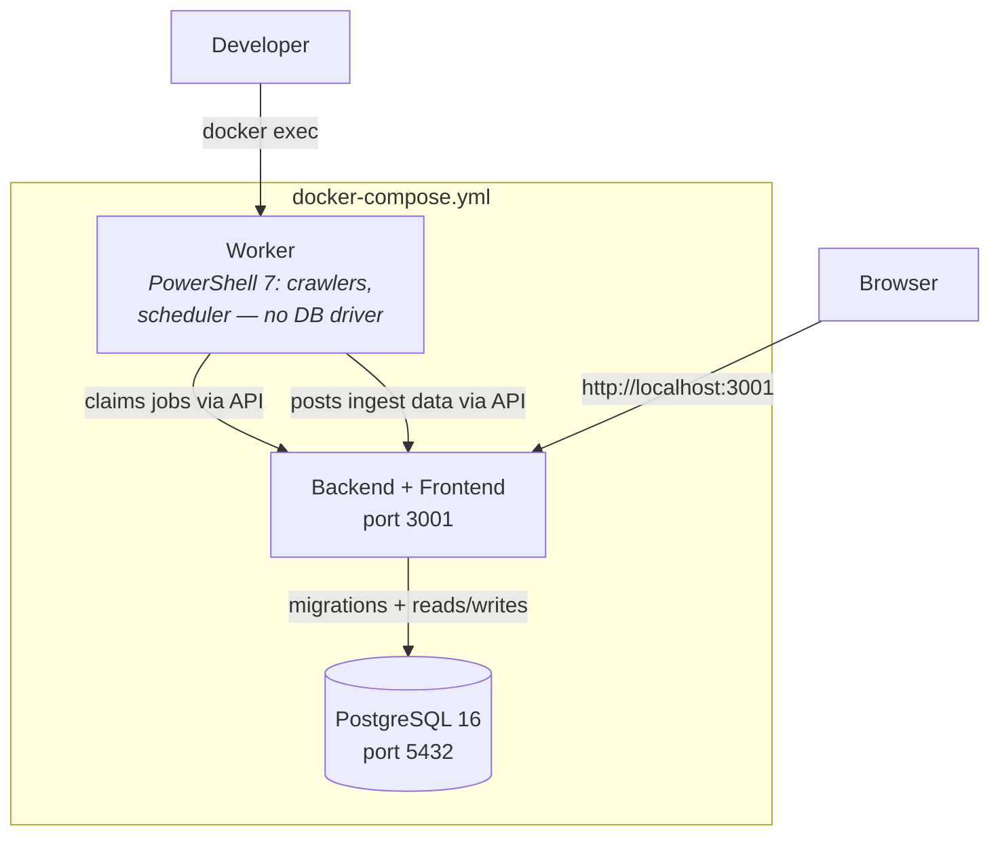

# Docker Setup

Running Identity Atlas locally with Docker — three containers providing the full stack.

---

## Quick Start (End Users — No Git Required)

The fastest way to try Identity Atlas — pulls pre-built images, no source code needed:

```bash
# 1. Download the compose file and environment template
curl -O https://raw.githubusercontent.com/Fortigi/IdentityAtlas/main/docker-compose.prod.yml
curl -O https://raw.githubusercontent.com/Fortigi/IdentityAtlas/main/setup/config/.env.example

# 2. Create your .env file
cp .env.example .env

# 3. Start everything (first run: ~2 min to pull images)
docker compose -f docker-compose.prod.yml up -d

# 4. Open the UI
open http://localhost:3001
```

On first visit, the UI opens to the Dashboard. If no data is loaded yet, click **"Configure a crawler"** to go to Admin → Crawlers, then click **"Load Demo Data"** to populate the system with synthetic data (~30 seconds). After that, explore the Matrix, Users, Resources, and other pages.

To connect your own Entra ID tenant, click **"Connect Entra ID"** on the Crawlers page and enter your App Registration credentials (Tenant ID, Client ID, Client Secret).

### The .env File

`docker-compose.prod.yml` reads all configuration from a `.env` file in the same directory. The template has safe defaults for local evaluation — for anything networked or production, set these two variables:

| Variable | Default | What to do |
|---|---|---|
| `POSTGRES_PASSWORD` | `identity_atlas_local` | **Change this** for any non-local deployment |
| `IDENTITY_ATLAS_MASTER_KEY` | *(auto-generated)* | Set an explicit value so you can back it up; if left blank the container generates one and saves it to the `job_data` volume |

Full variable reference: [Environment Variables](#environment-variables).

### Image Channels

The compose file uses the `IMAGE_TAG` variable to select which build to pull:

| `IMAGE_TAG` | What you get | Who should use it |
|---|---|---|
| *(unset or blank)* | `:latest` — last stable release | Customers and production deployments |
| `edge` | `:edge` — latest commit on `main`, may be unstable | Developers and testers who want the newest features |
| `5.2.1.0` | Exact pinned version, never auto-updates | Customers who want to control upgrade timing |

The running version is always visible in the footer of the UI. Edge builds show an amber **edge** badge so it is immediately obvious which channel is running.

```bash
# Run the stable release (default)
docker compose -f docker-compose.prod.yml up -d

# Run the edge build
IMAGE_TAG=edge docker compose -f docker-compose.prod.yml up -d
# or set IMAGE_TAG=edge in your .env
```

---

## Developer Setup (From Source)

For contributors who want to build and modify the code locally.

## Architecture (v5)



## Services

| Service | Image | Ports | Purpose |
|---|---|---|---|
| `postgres` | postgres:16-alpine | 5432 | Database. No size limits, no licensing. |
| `web` | Node.js 20 | 3001 | Migrations runner + Ingest API + Read API + served React frontend |
| `worker` | PowerShell 7 | — | Crawlers, scheduler. **No database driver in v5.** |

After startup, 3 containers remain running: `postgres`, `web`, `worker`.

The v4 `sql-init` and `sql-table-init` services are gone. Schema creation
happens inside the web container at startup via the migrations runner
(`app/api/src/db/migrate.js`) which applies any new files from
`app/api/src/db/migrations/*.sql`.

---

## Quick Start (Developer)

```powershell
cd c:\Source\GitHub\IdentityAtlas

# Create your .env file from the template
cp setup/config/.env.example .env
# IMAGE_TAG is ignored by the dev compose (it builds from source).
# You can leave the other defaults as-is for local development.

# Start the stack (first time takes ~3 min to build)
docker compose up -d --build

# Verify
docker compose ps
# Expected: postgres (healthy), web (up), worker (up)

# Open the UI — click "Load Demo Data" on the Crawlers page
Start-Process http://localhost:3001

# Open Swagger docs
Start-Process http://localhost:3001/api/docs
```

> **Note:** `docker-compose.yml` (dev) builds images from source — `IMAGE_TAG` has no effect. Use `docker-compose.prod.yml` with `IMAGE_TAG=edge` if you want to run the pre-built edge image without a local build.

## Stopping

```powershell
# Stop (keep data)
docker compose -f docker-compose.yml down

# Stop and delete all data
docker compose -f docker-compose.yml down -v
```

---

## Auto-Bootstrap (v5)

On first startup, the web container:

1. Runs the migrations in `app/api/src/db/migrations/*.sql` to create all
   tables, views, and indexes (idempotent — re-runs are safe).
2. Creates a **Built-in Worker** crawler row with a generated API key.
3. Writes the plaintext key to `/data/uploads/.builtin-worker-key` (a file
   inside the shared `job_data` volume) with `0600` permissions.

The worker container reads the key file on startup. Both containers mount
the same `job_data` volume so the file is visible to both. The API key is
never exposed via an HTTP endpoint — the trust boundary is the docker host.

## Job Queue (v5)

The UI submits crawler jobs (demo data, Entra ID sync, CSV import) via
`POST /api/admin/crawler-jobs`. Jobs are stored in the `CrawlerJobs` table.

The worker polls `POST /api/crawlers/jobs/claim` every 30 seconds. The claim
endpoint atomically marks the next queued job as `running` and returns it.
The worker dispatches to the appropriate crawler script, then calls
`POST /api/crawlers/jobs/:id/complete` (or `.../fail`) when done.

In v5 the worker has **no direct database access at all**. Every read and
write goes through the API.

The `Invoke-CrawlerJob.ps1` dispatcher routes jobs to the appropriate crawler script:

| Job Type | Dispatcher target |
|---|---|
| `demo` | `Ingest-DemoDataset.ps1` (synthetic data, baked into image) |
| `entra-id` | `Start-EntraIDCrawler.ps1` (fetches from Microsoft Graph) |
| `csv` | `Start-CSVCrawler.ps1` (reads uploaded CSV files) |

Progress is updated in SQL during execution and displayed in the UI with a progress bar.

## Crawler Configuration

Crawler configs are stored persistently in the `CrawlerConfigs` table and managed through the UI wizard. Each config stores:

- **Credentials** (Tenant ID, Client ID, Client Secret — secret is write-only, never readable via API)
- **Object types** to sync (Identity, Context, Users & Groups, Governance, Apps, Directory Roles, PIM)
- **Custom attributes** — additional user/group attributes to fetch from Graph (e.g., `employeeHireDate`, `extension_*`)
- **Identity filter** — selects which users are treated as identities (e.g., `employeeId` is not null)
- **Schedule** — hourly/daily/weekly with configurable time

### Custom Attributes

Extra attributes are appended to the Graph API `$select` clause and stored in the `extendedAttributes` JSON column:

```
User attributes:  employeeHireDate, onPremisesSyncEnabled, employeeType, extension_abc_costCenter
Group attributes: classification, resourceBehaviorOptions
```

### Identity Filter

Controls which users get synced as identities (useful for HR-managed account detection):

| Condition | Example |
|---|---|
| `isNotNull` | Users where `employeeId` has a value |
| `equals` | Users where `employeeType` equals `"Employee"` |
| `notEquals` | Users where `accountEnabled` is not `false` |
| `inValues` | Users where `companyName` is in `["Contoso", "Fabrikam"]` |

### Scheduling

Crawlers can be scheduled directly from the UI. The worker checks `CrawlerConfigs` every minute and queues jobs at the configured time.

| Frequency | Description |
|---|---|
| `hourly` | Runs at `:MM` every hour |
| `daily` | Runs at `HH:MM UTC` every day |
| `weekly` | Runs at `HH:MM UTC` on a specific day |

Scheduled jobs appear in the "Recent Jobs" table like any other job.

---

## Worker Container

The worker container runs PowerShell 7 with the Identity Atlas module pre-loaded. It has three responsibilities:

1. **Job queue polling** — picks up queued jobs from CrawlerJobs every 30 seconds
2. **Scheduled crawlers** — reads CrawlerConfigs schedules every minute and queues jobs at the right time
3. **Legacy crontab** — reads `setup/docker/crontab` for manually configured jobs (risk scoring, account correlation)

### Run Ad-Hoc Commands

```powershell
# Open an interactive PowerShell session in the worker
docker compose exec worker pwsh

# Run a one-off command
docker compose exec worker pwsh -Command "Import-Module /app/setup/IdentityAtlas.psd1; Get-Command *FG*"
```

### Legacy Crontab (for non-crawler jobs)

Edit `setup/docker/crontab` for jobs that aren't configured via the UI (risk scoring, account correlation):

```cron
# Risk scoring nightly at 03:00
0 3 * * * /usr/bin/pwsh -Command "Import-Module /app/setup/IdentityAtlas.psd1; Invoke-FGRiskScoring"
```

```powershell
docker compose -f docker-compose.yml restart worker
```

### Environment Variables

Copy the template once, then edit the values you need:

```bash
cp setup/config/.env.example .env
```

Both compose files (`docker-compose.yml` and `docker-compose.prod.yml`) read from `.env` in the project root.

#### Image channel (`docker-compose.prod.yml` only)

| Variable | Default | Description |
|---|---|---|
| `IMAGE_TAG` | *(blank → `latest`)* | Docker image tag to pull. Leave blank for the stable release, set `edge` for the latest dev build, or pin to a specific version like `5.2.1.0`. |

#### Database

| Variable | Default | Description |
|---|---|---|
| `POSTGRES_PASSWORD` | `identity_atlas_local` | PostgreSQL password. Safe for local evaluation; **change for any networked deployment**. |
| `POSTGRES_USER` | `identity_atlas` | PostgreSQL username. Rarely needs changing. |
| `POSTGRES_DB` | `identity_atlas` | Database name. Rarely needs changing. |

#### Security

| Variable | Default | Description |
|---|---|---|
| `IDENTITY_ATLAS_MASTER_KEY` | *(auto-generated)* | Master key for the AES-256-GCM secrets vault (LLM API keys, scraper credentials). If left blank, the container generates a key on first start and persists it to the `job_data` volume. **Set an explicit value for production** so the key can be backed up alongside other root secrets. |

#### Authentication (optional)

Identity Atlas defaults to no-auth (any browser can access the UI). To require Entra ID login:

| Variable | Default | Description |
|---|---|---|
| `AUTH_ENABLED` | `false` | Set to `true` to require Entra ID authentication. |
| `AUTH_TENANT_ID` | — | Your Entra ID tenant ID. |
| `AUTH_CLIENT_ID` | — | App Registration client ID for the UI. |
| `AUTH_REQUIRED_ROLES` | — | Optional comma-separated list of app roles required to access the UI. |

#### Crawler credentials (optional — can also configure via the in-browser wizard)

| Variable | Default | Description |
|---|---|---|
| `CRAWLER_API_KEY` | *(auto-generated)* | API key the worker uses to authenticate with the API. Auto-generated on first start; override only if you need a fixed key. |
| `GRAPH_TENANT_ID` | — | Entra ID tenant ID for the Graph API crawler. |
| `GRAPH_CLIENT_ID` | — | App Registration client ID. |
| `GRAPH_CLIENT_SECRET` | — | App Registration client secret. |

#### LLM / Risk Scoring (optional)

| Variable | Default | Description |
|---|---|---|
| `LLM_PROVIDER` | — | `Anthropic`, `OpenAI`, or `AzureOpenAI`. Can also be configured per-tenant via Admin → LLM Settings. |
| `LLM_API_KEY` | — | API key for the selected LLM provider. |

---

## Folder Mapping

| Host Path | Container Path | Used By |
|---|---|---|
| `app/api/src/` | `/app/backend/src/` | web |
| `app/ui/` (built) | `/app/frontend/dist/` | web (static) |
| `tools/` | `/app/tools/` | worker |
| `setup/docker/crontab` | `/app/setup/docker/crontab` | worker |
| `job_data` (named volume) | `/data/uploads/` | web (writes), worker (reads) — CSV crawler uploads |

---

## Rebuilding

After code changes:

```powershell
# Rebuild only the web service (API + UI changes)
docker compose -f docker-compose.yml up -d --build web

# Rebuild the worker (PowerShell script changes)
docker compose -f docker-compose.yml up -d --build worker

# Rebuild everything from scratch
docker compose -f docker-compose.yml down -v
docker compose -f docker-compose.yml up -d --build
```
