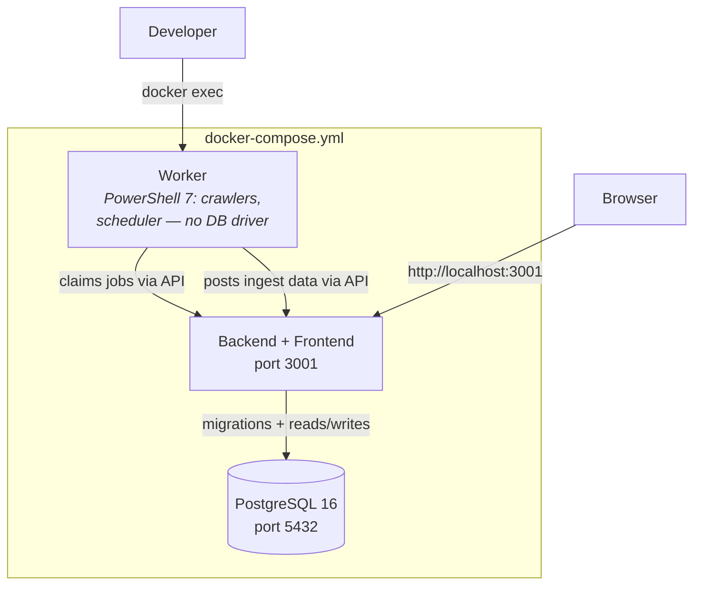

# Docker Setup

Running Identity Atlas locally with Docker — three containers providing the full stack.

---

## Quick Start (End Users — No Git Required)

The fastest way to try Identity Atlas — pulls pre-built images, no source code needed:

=== "Linux / macOS"

    ```bash
    # 1. Download the compose file and environment template
    curl -O https://raw.githubusercontent.com/Fortigi/IdentityAtlas/main/docker-compose.prod.yml
    curl -O https://raw.githubusercontent.com/Fortigi/IdentityAtlas/main/setup/config/.env.example

    # 2. Create your .env file
    cp .env.example .env

    # 3. Start everything (--pull always fetches the newest :latest from the registry)
    docker compose -f docker-compose.prod.yml up -d --pull always

    # 4. Open the UI
    open http://localhost:3001
    ```

=== "Windows (PowerShell)"

    ```powershell
    # 1. Download the compose file and environment template
    Invoke-WebRequest `
        -Uri https://raw.githubusercontent.com/Fortigi/IdentityAtlas/main/docker-compose.prod.yml `
        -OutFile docker-compose.prod.yml
    Invoke-WebRequest `
        -Uri https://raw.githubusercontent.com/Fortigi/IdentityAtlas/main/setup/config/.env.example `
        -OutFile .env.example

    # 2. Create your .env file
    Copy-Item .env.example .env

    # 3. Start everything (--pull always fetches the newest :latest from the registry)
    docker compose -f docker-compose.prod.yml up -d --pull always

    # 4. Open the UI
    Start-Process http://localhost:3001
    ```

On first visit, the UI opens to the Dashboard. If no data is loaded yet, click **"Configure a crawler"** to go to Admin → Crawlers, then click **"Load Demo Data"** to populate the system with synthetic data (~30 seconds). After that, explore the Matrix, Users, Resources, and other pages.

To connect your own Entra ID tenant, click **"Connect Entra ID"** on the Crawlers page and enter your App Registration credentials (Tenant ID, Client ID, Client Secret).

### The .env File

`docker-compose.prod.yml` reads all configuration from a `.env` file in the same directory. The template has safe defaults for local evaluation — for anything networked or production, set these two variables:

| Variable | Default | What to do |
|---|---|---|
| `POSTGRES_PASSWORD` | `identity_atlas_local` | **Change this** for any non-local deployment |
| `IDENTITY_ATLAS_MASTER_KEY` | *(auto-generated)* | Set an explicit value so you can back it up; if left blank the web container generates one and saves it to the web-only `web_keys` volume |

Full variable reference: [Environment Variables](#environment-variables).

### Image Channels

The compose file uses the `IMAGE_TAG` variable to select which build to pull:

| `IMAGE_TAG` | What you get | Who should use it |
|---|---|---|
| *(unset or blank)* | `:latest` — last stable release, published when a release tag is cut | Customers and production deployments |
| `beta` | `:beta` — latest pre-release build, published via Actions → Cut Beta | Beta testers |
| `edge` | `:edge` — latest commit on `main`, updated on every PR merge, may include unreleased features | Developers and testers |
| `5.2.1.0` | Exact pinned stable version, never auto-updates | Production deployments needing controlled upgrade timing |
| `5.3.0-beta.1` | Exact pinned pre-release version | Testers who want a reproducible pre-release build |

The running version is always visible in the footer of the UI. Edge builds show an amber **edge** badge so it is immediately obvious which channel is running.

=== "Linux / macOS"

    ```bash
    # Run the stable release (default)
    docker compose -f docker-compose.prod.yml up -d --pull always

    # Run the latest pre-release beta
    IMAGE_TAG=beta docker compose -f docker-compose.prod.yml up -d --pull always

    # Run the edge build (latest merged to main, may be unstable)
    IMAGE_TAG=edge docker compose -f docker-compose.prod.yml up -d --pull always
    # or set IMAGE_TAG=edge in your .env

    # Run a specific pinned version
    IMAGE_TAG=5.2.0.0 docker compose -f docker-compose.prod.yml up -d --pull always
    ```

=== "Windows (PowerShell)"

    ```powershell
    # Run the stable release (default)
    docker compose -f docker-compose.prod.yml up -d --pull always

    # Run the latest pre-release beta
    $env:IMAGE_TAG = "beta"
    docker compose -f docker-compose.prod.yml up -d --pull always

    # Run the edge build (latest merged to main, may be unstable)
    $env:IMAGE_TAG = "edge"
    docker compose -f docker-compose.prod.yml up -d --pull always
    # or set IMAGE_TAG=edge in your .env

    # Run a specific pinned version
    $env:IMAGE_TAG = "5.2.0.0"
    docker compose -f docker-compose.prod.yml up -d --pull always
    ```

---

## Sizing

Identity Atlas runs all three services (postgres, web, worker) on one host. These numbers are the floor — RAM first, disk second. The RAM figure is what the crawler's peak workload needs in steady state; tight provisioning causes the container runtime to thrash when a sync runs, not at idle. The disk figure is for the `postgres_data` volume plus the backing image layers.

| Tenant shape | Principals | Activity sync | RAM | Disk |
|---|---|---|---|---|
| Small | < 2k | off | **4 GB** | 20 GB |
| Small + activity | < 2k | on (7 days) | **6 GB** | 40 GB |
| Medium | 2k – 10k | off | **6 GB** | 40 GB |
| Medium + activity | 2k – 10k | on (7 days) | **12 GB** | 60 GB |
| Large | 10k – 50k | mixed | **16+ GB** | 100+ GB |
| Enterprise | 50k+ | on | **24+ GB** | 250+ GB |

### Why activity data dominates

"Activity sync" above means the Entra ID crawler's **sign-in logs** option (and, going forward, other activity feeds: audit logs, MFA challenges, consent events). Principal and resource tables stay roughly proportional to your org chart — a 10k-user tenant has ~10k rows in `Principals`. **Activity tables are one-to-many over time**: the same 10k tenant emits ~170,000 sign-in events per week (`/auditLogs/signIns`), 17× the user count.

Three levers control the activity footprint:

- **`signInLogsDays`** (crawler wizard → Advanced) — linear in RAM and disk. Default 7 days. Graph retains 30, so at the extreme you multiply the numbers above by ~4.
- **Retention policy in `PrincipalActivity`** — we only store the latest event per `(principalId, appId)` pair, so the table doesn't grow indefinitely. But each daily crawl holds the raw slice in memory before dedup.
- **Number of active crawlers** — each additional connected system (CSV imports, future SailPoint/Omada connectors, etc.) adds its own principal/resource/activity rows. Plan ~50% headroom above the shape in the table for a second system.

### What to watch as usage grows

Until the admin capacity dashboard ships, use these spot-checks:

```bash
# Host memory pressure during a crawl
ssh <host> 'free -h && swapon --show'

# Postgres disk usage by table (top 10)
docker compose exec postgres psql -U identity_atlas -d identity_atlas -c \
  "SELECT schemaname, relname, pg_size_pretty(pg_total_relation_size(relid))
     FROM pg_catalog.pg_statio_user_tables
    ORDER BY pg_total_relation_size(relid) DESC LIMIT 10;"

# Crawler duration trend — a run that doubles week-over-week is your early warning
docker compose exec postgres psql -U identity_atlas -d identity_atlas -c \
  "SELECT \"jobType\", \"startedAt\", \"completedAt\" - \"startedAt\" AS duration
     FROM \"CrawlerJobs\" WHERE status='completed'
    ORDER BY \"startedAt\" DESC LIMIT 20;"
```

**Red flags**: swap in use at all (disable swap and size RAM properly), `PrincipalActivity` > 40% of total DB size (tune `signInLogsDays` down or plan a vertical scale), a single crawler run taking longer than the scheduled interval.

### Swap

Do **not** rely on swap to carry crawler peaks. The workloads here (Node's V8 heap, PowerShell's .NET object graph, Postgres shared buffers) all degrade sharply under paging. If the table above says 12 GB, give it 12 GB of real RAM. A small swap partition (1–2 GB) as a safety net against OOM-kills is fine; anything larger invites false confidence.

---

## Container Security

`docker-compose.prod.yml` (compose file version 4 and later) applies these defaults:

- **Secrets as files, not environment variables.** `POSTGRES_PASSWORD` is still read from `.env`, but Compose hands it to the `postgres` and `web` containers as a secret file under `/run/secrets` (`POSTGRES_PASSWORD_FILE`), so it no longer appears in `docker inspect`. The API accepts `<NAME>_FILE` for `POSTGRES_PASSWORD`, `DATABASE_URL` and `IDENTITY_ATLAS_MASTER_KEY`; a plain variable that is set still wins. Environment-sourced Compose secrets need a recent Docker Compose v2 (v2.20 or later is recommended).
- **The vault master key is not on the shared volume.** The web container keeps its auto-generated key in the `web_keys` volume (`IDENTITY_ATLAS_KEY_DIR=/data/keys`), which the worker does not mount. On the first start with this compose file, an existing `/data/uploads/.master-key` is copied there, read back, checked against a stored secret, and only then removed from `job_data`. **Back up the `web_keys` volume** (or set `IDENTITY_ATLAS_MASTER_KEY` explicitly).
- **Fewer secrets in the worker.** The worker receives neither the database password nor the master key, and no longer gets the unused `GRAPH_*` / `LLM_*` variables. Crawler and LLM credentials are configured in the UI and reach the worker per job.
- **Hardening.** Every service runs with `no-new-privileges` and `cap_drop: [ALL]` (Postgres keeps the five capabilities its entrypoint needs), a `pids_limit`, and a memory limit (`POSTGRES_MEM_LIMIT`, `WEB_MEM_LIMIT`, `WORKER_MEM_LIMIT`, default `8g` each; raise them for very large tenants, see [Sizing](#sizing)). The worker image runs as uid 1000, like the web image; on start it recreates a job-log directory left root-owned by an older worker image.
- **Supply chain.** Base images are pinned by digest, and every published image carries signed build provenance and an SBOM: `gh attestation verify oci://ghcr.io/fortigi/identity-atlas:latest --owner Fortigi`.

### Upgrading from an older compose file

An older `docker-compose.prod.yml` keeps working with the new images: the master key stays at `/data/uploads/.master-key` (it is only moved when `IDENTITY_ATLAS_KEY_DIR` is set), and the database password is passed as before. Download the new file to get the protections above.

- **If you pin `IMAGE_TAG` to an older release**, use the compose file from that release. The new file relies on `POSTGRES_PASSWORD_FILE` support in the web image.
- **Rolling back after the key has moved.** If you return to an older compose file or image after the key was moved to `web_keys`, copy it out first and set it explicitly: run `docker compose exec web cat /data/keys/.master-key` and put the value in `IDENTITY_ATLAS_MASTER_KEY`. Current images refuse to generate a new key while the vault holds encrypted secrets and log how to recover instead; set `IDENTITY_ATLAS_ALLOW_NEW_MASTER_KEY=true` only if you intend to discard those secrets.

---

## Developer Setup (From Source)

For contributors who want to build and modify the code locally.

## Architecture (v5)


```mermaid
graph TB
    subgraph Docker["docker-compose.yml"]
        PG[(PostgreSQL 16<br/>port 5432)]
        API[Backend + Frontend<br/>port 3001]
        WORKER[Worker<br/><i>PowerShell 7: crawlers,<br/>scheduler — no DB driver</i>]
    end

    API -->|migrations + reads/writes| PG
    WORKER -->|claims jobs via API| API
    WORKER -->|posts ingest data via API| API

    User[Browser] -->|http://localhost:3001| API
    Dev[Developer] -->|docker exec| WORKER
```

## Services

| Service | Image | Ports | Purpose |
|---|---|---|---|
| `postgres` | postgres:16-alpine | 5432 | Database. No size limits, no licensing. |
| `web` | Node.js 20 | 3001 | Migrations runner + Ingest API + Read API + served React frontend |
| `worker` | PowerShell 7 | — | Crawlers, scheduler. **No database driver in v5.** |

After startup, 3 containers remain running: `postgres`, `web`, `worker`.

The v4 `sql-init` and `sql-table-init` services are gone. Schema creation
happens inside the web container at startup via the migrations runner
(`app/api/src/db/migrate.js`) which applies any new files from
`app/api/src/db/migrations/*.sql`.

---

## Quick Start (Developer)

=== "Linux / macOS"

    ```bash
    cd /path/to/IdentityAtlas

    # Create your .env file from the template
    cp setup/config/.env.example .env
    # IMAGE_TAG is ignored by the dev compose (it builds from source).
    # You can leave the other defaults as-is for local development.

    # Start the stack (first time takes ~3 min to build)
    docker compose up -d --build

    # Verify
    docker compose ps
    # Expected: postgres (healthy), web (up), worker (up)

    # Open the UI — click "Load Demo Data" on the Crawlers page
    open http://localhost:3001

    # Open Swagger docs
    open http://localhost:3001/api/docs
    ```

=== "Windows (PowerShell)"

    ```powershell
    cd C:\path\to\IdentityAtlas

    # Create your .env file from the template
    Copy-Item setup/config/.env.example .env
    # IMAGE_TAG is ignored by the dev compose (it builds from source).
    # You can leave the other defaults as-is for local development.

    # Start the stack (first time takes ~3 min to build)
    docker compose up -d --build

    # Verify
    docker compose ps
    # Expected: postgres (healthy), web (up), worker (up)

    # Open the UI — click "Load Demo Data" on the Crawlers page
    Start-Process http://localhost:3001

    # Open Swagger docs
    Start-Process http://localhost:3001/api/docs
    ```

> **Note:** `docker-compose.yml` (dev) builds images from source — `IMAGE_TAG` has no effect. Use `docker-compose.prod.yml` with `IMAGE_TAG=edge` if you want to run the pre-built edge image without a local build.

## Stopping

```powershell
# Stop (keep data)
docker compose -f docker-compose.yml down

# Stop and delete all data
docker compose -f docker-compose.yml down -v
```

---

## Auto-Bootstrap (v5)

On first startup, the web container:

1. Runs the migrations in `app/api/src/db/migrations/*.sql` to create all
   tables, views, and indexes (idempotent — re-runs are safe).
2. Creates a **Built-in Worker** crawler row with a generated API key.
3. Writes the plaintext key to `/data/uploads/.builtin-worker-key` (a file
   inside the shared `job_data` volume) with `0600` permissions.

The worker container reads the key file on startup. Both containers mount
the same `job_data` volume so the file is visible to both. The API key is
never exposed via an HTTP endpoint — the trust boundary is the docker host.

## Job Queue (v5)

The UI submits crawler jobs (demo data, Entra ID sync, CSV import) via
`POST /api/admin/crawler-jobs`. Jobs are stored in the `CrawlerJobs` table.

The worker polls `POST /api/crawlers/jobs/claim` every 30 seconds. The claim
endpoint atomically marks the next queued job as `running` and returns it.
The worker dispatches to the appropriate crawler script, then calls
`POST /api/crawlers/jobs/:id/complete` (or `.../fail`) when done.

In v5 the worker has **no direct database access at all**. Every read and
write goes through the API.

The `Invoke-CrawlerJob.ps1` dispatcher routes jobs to the appropriate crawler script:

| Job Type | Dispatcher target |
|---|---|
| `demo` | `Ingest-DemoDataset.ps1` (synthetic data, baked into image) |
| `entra-id` | `Start-EntraIDCrawler.ps1` (fetches from Microsoft Graph) |
| `csv` | `Start-CSVCrawler.ps1` (reads uploaded CSV files) |

Progress is updated in SQL during execution and displayed in the UI with a progress bar.

## Crawler Configuration

Crawler configs are stored persistently in the `CrawlerConfigs` table and managed through the UI wizard. Each config stores:

- **Credentials** (Tenant ID, Client ID, Client Secret — secret is write-only, never readable via API)
- **Object types** to sync (Identity, Context, Users & Groups, Governance, Apps, Directory Roles, PIM)
- **Custom attributes** — additional user/group attributes to fetch from Graph (e.g., `employeeHireDate`, `extension_*`)
- **Identity filter** — selects which users are treated as identities (e.g., `employeeId` is not null)
- **Schedule** — hourly/daily/weekly with configurable time

### Custom Attributes

Extra attributes are appended to the Graph API `$select` clause and stored in the `extendedAttributes` JSON column:

```
User attributes:  employeeHireDate, onPremisesSyncEnabled, employeeType, extension_abc_costCenter
Group attributes: classification, resourceBehaviorOptions
```

### Identity Filter

Controls which users get synced as identities (useful for HR-managed account detection):

| Condition | Example |
|---|---|
| `isNotNull` | Users where `employeeId` has a value |
| `equals` | Users where `employeeType` equals `"Employee"` |
| `notEquals` | Users where `accountEnabled` is not `false` |
| `inValues` | Users where `companyName` is in `["Contoso", "Fabrikam"]` |

### Scheduling

Crawlers can be scheduled directly from the UI. The worker checks `CrawlerConfigs` every minute and queues jobs at the configured time.

| Frequency | Description |
|---|---|
| `hourly` | Runs at `:MM` every hour |
| `daily` | Runs at `HH:MM UTC` every day |
| `weekly` | Runs at `HH:MM UTC` on a specific day |

Scheduled jobs appear in the "Recent Jobs" table like any other job.

---

## Worker Container

The worker container runs PowerShell 7 with the Identity Atlas module pre-loaded. It has three responsibilities:

1. **Job queue polling** — picks up queued jobs from CrawlerJobs every 30 seconds
2. **Scheduled crawlers** — reads CrawlerConfigs schedules every minute and queues jobs at the right time
3. **Legacy crontab** — reads `setup/docker/crontab` for manually configured jobs (e.g. risk scoring)

### Run Ad-Hoc Commands

```powershell
# Open an interactive PowerShell session in the worker
docker compose exec worker pwsh

# Run a one-off command
docker compose exec worker pwsh -Command "Import-Module /app/setup/IdentityAtlas.psd1; Get-Command *FG*"
```

### Legacy Crontab (for non-crawler jobs)

Edit `setup/docker/crontab` for jobs that aren't configured via the UI (e.g. risk scoring). Account Linking is **not** a crontab job — it is scheduled via `AccountLinkingConfig.schedules` and run by the web container's scheduler; see [Account Linking](account-linking.md).

```cron
# Risk scoring nightly at 03:00
0 3 * * * /usr/bin/pwsh -Command "Import-Module /app/setup/IdentityAtlas.psd1; Invoke-FGRiskScoring"
```

```powershell
docker compose -f docker-compose.yml restart worker
```

### Environment Variables

Copy the template once, then edit the values you need:

=== "Linux / macOS"

    ```bash
    cp setup/config/.env.example .env
    ```

=== "Windows (PowerShell)"

    ```powershell
    Copy-Item setup/config/.env.example .env
    ```

Both compose files (`docker-compose.yml` and `docker-compose.prod.yml`) read from `.env` in the project root.

#### Image channel (`docker-compose.prod.yml` only)

| Variable | Default | Description |
|---|---|---|
| `IMAGE_TAG` | *(blank → `latest`)* | Docker image tag to pull. Leave blank for the stable release, `beta` for the latest pre-release build, `edge` for the latest dev build, or pin to a specific version like `5.2.1.0`. |

#### Database

| Variable | Default | Description |
|---|---|---|
| `POSTGRES_PASSWORD` | `identity_atlas_local` | PostgreSQL password. Safe for local evaluation; **change for any networked deployment**. |
| `POSTGRES_USER` | `identity_atlas` | PostgreSQL username. Rarely needs changing. |
| `POSTGRES_DB` | `identity_atlas` | Database name. Rarely needs changing. |

#### Security

| Variable | Default | Description |
|---|---|---|
| `IDENTITY_ATLAS_MASTER_KEY` | *(auto-generated)* | Master key for the AES-256-GCM secrets vault (LLM API keys, scraper credentials). If left blank, the web container generates a key on first start and persists it to the web-only `web_keys` volume (`docker-compose.prod.yml` v4+; older compose files use the `job_data` volume). **Set an explicit value for production** so the key can be backed up alongside other root secrets. |
| `IDENTITY_ATLAS_MASTER_KEY_FILE` | — | Path to a file holding the master key (for Docker/Compose secrets). Used when `IDENTITY_ATLAS_MASTER_KEY` is empty. `POSTGRES_PASSWORD_FILE` and `DATABASE_URL_FILE` work the same way. |
| `IDENTITY_ATLAS_KEY_DIR` | *(unset)* | Directory for the auto-generated master key. The compose files set it to `/data/keys` (a web-only volume). Only set it when that path is a persistent volume. |
| `POSTGRES_MEM_LIMIT` / `WEB_MEM_LIMIT` / `WORKER_MEM_LIMIT` | `8g` | Container memory limits in `docker-compose.prod.yml`. |

#### Authentication (optional)

Identity Atlas defaults to no-auth (any browser can access the UI). To require Entra ID login:

| Variable | Default | Description |
|---|---|---|
| `AUTH_ENABLED` | `false` | Set to `true` to require Entra ID authentication. |
| `AUTH_TENANT_ID` | — | Your Entra ID tenant ID. |
| `AUTH_CLIENT_ID` | — | App Registration client ID for the UI. |
| `AUTH_REQUIRED_ROLES` | — | Optional comma-separated list of app roles required to access the UI. |

#### Crawler credentials

| Variable | Default | Description |
|---|---|---|
| `CRAWLER_API_KEY` | *(auto-generated)* | API key the worker uses to authenticate with the API. Auto-generated on first start; override only if you need a fixed key. |

Microsoft Graph and LLM credentials are configured in the UI (the crawler wizard and Admin → LLM Settings) and stored encrypted in the vault. The `GRAPH_TENANT_ID`, `GRAPH_CLIENT_ID`, `GRAPH_CLIENT_SECRET`, `LLM_PROVIDER` and `LLM_API_KEY` environment variables were never read by the containers and are no longer passed to them.

---

## Folder Mapping

| Host Path | Container Path | Used By |
|---|---|---|
| `app/api/src/` | `/app/backend/src/` | web |
| `app/ui/` (built) | `/app/frontend/dist/` | web (static) |
| `tools/` | `/app/tools/` | worker |
| `setup/docker/crontab` | `/app/setup/docker/crontab` | worker |
| `job_data` (named volume) | `/data/uploads/` | web (writes), worker (reads) — CSV crawler uploads, job logs, built-in worker key |
| `web_keys` (named volume) | `/data/keys/` | web only — auto-generated vault master key |

---

## Rebuilding

After code changes:

```powershell
# Rebuild only the web service (API + UI changes)
docker compose -f docker-compose.yml up -d --build web

# Rebuild the worker (PowerShell script changes)
docker compose -f docker-compose.yml up -d --build worker

# Rebuild everything from scratch
docker compose -f docker-compose.yml down -v
docker compose -f docker-compose.yml up -d --build
```
