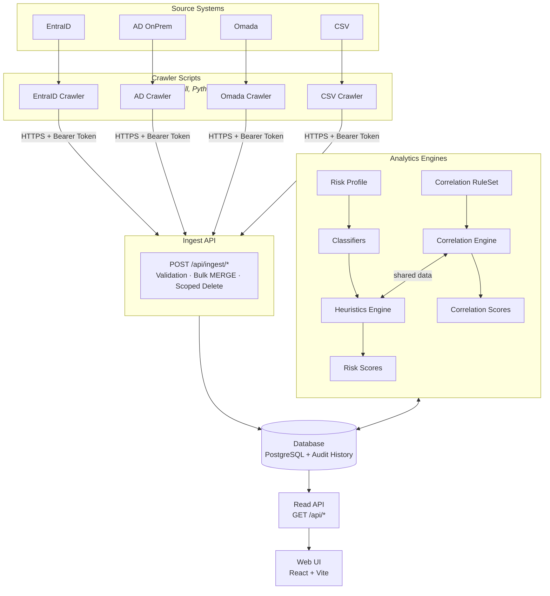
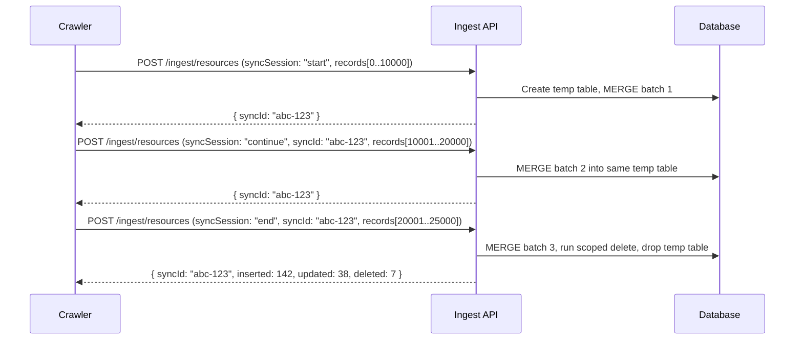
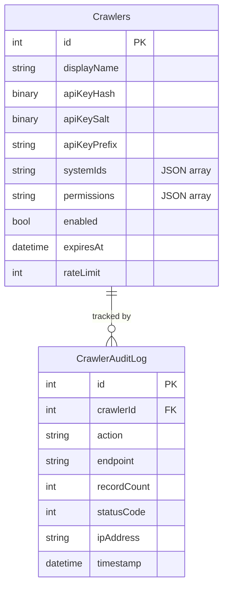
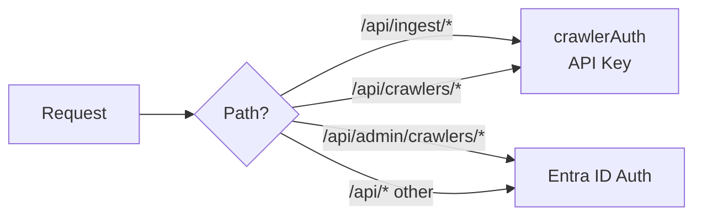
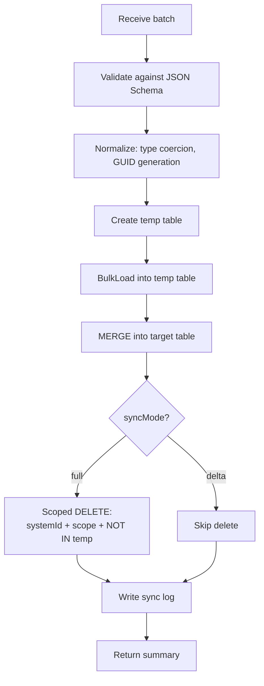

# Ingest API

The Ingest API is how every record gets into Identity Atlas. Crawlers — in any language — authenticate with an API key and POST batches of data to REST endpoints; the API handles validation, bulk merge, scoped delete detection, audit history, and sync logging. The worker container has no direct database access; everything flows through this layer.

---

## Why a separate ingest layer

Before v5, Identity Atlas (then shipped as the FortigiGraph PowerShell module) had two tightly-coupled sync paths that both ran *inside* the module with direct SQL access: `Start-FGSync` for the Entra ID path and `Start-FGCSVSync` for CSV imports. That design had real problems:

| Problem (pre-v5) | Impact |
|---|---|
| Crawlers needed SQL credentials | Security risk; credentials spread across environments |
| Couldn't write crawlers in Python, Go, or anything non-PowerShell | Locked into PowerShell for all integrations |
| CSV files had to be on the same machine as the module | No remote ingestion; no wizard uploads; limited deployment flexibility |
| Adding a new source system meant adding a new `Sync-FG*` function in the module | High coupling; slow to extend |
| No way for third parties to push data | Only pull-based; no webhook path |

v5 replaced both paths with this Ingest API. Crawlers are now standalone processes (in the worker container or anywhere else with network access to the web container) that speak HTTP, not SQL. Adding a new source is a matter of writing a small crawler that targets the endpoints below — no module changes.

---

## Reference Architecture



The architecture has four layers:

1. **Source Systems & Crawlers** — Each source system has a dedicated crawler. Crawlers are lightweight HTTP clients that fetch data from their source and POST it to the Ingest API. They can be written in any language.

2. **Ingest API** — Receives data via REST endpoints. Handles validation, bulk merge, scoped delete detection, and audit history recording. Authenticates crawlers via self-contained API keys.

3. **Analytics Engines** — Account Correlation and Risk Scoring run independently against the database. The Correlation Engine uses rulesets to link principals to identities. The Heuristics Engine uses risk profiles and classifiers to compute risk scores.

4. **Read API + Web UI** — The existing Express read routes and React frontend remain unchanged.

---

## Ingest API Design

### Core Principle: Batch-Oriented Sync

Each ingest endpoint accepts a **batch of records** for a given entity type and system. The API then:

1. **Validates** all records against the schema
2. **Normalizes** data (type coercion, deterministic GUID generation for non-GUID IDs)
3. **Bulk MERGEs** into the target table (INSERT new, UPDATE changed)
4. **Scoped delete detection** — if `syncMode: "full"`, records in this system+scope that are NOT in the batch are deleted
5. **Logs** the sync operation to `GraphSyncLog`
6. **Returns** a summary: `{ inserted, updated, deleted, errors }`

### Endpoint Pattern

All ingest endpoints follow the same pattern:

```http
POST /api/ingest/{entity-type}
Authorization: Bearer <crawler-api-key>
Content-Type: application/json

{
  "systemId": 3,
  "syncMode": "full",
  "scope": {
    "resourceType": "Group"
  },
  "records": [
    { "id": "...", "displayName": "...", ... }
  ]
}
```

Response:

```json
{
  "syncId": "uuid",
  "table": "Resources",
  "inserted": 142,
  "updated": 38,
  "deleted": 7,
  "errors": [],
  "durationMs": 2340
}
```

### Entity Endpoints

| Endpoint | Target Table | Key Column(s) | Scope Filters |
|----------|-------------|----------------|---------------|
| `POST /api/ingest/systems` | Systems | `id` (INT, auto) | — |
| `POST /api/ingest/principals` | Principals | `id` (GUID) | `principalType` |
| `POST /api/ingest/resources` | Resources | `id` (GUID) | `resourceType` |
| `POST /api/ingest/resource-assignments` | ResourceAssignments | `(resourceId, principalId, assignmentType)` | `assignmentType` |
| `POST /api/ingest/resource-relationships` | ResourceRelationships | `(parentResourceId, childResourceId, relationshipType)` | `relationshipType` |
| `POST /api/ingest/identities` | Identities | `id` (GUID) | — |
| `POST /api/ingest/identity-members` | IdentityMembers | `(identityId, principalId)` | — |
| `POST /api/ingest/contexts` | Contexts | `id` (GUID) | `contextType` |
| `POST /api/ingest/governance/catalogs` | GovernanceCatalogs | `id` (GUID) | — |
| `POST /api/ingest/governance/policies` | AssignmentPolicies | `id` (GUID) | — |
| `POST /api/ingest/governance/requests` | AssignmentRequests | `id` (GUID) | — |
| `POST /api/ingest/governance/certifications` | CertificationDecisions | `id` (GUID) | — |

### Sync Modes

| Mode | Behavior | Use Case |
|------|----------|----------|
| `full` | MERGE all records + DELETE records in scope not in batch | Scheduled full sync |
| `delta` | MERGE only; no deletes | Real-time webhook, incremental changes |

### Deterministic GUID Generation

For source systems that don't use GUIDs (e.g., Omada uses integer IDs):

```json
{
  "systemId": 3,
  "idGeneration": "deterministic",
  "idPrefix": "omada-resource",
  "records": [
    { "externalId": "12345", "displayName": "Admin Role" }
  ]
}
```

When `idGeneration: "deterministic"`, the API generates `MD5(idPrefix + ":" + externalId)` as UUID v3, matching the current CSV sync pattern.

### Sync Sessions (Chunked Uploads)

For datasets larger than 50,000 records:



---

## Crawler Authentication

### Self-Contained API Keys

No external IdP dependency. The API manages its own crawler credentials.



**Key format:** `fgc_<random-32-chars>` — the `fgc_` prefix makes keys recognisable in logs and auth middleware as crawler tokens (distinct from JWTs used for the read API). Only the hash is stored; the plaintext key is shown once at creation time.

### Admin Endpoints (Entra ID Auth)

| Method | Endpoint | Purpose |
|--------|----------|---------|
| `GET` | `/api/admin/crawlers` | List all crawlers (without keys) |
| `POST` | `/api/admin/crawlers` | Register new crawler, returns plaintext key **once** |
| `PATCH` | `/api/admin/crawlers/:id` | Update name, description, enabled, systemIds, permissions |
| `DELETE` | `/api/admin/crawlers/:id` | Disable (soft-delete) crawler |
| `GET` | `/api/admin/crawlers/:id/audit` | View audit log |
| `POST` | `/api/admin/crawlers/:id/reset` | Admin-initiated key reset |

### Crawler Self-Service Endpoints (API Key Auth)

| Method | Endpoint | Purpose |
|--------|----------|---------|
| `POST` | `/api/crawlers/rotate` | Rotate own key (old key invalidated immediately) |
| `GET` | `/api/crawlers/whoami` | Return crawler metadata |

### Key Rotation Flow

```python
# Example: Python crawler auto-rotation
new_key = requests.post("/api/crawlers/rotate",
    headers={"Authorization": f"Bearer {current_key}"}).json()["apiKey"]
save_to_vault(new_key)
```

### Auth Middleware Chain



---

## Ingest Engine

The server-side engine encapsulates all SQL complexity:

```
UI/backend/src/
├── ingest/
│   ├── engine.js              — Core MERGE + delete detection
│   ├── validation.js          — JSON Schema validation per entity type
│   ├── normalization.js       — Type coercion, GUID generation
│   ├── schemas/               — JSON Schema per entity type
│   └── sessions.js            — Sync session management
├── routes/
│   ├── ingest.js              — Ingest endpoints
│   └── crawlers.js            — Crawler management
├── middleware/
│   └── crawlerAuth.js         — API key validation
```

### Engine Operations



### Scoped Delete Detection

The engine preserves the same scoping patterns used by the current PowerShell sync:

- **System-scoped:** `WHERE systemId = @systemId`
- **Attribute-scoped:** `WHERE resourceType = @scope` (if provided)
- **Current-state scoped:** operates on the current table rows (no temporal filtering needed in v5)
- **Batch-scoped:** `AND NOT EXISTS (SELECT 1 FROM #temp WHERE ...)`

### Validation Rules

| Field | Rule |
|-------|------|
| `id` (GUID) | Valid UUID v4 format, or `externalId` + `idGeneration: "deterministic"` |
| `systemId` | Must exist in Systems table AND be in crawler's allowed systems |
| `displayName` | Required, max 255 chars |
| `principalType` | One of: `User`, `ServicePrincipal`, `ManagedIdentity`, `WorkloadIdentity`, `AIAgent`, `ExternalUser`, `SharedMailbox` |
| `resourceType` | One of: `Group`, `DirectoryRole`, `AppRole`, `BusinessRole`, `Site`, `Team`, etc. |
| `assignmentType` | One of: `Direct`, `Indirect`, `Eligible`, `Owner`, `Governed` |
| `extendedAttributes` | Valid JSON object, max 64 KB |

---

## OpenAPI / Swagger

The API serves an OpenAPI 3.0 spec and Swagger UI:

- `GET /api/docs` — Swagger UI (interactive documentation)
- `GET /api/docs/openapi.json` — OpenAPI 3.0 spec file

From this spec, crawlers can auto-generate clients:

```bash
# Generate PowerShell client
npx @openapitools/openapi-generator-cli generate \
  -i openapi.json -g powershell -o ./crawler-client-ps

# Generate Python client
npx @openapitools/openapi-generator-cli generate \
  -i openapi.json -g python -o ./crawler-client-py
```

---

## Observed performance

Measured against the committed load-test dataset (~2.17 M records, ~97 MB of CSV) on a VM with 6 cores / 16 GB RAM:

| Phase | Records | Duration | Throughput |
|---|---|---|---|
| Identities | 25,000 | 9 s | ~2,800 rows/s |
| Identity members | 76,000 | 40 s | ~1,900 rows/s |
| Certification decisions | 300,000 | 4 min 12 s (1 batch) | ~1,190 rows/s |
| Resource assignments | 1,500,000 | ~20 min (20 batches × 75 k) | ~1,250 rows/s sustained |
| **Full run** | **~2.17 M** | **~30 min** | **~1,200 rows/s overall** |

See [Scaling & Load Testing](scaling.md) for the full analysis, including hardware utilisation (CPU 73 %, memory 87 %, disk 1 % — memory is the limiting factor) and reproduction instructions.

---

## Future Extensions

- **Webhook receiver** — source systems push change events
- **NDJSON streaming** — for very large datasets
- **Crawler SDK** — npm/PyPI/PSGallery package with auth, chunking, retry
- **Crawler templates** — wizard in admin UI generates boilerplate
- **Async ingestion** — queue-based with job IDs
- **Data quality scoring** — completeness and consistency metrics per sync
