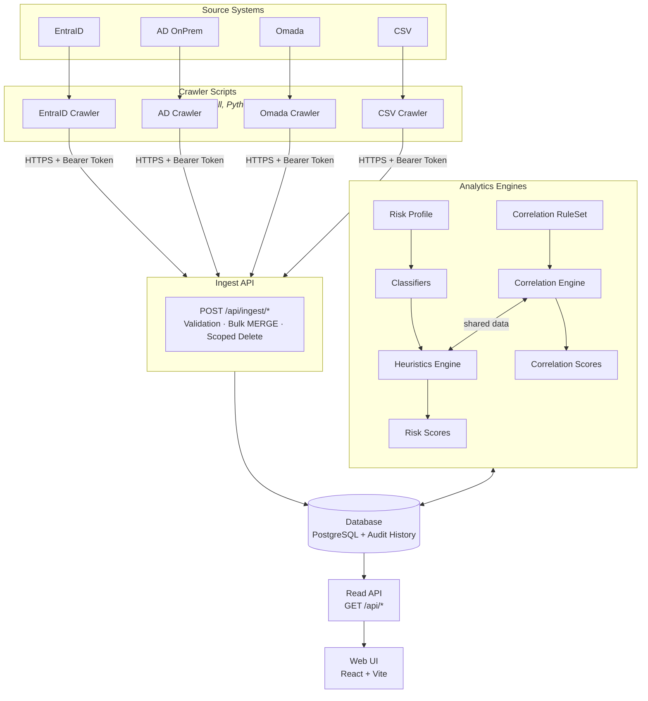
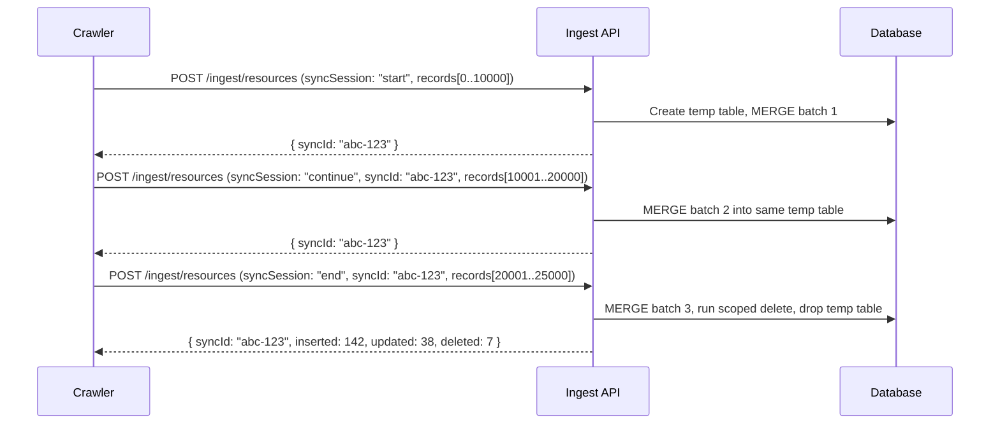
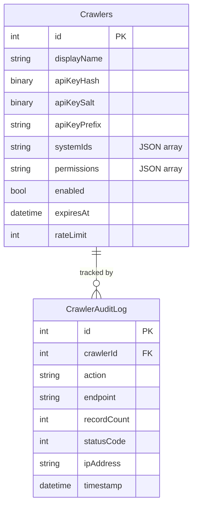
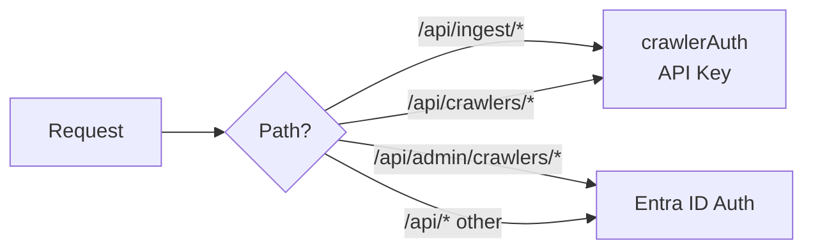
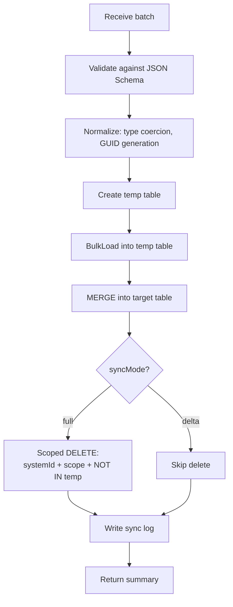

# Ingest API Layer

> **Status:** Draft | **Date:** 2026-03-30

The Ingest API decouples data ingestion from the FortigiGraph core. Instead of crawlers writing directly to the database, they POST data to REST endpoints. The API handles all complexity: validation, bulk merge, scoped delete detection, audit history, and sync logging.

---

## Motivation

Today, FortigiGraph has two tightly-coupled sync paths:

1. **`Start-FGSync`** — runs inside the PowerShell module, calls Graph API directly, writes to the database via `Invoke-FGSQLBulkMerge` (legacy) or the Ingest API (v5).
2. **`Start-FGCSVSync`** — runs inside the PowerShell module, reads CSV files from disk, writes to SQL via the same bulk merge.

Both paths require the crawler logic to run **inside** the PowerShell module with direct SQL access.

| Problem | Impact |
|---------|--------|
| Crawlers need SQL credentials | Security risk; credentials spread across environments |
| Can't write crawlers in Python, Go, etc. | Locked into PowerShell for all integrations |
| CSV files must be on the same machine | No remote ingestion; limits deployment flexibility |
| Adding a new source system requires a new `Sync-FG*` function in the module | High coupling; slow to extend |
| Azure Automation sandbox limits (400 MB) force batching workarounds | Complexity pushed into every crawler |
| No way for third parties to push data | Only pull-based; can't receive webhooks |

---

## Reference Architecture



The architecture has four layers:

1. **Source Systems & Crawlers** — Each source system has a dedicated crawler. Crawlers are lightweight HTTP clients that fetch data from their source and POST it to the Ingest API. They can be written in any language.

2. **Ingest API** — Receives data via REST endpoints. Handles validation, bulk merge, scoped delete detection, and audit history recording. Authenticates crawlers via self-contained API keys.

3. **Analytics Engines** — Account Correlation and Risk Scoring run independently against the database. The Correlation Engine uses rulesets to link principals to identities. The Heuristics Engine uses risk profiles and classifiers to compute risk scores.

4. **Read API + Web UI** — The existing Express read routes and React frontend remain unchanged.

---

## Ingest API Design

### Core Principle: Batch-Oriented Sync

Each ingest endpoint accepts a **batch of records** for a given entity type and system. The API then:

1. **Validates** all records against the schema
2. **Normalizes** data (type coercion, deterministic GUID generation for non-GUID IDs)
3. **Bulk MERGEs** into the target table (INSERT new, UPDATE changed)
4. **Scoped delete detection** — if `syncMode: "full"`, records in this system+scope that are NOT in the batch are deleted
5. **Logs** the sync operation to `GraphSyncLog`
6. **Returns** a summary: `{ inserted, updated, deleted, errors }`

### Endpoint Pattern

All ingest endpoints follow the same pattern:

```http
POST /api/ingest/{entity-type}
Authorization: Bearer <crawler-api-key>
Content-Type: application/json

{
  "systemId": 3,
  "syncMode": "full",
  "scope": {
    "resourceType": "Group"
  },
  "records": [
    { "id": "...", "displayName": "...", ... }
  ]
}
```

Response:

```json
{
  "syncId": "uuid",
  "table": "Resources",
  "inserted": 142,
  "updated": 38,
  "deleted": 7,
  "errors": [],
  "durationMs": 2340
}
```

### Entity Endpoints

| Endpoint | Target Table | Key Column(s) | Scope Filters |
|----------|-------------|----------------|---------------|
| `POST /api/ingest/systems` | Systems | `id` (INT, auto) | — |
| `POST /api/ingest/principals` | Principals | `id` (GUID) | `principalType` |
| `POST /api/ingest/resources` | Resources | `id` (GUID) | `resourceType` |
| `POST /api/ingest/resource-assignments` | ResourceAssignments | `(resourceId, principalId, assignmentType)` | `assignmentType` |
| `POST /api/ingest/resource-relationships` | ResourceRelationships | `(parentResourceId, childResourceId, relationshipType)` | `relationshipType` |
| `POST /api/ingest/identities` | Identities | `id` (GUID) | — |
| `POST /api/ingest/identity-members` | IdentityMembers | `(identityId, principalId)` | — |
| `POST /api/ingest/contexts` | Contexts | `id` (GUID) | `contextType` |
| `POST /api/ingest/governance/catalogs` | GovernanceCatalogs | `id` (GUID) | — |
| `POST /api/ingest/governance/policies` | AssignmentPolicies | `id` (GUID) | — |
| `POST /api/ingest/governance/requests` | AssignmentRequests | `id` (GUID) | — |
| `POST /api/ingest/governance/certifications` | CertificationDecisions | `id` (GUID) | — |

### Sync Modes

| Mode | Behavior | Use Case |
|------|----------|----------|
| `full` | MERGE all records + DELETE records in scope not in batch | Scheduled full sync |
| `delta` | MERGE only; no deletes | Real-time webhook, incremental changes |

### Deterministic GUID Generation

For source systems that don't use GUIDs (e.g., Omada uses integer IDs):

```json
{
  "systemId": 3,
  "idGeneration": "deterministic",
  "idPrefix": "omada-resource",
  "records": [
    { "externalId": "12345", "displayName": "Admin Role" }
  ]
}
```

When `idGeneration: "deterministic"`, the API generates `MD5(idPrefix + ":" + externalId)` as UUID v3, matching the current CSV sync pattern.

### Sync Sessions (Chunked Uploads)

For datasets larger than 50,000 records:



---

## Crawler Authentication

### Self-Contained API Keys

No external IdP dependency. The API manages its own crawler credentials.



**Key format:** `fgc_<random-32-chars>` — prefix `fgc_` makes keys recognizable (FortigiGraph Crawler). Only the hash is stored; the plaintext key is shown once at creation time.

### Admin Endpoints (Entra ID Auth)

| Method | Endpoint | Purpose |
|--------|----------|---------|
| `GET` | `/api/admin/crawlers` | List all crawlers (without keys) |
| `POST` | `/api/admin/crawlers` | Register new crawler, returns plaintext key **once** |
| `PATCH` | `/api/admin/crawlers/:id` | Update name, description, enabled, systemIds, permissions |
| `DELETE` | `/api/admin/crawlers/:id` | Disable (soft-delete) crawler |
| `GET` | `/api/admin/crawlers/:id/audit` | View audit log |
| `POST` | `/api/admin/crawlers/:id/reset` | Admin-initiated key reset |

### Crawler Self-Service Endpoints (API Key Auth)

| Method | Endpoint | Purpose |
|--------|----------|---------|
| `POST` | `/api/crawlers/rotate` | Rotate own key (old key invalidated immediately) |
| `GET` | `/api/crawlers/whoami` | Return crawler metadata |

### Key Rotation Flow

```python
# Example: Python crawler auto-rotation
new_key = requests.post("/api/crawlers/rotate",
    headers={"Authorization": f"Bearer {current_key}"}).json()["apiKey"]
save_to_vault(new_key)
```

### Auth Middleware Chain



---

## Ingest Engine

The server-side engine encapsulates all SQL complexity:

```
UI/backend/src/
├── ingest/
│   ├── engine.js              — Core MERGE + delete detection
│   ├── validation.js          — JSON Schema validation per entity type
│   ├── normalization.js       — Type coercion, GUID generation
│   ├── schemas/               — JSON Schema per entity type
│   └── sessions.js            — Sync session management
├── routes/
│   ├── ingest.js              — Ingest endpoints
│   └── crawlers.js            — Crawler management
├── middleware/
│   └── crawlerAuth.js         — API key validation
```

### Engine Operations



### Scoped Delete Detection

The engine preserves the same scoping patterns used by the current PowerShell sync:

- **System-scoped:** `WHERE systemId = @systemId`
- **Attribute-scoped:** `WHERE resourceType = @scope` (if provided)
- **Current-state scoped:** operates on the current table rows (no temporal filtering needed in v5)
- **Batch-scoped:** `AND NOT EXISTS (SELECT 1 FROM #temp WHERE ...)`

### Validation Rules

| Field | Rule |
|-------|------|
| `id` (GUID) | Valid UUID v4 format, or `externalId` + `idGeneration: "deterministic"` |
| `systemId` | Must exist in Systems table AND be in crawler's allowed systems |
| `displayName` | Required, max 255 chars |
| `principalType` | One of: `User`, `ServicePrincipal`, `ManagedIdentity`, `WorkloadIdentity`, `AIAgent`, `ExternalUser`, `SharedMailbox` |
| `resourceType` | One of: `Group`, `DirectoryRole`, `AppRole`, `BusinessRole`, `Site`, `Team`, etc. |
| `assignmentType` | One of: `Direct`, `Indirect`, `Eligible`, `Owner`, `Governed` |
| `extendedAttributes` | Valid JSON object, max 64 KB |

---

## OpenAPI / Swagger

The API serves an OpenAPI 3.0 spec and Swagger UI:

- `GET /api/docs` — Swagger UI (interactive documentation)
- `GET /api/docs/openapi.json` — OpenAPI 3.0 spec file

From this spec, crawlers can auto-generate clients:

```bash
# Generate PowerShell client
npx @openapitools/openapi-generator-cli generate \
  -i openapi.json -g powershell -o ./crawler-client-ps

# Generate Python client
npx @openapitools/openapi-generator-cli generate \
  -i openapi.json -g python -o ./crawler-client-py
```

---

## Impact Analysis

### Files That Change

| Area | Changes | Effort |
|------|---------|--------|
| **UI Backend** | New routes (`ingest.js`, `crawlers.js`), new middleware (`crawlerAuth.js`), new engine (`ingest/`), OpenAPI spec | XL |
| **SQL** | New `Initialize-FGCrawlerTables.ps1` | M |
| **Crawlers** | New `Crawlers/` folder with EntraID, CSV, and example crawlers | XL |
| **UI Frontend** | New `CrawlersPage.jsx` admin page | L |
| **Removed** | `Start-FGSync`, `Start-FGCSVSync`, all 35 `Sync-FG*` functions | — |

### What Stays Unchanged

- All existing SQL tables, views, indexes
- All UI frontend components (except new admin page)
- All UI backend read routes
- All `Functions/Generic/*.ps1`, `Functions/RiskScoring/*.ps1`
- Tags, categories, risk scores

### Breaking Changes

| Change | Who is Affected | Migration Path |
|--------|----------------|----------------|
| `Start-FGSync` **removed** | Users with scheduled syncs | Use `Crawlers/EntraID/Start-EntraIDCrawler.ps1` |
| `Start-FGCSVSync` **removed** | Users doing CSV imports | Use `Crawlers/CSV/Start-CSVCrawler.ps1` |
| All `Sync-FG*` functions **removed** | Users calling individual sync functions | Call ingest API endpoints directly |
| New `Crawlers` table | Fresh deployments | Auto-created on first API start |

---

## Implementation Plan

### Phase 0: Foundation

- Create `Crawlers` and `CrawlerAuditLog` tables
- Create `crawlerAuth.js` middleware
- Create crawler admin routes and self-service endpoints
- Add Crawlers admin page in frontend

### Phase 1: Ingest Engine Core

- Port `Invoke-FGSQLBulkMerge` pattern to JavaScript (PostgreSQL `INSERT ... ON CONFLICT`)
- Implement JSON Schema validation, normalization, sync sessions

### Phase 2: Ingest Endpoints

- All 12 entity type endpoints
- Optional view refresh trigger

### Phase 3: OpenAPI Spec & Swagger

- Hand-written OpenAPI 3.0 spec
- Swagger UI at `/api/docs`

### Phase 4: EntraID Crawler

- Refactor `Start-FGSync` into standalone crawler scripts
- Validate parity with old sync output

### Phase 5: CSV Crawler

- Refactor `Start-FGCSVSync` into standalone crawler
- Validate parity with old CSV sync output

### Phase 6: Deprecate Old Sync Path

- Mark old functions as deprecated
- Update Azure Automation runbooks

---

## Validation Plan

### Regression Tests (Old vs New)

The most critical validation: **the new path must produce identical results to the old path.**

```sql
-- Compare table states after old and new sync:
SELECT 'Resources' AS [Table], COUNT(*) AS [Count],
       CHECKSUM_AGG(CHECKSUM(*)) AS [Checksum]
FROM dbo.Resources WHERE ValidTo = '9999-12-31 23:59:59.9999999'
UNION ALL
SELECT 'Principals', COUNT(*), CHECKSUM_AGG(CHECKSUM(*))
FROM dbo.Principals WHERE ValidTo = '9999-12-31 23:59:59.9999999'
```

### Performance Targets

| Test | Target |
|------|--------|
| 10,000 principals in single batch | < 10 seconds |
| 100,000 resources in 10 chunks | < 60 seconds |
| 500,000 assignments in 50 chunks | < 5 minutes |
| Full sync with delete detection (100K records) | < 2 minutes |

### Security Tests

| Test | Expected |
|------|----------|
| No auth header | 401 |
| Invalid API key | 401 |
| Valid key, wrong system scope | 403 |
| SQL injection in fields | Parameterized; no injection |
| Oversized payload (> 10 MB) | 413 |
| Rate limit exceeded | 429 |

---

## Open Questions

| # | Question | Recommendation |
|---|----------|----------------|
| 1 | Same server or separate microservice? | **Same server** — avoids operational complexity |
| 2 | Keep old `Start-FGSync` as fallback? | **Yes, deprecated** — remove in v4.0 |
| 3 | Where do crawlers live? | **Separate `Crawlers/` folder** |
| 4 | Validate foreign keys? | **Strict for systemId**, lenient for others |
| 5 | Support NDJSON streaming? | **Not in v1** — add later if needed |
| 6 | OpenAPI spec: YAML or JSDoc? | **Hand-written YAML** — source of truth for client generation |

---

## Risks & Mitigations

| Risk | Mitigation |
|------|------------|
| JS bulk merge slower than PowerShell | Benchmark early; PostgreSQL `COPY` via `pg-copy-streams` is the native fast path |
| Data corruption during migration | Never run both paths against same system |
| Deadlocks from concurrent crawlers | Each crawler scoped to own system; row-level locks |
| Secret leakage | Never log keys; only store hashes |
| Breaking existing automation | Deprecation period; clear migration docs |

---

## Future Extensions

- **Webhook receiver** — source systems push change events
- **NDJSON streaming** — for very large datasets
- **Crawler SDK** — npm/PyPI/PSGallery package with auth, chunking, retry
- **Crawler templates** — wizard in admin UI generates boilerplate
- **Async ingestion** — queue-based with job IDs
- **Data quality scoring** — completeness and consistency metrics per sync
