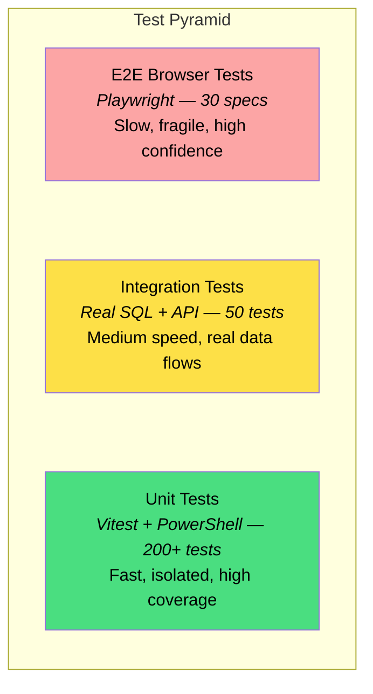
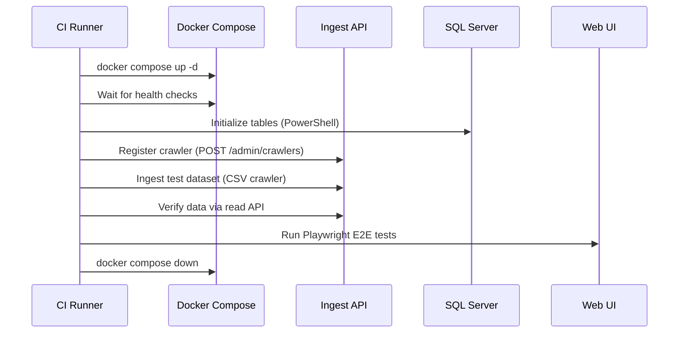
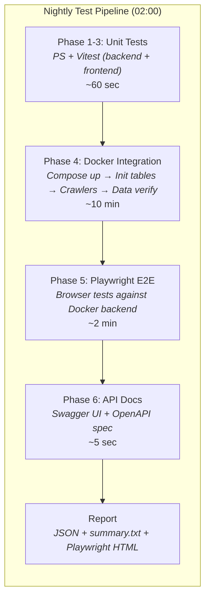
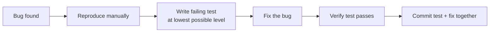

# Testing Plan

Comprehensive testing strategy for Identity Atlas — covering unit tests, integration tests, end-to-end browser tests, and nightly validation against the Docker stack.

---

## Current State

| What Exists | What's Missing / In Progress |
|---|---|
| **Pester v5 unit tests** (`test/unit/IdentityAtlas.Tests.ps1`) — replaces homegrown runner | Backend JS integration tests (engine, sessions, crawlers) |
| **Vitest API unit tests** (`app/api/src/ingest/validation.test.js`, 53 tests) | Frontend React component unit tests |
| **Playwright E2E browser tests** (12 specs, including tag lifecycle) | Real-data E2E (ingest → API → UI verification) |
| **PR pipeline** (PSScriptAnalyzer, ESLint, Pester+coverage, Vitest, Spectral, npm audit) | Automated nightly that provisions from scratch |
| **ESLint flat config** (`app/ui/eslint.config.js`) | Frontend Vitest + React Testing Library |
| **OpenAPI Spectral lint** in PR pipeline | Ingest engine + normalization unit tests |
| Docker integration suite (`test/run-docker-tests.ps1`, 87 checks) | Code coverage for JS (coverage-v8) |
| Nightly GitHub Actions workflow (fixed paths) | Failure notification (Slack/email) |
| Mock backend for E2E (`USE_SQL=false`) | |
| Test datasets (Omada CSVs in `test/datasets/`) | |
| Central test config (`test/test.config.json`) | |

The remaining highest-risk gap: the ingest engine (MERGE SQL generation, scoped deletes, sessions) and crawler auth middleware have no automated tests beyond the Docker integration suite.

---

## Testing Pyramid



**Principle:** Most tests at the bottom (fast, cheap, isolated), fewer at the top (slow, expensive, realistic). Every bug found in production gets a test added at the lowest possible level.

---

## Test Layers

### Layer 1: Unit Tests (Fast, No Dependencies)

**Goal:** Every function, module, and component is tested in isolation. Runs in < 60 seconds with zero external dependencies.

#### 1a. PowerShell Module Tests ✅ Migrated to Pester v5

**Runner:** Pester v5 (`test/unit/IdentityAtlas.Tests.ps1`)

**Run:** `Invoke-Pester -Path test/unit/IdentityAtlas.Tests.ps1 -Output Detailed`

**Current coverage:**
- Module import + manifest validity + version format
- ~130 function exports across Base, Generic, SQL, Sync, Automation, RiskScoring
- Removed functions must not exist (`Sync-FGGroupTransitiveMember`)
- All aliases point to the correct function
- `Verb-FGNoun` naming convention on all `.ps1` files
- `[CmdletBinding()]` on all functions
- No Dutch comments; no hardcoded secrets; no `Write-Output`
- Config template exists and is valid JSON with required sections
- Function counts per folder within expected ranges
- `IdentityAtlas.psm1` dot-sources all expected category folders

**Still to add:**
- [ ] Validate column definitions in `Initialize-FG*.ps1` SQL strings (no typos in column names or types)
- [ ] Verify no remaining references to deleted sync functions (`Start-FGSync`, `Sync-FGPrincipal`, etc.)

#### 1b. Backend JS Unit Tests (Partially Done ✅)

**Runner:** Vitest — `cd app/api && npm test`

**Location:** `app/api/src/ingest/`

**Done:**

| File | Tests | Status |
|---|---|---|
| `ingest/validation.test.js` | 53 test cases: envelope validation, per-entity record validation, UUID enforcement, enums, maxLength, error cap | ✅ Done |

**Still to add:**

| File | Tests |
|---|---|
| `ingest/normalization.test.js` | Deterministic GUID generation; boolean coercion (true→1, false→0); extendedAttributes packing; null/undefined handling |
| `ingest/engine.test.js` | MERGE SQL generation for single-key and composite-key tables; scoped delete SQL generation |
| `ingest/sessions.test.js` | Session lifecycle (start → continue → end); expired session cleanup |
| `middleware/crawlerAuth.test.js` | Hash verification; rate limit enforcement; expired key rejection |

**Setup already done:**
- `vitest` in `app/api/package.json` devDependencies
- `"test": "vitest run"` script in `app/api/package.json`

#### 1c. Frontend React Unit Tests (TODO)

**Runner:** Vitest + React Testing Library

**Location:** `app/ui/src/__tests__/`

**Tests to create:**

| File | Tests |
|---|---|
| `components/CrawlersPage.test.jsx` | Renders empty state; shows register dialog; displays crawler list; copy-to-clipboard works; enable/disable toggle |
| `utils/exportToExcel.test.js` | Column mapping; AP color assignment; multi-type badge formatting |
| `hooks/usePermissions.test.js` | Debounced refetch; error state handling |
| `hooks/useEntityPage.test.js` | Search filtering; pagination state; tag operations |
| `ingest validation (shared)` | Any shared validation logic used client-side |

**Setup needed:**

```bash
cd app/ui
npm install -D vitest @vitest/coverage-v8 @testing-library/react @testing-library/jest-dom jsdom
```

Add to `app/ui/package.json`:

```json
"scripts": {
  "test": "vitest run",
  "test:watch": "vitest",
  "test:coverage": "vitest run --coverage"
}
```

---

### Layer 2: Integration Tests (Real SQL, Real API)

**Goal:** Verify that components work together correctly with a real database. Runs against the Docker SQL container.

#### 2a. Ingest API Integration Tests (NEW — Critical)

**Runner:** Vitest with real SQL connection (Docker SQL Server)

**Location:** `UI/backend/src/__tests__/integration/`

**Pre-requisite:** Docker SQL Server running (from `docker-compose.yml`) with tables initialized.

| Test Suite | Tests |
|---|---|
| `ingest-engine.integration.test.js` | Merge 100 records into empty table → 100 inserted; re-merge same records → 0 inserted, 100 updated; merge with 10 changed fields → 10 updated; full sync with 90 of 100 → 10 deleted; delta sync with 10 of 100 → 0 deleted; temporal history preserved after delete; cross-system isolation (system A sync doesn't delete system B) |
| `ingest-scoped-delete.integration.test.js` | Scope by resourceType (delete Groups but not AppRoles); scope by assignmentType (delete Direct but not Owner); scope by principalType (delete User but not ServicePrincipal); composite key delete (ResourceAssignments matches all 3 columns); no ValidTo filter violation (history rows not deleted) |
| `ingest-sessions.integration.test.js` | Chunked upload: start + 2 continue + end → correct merged count; end with full sync → scoped delete runs on all accumulated records; session timeout → temp table cleaned up |
| `ingest-normalization.integration.test.js` | Deterministic GUID round-trip (generate → insert → re-generate → same ID found); extendedAttributes stored as valid JSON in SQL; boolean coercion stored as BIT |
| `ingest-endpoints.integration.test.js` | POST to each of the 12 endpoints with valid data → 201; POST with invalid data → 400 with field errors; POST with wrong system scope → 403; Full lifecycle: register system → ingest principals → ingest resources → ingest assignments → verify joins work |
| `crawler-auth.integration.test.js` | Register crawler → get key → authenticate → whoami returns metadata; rotate key → old key fails → new key works; disable crawler → 403; rate limit exceeded → 429; expired key → 401 |

#### 2b. Crawler Integration Tests (NEW)

**Runner:** PowerShell (calls the real crawlers against Docker)

**Location:** `_Test/Test-Crawlers.ps1`

| Test | Steps |
|---|---|
| **EntraID Crawler** | Run `Start-EntraIDCrawler.ps1` against test tenant → verify principals, resources, assignments appear in SQL via API |
| **CSV Crawler** | Run `Start-CSVCrawler.ps1` against `_Test/DatasetLed2/` → verify all CSV entity types appear in SQL |
| **Cross-system isolation** | Run EntraID crawler, then CSV crawler → verify neither deletes the other's data |
| **Repeat sync idempotency** | Run CSV crawler twice → second run has 0 inserts, only updates for changed records |
| **Delete detection** | Import 100 resources, remove 10 from CSV, re-run → 10 deleted |

#### 2c. SQL Schema Tests (Extend Existing)

**Add to existing `Test-Integration.ps1`:**

- [ ] Verify `Crawlers` table created with correct columns
- [ ] Verify `CrawlerAuditLog` table created with correct indexes
- [ ] Verify `contextId` column exists on Principals and Resources tables
- [ ] Verify all temporal tables have ValidFrom/ValidTo columns
- [ ] Verify all expected indexes exist after initialization

---

### Layer 3: End-to-End Browser Tests (Playwright)

**Goal:** Verify the full stack works from a user's perspective — data ingested via API shows up correctly in the UI.

#### 3a. Existing E2E Tests

**Location:** `app/ui/e2e/`

**Current specs (12):** navigation ✅, matrix ✅, tags ✅ (new), users-page ✅, groups-page ✅, access-packages ✅, sync-log ✅, risk-scoring ✅, org-chart ✅, performance ✅, detail-pages ✅, identities ✅

All specs run against the mock backend (`USE_SQL=false, AUTH_ENABLED=false`). Playwright config starts both servers automatically.

The `navigation.spec.js` was updated to match the current app state: "Identity Atlas" title/heading, correct tab labels (Resources not Groups, Business Roles not Access Packages), optional tabs excluded from the always-visible assertion.

**Still to add:**

| Spec | Tests |
|---|---|
| `swagger.spec.js` | `/api/docs` loads Swagger UI; spec renders without errors |
| `ingest-data-flow.spec.js` | After real ingest: resources/users/matrix/sync-log show data |

#### 3b. Real-Data E2E (NEW — Nightly Only)

These tests run against a fully provisioned environment with real data (not mock).

**Location:** `UI/frontend/e2e/nightly/`

| Spec | Tests |
|---|---|
| `nightly-data-integrity.spec.js` | After full crawler run: user count matches Graph API count; resource count matches group count; assignment count > 0; no "0 users x 0 resources" in matrix; every user in the matrix can be clicked to open a detail page; sync log shows successful entries for all entity types |
| `nightly-navigation.spec.js` | Every nav tab loads without errors; every page renders content (not empty); no broken links (404s); no unhandled JS exceptions |
| `nightly-governance.spec.js` | Business roles page shows access packages; category assignment works; review status displays correctly |

---

### Layer 4: Deployment Validation Tests (Docker)

**Goal:** Verify the full deployment pipeline works — from zero to a running, data-populated environment.

#### 4a. Docker Deployment Test



**Script:** `_Test/Test-DockerDeployment.ps1`

Steps:
1. `docker compose -f docker-compose.yml up -d`
2. Wait for SQL health check (up to 60 seconds)
3. Run `Initialize-FGSystemTables`, `Initialize-FGGovernanceTables`, `Initialize-FGCrawlerTables`
4. Register a crawler via API
5. Run CSV crawler against test dataset
6. Verify via API: principals count > 0, resources count > 0, assignments count > 0
7. Run Playwright E2E tests against `http://localhost:3001`
8. `docker compose down -v`

---

## Nightly Schedule



### Local Machine (Windows Task Scheduler)

The nightly tests run on a dedicated Windows machine using Task Scheduler. No CI pipeline needed.

**Setup (one-time):**

```powershell
# Register the nightly task (runs at 02:00 daily)
pwsh -File _Test\Register-NightlySchedule.ps1

# Or choose a custom time
pwsh -File _Test\Register-NightlySchedule.ps1 -Time "04:00"

# Remove the schedule
pwsh -File _Test\Register-NightlySchedule.ps1 -Unregister
```

**Run manually at any time:**

```powershell
pwsh -File _Test\Run-NightlyLocal.ps1

# Skip slow parts during development
pwsh -File _Test\Run-NightlyLocal.ps1 -SkipE2E
pwsh -File _Test\Run-NightlyLocal.ps1 -SkipIntegration

# Keep Docker running for debugging
pwsh -File _Test\Run-NightlyLocal.ps1 -KeepEnvironment
```

**Results** are written to `_Test/NightlyResults/<date>/`:

| File | Content |
|---|---|
| `results.json` | Machine-readable: every test name, pass/fail, detail, timestamp |
| `summary.txt` | Human-readable one-line-per-test summary |
| `playwright-report/` | Full Playwright HTML report with screenshots |
| `*.log` | Stdout/stderr capture per phase (docker-up, csv-crawler, etc.) |

**What the nightly run does:**

1. PowerShell unit tests (function naming, syntax, no deleted function references)
2. Backend JS unit tests (`npm test` in `UI/backend/`)
3. Frontend JS unit tests (`npm test` in `UI/frontend/`)
4. Docker provisioning: compose up → wait for SQL → initialize all tables → verify schema
5. Crawler auth lifecycle: register → whoami → rotate key → invalid key rejected
6. CSV crawler: ingest test dataset → verify data appears via read API
7. Playwright E2E: browser tests against Docker backend with real data
8. Swagger/OpenAPI: docs page loads, spec is valid
9. Teardown: `docker compose down -v`
10. Report: JSON + summary + Playwright HTML

**Prerequisites on the test machine:**

- PowerShell 7+
- Docker Desktop (running)
- Node.js 20+
- Chromium for Playwright: `cd UI/frontend && npx playwright install chromium`

### GitHub Actions Workflow (Optional, Future)

**File:** `.github/workflows/nightly-tests.yml`

```yaml
name: Nightly Tests
on:
  schedule:
    - cron: '0 2 * * *'  # 02:00 UTC daily
  workflow_dispatch:

jobs:
  unit-tests:
    runs-on: ubuntu-latest
    steps:
      - uses: actions/checkout@v4
      - uses: actions/setup-node@v4
        with: { node-version: '20' }
      - name: Backend unit tests
        working-directory: UI/backend
        run: npm ci && npm test
      - name: Frontend unit tests
        working-directory: UI/frontend
        run: npm ci && npm test
      - name: PowerShell unit tests
        shell: pwsh
        run: ./_Test/Test-Unit.ps1
      - name: Upload coverage
        uses: actions/upload-artifact@v4
        with:
          name: coverage
          path: |
            UI/backend/coverage/
            UI/frontend/coverage/

  docker-integration:
    needs: unit-tests
    runs-on: ubuntu-latest
    services:
      sqlserver:
        image: mcr.microsoft.com/mssql/server:2022-latest
        env:
          ACCEPT_EULA: Y
          MSSQL_SA_PASSWORD: FortigiGraph_Test1!
        ports: ['1433:1433']
        options: --health-cmd "/opt/mssql-tools18/bin/sqlcmd -S localhost -U sa -P FortigiGraph_Test1! -Q 'SELECT 1' -C" --health-interval 10s --health-timeout 5s --health-retries 10
    steps:
      - uses: actions/checkout@v4
      - uses: actions/setup-node@v4
        with: { node-version: '20' }
      - name: Install backend deps
        working-directory: UI/backend
        run: npm ci
      - name: Start backend
        working-directory: UI/backend
        env:
          USE_SQL: 'true'
          SQL_SERVER: localhost
          SQL_DATABASE: FortigiGraphTest
          SQL_USER: sa
          SQL_PASSWORD: FortigiGraph_Test1!
          SQL_TRUST_SERVER_CERT: 'true'
          AUTH_ENABLED: 'false'
          PORT: 3001
        run: |
          # Create database
          /opt/mssql-tools18/bin/sqlcmd -S localhost -U sa -P 'FortigiGraph_Test1!' -Q "CREATE DATABASE FortigiGraphTest" -C
          node src/index.js &
          sleep 5
      - name: Initialize tables
        shell: pwsh
        run: |
          $Global:FGSQLConnectionString = "Server=localhost;Database=FortigiGraphTest;User Id=sa;Password=FortigiGraph_Test1!;TrustServerCertificate=True"
          Import-Module ./FortigiGraph.psd1 -Force
          Initialize-FGSystemTables
          Initialize-FGGovernanceTables
          Initialize-FGCrawlerTables
      - name: Run ingest integration tests
        working-directory: UI/backend
        env:
          TEST_SQL_SERVER: localhost
          TEST_SQL_DATABASE: FortigiGraphTest
          TEST_SQL_USER: sa
          TEST_SQL_PASSWORD: FortigiGraph_Test1!
        run: npx vitest run src/__tests__/integration/
      - name: Run CSV crawler
        shell: pwsh
        run: |
          # Register crawler and run CSV ingest
          $key = (Invoke-RestMethod -Uri http://localhost:3001/api/admin/crawlers -Method Post -ContentType 'application/json' -Body '{"displayName":"test"}').apiKey
          ./Crawlers/CSV/Start-CSVCrawler.ps1 -ApiBaseUrl http://localhost:3001/api -ApiKey $key -CsvFolder ./_Test/DatasetLed2 -SystemName "Test Omada" -SystemType "Omada"
      - name: Verify ingested data
        shell: pwsh
        run: |
          $r = Invoke-RestMethod -Uri http://localhost:3001/api/resources
          if ($r.Count -eq 0) { throw "No resources found after ingest" }
          Write-Host "Resources: $($r.Count)" -ForegroundColor Green
      - name: Install Playwright
        working-directory: UI/frontend
        run: npm ci && npx playwright install chromium --with-deps
      - name: Run E2E tests
        working-directory: UI/frontend
        env:
          E2E_BASE_URL: http://localhost:3001
        run: npx playwright test
      - name: Upload Playwright report
        if: always()
        uses: actions/upload-artifact@v4
        with:
          name: playwright-report
          path: UI/frontend/playwright-report/
```

---

## Adding Tests When Bugs Are Found

When a bug is found in production or during manual testing, follow this process:



### Decision: Which Layer?

| Bug Type | Test Layer | Example |
|---|---|---|
| Wrong SQL generated | Backend unit test | `engine.test.js`: verify MERGE SQL for edge case |
| Data not showing in UI | Playwright E2E | `data-flow.spec.js`: verify data appears after ingest |
| Cross-system deletion | Integration test | `scoped-delete.integration.test.js`: system A sync deletes system B data |
| Validation bypass | Backend unit test | `validation.test.js`: invalid enum value not rejected |
| React component crash | Frontend unit test | `CrawlersPage.test.jsx`: handles null API response |
| Auth bypass | Integration test | `crawler-auth.integration.test.js`: expired key still works |
| Docker won't start | Deployment test | `Test-DockerDeployment.ps1`: health check fails |

### Template for Adding a Regression Test

```js
// In the appropriate test file, add:
it('should [describe expected behavior] (regression: [issue-description])', async () => {
  // Arrange: set up the condition that caused the bug
  // Act: perform the operation that triggered it
  // Assert: verify the bug is fixed
});
```

---

## Implementation Steps

### Step 1: Test Infrastructure ✅ Done

- [x] Add Vitest to `app/api/package.json` (devDependencies + `"test"` script)
- [x] Add ESLint flat config to `app/ui/eslint.config.js`
- [x] Migrate PowerShell unit tests to Pester v5 (`test/unit/IdentityAtlas.Tests.ps1`)
- [x] PR pipeline (`.github/workflows/pr.yml`) — PSScriptAnalyzer, ESLint, Pester+coverage, Vitest, Spectral, npm audit
- [x] Central test config (`test/test.config.json`)
- [x] Fix nightly workflow paths (`test/automation/github-nightly-tests.yml`)
- [ ] Add Vitest + Testing Library to `app/ui` for React component tests
- [ ] Create `app/ui/src/__tests__/` directory structure

### Step 2: Backend Unit Tests (Partially Done ✅)

- [x] `ingest/validation.test.js` — 53 test cases covering all envelope + record validation rules
- [ ] `ingest/normalization.test.js` — GUID generation, type coercion, extendedAttributes
- [ ] `ingest/engine.test.js` — SQL generation logic (mock the pool, test the SQL strings)
- [ ] `middleware/crawlerAuth.test.js` — hash verification, rate limiting, scope checking

### Step 3: Backend Integration Tests

- [ ] Set up Docker SQL in CI (service container in GitHub Actions)
- [ ] `ingest-engine.integration.test.js` — full merge + delete cycle against real SQL
- [ ] `ingest-endpoints.integration.test.js` — HTTP calls to each endpoint
- [ ] `crawler-auth.integration.test.js` — full key lifecycle

### Step 4: Frontend Unit Tests

- [ ] `CrawlersPage.test.jsx` — render, register, toggle
- [ ] `exportToExcel.test.js` — column mapping, color assignment
- [ ] `useEntityPage.test.js` — search, pagination state

### Step 5: E2E Tests (Mostly Done ✅)

- [x] `tags.spec.js` — tag lifecycle via API (create → assign → filter → delete)
- [x] Fixed `navigation.spec.js` — corrected stale tab labels and title after rebrand
- [ ] `swagger.spec.js` — Swagger UI loads
- [ ] `ingest-data-flow.spec.js` — data visible in UI after real ingest

### Step 6: Docker Deployment Test ✅ Partially Done

- [x] `test/run-docker-tests.ps1` — 87 checks covering infrastructure, API, crawler auth, demo dataset, schema, data counts, integrity, business logic, matrix + tag API
- [ ] Integrate Docker tests into GitHub Actions nightly pipeline as a dedicated job

### Step 7: Nightly CI Pipeline ✅ Done

- [x] `test/automation/github-nightly-tests.yml` — fixed paths, migrated to Pester
- [x] PR pipeline at `.github/workflows/pr.yml`
- [ ] Configure secrets in GitHub repository settings
- [ ] Set up failure notification (Slack/email)

---

## Coverage Targets

| Area | Current | Target (3 months) |
|---|---|---|
| PowerShell functions (naming, syntax) | 100% | 100% |
| Ingest engine (merge, delete, sessions) | 0% | 90% |
| Ingest validation | 0% | 95% |
| Crawler auth | 0% | 90% |
| API endpoints (12 ingest + crawlers) | 0% | 80% |
| React components | 0% | 50% |
| React hooks/utils | 0% | 70% |
| Playwright E2E pages | 11/14 pages | 14/14 pages |
| Docker deployment | Manual | Automated |

---

## Test Data Strategy

### Unit Tests
Use hardcoded fixtures — no external dependencies. Example:

```js
const testPrincipal = {
  id: '00000000-0000-0000-0000-000000000001',
  displayName: 'Test User',
  principalType: 'User',
  accountEnabled: true,
};
```

### Integration Tests
Use the existing `_Test/DatasetLed2/` CSV dataset (Omada format). This provides a realistic set of systems, resources, principals, identities, assignments, org units, and certifications.

### E2E Tests (Mock)
Use the existing mock backend (`USE_SQL=false`). Tests verify UI behavior, not data correctness.

### E2E Tests (Nightly Real-Data)
Use Docker SQL + CSV crawler with `_Test/DatasetLed2/` dataset. Tests verify data flows end-to-end.

### Tenant Tests
Use a real Entra ID test tenant (separate from production). Tests verify Graph API → Crawler → Ingest → UI pipeline running inside the Docker stack.
