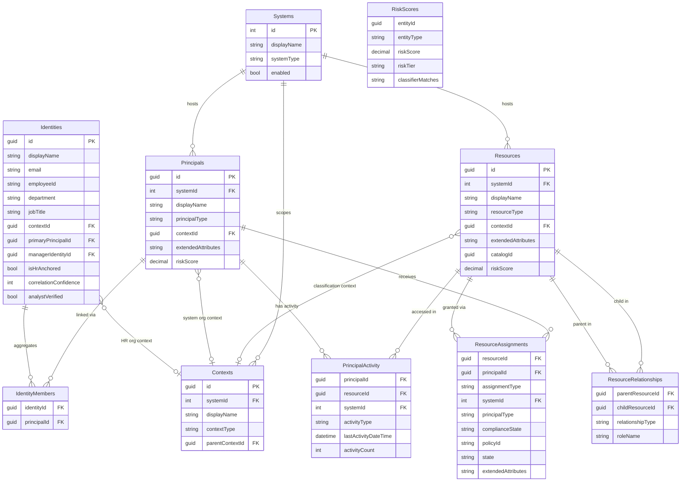

# Data Model

Identity Atlas uses a unified data model (v3.2) that stores all authorization entities — from any source system — in a consistent structure backed by PostgreSQL with trigger-based audit history.

---

## Core Design Principles

Four principles drive the data model design:

**Universal**
Any authorization source maps to the same tables. Entra ID groups, SAP roles, Omada business roles, and custom CSV imports all become `Resources` and `Principals` in the same schema. No source-specific tables.

**Audited**
All core tables are tracked by a shared `_history` audit table populated by PostgreSQL triggers. Every insert, update, and delete is recorded as a JSONB snapshot, giving you a complete change history for any entity. The trigger skips unchanged rows during re-syncs to avoid bloating the audit log.

**Core + JSON**
Frequently queried attributes (`displayName`, `resourceType`, `department`) are real SQL columns with indexes. System-specific fields that vary by source live in an `extendedAttributes` TEXT (JSON) column. This gives you index performance on hot paths without a rigid, source-specific schema.

**Unified business roles**
Business roles are not stored in a separate table. They are `Resources` with `resourceType = 'BusinessRole'`. Their assignments are `ResourceAssignments` with `assignmentType = 'Governed'`. Their resource grants are `ResourceRelationships` with `relationshipType = 'Contains'`. The result is a single set of views, risk scores, and queries that apply to all resource types equally.

---

## Conceptual Hierarchy

The model is organized around real people, not system accounts:

```
Identities (real persons — the governance anchor)
  └─ Principals (accounts in source systems, via IdentityMembers)
       └─ ResourceAssignments (what access each account holds)
            └─ Resources (what is being accessed)

Contexts (organizational/structural trees — system-scoped)
  └─ Identities  (contextId: HR org unit, department)
  └─ Principals  (contextId: AD OU, Entra admin unit)
  └─ Resources   (contextId: resource classification, location)

Systems (technical sync root — each Principal, Resource, and Context belongs to one System)
```

**Why Identity is the root:** A real person (Identity) may have multiple accounts (Principals) across different source systems. The organizational context — department, team, cost center — belongs to the *person*, not to each individual account. Identities carry a `contextId` that represents their place in the HR/governance org structure.

**Why Principals and Resources also have a contextId:** Source systems have their own organizational structures that are distinct from the HR org chart. Active Directory has OUs, Entra ID has administrative units, resource management systems have classification hierarchies. These structures are valuable for risk scoring, policy evaluation, and reporting — but they belong to the *system*, not to the person. A Principal's `contextId` captures its position in the source system's own hierarchy, independent of the Identity's HR context.

**Multiple independent context trees:** Each `(systemId, contextType)` combination forms an independent tree. An HR system produces a Department tree linked to Identities. Active Directory produces an OU tree linked to Principals. A resource classification system produces a Category tree linked to Resources. These trees coexist in the same Contexts table, scoped by `systemId`.

**Why Systems are the sync root:** At ingestion time, every Principal, Resource, and Context must belong to a System. This enables multi-tenant and multi-system deployments without ambiguity.

---

## Entity Relationship Diagram



---

## Table Reference

### Identities

Real persons aggregated across multiple accounts and source systems. An Identity is the result of account correlation: one human may have an Entra ID user, a service account, and a privileged admin account — all linked to one Identity record.

Identities carry the `contextId` because organizational context (department, team) belongs to the *person*, not to their individual accounts.

| Property | Value |
|---|---|
| Primary Key | `id` GUID |
| Audit history | Yes (via `_history` trigger) |
| Created by | Migration `001_core_schema.sql` |

Key columns: `displayName`, `email`, `employeeId`, `department`, `jobTitle`, `contextId`, `primaryPrincipalId`, `managerIdentityId`.

Identity correlation columns: `isHrAnchored`, `hrAccountId`, `accountCount`, `accountTypes` (JSONB), `correlationSignals` (JSONB), `correlationConfidence`, `correlatedAt`, `orphanStatus`, `analystVerified`, `analystNotes`.

---

### IdentityMembers

The join table between Identities and Principals. One identity links to one or more principals, potentially across different source systems.

| Property | Value |
|---|---|
| Primary Key | Composite: `identityId` + `principalId` |
| Audit history | No |
| Created by | Migration `001_core_schema.sql` |

---

### Contexts

Organizational and structural groupings from any source system. A Context can represent an HR department, an AD organizational unit, an Entra ID administrative unit, a resource classification category, or any other hierarchy. The `contextType` column discriminates between them; the `systemId` column scopes them to a source system.

**Multiple independent context trees:** Each `(systemId, contextType)` combination forms its own tree. These trees are independent — an HR department tree, an AD OU tree, and a resource classification tree all coexist in the same table without interfering.

| Source System | contextType | Linked To | Example |
|---|---|---|---|
| HR system (CSV) | `OrgUnit` | Identities | Finance > Accounts Payable > Invoice Processing |
| Active Directory | `OrgUnit` | Principals | corp.local > Users > Amsterdam > Admins |
| Entra ID | `AdministrativeUnit` | Principals | AU-Netherlands, AU-Germany |
| Entra ID | `Department` | Identities | Calculated from user.department field |
| Resource mgmt | `Classification` | Resources | Confidential > Finance Data > Payment Systems |
| Custom | Any string | Any | Fully extensible |

**Which entities carry a contextId:**

- **Identities** — HR/governance org context. "This person belongs to Finance > Accounts Payable."
- **Principals** — Source system org context. "This AD account lives in OU=Admins,OU=Amsterdam."
- **Resources** — Classification or grouping context. "This SharePoint site is classified as Confidential > Finance Data."

Each entity has a single `contextId` column. If an entity needs to participate in multiple context trees (e.g., an Identity has both an HR department and a location), use the primary governance context as `contextId` and store secondary context references in `extendedAttributes`.

**Context and policy-driven access:** When an assignment is driven by an Identity's context (e.g., "all Finance employees get access to SharePoint Finance"), the governing rule is captured in `AssignmentPolicies.policyConditions` as a JSON condition referencing the `contextId`. The assignment row in `ResourceAssignments` records the *result*; the policy row records the *rule*. This keeps assignments clean while the "why" remains auditable through the policy chain.

| Property | Value |
|---|---|
| Primary Key | `id` GUID |
| Audit history | No |
| Created by | Migration `001_core_schema.sql` |

Key columns: `displayName`, `contextType`, `systemId`, `parentContextId` (self-referencing for hierarchy).

**contextType values:** `Department`, `Division`, `CostCenter`, `Team`, `Office`, `Project`, `Location`, `OrgUnit`, `AdministrativeUnit`, `Classification`, or any custom string.

---

### Systems

Represents a connected authorization source. Every resource and principal is owned by exactly one system.

| Property | Value |
|---|---|
| Primary Key | `id` SERIAL |
| Audit history | Yes (via `_history` trigger) |
| Created by | Migration `001_core_schema.sql` |

Key columns: `displayName`, `systemType` (e.g. `EntraID`, `Omada`, `SAP`, `CSV`), `enabled`.

---

### Resources

Any permission-granting entity: Entra ID groups, directory roles, application roles, business roles, SharePoint sites, Azure RBAC roles, or any custom type. The `resourceType` column discriminates between them.

| Property | Value |
|---|---|
| Primary Key | `id` GUID |
| Audit history | Yes (via `_history` trigger) |
| Created by | Migration `001_core_schema.sql` |

Key columns: `displayName`, `resourceType`, `systemId`, `contextId` (optional — classification or grouping context), `extendedAttributes` (JSON), `catalogId`, `isHidden`, `riskScore`.

---

### ResourceAssignments

Captures who has access to what, and how. The `assignmentType` column distinguishes direct membership from PIM-eligible access from governed (business-role-driven) access.

| Property | Value |
|---|---|
| Primary Key | Composite: `resourceId` + `principalId` + `assignmentType` |
| Audit history | Yes (via `_history` trigger) |
| Created by | Migration `001_core_schema.sql` |

Key columns: `assignmentType`, `systemId`, `principalType`, `complianceState`, `policyId`, `state`, `assignmentStatus`, `expirationDateTime`, `extendedAttributes` (JSONB).

---

### ResourceRelationships

Resource-to-resource links. Used for two purposes: `Contains` links a business role to the resources it grants; `GrantsAccessTo` expresses that holding one resource implies access to another.

| Property | Value |
|---|---|
| Primary Key | Composite: `parentResourceId` + `childResourceId` + `relationshipType` |
| Audit history | Yes (via `_history` trigger) |
| Created by | Migration `001_core_schema.sql` |

Key columns: `relationshipType`, `roleName`, `roleOriginSystem`.

---

### Principals

All identity types from any system. The `principalType` column distinguishes human accounts from service principals, managed identities, AI agents, and more.

| Property | Value |
|---|---|
| Primary Key | `id` GUID |
| Audit history | Yes (via `_history` trigger) |
| Created by | Migration `001_core_schema.sql` |

Key columns: `displayName`, `principalType`, `systemId`, `contextId` (optional — source system org structure, e.g. AD OU), `extendedAttributes` (JSON), `riskScore`.

---

### PrincipalActivity

High-frequency activity signals: sign-ins, per-app usage, AI agent invocations. This table is intentionally **not** tracked by audit triggers. See [Activity Data](#activity-data-principalactivity) below for the reason.

| Property | Value |
|---|---|
| Primary Key | Composite: `principalId` + `resourceId` + `systemId` + `activityType` |
| Audit history | No (upsert-based) |
| Created by | Migration `001_core_schema.sql` |

Key columns: `activityType`, `lastActivityDateTime`, `activityCount`.

---

### RiskScores

Risk assessment results for any entity type (Principal, Resource, Identity, Context). Written by `Invoke-FGRiskScoring` and updated by analyst overrides.

| Property | Value |
|---|---|
| Primary Key | Composite: `entityId` + `entityType` |
| Audit history | No |
| Created by | Migration `004_risk_scoring.sql` |

Key columns: `riskScore`, `riskTier`, `riskDirectScore`, `riskMembershipScore`, `riskStructuralScore`, `riskPropagatedScore`, `riskClassifierMatches` (JSON), `riskOverride`, `riskOverrideReason`.

Risk scoring also uses several supporting tables for inputs (org context, classifiers, correlation rules) and outputs (resource clusters). See [Risk Scoring Data Model](risk-scoring-model.md) for the full picture.

---

## principalType Values

The `principalType` column on the Principals table uses these standard values across all sync and scoring functions.

| Value | What it covers | Source |
|---|---|---|
| `User` | Interactive human user accounts | `Sync-FGPrincipal`, CSV |
| `ServicePrincipal` | App registration service principals | `Sync-FGServicePrincipal` |
| `ManagedIdentity` | Azure resource-attached identities (system or user-assigned) | `Sync-FGServicePrincipal` |
| `WorkloadIdentity` | Federated credential identities (GitHub Actions, AKS workloads) | `Sync-FGServicePrincipal`, CSV |
| `AIAgent` | AI agents: Copilot Studio, Azure OpenAI, custom bots | `Sync-FGServicePrincipal` auto-detection, CSV |
| `ExternalUser` | Guest / B2B accounts from another tenant | CSV import |
| `SharedMailbox` | Shared mailboxes and room/equipment accounts | CSV import |

!!! note "Risk scoring behavior by principalType"
    `User` principals receive the full set of stale sign-in, never-signed-in, and guest-account checks. Non-human types (`ServicePrincipal`, `ManagedIdentity`, `WorkloadIdentity`, `AIAgent`) receive structural signals only — no stale sign-in checks. All types participate in direct classifier matching, membership analysis, and risk propagation.

---

## resourceType Values

The `resourceType` column on the Resources table is a free-form string. These are the standard values used by the built-in sync functions.

| Value | What it covers |
|---|---|
| `EntraGroup` | Entra ID security groups and Microsoft 365 groups |
| `EntraDirectoryRole` | Entra ID directory roles (Global Administrator, etc.) |
| `EntraAppRole` | Application roles from enterprise app registrations |
| `BusinessRole` | Named entitlement bundles from any IGA platform |
| `SharePointSite` | SharePoint sites (via CSV import) |
| `AzureRBACRole` | Azure RBAC role assignments (via CSV import) |
| Custom | Any string — fully extensible for any authorization source |

!!! tip "Extending resourceType"
    You can use any string value for custom source systems. The model does not enforce an enum — `resourceType` is TEXT. Use a consistent naming convention such as `SystemPrefix_TypeName` (e.g., `SAP_Role`, `Pathlock_Permission`) so queries and views remain readable.

---

## assignmentType Values

The `assignmentType` column on ResourceAssignments describes how the assignment was created and what it means.

| Value | Meaning |
|---|---|
| `Direct` | Direct group membership |
| `Owner` | Group owner relationship |
| `Eligible` | PIM-eligible membership — granted but not yet activated |
| `Governed` | Assigned through a business role or access package |
| Custom | Any string for CSV-imported assignments |

---

## Source System Mapping

The same three tables (Resources, Principals, ResourceAssignments) absorb data from any source. The sync function and the `resourceType` / `assignmentType` values are the only things that differ.

| Source System | Sync Method | resourceType | principalType | assignmentType |
|---|---|---|---|---|
| Entra ID groups | `Sync-FGGroup` | `EntraGroup` | `User` | `Direct` / `Owner` / `Eligible` |
| Entra ID directory roles | `Sync-FGEntraDirectoryRole` | `EntraDirectoryRole` | `User` | `Direct` |
| Entra ID app roles | `Sync-FGEntraAppRoleAssignment` | `EntraAppRole` | `User` / `ServicePrincipal` | `Direct` |
| Entra ID access packages | `Sync-FGAccessPackage` | `BusinessRole` | — | `Governed` (via assignments sync) |
| Omada / SailPoint | CSV import via `Sync-FGCSVBusinessRole` | `BusinessRole` | Any | `Governed` |
| SAP / Pathlock | CSV import via `Sync-FGCSVResource` | Any | Any | Any |
| Custom system | `Sync-FGCSVResource` + `Sync-FGCSVResourceAssignment` | Any | Any | Any |

---

## Activity Data (PrincipalActivity)

PrincipalActivity is physically separated from Principals by design, even though it describes the same entities.

**Why not store activity in Principals?**

Principals is tracked by the `_history` audit trigger, which records a JSONB snapshot every time a row changes. Sign-in timestamps change daily — sometimes hourly — for active accounts. Storing `lastSignInDateTime` on Principals would generate enormous audit history for data that is not meaningful to review. A user's last sign-in two minutes ago is not a material change that anyone needs to audit.

**What PrincipalActivity does instead:**

Each row stores the latest known activity per `(principalId, resourceId, systemId, activityType)` combination. Sync functions upsert into this table, overwriting the previous value in place. No history is retained — the table is always a current snapshot.

**Activity types:**

| activityType | Source | Meaning |
|---|---|---|
| `SignIn` | Entra ID audit log | Most recent interactive or non-interactive sign-in |
| `AppSignIn` | Entra ID audit log | Last sign-in to a specific application (resourceId = app) |
| `Invocation` | AI platform telemetry | Last invocation of an AI agent |

**Use in risk scoring:**

The risk engine queries PrincipalActivity to detect:

- **Stale accounts** — `User` principals with no `SignIn` activity in 90+ days
- **Ghost app roles** — `EntraAppRole` assignments where the user has never signed in to the app
- **Active high-privilege usage** — principals actively using sensitive resources (reduces risk score)
- **AI agent dormancy** — `AIAgent` principals with no recent `Invocation` activity
