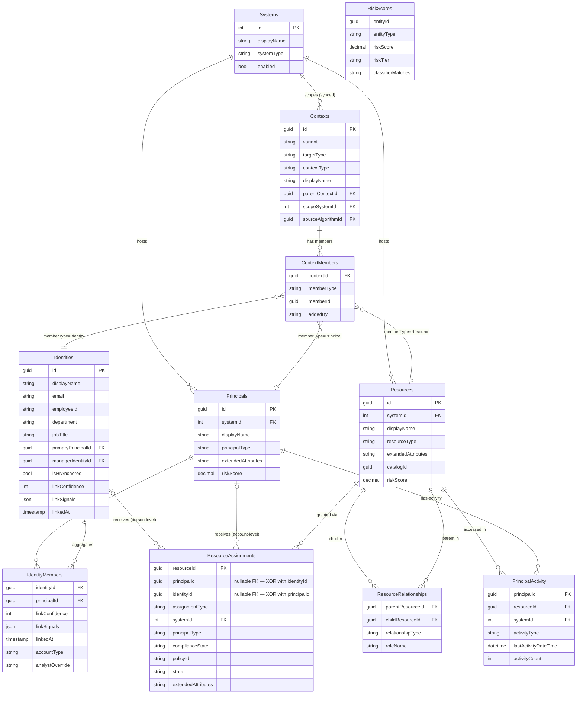

# Data Model

Identity Atlas uses a unified data model (v3.1) that stores all authorization entities — from any source system — in a consistent structure backed by PostgreSQL with trigger-based audit history.

---

## Core Design Principles

Four principles drive the data model design:

**Universal**
Any authorization source maps to the same tables. Entra ID groups, SAP roles, Omada business roles, and custom CSV imports all become `Resources` and `Principals` in the same schema. No source-specific tables.

**Audited**
All core tables are tracked by a shared `_history` audit table populated by PostgreSQL triggers. Every insert, update, and delete is recorded as a JSONB snapshot, giving you a complete change history for any entity. The trigger skips unchanged rows during re-syncs to avoid bloating the audit log.

**Core + JSON**
Frequently queried attributes (`displayName`, `resourceType`, `department`) are real SQL columns with indexes. System-specific fields that vary by source live in an `extendedAttributes` TEXT (JSON) column. This gives you index performance on hot paths without a rigid, source-specific schema.

**Unified business roles**
Business roles are not stored in a separate table. They are `Resources` with `resourceType = 'BusinessRole'`. Their assignments are `ResourceAssignments` flagged `governed = true` (with a `Direct` `assignmentType`). Their resource grants are `ResourceRelationships` with `relationshipType = 'Contains'`. The result is a single set of views, risk scores, and queries that apply to all resource types equally.

---

## Conceptual Hierarchy

The model is organized around real people, not system accounts:

```
Identities (real persons — the governance anchor)
  └─ Principals (accounts in source systems, via IdentityMembers)
       └─ ResourceAssignments (what access each account holds)
            └─ Resources (what is being accessed)

Contexts (organizational/structural trees — synced, generated, or manual)
  └─ ContextMembers (which entities belong to each context)
       └─ Identities / Principals / Resources / Systems  (by memberType)

Systems (technical sync root — each Principal, Resource, and synced Context belongs to one System)
```

**Why Identity is the root:** A real person (Identity) may have multiple accounts (Principals) across different source systems. Organizational context — department, team, cost center — belongs to the *person*, not to each individual account, so it is modelled as Contexts whose members are Identities.

**Membership is many-to-many (since v6):** Entities do **not** carry a `contextId` column. Membership lives in the explicit `ContextMembers` join table (`contextId` + `memberType` + `memberId`), so a single Identity, Principal, or Resource can belong to *many* contexts at once — an HR department **and** a location **and** a tag — without picking a "primary" one. (Before the v6 Contexts redesign in migration `018_context_redesign.sql`, each entity had a single `contextId` FK; those columns were dropped.)

**Why each Context has a `targetType`:** A context groups exactly one kind of entity — `Identity`, `Principal`, `Resource`, or `System`. An HR department tree targets Identities; an Active Directory OU tree targets Principals; a resource-classification tree targets Resources. They coexist in the same `Contexts` table, discriminated by `targetType` + `contextType`.

**Three variants:** Every context is `synced` (ingested from a source system), `generated` (emitted by a context-algorithm plugin — org-chart derivation, clustering, orphan detection), or `manual` (analyst-curated, including tags). See [context-redesign](../architecture/context-redesign.md).

**Why Systems are the sync root:** At ingestion time, every Principal, Resource, and synced Context must belong to a System. This enables multi-tenant and multi-system deployments without ambiguity.

---

## Entity Relationship Diagram


```mermaid
erDiagram
    Identities {
        guid id PK
        string displayName
        string email
        string employeeId
        string department
        string jobTitle
        guid primaryPrincipalId FK
        guid managerIdentityId FK
        bool isHrAnchored
        int linkConfidence
        json linkSignals
        timestamp linkedAt
    }
    IdentityMembers {
        guid identityId FK
        guid principalId FK
        int linkConfidence
        json linkSignals
        timestamp linkedAt
        string accountType
        string analystOverride
    }
    Systems {
        int id PK
        string displayName
        string systemType
        bool enabled
    }
    Resources {
        guid id PK
        int systemId FK
        string displayName
        string resourceType
        string extendedAttributes
        guid catalogId
        decimal riskScore
    }
    Principals {
        guid id PK
        int systemId FK
        string displayName
        string principalType
        string extendedAttributes
        decimal riskScore
    }
    Contexts {
        guid id PK
        string variant
        string targetType
        string contextType
        string displayName
        guid parentContextId FK
        int scopeSystemId FK
        guid sourceAlgorithmId FK
    }
    ContextMembers {
        guid contextId FK
        string memberType
        guid memberId
        string addedBy
    }
    ResourceAssignments {
        guid resourceId FK
        guid principalId "nullable FK — XOR with identityId"
        guid identityId "nullable FK — XOR with principalId"
        string assignmentType
        int systemId FK
        string principalType
        string complianceState
        string policyId
        string state
        string extendedAttributes
    }
    ResourceRelationships {
        guid parentResourceId FK
        guid childResourceId FK
        string relationshipType
        string roleName
    }
    PrincipalActivity {
        guid principalId FK
        guid resourceId FK
        int systemId FK
        string activityType
        datetime lastActivityDateTime
        int activityCount
    }
    RiskScores {
        guid entityId
        string entityType
        decimal riskScore
        string riskTier
        string classifierMatches
    }

    Identities ||--o{ IdentityMembers : "aggregates"
    Principals ||--o{ IdentityMembers : "linked via"
    Contexts ||--o{ ContextMembers : "has members"
    ContextMembers }o--|| Identities : "memberType=Identity"
    ContextMembers }o--|| Principals : "memberType=Principal"
    ContextMembers }o--|| Resources : "memberType=Resource"
    Systems ||--o{ Resources : "hosts"
    Systems ||--o{ Principals : "hosts"
    Systems ||--o{ Contexts : "scopes (synced)"
    Resources ||--o{ ResourceAssignments : "granted via"
    Principals |o--o{ ResourceAssignments : "receives (account-level)"
    Identities |o--o{ ResourceAssignments : "receives (person-level)"
    Resources ||--o{ ResourceRelationships : "parent in"
    Resources ||--o{ ResourceRelationships : "child in"
    Principals ||--o{ PrincipalActivity : "has activity"
    Resources ||--o{ PrincipalActivity : "accessed in"
```

---

## Table Reference

### Identities

Real persons aggregated across multiple accounts and source systems. An Identity is the result of account linking: one human may have an Entra ID user, a service account, and a privileged admin account — all linked to one Identity record. Links come from a crawler's IdentityFilter (authoritative, score-less) or from the deterministic [Account Linking](../architecture/account-linking.md) engine (orphan accounts attached with a confidence score).

Organizational context (department, team) belongs to the *person*, not to their individual accounts, so an Identity's context memberships live in `ContextMembers` (`memberType='Identity'`) — an Identity can belong to several contexts at once.

| Property | Value |
|---|---|
| Primary Key | `id` UUID |
| Audit history | Yes (via `_history` trigger) |
| Created by | Migration `001_core_schema.sql` |

Key columns: `displayName`, `email`, `employeeId`, `department`, `jobTitle`, `primaryPrincipalId`, `managerIdentityId`.

Account-linking columns: `isHrAnchored`, `hrAccountId`, `accountCount`, `linkSignals` (JSONB), `linkConfidence`, `linkedAt`. These were renamed from `correlationSignals` / `correlationConfidence` / `correlatedAt` in migration `030_account_linking.sql`.

!!! note "`orphanStatus` is retired"
    Orphan-ness is no longer modelled as a property on the identity/account. The deterministic [Account Linking](../architecture/account-linking.md) run emits a generated **"Orphaned Accounts"** Context (via the `orphaned-accounts` plugin) containing every Principal not linked to any Identity, sub-grouped by detected account type. The `Identities.orphanStatus` column remains in the schema for backward compatibility but is no longer the source of truth.

---

### IdentityMembers

The join table between Identities and Principals. One identity links to one or more principals, potentially across different source systems.

| Property | Value |
|---|---|
| Primary Key | Composite: `identityId` + `principalId` |
| Audit history | No |
| Created by | Migration `001_core_schema.sql` |

Per-account link columns (renamed in migration `030_account_linking.sql`): `linkConfidence`, `linkSignals`, `accountType`, `accountTypePattern`, plus `analystOverride` (`confirmed` / `rejected` / `moved`). Crawler-sourced links carry no `linkConfidence` (NULL); Account Linking writes scored links and honours `analystOverride` on every re-run.

---

### Contexts

Organizational and structural groupings — synced from a source system, generated by a plugin, or manually curated. A Context can represent an HR department, an AD organizational unit, an Entra ID administrative unit, a resource classification category, a tag, a cluster, or any other grouping. The `contextType` column discriminates between them, `targetType` declares which kind of entity they group, and `scopeSystemId` scopes synced contexts to a source system.

**Multiple independent context trees:** Each `(scopeSystemId, targetType, contextType)` combination forms its own tree. These trees are independent — an HR department tree, an AD OU tree, and a resource classification tree all coexist in the same table without interfering.

| Source System | contextType | Linked To | Example |
|---|---|---|---|
| HR system (CSV) | `OrgUnit` | Identities | Finance > Accounts Payable > Invoice Processing |
| Active Directory | `OrgUnit` | Principals | corp.local > Users > Amsterdam > Admins |
| Entra ID | `AdministrativeUnit` | Principals | AU-Netherlands, AU-Germany |
| Entra ID | `Department` | Identities | Calculated from user.department field |
| Resource mgmt | `Classification` | Resources | Confidential > Finance Data > Payment Systems |
| Custom | Any string | Any | Fully extensible |

**Membership lives in `ContextMembers`, not on the entity:** Since the v6 redesign there is **no `contextId` column** on Identities, Principals, or Resources. Instead the `ContextMembers` join table records membership as (`contextId`, `memberType`, `memberId`), so any entity can belong to **multiple** contexts at once:

- An **Identity** can be in an HR department context *and* a location context *and* a tag.
- A **Principal** can be in an AD OU context *and* an Entra administrative-unit context.
- A **Resource** can be in a classification context *and* a generated cluster.

`ContextMembers.addedBy` records provenance — `sync` (from a crawler), `algorithm` (a context plugin), or `analyst` (manual).

**Three variants** (the `variant` column): `synced` (ingested from a source system), `generated` (emitted by a context-algorithm plugin — org-chart derivation, resource clustering, orphan detection), or `manual` (analyst-curated, including tags). **`targetType`** (`Identity` / `Resource` / `Principal` / `System`) declares which kind of entity a context groups.

**Context and policy-driven access:** When an assignment is driven by an Identity's context (e.g., "all Finance employees get access to SharePoint Finance"), the governing rule is captured in `AssignmentPolicies.policyConditions` as a JSON condition referencing the context. The assignment row in `ResourceAssignments` records the *result*; the policy row records the *rule*. This keeps assignments clean while the "why" remains auditable through the policy chain.

| Property | Value |
|---|---|
| Primary Key | `Contexts.id` UUID; `ContextMembers` keyed on (`contextId`, `memberId`) |
| Audit history | Yes for `Contexts` (via `_history` trigger); no for `ContextMembers` |
| Created by | Migration `018_context_redesign.sql` (replaced the legacy `OrgUnits` / per-entity `contextId` shape) |

Key columns (`Contexts`): `variant`, `targetType`, `contextType`, `displayName`, `parentContextId` (self-referencing for hierarchy), `scopeSystemId`, `sourceAlgorithmId` / `sourceRunId` (provenance for generated contexts), `directMemberCount` / `totalMemberCount`.

**contextType values:** `Department`, `Division`, `CostCenter`, `Team`, `Office`, `Project`, `Location`, `OrgUnit`, `AdministrativeUnit`, `Classification`, `Tag`, or any custom string.

!!! note "Tags can target Identities"
    Tags are stored as manual Contexts (`contextType='Tag'`). As of migration `031_tags_identity_targettype.sql`, tags support `targetType='Identity'` in addition to `Principal` and `Resource`, so an analyst can tag an identity directly. The `GraphTags` backward-compat view surfaces `targetType='Identity'` rows as `entityType='identity'`.

---

### Systems

Represents a connected authorization source. Every resource and principal is owned by exactly one system.

| Property | Value |
|---|---|
| Primary Key | `id` SERIAL |
| Audit history | Yes (via `_history` trigger) |
| Created by | Migration `001_core_schema.sql` |

Key columns: `displayName`, `systemType` (e.g. `EntraID`, `Omada`, `SAP`, `CSV`), `enabled`.

---

### Resources

Any permission-granting entity: Entra ID groups, directory roles, application roles, business roles, SharePoint sites, Azure RBAC roles, or any custom type. The `resourceType` column discriminates between them.

| Property | Value |
|---|---|
| Primary Key | `id` UUID |
| Audit history | Yes (via `_history` trigger) |
| Created by | Migration `001_core_schema.sql` |

Key columns: `displayName`, `resourceType`, `systemId`, `extendedAttributes` (JSON), `catalogId`, `isHidden`, `riskScore`. Classification/grouping is via `ContextMembers` (`memberType='Resource'`), not a column.

---

### ResourceAssignments

Captures who has access to what, and how. The `assignmentType` column distinguishes direct membership from PIM-eligible access from governed (IGA-driven) access.

Every row targets either a specific account (`principalId`) or a person (`identityId`) — exactly one must be set (XOR CHECK constraint). Use the principal endpoint for account-level assignments (e.g. "this AD account is in this group") and the identity endpoint for person-level assignments (e.g. "this person has been given this access" from an IGA system).

| Property | Value |
|---|---|
| Uniqueness | Two partial unique indexes: `(resourceId, principalId, assignmentType)` WHERE `principalId IS NOT NULL`; `(resourceId, identityId, assignmentType)` WHERE `identityId IS NOT NULL` |
| Audit history | Yes (via `_history` trigger) |
| Created by | Migration `001_core_schema.sql` |
| Modified by | Migration `036_resource_assignments_identity_support.sql` |

Key columns: `assignmentType`, `principalId` (nullable), `identityId` (nullable), `systemId`, `principalType`, `complianceState`, `policyId`, `state`, `assignmentStatus`, `expirationDateTime`, `extendedAttributes` (JSONB).

---

### ResourceRelationships

Resource-to-resource links. Used for two purposes: `Contains` links a business role to the resources it grants; `GrantsAccessTo` expresses that holding one resource implies access to another.

| Property | Value |
|---|---|
| Primary Key | Composite: `parentResourceId` + `childResourceId` + `relationshipType` |
| Audit history | Yes (via `_history` trigger) |
| Created by | Migration `001_core_schema.sql` |

Key columns: `relationshipType`, `roleName`, `roleOriginSystem`.

---

### Principals

All identity types from any system. The `principalType` column distinguishes human accounts from service principals, managed identities, AI agents, and more.

| Property | Value |
|---|---|
| Primary Key | `id` UUID |
| Audit history | Yes (via `_history` trigger) |
| Created by | Migration `001_core_schema.sql` |

Key columns: `displayName`, `principalType`, `systemId`, `extendedAttributes` (JSON), `riskScore`. Source-system org placement (e.g. AD OU) is via `ContextMembers` (`memberType='Principal'`), not a column.

---

### PrincipalActivity

High-frequency activity signals: sign-ins, per-app usage, AI agent invocations. This table is intentionally **not** tracked by audit triggers. See [Activity Data](#activity-data-principalactivity) below for the reason.

| Property | Value |
|---|---|
| Primary Key | Composite: `principalId` + `resourceId` + `systemId` + `activityType` |
| Audit history | No (upsert-based) |
| Created by | Migration `001_core_schema.sql` |

Key columns: `activityType`, `lastActivityDateTime`, `activityCount`.

---

### RiskScores

Risk assessment results for any entity type (Principal, Resource, Identity, Context). Written by `Invoke-FGRiskScoring` and updated by analyst overrides.

| Property | Value |
|---|---|
| Primary Key | Composite: `entityId` + `entityType` |
| Audit history | No |
| Created by | Migration `004_risk_scoring.sql` |

Key columns: `riskScore`, `riskTier`, `riskDirectScore`, `riskMembershipScore`, `riskStructuralScore`, `riskPropagatedScore`, `riskClassifierMatches` (JSON), `riskOverride`, `riskOverrideReason`.

Risk scoring also uses several supporting tables for inputs (org context, classifiers, correlation rules) and outputs (resource clusters). See [Risk Scoring Data Model](risk-scoring-model.md) for the full picture.

---

## principalType Values

The `principalType` column on the Principals table uses these standard values across all sync and scoring functions.

| Value | What it covers | Populated by |
|---|---|---|
| `User` | Interactive human user accounts | Entra ID crawler, CSV crawler |
| `ServicePrincipal` | App registration service principals | Entra ID crawler |
| `ManagedIdentity` | Azure resource-attached identities (system or user-assigned) | Entra ID crawler |
| `WorkloadIdentity` | Federated credential identities (GitHub Actions, AKS workloads) | Entra ID crawler, CSV crawler |
| `AIAgent` | AI agents: Copilot Studio, Azure OpenAI, custom bots | Entra ID crawler (tag/name auto-detection), CSV crawler |
| `ExternalUser` | Guest / B2B accounts from another tenant | CSV crawler |
| `SharedMailbox` | Shared mailboxes and room/equipment accounts | CSV crawler |

!!! note "Risk scoring behavior by principalType"
    `User` principals receive the full set of stale sign-in, never-signed-in, and guest-account checks. Non-human types (`ServicePrincipal`, `ManagedIdentity`, `WorkloadIdentity`, `AIAgent`) receive structural signals only — no stale sign-in checks. All types participate in direct classifier matching, membership analysis, and risk propagation.

---

## resourceType Values

The `resourceType` column on the Resources table is a free-form string. The values below are produced by the built-in crawlers.

| Value | Crawler | What it represents |
|---|---|---|
| `Group` | Entra ID | Security group or Microsoft 365 group |
| `Application` | Entra ID | Enterprise application / service principal. Parent of `AppRole` and `DelegatedPermission` — does not grant access on its own. |
| `AppRole` | Entra ID | One synthetic resource per (Application, appRoleId). Linked to its parent via `relationshipType='HasAppRole'`. |
| `DelegatedPermission` | Entra ID | One synthetic resource per (clientSP, targetAPI, OAuth2 scope). Linked to its parent via `relationshipType='DelegatesScope'`. |
| `ApplicationPermission` | Entra ID | One synthetic resource per (clientSP, targetAPI, appRole) — the app-only (admin-consented) permission a service principal holds on another API (e.g. `Mail.Read` on Microsoft Graph). The app-only sibling of `DelegatedPermission`; linked to its parent client app via `relationshipType='HasApplicationPermission'`. |
| `ServicePrincipalOwnership` | Entra ID | Owners of an enterprise-app service principal — one resource per owned app, linked to its `Application` via `relationshipType='HasAppOwnership'`. |
| `ApplicationOwnership` | Entra ID | Owners of an app registration (who can add a credential and authenticate as the app), matched to the app's SP by `appId` and linked via `HasAppOwnership`. |
| `BusinessRole` | Entra ID, Omada, MidPoint | Entra ID access package; Omada business role; MidPoint role type. Contains child resources via `relationshipType='Contains'`; assigned via a `Direct` membership flagged `governed=true`. |
| `Entitlement` | MidPoint | AD group or other entitlement synced as a MidPoint shadow (kind=entitlement). |
| `Resource` | Omada | Omada resource. |
| `Service` | MidPoint | MidPoint service type. |
| Custom | Any crawler | Any string — fully extensible for any authorization source. |

!!! tip "Extending resourceType"
    You can use any string value for custom source systems. The model does not enforce an enum — `resourceType` is TEXT. Use a consistent naming convention such as `SystemPrefix_TypeName` (e.g., `SAP_Role`, `Pathlock_Permission`) so queries and views remain readable.

---

## assignmentType Values

The `assignmentType` column on ResourceAssignments describes *how* a principal holds the access. **Only three values are accepted — ingest rejects anything else** (see `app/api/src/ingest/assignmentTypes.guard.test.js`):

| Value | Meaning |
|---|---|
| `Direct` | Directly held — a group/role membership, a directly-assigned app role, an OAuth2 grant, or ownership (modelled as a `Direct` membership on a `GroupOwnership` resource) |
| `Indirect` | Inherited through a nested resource (e.g. an app role held via group membership) |
| `Eligible` | PIM-eligible membership — granted but not yet activated |

Everything that used to be its own `assignmentType` is now modelled differently — the source detail is carried elsewhere, not in `assignmentType`:

- **Ownership** → a `Direct` membership on a `GroupOwnership` resource (not an `Owner` type).
- **Governance** → the `governed` boolean flag on the assignment, with the business role / access package flagged `governanceResource` (not a `Governed` type).
- **Source-attribute detail** (former `OAuth2Grant`, `AppRole`, `AppRoleViaGroup`, `DirectoryRole`, `DirectoryRoleEligible`) → collapses to `Direct` / `Indirect` / `Eligible`, with `resourceType` carrying the source detail.

CSV and custom crawlers follow the same rule — map onto one of the three accepted values (they can't invent their own `assignmentType`).

---

## Source System Mapping

The same tables (Resources, Principals, ResourceAssignments) absorb data from any source. The crawler and the `resourceType` / `assignmentType` values are the only things that differ.

| Source System | Crawler | resourceType | principalType | assignmentType |
|---|---|---|---|---|
| Entra ID groups | Entra ID | `Group` | `User` | `Direct` / `Eligible` |
| Entra ID group ownership | Entra ID | `GroupOwnership` | `User` | `Direct` |
| Entra ID enterprise apps | Entra ID | `Application` | — | — (parent only) |
| Entra ID app roles | Entra ID | `AppRole` | `User` / `ServicePrincipal` | `Direct` / `Indirect` |
| Entra ID OAuth2 grants | Entra ID | `DelegatedPermission` | `User` | `Direct` |
| Entra ID app permissions | Entra ID | `ApplicationPermission` | `ServicePrincipal` / `ManagedIdentity` / `AIAgent` | `Direct` |
| Entra ID access packages | Entra ID | `BusinessRole` | `User` | `Direct` (`governed`) |
| Omada business roles | Omada | `BusinessRole` | `User` | `Direct` (`governed`) |
| Omada resources | Omada | `Resource` | `User` | `Direct` (`governed`) |
| MidPoint roles | MidPoint | `BusinessRole` | `User` | `Direct` (`governed`) |
| MidPoint entitlements (AD groups etc.) | MidPoint | `Entitlement` | `User` | `Direct` |
| MidPoint service types | MidPoint | `Service` | `User` | `Direct` (`governed`) |
| Any system | CSV / custom crawler | Any string | Any | `Direct` / `Indirect` / `Eligible` |

---

## Activity Data (PrincipalActivity)

PrincipalActivity is physically separated from Principals by design, even though it describes the same entities.

**Why not store activity in Principals?**

Principals is tracked by the `_history` audit trigger, which records a JSONB snapshot every time a row changes. Sign-in timestamps change daily — sometimes hourly — for active accounts. Storing `lastSignInDateTime` on Principals would generate enormous audit history for data that is not meaningful to review. A user's last sign-in two minutes ago is not a material change that anyone needs to audit.

**What PrincipalActivity does instead:**

Each row stores the latest known activity per `(principalId, resourceId, systemId, activityType)` combination. Sync functions upsert into this table, overwriting the previous value in place. No history is retained — the table is always a current snapshot.

**Activity types:**

| activityType | Source | Meaning |
|---|---|---|
| `SignIn` | Entra ID audit log | Most recent interactive or non-interactive sign-in |
| `AppSignIn` | Entra ID audit log | Last sign-in to a specific application (resourceId = app) |
| `Invocation` | AI platform telemetry | Last invocation of an AI agent |

**Use in risk scoring:**

The risk engine queries PrincipalActivity to detect:

- **Stale accounts** — `User` principals with no `SignIn` activity in 90+ days
- **Ghost app roles** — `AppRole` assignments where the user has never signed in to the app
- **Active high-privilege usage** — principals actively using sensitive resources (reduces risk score)
- **AI agent dormancy** — `AIAgent` principals with no recent `Invocation` activity
