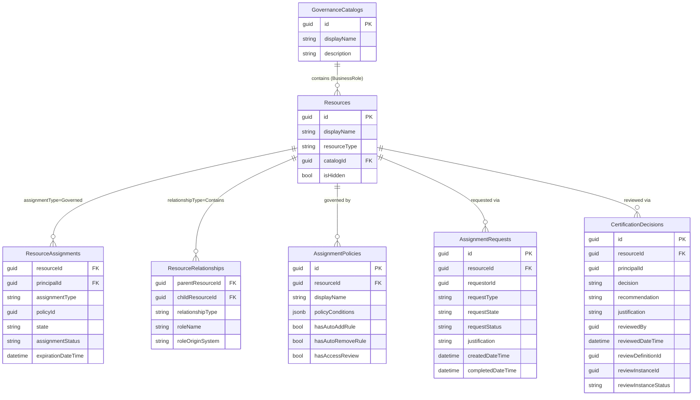
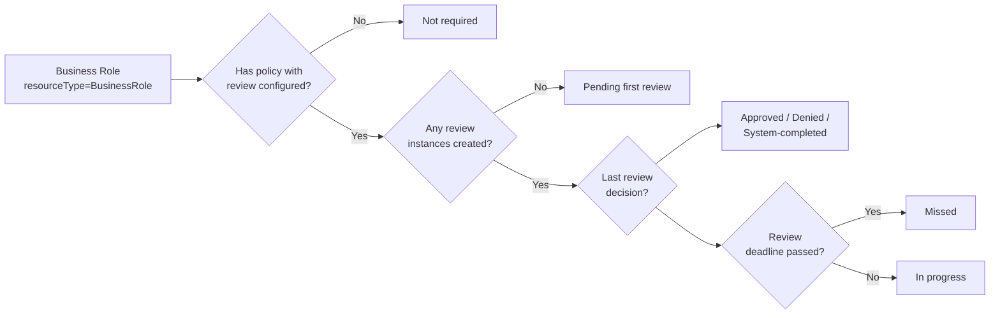

# Governance Model

Identity Atlas supports business roles, certification reviews, and access policies from any IGA platform — not just Entra ID. The governance model is unified with the resource model: business roles **are** Resources, their assignments **are** ResourceAssignments, and their resource grants **are** ResourceRelationships. Only governance-specific metadata (policies, requests, certification decisions) lives in dedicated tables.

---

## Overview

In v3.1, the governance model was merged into the universal resource model. The practical effect is that business roles from any IGA platform participate in the same views, risk scores, and queries as Entra ID groups and directory roles — without a separate schema.

The unification uses discriminator columns:

- `Resources.resourceType = 'BusinessRole'` — identifies business roles among all resources
- `ResourceAssignments.assignmentType = 'Governed'` — identifies governed assignments among all assignments
- `ResourceRelationships.relationshipType = 'Contains'` — identifies resource grants among all relationships

The four governance-specific tables (`GovernanceCatalogs`, `AssignmentPolicies`, `AssignmentRequests`, `CertificationDecisions`) contain only data that has no place in the shared model.

!!! info "Breaking change from v3.0"
    In v3.0, governance used seven separate tables: GovernanceCatalogs, BusinessRoles, BusinessRoleResources, BusinessRoleAssignments, BusinessRolePolicies, BusinessRoleRequests, and CertificationDecisions. In v3.1, three of those were absorbed into the shared resource model. Existing v3.0 deployments must re-sync to populate the unified tables.

---

## Governance Entity Diagram



---

## IGA Platform Mapping

The same governance tables absorb data from any IGA platform. The source platform determines the sync method; the model is always the same.

| Concept | Entra ID | Omada | SailPoint | Table |
|---|---|---|---|---|
| Catalog / Container | Catalog | — | Source | `GovernanceCatalogs` |
| Business Role | Access Package | Business Role | Access Profile | `Resources` (`resourceType = 'BusinessRole'`) |
| Resource Grant | Resource Role Scope | Role Entitlement | Entitlement | `ResourceRelationships` (`relationshipType = 'Contains'`) |
| Assignment | AP Assignment | Role Assignment | Access Request Result | `ResourceAssignments` (`assignmentType = 'Governed'`) |
| Policy | Assignment Policy | Assignment Policy | Access Request Config | `AssignmentPolicies` |
| Request | AP Assignment Request | — | Access Request | `AssignmentRequests` |
| Certification | Access Review Decision | CRA | Certification | `CertificationDecisions` |

---

## Governance-Specific Columns

The unified model extends the three shared tables with extra columns that carry governance semantics. These columns are `NULL` for non-governance rows, so they do not break existing queries.

`Initialize-FGGovernanceTables` adds these columns if they are not already present.

### Resources (business roles)

| Column | Type | Purpose |
|---|---|---|
| `catalogId` | GUID | Links the business role to its `GovernanceCatalogs` parent |
| `isHidden` | BIT | Hides the business role from self-service request portals |

### ResourceAssignments (governed assignments)

| Column | Type | Purpose |
|---|---|---|
| `policyId` | GUID | The `AssignmentPolicies` row that granted this assignment |
| `state` | NVARCHAR(50) | Lifecycle state: `Delivered`, `Expired`, `PendingApproval`, etc. |
| `assignmentStatus` | NVARCHAR(100) | Finer-grained status from the source IGA platform |
| `expirationDateTime` | DATETIME2 | When the assignment expires (NULL = no expiry) |

### ResourceRelationships (business role resource grants)

| Column | Type | Purpose |
|---|---|---|
| `roleName` | NVARCHAR(100) | The role within the target resource: `Member` or `Owner` |
| `roleOriginSystem` | NVARCHAR(100) | Which system defined this role (e.g. `EntraID`, `Omada`) |

---

## IST vs SOLL Analysis

Identity Atlas uses IST/SOLL terminology to express the gap between actual access and governed access.

**SOLL (should-be state)**
Access granted through a business role. Rows in `ResourceAssignments` where `assignmentType = 'Governed'`. This is access that was formally requested, approved, and periodically reviewed.

**IST (as-is state)**
Direct access assignments outside governance. Rows in `ResourceAssignments` where `assignmentType = 'Direct'`. This is access that exists but was not channeled through the IGA process.

**The gap**
Users who have direct membership to a group that is also granted by a business role. They have the access, but not through the approved channel. This is the primary finding that role mining and certification campaigns aim to remediate.

The following SQL views expose the IST/SOLL picture:

```sql
-- All access assignments outside business role governance
SELECT * FROM vw_UnmanagedPermissions;

-- A principal's full access picture: every assignment and how it was granted
SELECT *
FROM vw_ResourceUserPermissionAssignments
WHERE principalId = 'your-user-guid-here';
```

!!! tip "Matrix view IST/SOLL toggle"
    The Role Mining UI matrix view has an IST/SOLL toggle in the toolbar. SOLL filters to governed assignments only; IST filters to direct (unmanaged) assignments only; All shows both. The underlying queries use `assignmentType` to implement this filter.

---

## Certification Review Flow



Certification decisions are stored in `CertificationDecisions`. The `certificationScopeType` column distinguishes what was reviewed:

| certificationScopeType | Meaning |
|---|---|
| `BusinessRole` | The entire business role assignment was reviewed |
| `ResourceAssignment` | A specific resource within the business role was reviewed |

The UI differentiates two states that might otherwise appear identical:

- **Not required** — no review policy is configured for this business role
- **Pending first review** — a review policy exists, but no review instance has been created yet

---

## Sync Functions

### Entra ID (built-in sync)

These functions sync Entra ID governance data to the unified tables. Run them as part of `Start-FGSync` or individually.

| Function | Target Table | What it syncs |
|---|---|---|
| `Sync-FGCatalog` | `GovernanceCatalogs` | Entra ID access package catalogs |
| `Sync-FGAccessPackage` | `Resources` (`BusinessRole`) | Access packages as business roles |
| `Sync-FGAccessPackageAssignment` | `ResourceAssignments` (`Governed`) | Active access package assignments |
| `Sync-FGAccessPackageResourceRoleScope` | `ResourceRelationships` (`Contains`) | Which groups each access package grants |
| `Sync-FGAccessPackageAssignmentPolicy` | `AssignmentPolicies` | Assignment rules and ABAC conditions |
| `Sync-FGAccessPackageAssignmentRequest` | `AssignmentRequests` | Request and approval workflow history |
| `Sync-FGAccessPackageAccessReview` | `CertificationDecisions` | Access review decisions |

### CSV-based import (Omada, SailPoint, custom)

These functions import governance data from CSV files produced by any IGA platform.

| Function | Target Table | What it imports |
|---|---|---|
| `Sync-FGCSVBusinessRole` | `Resources` (`BusinessRole`) | Business roles from any IGA system |
| `Sync-FGCSVResourceAssignment` | `ResourceAssignments` (`Governed`) | Governed assignments from any IGA system |
| `Sync-FGCSVCertification` | `CertificationDecisions` | Certification or CRA results from any system |

!!! example "Running a full governance sync for Entra ID"
    ```powershell
    # Authenticate first
    Get-FGAccessToken -ConfigFile '.\Config\mycompany.json'
    Connect-FGSQLServer -ConfigFile '.\Config\mycompany.json'

    # Initialize governance tables (idempotent — safe to re-run)
    Initialize-FGGovernanceTables

    # Sync governance data
    Sync-FGCatalog
    Sync-FGAccessPackage
    Sync-FGAccessPackageAssignment
    Sync-FGAccessPackageResourceRoleScope
    Sync-FGAccessPackageAssignmentPolicy
    Sync-FGAccessPackageAssignmentRequest
    Sync-FGAccessPackageAccessReview
    ```

!!! example "Importing business roles from a CSV (Omada / SailPoint)"
    ```powershell
    Connect-FGSQLServer -ConfigFile '.\Config\mycompany.json'
    Initialize-FGGovernanceTables

    Sync-FGCSVBusinessRole   -Path '.\export\business-roles.csv'   -SystemId 2
    Sync-FGCSVResourceAssignment -Path '.\export\assignments.csv'  -SystemId 2 -AssignmentType 'Governed'
    Sync-FGCSVCertification  -Path '.\export\certifications.csv'   -SystemId 2
    ```
