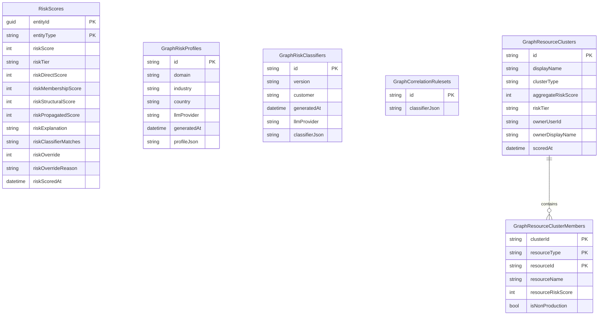

# Risk Scoring Data Model

Identity Atlas stores risk intelligence in a set of dedicated SQL tables that sit alongside the core data model. These tables hold the inputs that drive scoring (org context, classifier patterns, correlation rules) and the outputs (per-entity scores, clusters, overrides).

These tables are created by migration `004_risk_scoring.sql` when the web container starts.

---

## Conceptual Overview

```
Inputs (one-time / periodic)              Outputs (per scoring run)
─────────────────────────────             ─────────────────────────
GraphRiskProfiles                         RiskScores
  └─ org context from LLM                   └─ score per entity (all types)
GraphRiskClassifiers                           directScore
  └─ regex patterns from LLM                  membershipScore
GraphCorrelationRulesets                       structuralScore
  └─ cross-system match rules                 propagatedScore
                                              overrideAdjustment

                                         GraphResourceClusters
                                           └─ groups of related resources
                                         GraphResourceClusterMembers
                                           └─ which resources belong to each cluster
```

Scoring reads the **inputs** and writes the **outputs**. The inputs change only when you call `New-FGRiskProfile` / `New-FGRiskClassifiers` / `New-FGCorrelationRuleset`. The outputs are overwritten on every `Invoke-FGRiskScoring` run (with analyst overrides preserved).

---

## Entity Relationship Diagram



The `RiskScores` table links back to the core model by `entityId` matching the `id` column on `Principals`, `Resources`, `Identities`, or `Contexts`. There is no FK constraint — this is intentional, so risk scores can be queried independently of whether the source entity still exists.

---

## Table Reference

### RiskScores

The central output table. One row per entity per entity type. Updated by every `Invoke-FGRiskScoring` run. Analyst overrides are applied on top and preserved across re-scoring.

| Property | Value |
|---|---|
| Primary Key | Composite: `entityId` + `entityType` |
| Audit history | No (overwritten each scoring run; analyst overrides preserved) |
| Created by | Migration `004_risk_scoring.sql` |

**entityType values:**

| Value | Links to |
|---|---|
| `Principal` | `Principals.id` |
| `Resource` | `Resources.id` |
| `Context` | `Contexts.id` |
| `Identity` | `Identities.id` |

**Score columns:**

| Column | Type | Description |
|---|---|---|
| `riskScore` | INT | Final effective score (0–100): sum of sub-scores + override, clamped |
| `riskTier` | NVARCHAR(20) | `Critical` / `High` / `Medium` / `Low` / `Minimal` / `None` |
| `riskDirectScore` | INT | Layer 1: direct classifier match contribution |
| `riskMembershipScore` | INT | Layer 2: risk inherited from group/resource memberships |
| `riskStructuralScore` | INT | Layer 3: hygiene signals (stale sign-in, no description, etc.) |
| `riskPropagatedScore` | INT | Layer 4: risk propagated from children/members |
| `riskExplanation` | NVARCHAR(MAX) | JSON array of human-readable factor descriptions |
| `riskClassifierMatches` | NVARCHAR(MAX) | JSON array of classifier IDs that matched this entity |
| `riskOverride` | INT | Analyst adjustment (−50 to +50). NULL if no override. |
| `riskOverrideReason` | NVARCHAR(500) | Required justification supplied with the override |
| `riskScoredAt` | DATETIME2 | When this score row was last written by the scoring engine |

**Denormalization:** `riskScore` and `riskTier` are also written back to `Principals.riskScore` / `Principals.riskTier` and `Resources.riskScore` / `Resources.riskTier` for fast joins without touching `RiskScores`.

---

### GraphRiskProfiles

Stores the organizational context discovered by `New-FGRiskProfile`. The profile describes your organization's industry, country, sensitive system types, and risk posture — used by the LLM to generate classifiers that are meaningful for your specific context.

| Property | Value |
|---|---|
| Primary Key | `id` (NVARCHAR — usually the domain name) |
| Audit history | No |
| Created by | `Save-FGRiskProfile` (called by `New-FGRiskProfile`) |

Key columns: `domain`, `industry`, `country`, `llmProvider`, `profileJson` (full profile as JSON).

!!! note "What is sent to the LLM"
    Only public organizational context is sent (domain, inferred industry, known system names). No user names, email addresses, or identity data ever leave your infrastructure. See [Data Privacy](../risk-scoring/overview.md#data-privacy).

---

### GraphRiskClassifiers

Stores the regex-based detection patterns generated by `New-FGRiskClassifiers`. Classifiers match against `displayName`, `description`, job titles, and other string attributes to identify entities that warrant elevated risk scores.

| Property | Value |
|---|---|
| Primary Key | `id` (NVARCHAR — usually `{domain}-v{version}`) |
| Audit history | No |
| Created by | `Save-FGRiskClassifiers` (called by `New-FGRiskClassifiers`) |

Key columns: `version`, `customer`, `llmProvider`, `classifierJson` (full classifier ruleset as JSON).

The `classifierJson` contains three sections:

| Section | Targets |
|---|---|
| `groups` | Resources — matches against `displayName` and `description` |
| `users` | Human principals — matches against `displayName`, `userPrincipalName`, `jobTitle` |
| `agents` | Non-human principals (`ServicePrincipal`, `ManagedIdentity`, `AIAgent`) |

When no custom classifiers are found in SQL, `Invoke-FGRiskScoring` falls back to a set of built-in universal classifiers that work for any organization.

---

### GraphCorrelationRulesets

Stores the account correlation rules generated by `New-FGCorrelationRuleset`. These rules define how principals from different source systems are matched to the same real person (Identity).

| Property | Value |
|---|---|
| Primary Key | `id` |
| Audit history | No |
| Created by | `Save-FGCorrelationRuleset` (called by `New-FGCorrelationRuleset`) |

Key columns: `classifierJson` (full ruleset as JSON with match strategies, confidence weights, and tie-breaking rules).

---

### GraphResourceClusters

Groups of related resources identified by `Save-FGResourceClusters`. A cluster aggregates resources that share a classifier match or a common display name stem. Each cluster has an aggregate risk score and an optional analyst-assigned owner for remediation accountability.

| Property | Value |
|---|---|
| Primary Key | `id` |
| Audit history | No |
| Created by | `Save-FGResourceClusters` |

Key columns:

| Column | Description |
|---|---|
| `displayName` | Human-readable cluster name (derived from classifier or shared stem) |
| `clusterType` | `Classifier` (grouped by risk classifier) or `NameStem` (grouped by display name prefix) |
| `aggregateRiskScore` | Weighted average of member resource risk scores |
| `riskTier` | Tier of the aggregate score |
| `ownerUserId` / `ownerDisplayName` | Analyst-assigned owner for remediation tracking |
| `ownerAssignedBy` | Identity of the analyst who assigned the owner |
| `scoredAt` | When the cluster was last computed |

---

### GraphResourceClusterMembers

The detail rows for each cluster — one row per resource in the cluster.

| Property | Value |
|---|---|
| Primary Key | Composite: `clusterId` + `resourceType` + `resourceId` |
| Audit history | No |
| Created by | `Save-FGResourceClusters` |

Key columns: `resourceName`, `resourceRiskScore`, `resourceRiskTier`, `isNonProduction` (BIT — non-production resources are included but weighted down in the aggregate), `matchedOn` (which field matched the classifier), `matchDetail`.

---

## Initialization Order

```powershell
# 1. Create the RiskScores table (also adds riskScore/riskTier columns to Principals and Resources)
Initialize-FGRiskScoreTables

# 2. Generate org context profile (one-time, contacts LLM)
New-FGRiskProfile -Domain "yourcompany.com" -LLMProvider Anthropic -LLMApiKey $key

# 3. Generate classifiers from the profile (one-time, contacts LLM)
New-FGRiskClassifiers

# 4. Score all entities (run after each sync)
Invoke-FGRiskScoring

# 5. Cluster related resources (optional, run after scoring)
Save-FGResourceClusters
```

Steps 2 and 3 only need to run once, or when your organization's risk posture changes significantly. Steps 4 and 5 run on a schedule alongside your regular data sync.

---

## Score History

`RiskScores` is overwritten by each scoring run. Analyst overrides (`riskOverride`, `riskOverrideReason`) are preserved across re-scoring runs.

The other risk tables (`GraphRiskProfiles`, `GraphRiskClassifiers`, `GraphCorrelationRulesets`, `GraphResourceClusters`, `GraphResourceClusterMembers`) are also overwritten in place when regenerated.
