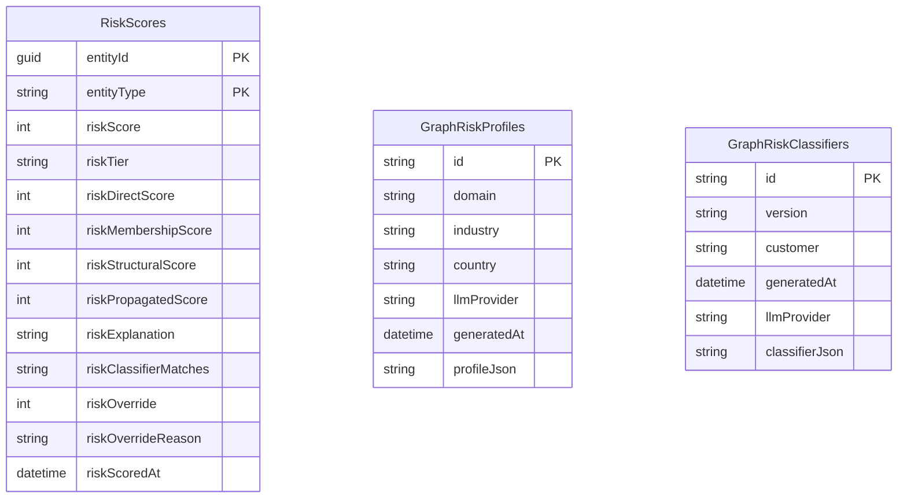

# Risk Scoring Data Model

!!! info "Before this page"
    Assumes you have read **[Data Model](./data-model.md)**.
    Brand new? Start at [The words you need first](../start/glossary.md).

Identity Atlas stores risk intelligence in a set of dedicated SQL tables that sit alongside the core data model. These tables hold the inputs that drive scoring (org context, classifier patterns) and the outputs (per-entity scores, clusters, overrides).

!!! note "Account correlation moved out of risk scoring"
    The old `GraphCorrelationRulesets` table was dropped in migration `030_account_linking.sql` and replaced by `AccountLinkingConfig` + `AccountLinkingRuns`. Linking accounts to identities is now the deterministic, dictionary-based [Account Linking](../architecture/account-linking.md) engine — separate from risk scoring, and no longer driven by `New-FGCorrelationRuleset` / `Save-FGCorrelationRuleset`.

These tables are created by migration `004_risk_scoring.sql` when the web container starts.

---

## Conceptual Overview

```
Inputs (one-time / periodic)              Outputs (per scoring run)
─────────────────────────────             ─────────────────────────
GraphRiskProfiles                         RiskScores
  └─ org context from LLM                   └─ score per entity (all types)
GraphRiskClassifiers                           directScore
  └─ regex patterns from LLM                  membershipScore
                                               structuralScore
                                               propagatedScore
                                              overrideAdjustment
```

Resource clustering is no longer a risk-scoring table — it runs as a context-algorithm plugin (see "Resource clusters" below).

Scoring reads the **inputs** and writes the **outputs**. The inputs change only when you regenerate the risk profile / classifiers. The outputs are overwritten on every scoring run (with analyst overrides preserved). Account linking is a separate engine — see [Account Linking](../architecture/account-linking.md).

---

## Entity Relationship Diagram


```mermaid
erDiagram
    RiskScores {
        guid entityId PK
        string entityType PK
        int riskScore
        string riskTier
        int riskDirectScore
        int riskMembershipScore
        int riskStructuralScore
        int riskPropagatedScore
        string riskExplanation
        string riskClassifierMatches
        int riskOverride
        string riskOverrideReason
        datetime riskScoredAt
    }
    GraphRiskProfiles {
        string id PK
        string domain
        string industry
        string country
        string llmProvider
        datetime generatedAt
        string profileJson
    }
    GraphRiskClassifiers {
        string id PK
        string version
        string customer
        datetime generatedAt
        string llmProvider
        string classifierJson
    }
```

The `RiskScores` table links back to the core model by `entityId` matching the `id` column on `Principals`, `Resources`, `Identities`, or `Contexts`. There is no FK constraint — this is intentional, so risk scores can be queried independently of whether the source entity still exists.

---

## Table Reference

### RiskScores

The central output table. One row per entity per entity type. Updated by every `Invoke-FGRiskScoring` run. Analyst overrides are applied on top and preserved across re-scoring.

| Property | Value |
|---|---|
| Primary Key | Composite: `entityId` + `entityType` |
| Audit history | No (overwritten each scoring run; analyst overrides preserved) |
| Created by | Migration `004_risk_scoring.sql` |

**entityType values:**

| Value | Links to |
|---|---|
| `Principal` | `Principals.id` |
| `Resource` | `Resources.id` |
| `Context` | `Contexts.id` |
| `Identity` | `Identities.id` |

**Score columns:**

| Column | Type | Description |
|---|---|---|
| `riskScore` | INTEGER | Final effective score (0–100): sum of sub-scores + override, clamped |
| `riskTier` | TEXT | `Critical` / `High` / `Medium` / `Low` / `Minimal` / `None` |
| `riskDirectScore` | INTEGER | Layer 1: direct classifier match contribution |
| `riskMembershipScore` | INTEGER | Layer 2: risk inherited from group/resource memberships |
| `riskStructuralScore` | INTEGER | Layer 3: hygiene signals (stale sign-in, no description, etc.) |
| `riskPropagatedScore` | INTEGER | Layer 4: risk propagated from children/members |
| `riskExplanation` | JSONB | JSON array of human-readable factor descriptions |
| `riskClassifierMatches` | JSONB | JSON array of classifier IDs that matched this entity |
| `riskOverride` | INTEGER | Analyst adjustment (−50 to +50). NULL if no override. |
| `riskOverrideReason` | TEXT | Required justification supplied with the override |
| `riskScoredAt` | TIMESTAMPTZ | When this score row was last written by the scoring engine |

**Denormalization:** `riskScore` and `riskTier` are also written back to `Principals.riskScore` / `Principals.riskTier` and `Resources.riskScore` / `Resources.riskTier` for fast joins without touching `RiskScores`.

---

### GraphRiskProfiles

Stores the organizational context discovered by `New-FGRiskProfile`. The profile describes your organization's industry, country, sensitive system types, and risk posture — used by the LLM to generate classifiers that are meaningful for your specific context.

| Property | Value |
|---|---|
| Primary Key | `id` (TEXT — usually the domain name) |
| Audit history | No |
| Created by | `Save-FGRiskProfile` (called by `New-FGRiskProfile`) |

Key columns: `domain`, `industry`, `country`, `llmProvider`, `profileJson` (full profile as JSON).

!!! note "What is sent to the LLM"
    Only public organizational context is sent (domain, inferred industry, known system names). No user names, email addresses, or identity data ever leave your infrastructure. See [Data Privacy](../risk-scoring/overview.md#data-privacy).

---

### GraphRiskClassifiers

Stores the regex-based detection patterns generated by `New-FGRiskClassifiers`. Classifiers match against `displayName`, `description`, job titles, and other string attributes to identify entities that warrant elevated risk scores.

| Property | Value |
|---|---|
| Primary Key | `id` (TEXT — usually `{domain}-v{version}`) |
| Audit history | No |
| Created by | `Save-FGRiskClassifiers` (called by `New-FGRiskClassifiers`) |

Key columns: `version`, `customer`, `llmProvider`, `classifierJson` (full classifier ruleset as JSON).

The `classifierJson` contains three sections:

| Section | Targets |
|---|---|
| `groups` | Resources — matches against `displayName` and `description` |
| `users` | Human principals — matches against `displayName`, `userPrincipalName`, `jobTitle` |
| `agents` | Non-human principals (`ServicePrincipal`, `ManagedIdentity`, `AIAgent`) |

When no custom classifiers are found in SQL, `Invoke-FGRiskScoring` falls back to a set of built-in universal classifiers that work for any organization.

---

### AccountLinkingConfig + AccountLinkingRuns

`GraphCorrelationRulesets` was **dropped** in migration `030_account_linking.sql`. Account-to-identity matching now lives in two purpose-built tables and is independent of risk scoring:

| Table | Role |
|---|---|
| `AccountLinkingConfig` | The editable dictionary (`rules`) + `schedules`. Single active row, edited via Admin → Account Linking. |
| `AccountLinkingRuns` | One row per run with progress and result counts. |

The engine is deterministic — no LLM and no `New-FGCorrelationRuleset` / `Save-FGCorrelationRuleset` step. See [Account Linking](../architecture/account-linking.md).

---

### Resource clusters (moved out of dedicated tables)

The legacy `GraphResourceClusters` / `GraphResourceClusterMembers` tables were **dropped** in migration `019_drop_legacy_clusters.sql`. Resource clustering now runs as a registered **context-algorithm plugin** (`contexts/plugins/resource-cluster/`): a cluster is just a generated [Context](data-model.md#contexts), and its members live in `ContextMembers` — the same unified surface as every other context. See the [resource-cluster algorithm](../architecture/resource-cluster-algorithm.md) and the [risk-scoring plugin architecture](../risk-scoring/plugin-architecture.md).

---

## Initialization Order

```powershell
# 1. (No action needed) The RiskScores table — plus the riskScore/riskTier columns
#    on Principals and Resources — is created automatically by migration
#    004_risk_scoring.sql when the web container starts.

# 2. Generate org context profile (one-time, contacts LLM)
New-FGRiskProfile -Domain "yourcompany.com" -LLMProvider Anthropic -LLMApiKey $key

# 3. Generate classifiers from the profile (one-time, contacts LLM)
New-FGRiskClassifiers

# 4. Score all entities (run after each sync)
Invoke-FGRiskScoring
```

Steps 2 and 3 only need to run once, or when your organization's risk posture changes significantly. Step 4 runs on a schedule alongside your regular data sync. Resource clustering runs separately as a context-algorithm plugin (see "Resource clusters" above).

---

## Score History

`RiskScores` is overwritten by each scoring run. Analyst overrides (`riskOverride`, `riskOverrideReason`) are preserved across re-scoring runs.

The other risk tables (`GraphRiskProfiles`, `GraphRiskClassifiers`) are also overwritten in place when regenerated. (Resource clustering is no longer a risk table — it runs as a context-algorithm plugin; account-to-identity matching lives in `AccountLinkingConfig` / `AccountLinkingRuns` above.)
