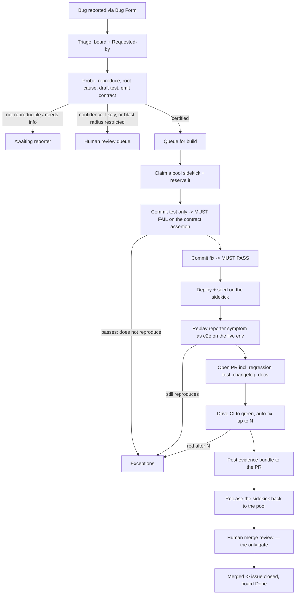

# Autonomous bug pipeline — workflow definition

> **Status: proposal.** Nothing here is built yet. This document is the shared vision we build
> against; it supersedes nothing until it is agreed. The feature pipeline
> ([operationalization](operationalization.md)) is unaffected — see [§9](#9-what-this-does-not-change).

A reported bug that the DoR probe has **certified** — reproduced against real code, root cause
pinned, regression test drafted — goes from report to a merge-ready PR **without a human in the
loop**. The only human action is the merge review, and it is a review of *evidence*, not of a
promise.

---

## 1. Why a bug needs no value gate

The value gate exists because "should we build this?" is a genuinely contestable question — for a
**feature**. Someone has to weigh desirability, product coherence, and opportunity cost, and no
amount of AI diligence answers it. That gate stays.

For a **bug**, that question is already answered, and not by us: the product made a promise and
broke it. Once the probe has certified that the break is real and reproducible, "is it worth
fixing?" has no interesting answer left. Approving it is ceremony.

But today's single gate quietly bundles three different jobs. Splitting them is what makes it safe
to drop:

| Function of the gate | The question it answers | For a certified bug |
|---|---|---|
| **Value** | Is this worth building at all? | Answered by certification → **drop** |
| **Spend** | What will this cost in runner time and model quota? | Real, but a *policy* question — bound it with concurrency + budget caps, not a per-issue click ([§7](#7-concurrency-budget-and-kill-switches)) |
| **Blast radius** | Should the AI change *this part of the codebase* unsupervised? | Real, and the one worth keeping — but as an **automatic rule**, not a human judgement call ([§5](#5-stop-conditions--when-the-machine-must-escalate)) |

The trade this makes: **the gate moves from before the work to after it.** Before, a human guesses
whether the work is worth doing. After, a human reads what was actually done, with proof. The second
is a better decision made on better information — and it already exists as a required step, because
`main` is branch-protected and needs an approving review.

That only holds if the machine can *prove* its work. That is the rest of this document.

---

## 2. The three proof obligations

Autonomy is bought with falsifiability. Each obligation below exists because without it a specific
failure mode passes silently.

### 2.1 A falsifiable certification — the repro contract

Today the probe emits prose plus a route label. Prose cannot be checked. If certification is the
*only* thing standing between a bug report and an autonomous code change, it must be a contract the
build is then measured against.

The probe additionally emits `.dor/out/contract.json`, validated by the deterministic post step the
same way `route.txt` already is (schema check → reject → no action). Fields:

| Field | Purpose |
|---|---|
| `symptom` | The observable defect, in the reporter's terms |
| `assertion` | The specific assertion that must FAIL before the fix and PASS after |
| `root_cause` | Layer + file(s) that produce the wrong value — the "fix at the source" target |
| `blast_radius` | Globs the fix is predicted to touch |
| `test_tier` | `unit` \| `api` \| `e2e` — where the regression test belongs |
| `repro_path` | The user-visible route to the symptom, for the live-env replay |
| `confidence` | `certain` \| `likely` — `likely` routes to a human, never to an autonomous build |
| `duplicate_of` | Issue number, if the backlog scan found one |

The contract is what makes the later checks mechanical instead of narrative.

### 2.2 Red before green

**A test that was never red proves nothing.** A green suite after a fix is equally consistent with
"bug fixed" and "test doesn't touch the bug" — and an AI that writes both the fix and its test has
every opportunity to produce the second by accident.

So the build commits in a fixed order, and the flow — not the model — checks it:

1. **Test-only commit.** Run it. It **must fail**, and fail on `contract.assertion`. If it passes,
   the test does not reproduce the bug → **Exceptions**. This is cheap: same checkout, no Docker.
2. **Fix commit.** Re-run. It **must pass**.

Both runs are captured verbatim into the evidence bundle. The red output is the single most
valuable artifact the pipeline produces, because it is the only one that cannot be faked by
optimism.

### 2.3 The symptom is gone on a real deployment

Unit-tier green is not "the bug is fixed" — it is "one assertion changed state". The reporter's
symptom must be replayed against the actual running product.

The build deploys the branch to its sidekick, seeds demo data, runs the context plugins, then replays
`contract.repro_path` as an e2e against `https://N.build.identityatlas.io`.

**The current smoke fallback must die for bugs.** `run_feature_e2e()` today runs only the e2e specs
the branch touched, and falls back to "does the app serve?" when the branch touched none — which a
unit-only bug fix would sail straight through, and be reported as verified. For a bug: no e2e means
**no pass**.

---

## 3. The workflow

| # | Step | Actor | Trigger | Artifact | On failure |
|---|---|---|---|---|---|
| 1 | Intake | Reporter | Bug Form | issue | — |
| 2 | Triage | deterministic | `issues.opened` | Bug board item, Requested-by | non-member → notice + assign |
| 3 | Probe / certify | AI (Fable 5) | `issues`, `issue_comment` | verdict comment + `contract.json` + route | route to reporter / design / duplicate / out |
| 4 | Queue | deterministic | route = `certified` | queue position | over concurrency cap → wait |
| 5 | Claim runner | deterministic | free `dor-build` runner | reservation written **at claim**, not at PR-create | no free runner → stay queued |
| 6 | Red proof | flow | — | failing test output | test passes → **Exceptions** |
| 7 | Fix | AI (Opus 5) | — | fix commit | no changes produced → **Exceptions** |
| 8 | Green proof | flow | — | passing test output | still red after N → **Exceptions** |
| 9 | Deploy + seed | flow | — | live env URL | infra failure → **Exceptions** (not a fix loop) |
| 10 | Live replay | flow | — | e2e run + trace | symptom persists → **Exceptions** |
| 11 | PR + CI | flow | — | PR, CI checks | red after N auto-fixes → **Exceptions** |
| 12 | Evidence + release | deterministic | CI green | evidence bundle comment; sidekick reset | — |
| 13 | Merge review | **human** | PR ready | approval | changes requested → feedback flow |

Steps 6–11 are the Definition of Done. **All** must hold; any failure routes to Exceptions with the
evidence of *why*, and never silently degrades to "probably fine".

---

## 4. The evidence bundle — what "prove it to me" means

Posted as a single structured PR comment when CI goes green. Every row is a claim with a link to the
line in a run log that substantiates it. A reviewer reads a checklist, not a story.

| Claim | Evidence |
|---|---|
| The bug was real and reproducible | Certification comment + `contract.json` |
| The test reproduces *this* bug | **Red run output** — the failing assertion, pre-fix |
| The fix resolves it | Green run output, same test, post-fix |
| The reporter's symptom is gone | Live-env e2e result + trace/screenshot + the `N.build` URL |
| It cannot come back | The regression test now in `main`'s CI — named, linked |
| The fix is where the diagnosis said | Files touched vs `contract.blast_radius`, diffed |
| Nothing else broke | Full CI status; coverage delta (line + branch, per-file ratchet) |
| It was fixed at the source | The root-cause layer, quoted from the contract, vs the files actually changed |
| What it did **not** do | Explicit: scope not expanded, no schema/migration, no `.github/`, no dependency bumps |

The live env stays up until the PR closes. Available for a look — **not** something anyone has to
block on.

---

## 5. Stop conditions — when the machine must escalate

An autonomous pipeline is only trustworthy if it is eager to stop. Every one of these routes to
**Exceptions** with a maintainer @-mention, and none of them are recoverable by retrying harder:

| Condition | Why it stops |
|---|---|
| `confidence: likely` in the contract | Uncertain diagnosis is exactly where autonomy is worst |
| Test passes before the fix | Does not reproduce the bug → the whole proof chain is void |
| Fix touches files outside `blast_radius` | The diagnosis was wrong, or scope crept — either way a human decides |
| Touches a schema migration, auth/security path, or crawler credential handling | Blast radius a review cannot cheaply undo |
| Diff exceeds size limit (files / lines — value in [§12](#12-decisions-i-need-from-you)) | "Bug fix" that is really a refactor |
| No test added | Violates the DoD and the coverage ratchet |
| Coverage down, or diff-coverage gate red | Repo hard rule |
| Live replay still shows the symptom | The thing we set out to prove failed |
| CI red after N auto-fix attempts | Flailing; a human reads it faster |
| Model usage limit | **Not a failure** — pause, save the branch, resume (existing `dor-resume`) |

---

## 6. Runner lifecycle

Unchanged in shape, two fixes the loss of the human gate makes load-bearing:

- **Reserve at claim, not at PR-create.** Today `~/.dor-reservation` is written after the PR opens;
  a build that dies before that leaves a box that looks free but has a stack on it. With no human
  pacing the queue, that collides.
- **Sweep stale reservations.** The daily reconcile gains a check: reservation referencing a closed
  or non-existent PR → reset the box. Without a human gate, a stranded runner silently shrinks the
  pool until it starves.

Release on PR close is already correct (`dor-reset.yml`: stack down, volumes + images pruned,
reservation cleared, `edge` placeholder restored). One known gap to close first: sk7–sk10 are
registered runners but absent from the hostname→URL map, so a build landing there fails at step 1
(PR #944).

---

## 7. Concurrency, budget, and kill switches

The human gate was also, accidentally, the rate limiter. Replace it explicitly:

- **Concurrency cap** — at most *N* autonomous builds in flight (N ≤ pool size − 1, so a human can
  always grab a box). Excess queues; queue order by severity then age.
- **Budget guard** — a weekly quota ceiling; on breach the pipeline queues instead of building and
  says so on the issue. Bugs share the Max subscription with the spec side, which must never starve:
  triage and certification are cheap and always run.
- **`DOR_AUTOBUILD`** — a new repo variable, separate from `DOR_ENABLED`, so autonomy can be turned
  off without turning off triage and certification. Default `false` until we have watched it work.
- **Per-issue opt-out** — a `no-autobuild` label any maintainer can apply, honoured at step 4.

---

## 8. What the human still does

- **Approves the merge.** The single gate. Already required by the ruleset (1 approval + CODEOWNERS
  + required checks), so this is not new machinery — it is the machinery we stop duplicating.
- **Reads Exceptions.** The pipeline's job is to be honest about what it could not prove.
- **Objects, if the reporter disagrees.** The reporter is notified when the PR opens, with the live
  URL. Objection before merge routes into the existing feedback flow. Their voice is preserved as an
  **opt-out**, not as a blocking opt-in.

---

## 9. What this does *not* change

- **Features keep the value gate.** "Is this worth building?" stays a human question. This document
  is only about bugs — the distinction is the whole argument.
- **Merge stays human. Permanently.** No auto-merge, no self-approval; "Actions can approve PRs"
  stays off.
- **The security model is untouched.** Untrusted issue text still reaches the model only through the
  sandboxed reason step; the deterministic post step is still the only thing that writes to GitHub;
  the build still runs on an isolated, reset-between-uses sidekick and pushes with no merge rights.
- **External reporters still cannot trigger anything.** Org-member gate unchanged.

---

## 10. Board and state model

The Bug board (org project #3) already carries every Status option needed. Under this design:

| Status | Under autonomy |
|---|---|
| Ready for AI probe · Awaiting requestor · Awaiting design · Decompose · Blocked (external) · Out of pipeline | unchanged |
| **Awaiting approval** | **retires** — rename the column to **Queued for build** (certified, waiting on a runner) |
| Building | set at claim |
| **Awaiting functional acceptance** | **retires** — replaced by the live replay in step 10 |
| Awaiting merge | set when the evidence bundle posts; the human queue |
| Done · Exceptions | unchanged |

Prerequisite, and the reason this cannot ship today: the build side is **Feature-board-only** —
`dor_set_status.sh` defaults to project #2 and nine call sites pass no override, so an approved bug
would be silently added to the Feature board and driven there. Fix by resolving the board from the
issue's labels inside `dor_set_status.sh` itself (the picker already exists, copy-pasted, in four
workflows).

---

## 11. Build order

Each phase is independently useful and independently revertible.

| Phase | Contents | Value on its own |
|---|---|---|
| **0** | Board resolution moved into `dor_set_status.sh`; sk7–sk10 pool map (#944) | Unblocks *any* bug reaching the build side |
| **1** | Red-first sequencing; mandatory live replay (kill the smoke fallback); "no test → Exceptions" | The proof chain — valuable even with the gate still in place |
| **2** | `contract.json` from the probe + conformance check against it | Makes certification falsifiable |
| **3** | Evidence bundle on the PR | Makes the merge review a review of proof |
| **4** | Flip the gate: `DOR_AUTOBUILD`, concurrency cap, budget guard, stale-reservation sweep | The autonomy itself — last, on top of everything that proves it |

Phases 1–3 are worth shipping regardless of whether we ever flip phase 4. That ordering is
deliberate: **build the proof before removing the gate that the proof replaces.**

---

## 12. Decisions I need from you

1. **Scope of autonomy** — every certified bug, or only those under a blast-radius/size threshold
   (my recommendation: threshold, with schema/auth/crawler-credential paths always escalating)?
2. **Diff size ceiling** for "this is a bug fix, not a refactor" — I suggest 10 files / 400 changed
   lines, escalate above.
3. **Concurrency cap** — my recommendation: 3 concurrent autonomous builds against a 6-box pool.
4. **Severity filter** — do cosmetic/low bugs auto-build too, or only `priority:` medium and up?
5. **Reporter veto window** — merge as soon as CI is green and a maintainer approves, or hold a
   fixed window (e.g. 24h) for the reporter to object first?
6. **Column renames** on the Bug board (§10) — these are manual, one-time, and mine to do only if
   you want them.
