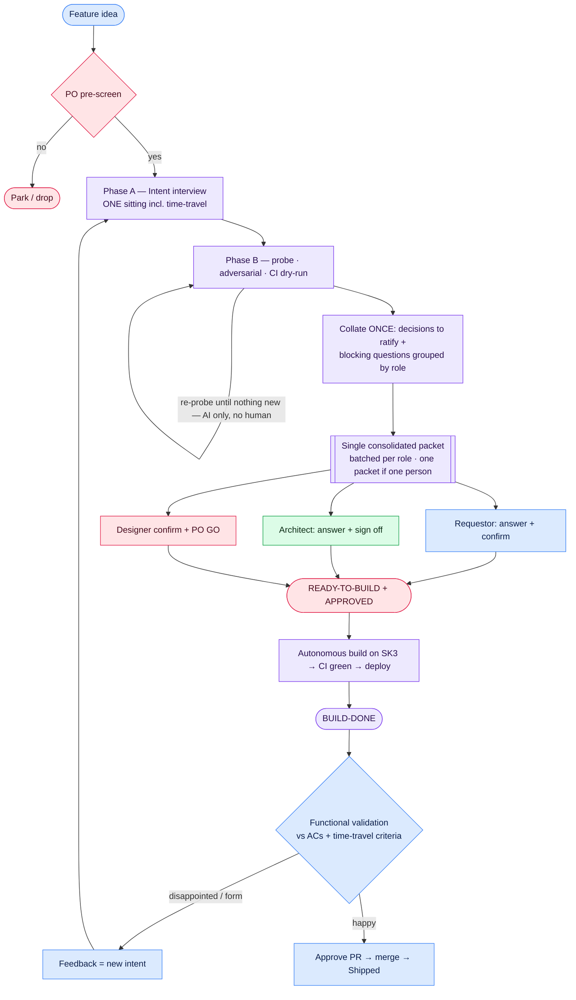

# Definition of Ready v3.1 — the "ready-to-build" process

**Purpose.** Produce a spec complete enough that building, testing and documenting run with **zero *functional* human decisions and zero silent *functional* assumptions** — while spending the fewest possible **human touchpoints** getting there. Non-functional decisions (architecture, design/UX, product fit) are not eliminated — they are **routed to the role that owns them**, *batched*, and resolved in as few interactions as possible. *Form* is expected to need a **feedback loop**, because taste is a see-it reaction that can't be fully pre-specified.

**The realistic bar.** "One perfect spec → build once" is reachable for **function**, not **form**. Front-load every *functional* decision; route every *architectural / design / product* decision to its owner; keep human round-trips minimal; treat post-build feedback as a normal, cheap loop.

---

## The process at a glance

## Roles (lanes)

One human may wear several hats — on a small team the same person is requestor, architect and PO. The point is not headcount; it's that **each question is answered by the right *hat*, a hat with no open question is not consulted, and a hat is touched as few times as possible.**

| Role | Owns | Answers questions about |
|------|------|-------------------------|
| **Requestor** | Intent + functional decisions; the time-travel success/failure criteria | what it should do, for whom, which cases matter, "just another attribute vs. a new surface" |
| **Architect / tech lead** | Technical approach; coherence of the codebase | registry vs engine, additive vs mutate-shared-contract, matview vs query-time, migrations |
| **Designer** | Form: interaction model, information architecture | how it looks/feels, integrate with an existing control or stand alone |
| **Product Owner** | Desirability / product coherence — the GO | does this move the product forward or just add complexity/bloat |
| **Builder (AI)** | Runs Phases A/B, then builds/tests/documents autonomously | — |

## Minimise human round-trips — batch, don't ping-pong  ← the scheduling discipline

Every return to a human costs real time (a message, a meeting, a wait). Routing questions to the right role is worthless if it produces *more* interactions. So:

- **Exhaust the AI-resolvable work before touching any human.** The Phase-B probe, adversarial passes and CI dry-run are an **AI-internal loop** (B10) — they are *never* a reason to go back to a person. Iterate them fully first.
- **Prefer a proposed decision over a question.** If the AI can pick a defensible default from the code/model, record it in the decisions register as *"decided: X (because Y)"* for the owning role to **ratify in bulk**. Only escalate as a **blocking question** what genuinely needs a human's judgment *before* building. Most items should be proposed-decisions, not questions.
- **Batch by role, ask once.** Group all blocking questions + all decisions-to-ratify by owning role and put them to that role in a **single async packet** — never a trickle of one-at-a-time asks. Fold a role's questions into that role's **sign-off** so answering and signing off are one touch.
- **One person, one packet.** When the same human wears several hats, do **not** simulate separate meetings — present a single consolidated packet: decisions to ratify + the few must-ask questions (each tagged by hat) + all sign-offs, handled in one sitting.
- **Async by default.** A human touch is a written packet the person answers on their own time, not a scheduled meeting. Reserve synchronous time only when a decision genuinely needs discussion.
- **Target: two human touchpoints** — the Phase-A interview, and one consolidated sign-off/GO packet. A second interview round happens only when a genuine cross-role dependency forces it — and even then, present options **with their implications** ("if you pick X, that means Y for you") so the chain resolves in one pass.

**Optionality rule.** Only pose a question to a role if a genuine question is *owned* by that role. Do not ask the requestor an architectural question, or any hat for an opinion it doesn't own. Skip hats with no open questions.

---

## Phase A — Intent interview (what & why) — one sitting, exhaust it
Get maximum detail in a single interview so you rarely need to return.
- **A1 Problem & value** — a user/governance question, not a solution; who for; why now.
- **A2 Scope boundaries** — what it deliberately does NOT do.
- **A3 Backlog context** — related/precondition/duplicate issues; weighed against the whole backlog.
- **A4 External dependencies** — known and secured, or N/A.
- **A5 Architecture fit** — fits the existing architecture, or *raises* an architectural question → tag it for the architect, don't resolve it with the requestor.
- **A6 Documentation needs.**
- **A7 Time-travel pre-mortem (Rob's question).** *"We fast-forward to the moment I show you the finished feature. You're delighted because…? You're disappointed because…?"* The "disappointed because" answers become explicit acceptance/rejection criteria — this is where *form* preferences surface before code.

## Phase B — Build-readiness probe (AI-internal; no human until it's exhausted)
Intent is fixed. **Draft the actual implementation against the real code and schema — far enough to hit the walls.** An implementation dry-run, not a re-read.
- **B1 Trace every value to its real storage** — write the real query; multi-hop → write the join path; not modelled as assumed (derived / blob / N hops / premise self-refuted) → raise it.
- **B2 Enumerate consumers** of every shared contract/function/wire-format/table/component touched, with the compatibility approach for each.
- **B3 Resolve every choice to one option** — no "A or B", no "TBD". Includes **UX-shaping words** ("alongside / integrated / shared / inline") — resolve them explicitly.
- **B4 Pin the exact scope set** — the concrete list.
- **B5 Delivery decomposition** — one PR or a required stack, and the order.
- **B6 Adversarial pass (independent)** — *"find where this spec contradicts the real code/schema — assume a hidden hop, an unlisted consumer, an unhandled empty/edge case, or an ambiguous UX word."*
- **B7 Dry-run the CI / Definition of Done** (appendix) — not just the schema.
- **B8 Classify each open item** as a **proposed decision** (AI default → ratify in bulk) or a **blocking question** (needs human judgment). Tag each by owning role. Minimise blocking questions.
- **B9 Outputs:** **decisions register** (each entry: decision + reason + owning role, marked ratify/blocking) · **fixture-backed ACs** (input → expected output vs the REAL model; incl. empty/zero/error) · **form artifact** for UI (interaction spec / mock) · **test plan** that keeps the ratchets green · **docs + changelog targets.**
- **B10 Loop** the probe + adversarial pass until a pass surfaces nothing new — **all AI, no human.**

## Phase C — Consolidated sign-off (batched; one packet if one person)
Present the collated output as a **single packet**, batched per role. Answering a role's batched questions and taking its sign-off are the **same touch**.
- **C1 Requestor** — answers any batched functional questions, confirms the functional summary + time-travel criteria ⇒ *functional* `ready-to-build`.
- **C2 Architect** — answers batched architectural questions, signs off the technical approach ⇒ *technical* ready. The technical-coherence gate against spaghetti.
- **C3 Product Owner** — GO: moves the product forward vs. adds bloat ⇒ `approved`. Only now may autonomous build start. (Designer confirms the form artifact here too.)

## Phase D — Build, validate, and the feedback loop (first-class)
- **D1 Autonomous build** on SK3: implement, fixture-AC tests, docs, changelog, PR, CI green, deploy ⇒ `build-done`.
- **D2 Functional validation** by the requestor against the fixture ACs **and the time-travel criteria** — check the numbers and the "disappointed because" list, not just "does it run."
- **D3 Feedback loop.** Disappointment (usually *form*) is captured as **new intent** and re-enters at Phase A. Expected and cheap — the point of cheap building. Happy ⇒ approve PR ⇒ merge.

---

## Appendix — Definition of Done the probe must design against
Standing repo gates (design against these in B7; they are knowable, so must not be mid-build surprises):
- **Coverage** — aggregate + per-file ratchet (only up) + diff-coverage. New code ships with tests.
- **File size** — >1000 lines must split; >600 is a smell.
- **Complexity** — per-unit cyclomatic + cognitive ratchets; new/touched units under the per-language threshold.
- **Duplication** — jscpd gate; reuse before creating.
- **Contract tests** — real PostgreSQL; each test **DELETEs its own rows** (never DROP/TRUNCATE, never assume a clean shared DB).
- **OpenAPI** — a new router must be documented in `openapi.yaml` or allowlisted.
- **UI** — dark mode from the start; WCAG AA contrast (no bare `text-*-300/400`); real accessible names; no native `alert/confirm/prompt`; `@ui/` alias (no relative traversal); nothing crawler-specific under `app/ui/`.
- **Changelog** — a fragment under `changes/` for functional changes (never edit `CHANGES.md`; docs-only needs none).
- **Merge** — 1 approval; never admin-merge.

**Baseline precondition.** Verify `main` (and the target Sidekick) is green *before* starting. A pre-existing failure (e.g. a transitive npm-audit advisory) is repo debt, not a feature defect — fix it as a disclosed separate chore.

## The bar
A fresh builder given ONLY the spec builds, tests and documents it with **zero functional decisions and zero silent functional assumptions**, reached with **≈two human touchpoints**; end-validation is mechanical against the fixture ACs + time-travel criteria. Architectural/design/product decisions were made by their owners, batched. Residual *form* gaps go through the D3 feedback loop.

## Version history (generalized lessons)
- **v1 → v2:** "no open design questions" was satisfiable by *review*; v2 requires an *executed* build-readiness probe. Added consumer-enumeration, no-A-or-B, pinned scope, adversarial pass, fixture ACs.
- **v2 → v3:** v2 collapsed a product team into "the requestor." Added role-routing, the time-travel pre-mortem, a form artifact for UI, CI/DoD dry-run, and a first-class feedback loop.
- **v3 → v3.1:** role-routing without batching risks *human ping-pong*. Added the **round-trip discipline** — exhaust AI-internal work first; prefer proposed-decisions over questions; batch per role; one consolidated packet (one packet when one person wears the hats); target ≈two human touchpoints.
