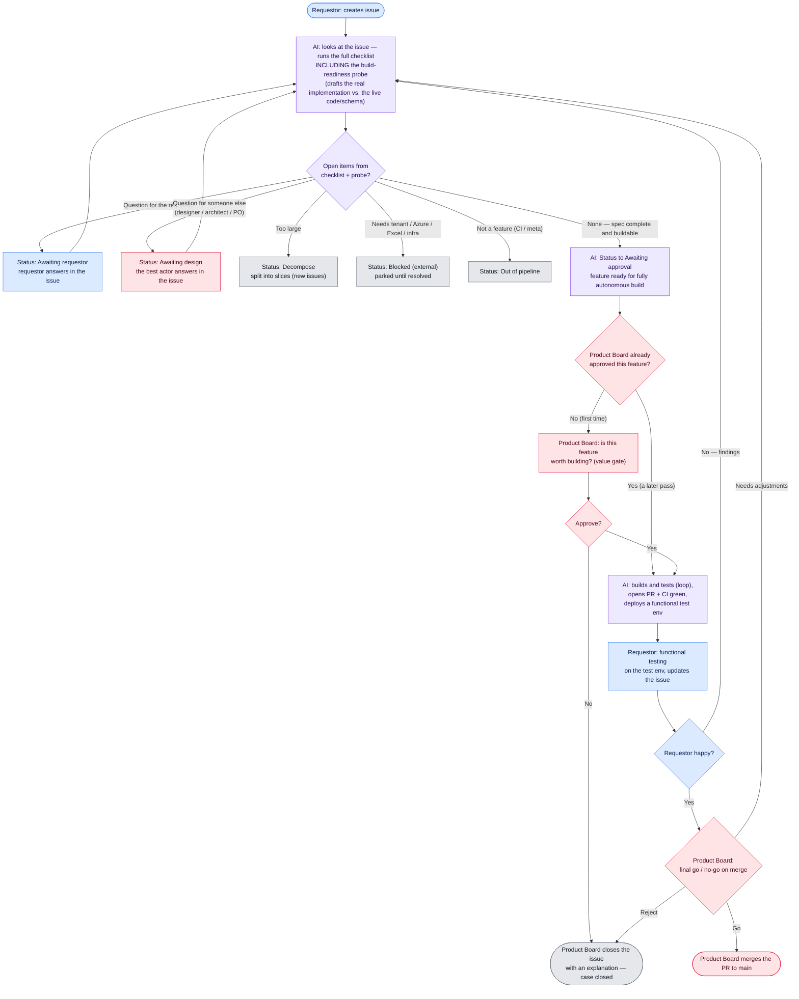

# Definition of Ready v3.4 — the "ready-to-build" process

**Purpose.** Produce a spec complete enough that building, testing and documenting run with **zero *functional* human decisions and zero silent *functional* assumptions** — while spending the fewest possible **human round-trips**. Non-functional decisions (architecture, design/UX, product fit) are **routed to the role that owns them**, *batched*, and resolved in as few interactions as possible. *Form* is expected to need a **feedback loop**. Every feature is tracked by a **GitHub issue** that is its durable spine from intent to close.

**The realistic bar.** "One perfect spec → build once" is reachable for **function**, not **form**. Front-load every *functional* decision; route every *architectural / design / product* decision to its owner; keep round-trips minimal; treat post-build feedback as a normal, cheap loop.

---

## The process at a glance

> **Note — flowchart corrected (this is the authoritative process).** It differs from the phase prose further below in two ways that the prose is still being reconciled to: (1) the **Product Board decision sits _after_ the spec is complete** — a value gate on the **first pass only**, not a front-of-line pre-screen (feedback loops skip it); and (2) there is a **final Product-Board go / no-go on merge** (go · needs-adjustments · reject). The build-readiness probe runs **inside** the AI's "looks at the issue" step; its questions must all clear before the Product Board looks.

## Roles (lanes)

One human may wear several hats. The point is not headcount; it's that **each question is answered by the right *hat*, a hat with no open question is not consulted, and a hat is touched as few times as possible.**

| Role | Owns | Answers questions about |
|------|------|-------------------------|
| **Requestor** | Intent + functional decisions; scope; the time-travel success/failure criteria | what it should do, for whom, how *complete/general* it should be, "just another attribute vs. a new surface" |
| **Architect / tech lead** | Technical approach; coherence of the codebase | registry vs engine, additive vs mutate-shared-contract, matview vs query-time, migrations |
| **Designer** | Form: interaction model, information architecture | how it looks/feels, integrate with an existing control or stand alone |
| **Product Owner** | Desirability / product coherence — the GO | does this move the product forward or just add complexity/bloat |
| **Builder (AI)** | Runs Phases A/B, then builds/tests/documents autonomously | — |

## Tracking issue — the durable spine

Every feature that passes the PO pre-screen gets a **GitHub issue**, created *before* Phase A and closed *after* merge + validation. It is the one artifact that outlives the session and the (squash-merged) PR, carries the gate labels, and gives end-to-end traceability. Maintaining it is the **Builder's** job — it adds **no human touchpoints**.

- **Created at pre-screen "yes"**, labelled `needs-clarification`, seeded with the Phase-A intent.
- **Body = current-state spec:** pinned scope (A8), time-travel criteria (A7), the **decisions register** (each entry tagged by role, ratify/blocking + how it resolved), the **fixture ACs**, and the form artifact. Updated as Phase B produces them.
- **Comments = the trail:** material changes and every feedback-loop iteration ("decisions along the way").
- **Labels ride the gates:** `needs-clarification` → `ready-to-build` (C1) → `approved` (C3) → `build-done` (D1).
- **PR references `Closes #N`** so issue ↔ PR link both ways.
- **Closed on merge + functional validation**, with an **outcome comment**: what shipped vs. what was consciously de-scoped. The outcome comment is a required closing step, not an afterthought.

## Minimise human round-trips — batch, don't ping-pong

- **Efficiency = few round-trips, not few questions.** The discipline limits *returns* to a human — it does **not** thin the first interview. A *complete* spec in two touchpoints beats a *thin* one in two touchpoints.
- **Exhaust the AI-resolvable work before touching any human.** The Phase-B probe/adversarial/CI-dry-run loop is AI-internal — never a reason to return to a person.
- **Prefer a proposed decision over a question** (bulk-ratify) — *except scope-ambition, which is the requestor's to choose (surface it, don't default it away).*
- **Batch by role, ask once**, folding a role's questions into its sign-off. **One person, one packet.**
- **Target: two human touchpoints** — the Phase-A interview and one consolidated sign-off/GO packet.
- **Optionality rule.** Only pose a question to a role that owns it; skip hats with no open question.

---

## Phase A — Intent interview (GENERATIVE, one sitting)
**Generative, not extractive.** Actively help the requestor find the *best and most complete* version. An open brain-dump alone under-scopes; start with the open description, then run the scope battery as explicit choices. All touchpoint #1 — no round-trips.
- **A1 Problem & value** — a user/governance question, not a solution; who for; why now.
- **A2 Scope boundaries** — what it deliberately does NOT do.
- **A3 Backlog context** — related/precondition/duplicate issues; weighed against the whole backlog.
- **A4 External dependencies** — known and secured, or N/A.
- **A5 Architecture fit** — fits the existing architecture, or *raises* an architectural question → tag for the architect.
- **A6 Documentation needs.**
- **A7 Time-travel pre-mortem.** *"We fast-forward to the moment I show you the finished feature. You're delighted because…? You're disappointed because…?"* The "disappointed because" answers become explicit accept/reject criteria.
- **A8 Scope-elicitation battery (ask as explicit choices; include or consciously defer each — never default away):** **generality** (specific case vs general capability) · **operation completeness** (existence → count/threshold → range; view → edit; single → bulk) · **symmetry & variants** (inverse directions, adjacent cases) · **surface / reach** (one page vs everywhere) · **adjacent / phase-2** (a bigger/reusable version) · **driver & priority**.

**Pin the chosen scope explicitly** (feeds B4). A minimal cut is fine — but as a *conscious choice*.

## Phase B — Build-readiness probe (AI-internal; no human until it's exhausted)
Draft the actual implementation against the real code and schema — far enough to hit the walls. A dry-run, not a re-read.
- **B1 Trace every value to its real storage** — write the real query; multi-hop → the join path; not modelled as assumed → raise it.
- **B2 Enumerate consumers** of every shared contract/function/wire-format/table/component touched.
- **B3 Resolve every choice to one option** — no "A or B", no "TBD"; includes UX-shaping words.
- **B4 Pin the exact scope set** — matching the scope chosen in A8.
- **B5 Delivery decomposition** — one PR or a required stack, and the order.
- **B6 Adversarial pass (independent)** — find where the spec contradicts the real code/schema (hidden hop, unlisted consumer, unhandled empty/edge, ambiguous UX word).
- **B7 Dry-run the CI / Definition of Done** (appendix) — not just the schema.
- **B8 Classify each open item** — proposed decision (ratify) vs blocking question; tag by role.
- **B9 Outputs (recorded in the tracking issue):** decisions register · fixture-backed ACs (input → expected output vs the REAL model; incl. empty/zero/error) · validation-data plan · form artifact for UI · test plan · docs + changelog targets.
- **B10 Loop** until a pass surfaces nothing new — all AI, no human.

## Phase C — Consolidated sign-off (batched; one packet if one person)
- **C1 Requestor** — answers batched functional questions, confirms summary + scope + time-travel criteria ⇒ label `ready-to-build`.
- **C2 Architect** — answers batched architectural questions, signs off the technical approach.
- **C3 Product Owner** — GO ⇒ label `approved`; only now may autonomous build start. (Designer confirms the form artifact here too.)

## Phase D — Build, validate, and the feedback loop (first-class)
- **D1 Autonomous build** on SK3: implement, run the fixture-AC tests, and — **for a feature with a runtime surface** — **load the full demo dataset** (baseline realistic volume; it includes ownership/sponsor/member data) and top up any feature-specific gap, so functional validation runs against real data, not a hand-seeded sliver. Then docs, changelog, PR (`Closes #N`), CI green, deploy ⇒ label `build-done`. The handoff **reports the ACs + their green test run** so real testing is visible and distinct from manual validation. *(A change with no runtime surface — e.g. docs — skips the demo-data load; note that in the issue rather than forcing it.)*
- **D2 Functional validation** by the requestor against the fixture ACs **and** the time-travel criteria, using the loaded data.
- **D3 Feedback loop.** Disappointment (form, or missed scope) is captured as **new intent** (a comment on the issue) and re-enters at Phase A. Expected and cheap. Happy ⇒ approve PR ⇒ merge ⇒ close the issue with the outcome comment.

---

## External requests — the vouch

The pipeline only accepts requests from **Fortigi org members**. That is a security boundary, not
an administrative one: this is a **public** repo, so `issues` / `issue_comment` events run **with
secrets** for anyone who can type in a text box, and org membership is the only real defense for
the Claude subscription token (see the injection note in
[`operationalization.md`](operationalization.md#security-note--the-dor-agents-injection-residual-phase-1)).

But customers and partners *do* file good requests. Rather than widening the gate, we **transfer
the request**:

| | |
|---|---|
| **A non-member opens an issue** | `dor-triage` posts a notice, assigns Wim/Taeke/Rob, labels it **`needs-vouch`**, and stops. It is deliberately *not* put on the board — a request nobody has accepted has no requestor, and parking it at "Awaiting requestor" would falsely read as "waiting on them". The nightly reconcile keeps flagging it until someone acts. |
| **A maintainer accepts it** | Apply the **`dor-vouched`** label. That is the whole gesture. |
| **What vouching means** | **You become the requestor of record.** The board's "Requested by" becomes you, you become the sole assignee, and you answer the Phase-A interview and Phase-B probe questions. You are accountable for the request as if you had filed it. |
| **The original reporter** | Stays subscribed and is @-mentioned, so every step — questions, spec, test environment, delivery — reaches them. They can keep commenting, and you relay what matters. **Their comments do not drive the pipeline**; yours do. |
| **Declining** | Just close the issue with an explanation. Not vouching *is* the "no". |

**Why the requestor role transfers rather than the gate opening.** No external account gains the
ability to trigger a workflow, so the threat model is unchanged — the only thing that changes is
*who the pipeline considers the requestor*, resolved in one place by
`.github/scripts/dor_requestor_of_record.sh` (author by default; the voucher when a vouch exists).
That resolver is what the **build** gate reads too, so a vouched request builds normally instead of
being refused at the last step for having been filed by a non-member. Only a human org member can
vouch: the label is applied via a `labeled` timeline event, `dor-vouch` verifies the applier's
membership and strips the label if they are not a member, and a bot-applied label never transfers
the role.

The value gate is untouched — a vouched request still needs a **Product Board GO** before anything
builds. Vouching says *"this is a real request and I own it"*, not *"build this"*.

---

## Bugs — the reproduce-first variant

Bug reports run the **same spine** (tracking issue · `state:*` routes · board Status · human GO) with
one substitution: the "AI looks at the issue" step is a **reproduce-first probe**, not an intent
interview. Bugs are the *easier* case — a feature's hard question ("is this the right thing to
build?") is a judgment call, but a bug has an **objective Definition of Done: it no longer
reproduces.**

The probe, in order: **reproduce** the report statically against the real code **and the demo
dataset** (evidence as `file:line`; does it reproduce on demo data, or only real tenant data?);
pin the **root cause** at the layer that *produces* the wrong value (*fix at the source, not the
surface*); map the **blast radius** (every consumer of what would change); and **draft the
reproducing regression test** (red today, green once fixed) — which *is* the acceptance criterion and
ratchets coverage by construction. Routes reuse the same set: confirmed + root-caused + red test →
*Awaiting approval* (a light human **GO on the fix**); can't-reproduce / needs detail → *Awaiting
requestor*; needs real tenant/data → *Blocked (external)*; a fix with a genuine design tradeoff →
*Awaiting design*; several bugs bundled → *Decompose*; not-a-bug → *Out of pipeline*.

**Runtime** reproduction (running the fix against a live demo env until the red test goes green) is
the deferred build-side step. Bugs live on their **own board** (Bug Pipeline, project #3) and are
**org-members-only** — an external report is parked as `needs-vouch` and enters the same way a
feature does, via [the vouch](#external-requests--the-vouch). The wiring — `bug` gate
label, `dor-bug-agent`, the Bug Form, and the shared scripts — is in
[`operationalization.md`](operationalization.md#bug-pipeline-spec-side-live).

## Appendix — Definition of Done the probe must design against
- **Coverage** — aggregate + per-file ratchet (only up) + diff-coverage. New code ships with tests.
- **File size** — >1000 lines must split; >600 is a smell.
- **Complexity** — per-unit cyclomatic + cognitive ratchets; under the per-language threshold.
- **Duplication** — jscpd gate; reuse before creating.
- **Contract tests** — real PostgreSQL; each test **DELETEs its own rows**.
- **OpenAPI** — a new router must be documented in `openapi.yaml` or allowlisted.
- **UI** — dark mode; WCAG AA contrast (no bare `text-*-300/400`); real accessible names; no native `alert/confirm/prompt`; `@ui/` alias; nothing crawler-specific under `app/ui/`.
- **Changelog** — a fragment under `changes/` for functional changes (docs-only needs none).
- **Merge** — 1 approval; never admin-merge.

**Baseline precondition.** Verify `main` (and the target Sidekick) is green *before* starting. Pre-existing failure = repo debt, fixed as a disclosed separate chore.

## The bar
A fresh builder given ONLY the spec (via its tracking issue) builds, tests and documents it with **zero functional decisions and zero silent functional assumptions**, in **≈two human touchpoints**, to the **complete** scope the requestor chose. End-validation is mechanical against the fixture ACs + time-travel criteria on real data. Residual *form* gaps go through the D3 feedback loop. The issue carries the whole trail and closes with an outcome comment.

## Version history (generalized lessons)
- **v1 → v2:** review didn't satisfy "no open questions" — added the executed build-readiness probe, consumer-enumeration, no-A-or-B, pinned scope, adversarial pass, fixture ACs.
- **v2 → v3:** stopped collapsing a product team into "the requestor" — role-routing, time-travel pre-mortem, form artifact, CI/DoD dry-run, first-class feedback loop.
- **v3 → v3.1:** round-trip discipline — exhaust AI work first, prefer proposed-decisions, batch per role, ≈two touchpoints.
- **v3.1 → v3.2:** efficiency had starved the interview — made Phase A generative with the scope battery; validation-data seeding; AC-result transparency.
- **v3.2 → v3.3:** the gate labels had no home and the decisions trail died with the session — added the **tracking issue** as the durable spine (created at pre-screen, decisions in the body, trail in comments, labels ride it, `Closes #N`, closed with an outcome comment). Made the validation-data load use the **full demo dataset** and scoped it to features with a runtime surface.
- **v3.3 → v3.4:** corrected the process flowchart to match how the pipeline actually runs: the **build-readiness probe is explicit inside the AI's "looks at the issue" step** (its questions must all clear first); open items route to *Awaiting requestor* / *Awaiting design*, or to *Decompose / Blocked / Out-of-pipeline*; **Product-Board value-approval moved to _after_ the spec is ready and only on the first pass** (was a front-of-line pre-screen; feedback loops now skip it); and a **final Product-Board go / no-go on merge** was added (go · needs-adjustments · reject). Phase A–D prose still to be reconciled to this flow.
