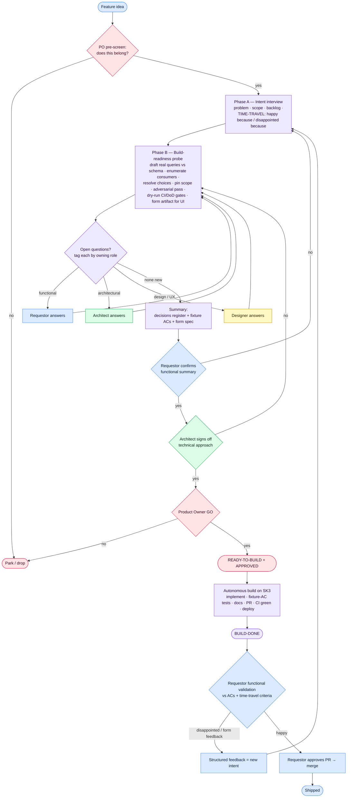

# Definition of Ready v3 — the "ready-to-build" process

**Purpose.** Produce a spec complete enough that building, testing and documenting run with **zero *functional* human decisions and zero silent *functional* assumptions**. Non-functional decisions (architecture, design/UX, product fit) are not eliminated — they are **routed to the role that owns them** at spec time, and *form* (look/feel/interaction) is expected to need a **feedback loop**, because taste is a see-it reaction that cannot be fully pre-specified.

**The realistic bar (corrected from v2).** "One perfect spec → build once" is reachable for **function**, not for **form**. So: front-load every *functional* decision; route every *architectural / design / product* decision to its owner; and treat post-build feedback as a normal, first-class loop, not a failure.

---

## The process at a glance

## Roles (lanes)

One human may wear several hats — on a small team the same person is requestor, architect and PO. The point is not headcount; it's that **each question is answered by the right *hat*, and a hat with no open question is not consulted.**

| Role | Owns | Answers questions about |
|------|------|-------------------------|
| **Requestor** | Intent + functional decisions; the time-travel success/failure criteria | what it should do, for whom, which cases matter, "just another attribute vs. a new surface" |
| **Architect / tech lead** | Technical approach; coherence of the codebase | registry vs engine, additive vs mutate-shared-contract, matview vs query-time, migrations |
| **Designer** | Form: interaction model, information architecture | how it looks/feels, whether it integrates with an existing control or stands alone |
| **Product Owner** | Desirability / product coherence — the GO | does this move the product toward its goals or just add complexity/bloat |
| **Builder (AI)** | Runs Phases A/B, then builds/tests/documents autonomously | — |

**Optionality rule.** When routing questions, only pose a question to a role if a genuine question is *owned* by that role. Do **not** ask the requestor an architectural question; do **not** ask any hat for an opinion it doesn't own. Skip hats with no open questions.

---

## Phase A — Intent interview (what & why)
- **A1 Problem & value** — a user/governance question, not a solution; who for; why now.
- **A2 Scope boundaries** — what it deliberately does NOT do.
- **A3 Backlog context** — related/precondition/duplicate issues; weighed against the whole backlog.
- **A4 External dependencies** — known and secured, or N/A.
- **A5 Architecture fit** — fits the existing architecture, or names the principle-change (this often *raises* an architectural question → route to the architect, do not resolve it with the requestor).
- **A6 Documentation needs** — what a user/dev will need.
- **A7 Time-travel pre-mortem (Rob's question).** Ask the requestor, in their own words: *"We fast-forward to the moment I show you the finished feature. You're delighted because… ? You're disappointed because… ?"* Capture both. The "disappointed because" answers become **explicit acceptance/rejection criteria** — this is where *form* preferences ("I wanted it to be just another attribute") surface before any code.

## Phase B — Build-readiness probe (can it actually be built?)
Intent is fixed. **Draft the actual implementation against the real code and schema — far enough to hit the walls.** An implementation dry-run, not a re-read.
- **B1 Trace every value to its real storage** — for each value/condition/edge/derived field, find the EXACT storage and **write the real query**. Multi-hop → write the join path. Not modelled as assumed (derived / blob / N hops away / premise self-refuted) → that's a question; raise it.
- **B2 Enumerate consumers** of every shared contract/function/wire-format/table/component touched, with the compatibility approach for each.
- **B3 Resolve every choice to one option** — no "A or B", no "TBD". **This includes UX-shaping words** — "alongside / integrated / shared / inline" are hidden A-or-B choices; resolve them explicitly.
- **B4 Pin the exact scope set** — the concrete list, never "whatever the data contains".
- **B5 Delivery decomposition** — one PR or a required stack, and the order.
- **B6 Adversarial pass (independent)** — a second reviewer tasked only with *"find where this spec contradicts the real code/schema — assume a hidden hop, an unlisted consumer, an unhandled empty/edge case, or an ambiguous UX word."*
- **B7 Dry-run the CI / Definition of Done** (see appendix) — not just the schema. "Will each new unit stay under the complexity ceiling? Does my contract test isolate its own rows? Does this new route need OpenAPI? Dark mode + accessible name + `@ui/` alias?" Design against the gates so they are not discovered mid-build.
- **B8 Tag every open question by owning role** (functional / architectural / design / product) and route per the optionality rule.
- **B9 Outputs:**
  - **Decisions register** — every decision + option taken + **owning role**.
  - **Fixture-backed acceptance criteria** — concrete input → expected output vs the REAL model (double as automated tests; make validation mechanical). Include empty/zero/error cases.
  - **Form artifact (UI features)** — a concrete interaction spec or low-fi/ASCII mock the requestor + designer sign off on. Fixture ACs pin *behavior*; the form artifact pins *form*.
  - **Test plan** that keeps the ratchets green; **docs + changelog targets**.
- **B10 Loop** until a probe pass surfaces nothing new.

## Phase C — Sign-offs (three distinct gates; may be one person, several hats)
- **C1 Requestor** confirms the functional summary + the time-travel criteria are captured ⇒ *functional* `ready-to-build`.
- **C2 Architect** signs off the technical approach (the decisions register's architectural entries) ⇒ *technical* ready. The architect is the technical-coherence gate that stops cheap building from becoming spaghetti.
- **C3 Product Owner** GO — moves the product forward vs. adds bloat ⇒ `approved`. Only now may autonomous build start.

## Phase D — Build, validate, and the feedback loop (first-class)
- **D1 Autonomous build** on SK3: implement, run the fixture-AC tests, docs, changelog, PR, CI green, deploy ⇒ `build-done`.
- **D2 Functional validation** by the requestor against the fixture ACs **and the time-travel criteria** (not just "does it run" — check the numbers, and check the "disappointed because" list).
- **D3 Feedback loop.** If the requestor is disappointed (usually *form*), the feedback is captured as **new intent** and re-enters at Phase A. This is expected and cheap — it is the point of cheap building, not a failure. If happy ⇒ requestor approves the PR ⇒ merge.

---

## Appendix — Definition of Done the probe must design against
Standing repo gates (design against these in B7; they are knowable, so they must not be mid-build surprises):
- **Coverage** — aggregate + per-file ratchet (only ratchets up) + diff-coverage on changed lines. New code ships with tests.
- **File size** — >1000 lines must split; >600 is a smell. Grandfathered files may only shrink.
- **Complexity** — per-unit cyclomatic + cognitive ratchets; new/touched units under the per-language threshold.
- **Duplication** — jscpd gate; reuse before creating.
- **Contract tests** — run against real PostgreSQL; each test **DELETEs its own rows** (never DROP/TRUNCATE, never assume a clean shared DB).
- **OpenAPI** — a new router must be documented in `openapi.yaml` or allowlisted, or the drift guard fails.
- **UI** — dark mode from the start; WCAG AA contrast (no bare `text-*-300/400`); real accessible names (not placeholders); no native `alert/confirm/prompt`; `@ui/` alias (no relative traversal); nothing crawler-specific under `app/ui/`.
- **Changelog** — a fragment under `changes/` for functional changes (never edit `CHANGES.md`; docs-only changes need no fragment).
- **Merge** — 1 approval; never admin-merge / bypass branch protection.

**Baseline precondition.** Verify `main` (and the target Sidekick) is green *before* starting. A pre-existing failure (e.g. a transitive npm-audit advisory) is repo debt, not a defect of the feature — fix it as a disclosed separate chore, and don't attribute it to the feature's DoR.

## The bar
A fresh builder given ONLY the spec builds, tests and documents it with **zero functional decisions and zero silent functional assumptions**; end-validation is mechanical against the fixture ACs + time-travel criteria. Architectural/design/product decisions were made by their owners at spec time. Residual *form* gaps are handled by the D3 feedback loop, cheaply.

## Version history (generalized lessons)
- **v1 → v2:** "no open design questions" was satisfiable by *review*; v2 requires an *executed* build-readiness probe (a value can look modelled and not be). Added consumer-enumeration, no-A-or-B, pinned scope, adversarial pass, fixture ACs.
- **v2 → v3:** v2 collapsed a whole product team into "the requestor." v3 **routes questions by role** (and skips hats with no question), adds the **time-travel pre-mortem** (surfaces form/success criteria), a **form artifact** for UI, **dry-runs the CI/DoD gates** (not just the schema), and makes the **feedback loop first-class** — because form/taste can't be fully pre-specified.
