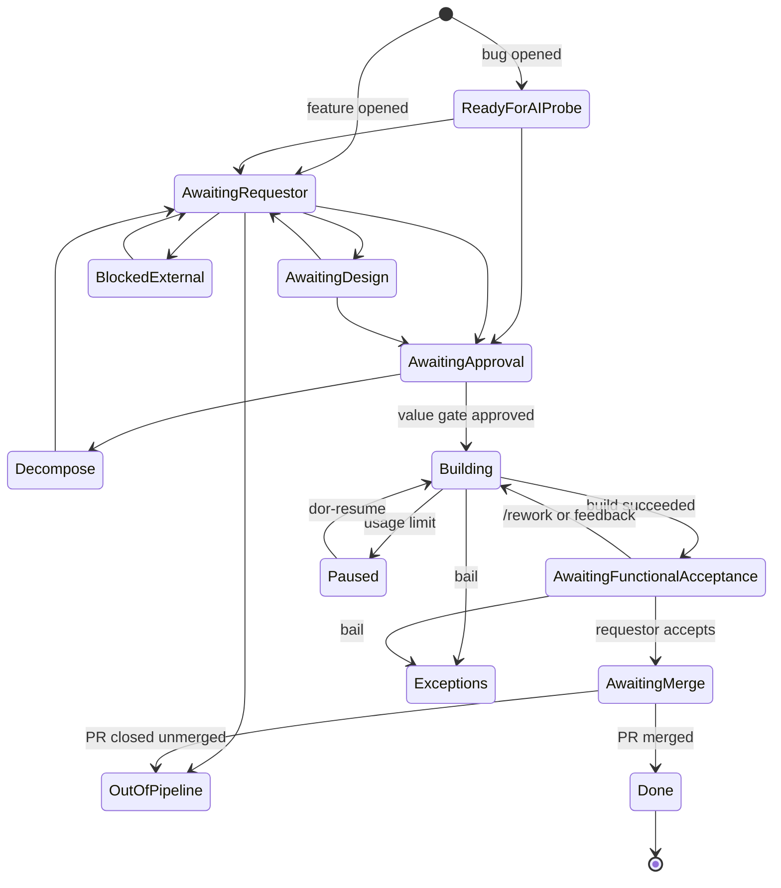

# DoR state machine & operating procedure

Who moves an issue, from which column to which, and what to do when it stops moving.

[definition-of-ready.md](definition-of-ready.md) describes the *process* — the questions each phase
answers and why. [operationalization.md](operationalization.md) describes the *platform* — the
workflows, tokens and runners. This page is the third thing: the **board columns as a state
machine**, and the **operating procedure** for each actor.

!!! warning "The graph is emergent, not enforced"

    `dor_set_status.sh` takes a phase token and writes the column. There is **no from-state check
    anywhere** — nothing rejects an illegal transition, and the board lets you drag a card from Done
    back to Building. Every transition below is one the automation *makes*, not one the system
    *permits*.

    The reconcile sweep does not police it either. It flags a `state:*` label that disagrees with
    its Status column (🔀), but a legal-label / illegal-jump combination is invisible to it. Treat
    this page as the contract the workflows keep with each other — and if you move a card by hand,
    you are the one keeping it.

!!! danger "Dragging a card into *Building* is the one manual move that raises a real alarm"

    Moving a card does not start anything — the column is written *by* the pipeline, it does not
    drive it. But *Building* is the one column the sweep actively polices: it asserts that work is
    running **right now**, so 20 minutes later the liveness check asks whether any DoR run is alive
    for that issue. If none is, you get 💀 in the health report, a `dor-stuck` label on the issue,
    and an @-mention comment saying its sidekick died mid-flight.

    An issue parked at the value gate is exempt, because a `waiting` run counts as alive — which is
    the only reason moving two gate-parked issues into *Building* did not fire it. Move one that has
    no run at all and it will.

---

## Actors

Human roles are the lanes from [definition-of-ready.md](definition-of-ready.md#roles-lanes). The
machine actors are listed with them because on this board they take turns.

| Actor | Kind | Moves the board? | Owns |
|---|---|---|---|
| **Requestor of record** | human | no (answers, and accepts) | Intent, scope, functional acceptance. Normally the issue author; for a vouched external request it is the member who applied `dor-vouched` ([`dor_requestor_of_record.sh`](https://github.com/Fortigi/IdentityAtlas/blob/main/.github/scripts/dor_requestor_of_record.sh)) |
| **Product Board** | human | yes — the value gate | The GO. Required reviewers on the `build-approval` Environment: the build job *pauses* until one of them approves |
| **Architect / tech lead** | human | via labels | Technical approach; answers a `state:awaiting-design` question |
| **Designer** | human | via labels | Form and interaction; the other half of `Awaiting design` |
| **Merge reviewer** | human | yes — merging is the terminal transition | Code review. GitHub Actions **cannot** approve a PR (D5), so this is always a person |
| **Spec agent** | AI | yes | `dor-agent` / `dor-bug-agent`: interview, probe, and route to exactly one `state:*` |
| **Build agent** | AI | yes | `dor-build-agent`: implement, verify, open the PR |
| **Deterministic workflows** | machine | yes | `dor-triage`, `dor-vouch`, `dor-board-sync`, `dor-propose-build`, `dor-deploy`, `dor-reset` — no LLM |
| **Reconcile sweep** | machine | almost never | `dor-reconcile`, hourly. Heals only "open issue missing from the board"; everything else it *reports* |

Everything is inert unless the repository variable `DOR_ENABLED` is `true`.

**Authorization.** This is a public repository, and `issues` / `issue_comment` events run with secrets
for *any* commenter. Every DoR workflow that reacts to those events therefore gates on Fortigi org
membership first, via [`.github/actions/dor-authorize`](https://github.com/Fortigi/IdentityAtlas/blob/main/.github/actions/dor-authorize/action.yml).
A non-member's comment is read, and nothing else.

---

## The columns

Thirteen. Six belong to the spec side, four to the build side, two are off-path, one is terminal.

| Column | Side | Means | Who moves it next |
|---|---|---|---|
| **Ready for AI probe** | spec | A bug, freshly filed, queued for reproduction | Spec agent |
| **Awaiting requestor** | spec | The agent asked a question about intent | Requestor |
| **Awaiting design** | spec | Blocked on approach or form | Architect / Designer |
| **Decompose** | spec | Too big for one build; must be split | Requestor + Architect |
| **Awaiting approval** | spec | Spec certified. **The value gate** | Product Board |
| **Blocked (external)** | spec | Waiting on something outside the repo | Whoever owns the dependency |
| **Building** | build | A sidekick is implementing, right now | Build agent |
| **Awaiting functional acceptance** | build | Built and deployed; does it do the job? | Requestor |
| **Awaiting merge** | build | Accepted; needs code review | Merge reviewer |
| **Paused** | off-path | Hit a Claude usage limit; work saved on the branch | `dor-resume`, automatically |
| **Exceptions** | off-path | Dead-letter — broke somewhere in the pipeline | A maintainer |
| **Out of pipeline** | off-path | Not for this process (CI, tooling, docs, meta), or a PR closed unmerged | Normal dev flow |
| **Done** | terminal | PR merged, issue closed | — |

`Out of pipeline` is **not** a resting place for closed work: the reconcile sweep will keep asking you
to move a closed issue to Done. Done is the only resting state on the board.

---

## Default flow

**Feature**

```
issue opened
  └─ Awaiting requestor            dor-triage
       └─ Awaiting approval        spec agent, after interview + readiness probe
            │                      dor-propose-build applies `ready-to-build` at once, no human;
            │                      that starts dor-build-agent, which PARKS on the gate
            └─ Building            the Product Board approves the parked RUN; the build agent
                 │                 sets this column itself, as its first act on the sidekick
                 └─ Awaiting functional acceptance
                      └─ Awaiting merge      requestor accepts
                           └─ Done           PR merged → issue closed
```

!!! warning "`ready-to-build` comes *before* the gate, not after"

    It is tempting to read the value gate as "a human approves, and then the build is labelled and
    dispatched". It is the other way round: the label is applied **automatically and immediately**
    on entering *Awaiting approval*, and it is what creates the run that then waits for a human. The
    approval acts on the **run**, not on the label — so re-applying `ready-to-build` never bypasses
    anything.

    While the run is parked, `authorize`, `policy` and `notify` have already completed and `gate` is
    `waiting`; the `build` job does not exist yet. That is why the column still reads *Awaiting
    approval* — nothing has set *Building*, because nothing is building.

**Bug** — identical from `Awaiting approval` onward; it enters one column earlier:

```
issue opened (label: bug)
  └─ Ready for AI probe            dor-triage
       └─ Awaiting approval        bug agent, after reproduce + root cause + repro contract
            └─ …
```

The spec side is a **loop, not a line**. The agent may route to `Awaiting requestor`,
`Awaiting design`, `Decompose` or `Blocked (external)` any number of times before it reaches
`Awaiting approval`; each answer re-triggers it.



---

## Every transition the automation makes

| To | From | Trigger | Actor / mechanism |
|---|---|---|---|
| Awaiting requestor | *(entry)* | issue opened, no `bug` label | `dor-triage`, deterministic. Also sets "Requested by" |
| Ready for AI probe | *(entry)* | issue opened with `bug` | `dor-triage` |
| *(same, on the right board)* | *(parked)* | member applies `dor-vouched` | `dor-vouch` — transfers the requestor role to the voucher |
| Awaiting requestor · Awaiting design · Decompose · Blocked (external) · Out of pipeline · **Awaiting approval** | any spec column | agent finishes a pass | Spec agent → [`dor_post_decision.sh`](https://github.com/Fortigi/IdentityAtlas/blob/main/.github/scripts/dor_post_decision.sh) picks **exactly one** of six routes |
| *(any)* | *(any)* | a human edits a `state:*` label | `dor-board-sync`. Bot senders are ignored |
| *(column unchanged)* | Awaiting approval | the spec agent applied `state:awaiting-approval` | `dor-propose-build` applies `ready-to-build` at once — no human. That starts `dor-build-agent`, whose `gate` job parks on the `build-approval` Environment. The column does **not** move yet |
| Building | Awaiting approval | the Product Board approves the parked **run** | the `build` job then runs on a sidekick and `dor_build_flow.sh` sets this column itself, first thing — it also *consumes* `ready-to-build` (removes it), so that label disappearing is not drift |
| Building | Awaiting functional acceptance | requestor comments, or `/rework` on the PR | `dor_feedback_flow.sh` |
| Awaiting functional acceptance | Building | build or rework finished | `dor_build_flow.sh` / `dor_feedback_flow.sh` |
| Awaiting merge | Awaiting functional acceptance | requestor accepts | `dor-acceptance`, after the org-member + classify gate |
| **Done** | Awaiting merge | PR **merged** | `dor-reset` — also closes the issue and drops every in-flight label |
| Out of pipeline | Awaiting merge | PR closed **unmerged** | `dor-reset`, with a comment explaining how to restart |
| Paused | Building | Claude usage limit | `dor_build_lib.sh` → work saved on the branch, runner released |
| Building | Paused | every 6h | `dor-resume` re-dispatches |
| Exceptions | Building / acceptance | `bail()` | The flow failed somewhere it could still report |

Two asymmetries worth knowing:

- **`Ready for AI probe` is entry-only.** `dor_post_decision.sh` accepts six routes and that is not
  one of them — the agent can never send an issue back to it.
- **`Awaiting approval` is the only route that cascades.** Every other route parks the issue and
  waits for a human. That one triggers `dor-propose-build`, which is precisely why it is the gate.

---

## The two gates

Two GitHub-enforced human gates bracket the AI. Neither can be bypassed by a workflow.

**1. The value gate — is this worth building?**

`ready-to-build` only *proposes* a build; GitHub cannot restrict who applies a label. The real gate
is the **`build-approval` Environment**, whose required reviewers are the Product Board. The build
job does not run a single step until someone clicks Approve — *before the agent runs or any token is
spent*.

A run parked here shows as **`waiting`** in the Actions list, indefinitely. That is a healthy state,
not a stall, which is why the reconcile sweep's liveness check counts `waiting` as alive alongside
`in_progress` and `queued`.

The notice asking you to approve is posted from a **separate, ungated job** — a notice posted from
inside the gate could only ever arrive after the approval it asks for. `test/ci-scripts/test-dor-gate-notice.sh`
pins that separation.

**2. The merge gate — is this good code?**

A human approval on the PR. GitHub Actions cannot approve pull requests (D5), so this is structurally
impossible to automate.

### The autonomous carve-out

A build may skip the value gate entirely, but only when **every** one of these holds:

- repository variable `DOR_AUTOBUILD` is `true`
- the issue is a **bug** — a feature's value is a human question, always
- it does not carry `no-autobuild`
- it has a **repro contract** whose `confidence` is `certain`
- the contract's predicted `blast_radius` touches no path segment matching
  `migrations · auth · authn · authz · security · credentials · secrets`, and no
  `*credential* / *secret* / *token*` source file
- fewer than `DOR_MAX_CONCURRENT_BUILDS` (default 3) builds are already running

Anything else falls back to the human gate. The merge review still applies either way — the carve-out
skips *one* of the two gates, never both.

---

## Operating procedure

### If you are the requestor

| The board says | Do this |
|---|---|
| Awaiting requestor | Answer the agent's question in a comment. That re-triggers it |
| Awaiting design | Not yours — an architect or designer owes an answer |
| Decompose | Split the issue. Close this one or narrow it, and file the pieces |
| Awaiting functional acceptance | Try it at the deployed URL on the issue and say whether it does the job. Accepting moves it to Awaiting merge |

To ask for a change after a build, comment on the **issue**. On the **PR**, a change request must be
prefixed `/rework` — a merge review is a conversation, and every comment should not fire the agent.

### If you are on the Product Board

An issue at **Awaiting approval** is waiting on you and nothing else is happening. Open the linked run
and Approve or reject in the Actions UI. The notice comment deep-links the certified spec, because by
then it is usually buried up-thread.

Rejecting is a normal outcome: remove `ready-to-build` and route the issue with a `state:*` label.

**Check the age of a parked run before approving it.** A gate holds indefinitely, and the run is
pinned to the commit that was `main` when it was *created* — not when you approve. Two runs sat here
for a week and 119 commits; approving those would have had the agent implement against a
seven-day-old tree. If the run is stale, discard it and re-dispatch, in this order:

```bash
# 1. Cancel first. The concurrency group dor-build-agent-<issue> is cancel-in-progress: false,
#    so a fresh run would just queue behind the parked one instead of starting.
gh run cancel <run-id> --repo Fortigi/IdentityAtlas

# 2. Re-apply the trigger label to create a fresh run against current main.
gh issue edit <issue> --repo Fortigi/IdentityAtlas --remove-label ready-to-build
gh issue edit <issue> --repo Fortigi/IdentityAtlas --add-label ready-to-build
```

The new run parks at the gate exactly like the old one — this re-dispatches, it does not approve.
`dor-propose-build` cannot do this for you: it skips any issue that already carries
`ready-to-build`, which by definition includes every issue parked at the gate.

### If you are a maintainer

| Signal | What it means | Do this |
|---|---|---|
| **Exceptions** | The flow broke but got far enough to say so | Read the run log; fix and re-dispatch, or route it out |
| **`dor-stuck` label + a 💀 comment** | The sidekick died mid-flight; the flow never reached its own error handling | Re-dispatch: remove and re-apply `ready-to-build` |
| **Paused** | Usage limit, work is safe on the branch | Nothing — `dor-resume` picks it up within 6h. `workflow_dispatch` it if you are impatient |
| **`needs-vouch`** | An external request nobody has accepted | Apply `dor-vouched` — *you become the requestor of record* — or close it |
| **`sk:` label with no open PR** | A sidekick is reserved by nothing | Release the box: `~/.dor-reservation` + `~/stacks/dor-N`, then drop the label |

### If you are triaging a new issue

Filed through the web **New issue** form, an issue arrives correctly labelled and `dor-triage` routes
it. Filed with `gh issue create` or the REST API, it does **not** — issue-template labels are applied
only by the web form. An unlabelled issue still gets swept once it is on a board, but it can never be
*healed* back onto one, because the heal path is the deliberate `enhancement` / `bug` opt-in.

Add the gate label by hand when you bulk-file.

---

## The backstop

`dor-reconcile` runs hourly at `:17`, once per board. Every other DoR workflow is edge-triggered on a
GitHub event; a missed edge leaves no trace. This sweep is the only **level-triggered** component —
it re-derives desired state from actual state, and it is the only reason a dead build is ever noticed.

It walks **every open issue its board carries**, plus any gate-labelled issue missing from the board.
It heals exactly one thing — an open issue that never made it onto the board — and reports everything
else into a single health issue, commenting **only when the set of findings changes**.

| Marker | Means | Owner |
|---|---|---|
| 🩹 | Healed: added a missing issue to the board | — |
| ❌ | Missing from the board and could not be added | Maintainer |
| 🎟️ | External request awaiting a vouch | Maintainer |
| 🕳️ | On the board, no `state:*` label, untouched ≥6h — the agent probably never ran | Maintainer |
| 🔀 | Label and Status disagree | Whoever moved one of them |
| ⏳ | ≥14 days in Awaiting requestor / Awaiting design | The named actor |
| 🚦 | Count waiting at the value gate | Product Board |
| 💀 | Says Building, but no run is alive for it | Maintainer — re-dispatch |
| 🧟 | Claims a sidekick with no open PR | Maintainer — release the box |
| 🧭 | On this board, but its labels route it to the other one | Maintainer |
| 🔚 | Closed but parked outside Done | Move it to Done |
| ⚠️ | The sweep itself could not do its job | Maintainer |

The sweep never overwrites a human's Status from a possibly-stale label — a disagreement is flagged
for a person, not auto-"healed" (D3).
