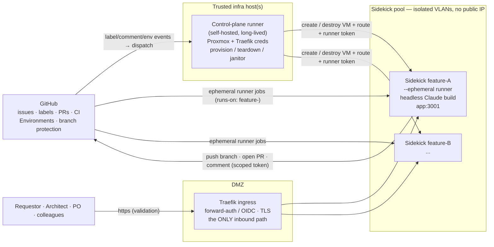
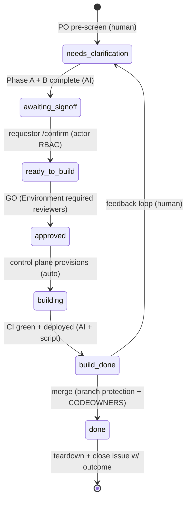

# Operationalising the Definition of Ready — automation platform

**Status: phase 1 (the spec side) is in build; steps 8+ (build / validate / merge on a sidekick) remain design.** This describes the system that *runs* the [Definition of Ready](definition-of-ready.md) process at scale (multiple features, multiple people, multiple infrastructures, in parallel), and a work breakdown to build it end-to-end. The **Phase 1** section immediately below records what is actually built, decided, and grounded against the live repo/GitHub state (surveyed 2026-07-28); everything from **Topology** onward is the full aspirational design, most of which is not built yet.

---

## Phase 1 — the spec side (grounded build status, 2026-07-28)

Phase 1 automates the **cloud-only spec side**: everything up to and including reaching the `Awaiting approval` value gate (FSM `needs_clarification → awaiting_signoff → ready_to_build → approved`), then **STOP**. It runs entirely on **GitHub-hosted runners**, reusing the existing CI and secrets — **no sidekick, no build job, no merge**. Steps 8+ (provision a sidekick → implement → test → deploy → merge) are out of phase-1 scope and remain the design from **Topology** onward.

### Spec-side pipeline — steps 1–7 (at a glance)

The **foundation prerequisites are in place** — board #2 (Status = canonical phase), `state:*`/gate labels, the BOT app token (Projects R/W + Issues R/W + **Members Read**), `CLAUDE_CODE_OAUTH_TOKEN`, the `main` rulesets, and the D5 self-approve hole closed. The seven step-automations an issue travels through:

| Step | Stage | Automation artifact | Status |
|------|-------|---------------------|--------|
| 1 | **Intake** — structured issue template (delighted/disappointed, does-NOT-do, generality) | `.github/ISSUE_TEMPLATE/feature_request.yml` | built (this PR) |
| 2 | **Triage** — add-to-board · "Requested by" · known/unknown-requestor filter | `dor-triage.yml` | built (this PR) |
| 3 | **Interview** — Phase-A generative intent, multi-persona lenses | `dor-agent.yml` | built (this PR) |
| 4 | **Route** — requestor / design / off-ramp (Decompose · Blocked · Out) | `dor-agent` (label + Status) + `dor-board-sync.yml` | built (this PR) |
| 5 | **Probe** — Phase-B build-readiness vs live code/schema → verdict | `dor-agent.yml` | built (this PR) |
| 6 | **Sign-off** — spec complete → *Awaiting approval* | `dor-agent` (label + Status) | built (this PR) |
| 7 | **Value gate** — Product-board GO (or park) | manual Status move now / Environment gate later | manual (auto = later phase) |

**Cross-cutting backstop — `dor-reconcile.yml` (level-triggered sweep, this PR).** Steps 1–6 are edge-triggered (GitHub events), so a dropped webhook, a failed run, or a concurrency race could silently strand an issue. A **daily scheduled** reconcile re-derives desired state from *actual* state and heals or flags drift: an open `enhancement` issue missing from the board → add it; board Status ≠ `state:*` label → re-sync; on the board but un-routed after N hours → flag (the agent likely never ran); stale in *Awaiting requestor/design* → nudge then flag; *Awaiting approval* backlog → flag the Product board; closed-but-still-active → move to *Done*. Deterministic (no LLM), **exception-only** reporting, and it maintains a single **"DoR pipeline health"** tracking issue. Being level-triggered it self-corrects even if the cron itself slips.

**Kill-switch.** Every DoR workflow is **inert until repo variable `DOR_ENABLED=true`** — the whole set can merge and be smoke-tested before anything runs.

**Live board — which issue is in which phase:** [github.com/orgs/Fortigi/projects/2](https://github.com/orgs/Fortigi/projects/2) (grouped by **Status**, the canonical phase). The [end-to-end map](#end-to-end-map--build-side-design-v2--pooled-sidekicks) below is its legend.

### Roles → GitHub identity

| Role | Owns / answers | GitHub identity |
|------|----------------|-----------------|
| **Requestor** | intent, functional scope, the time-travel success/failure criteria | **any Fortigi org member** (live-enumerated allow-list — self-maintaining) |
| **Design board** (architect + designer) | technical approach + form: registry-vs-engine, additive-vs-mutate, integrate-vs-standalone | `WimvandenHeijkant`, `TaekeK` |
| **Product board** (the value GO + final merge go/no-go) | desirability / product coherence — the GO | `WimvandenHeijkant`, `TaekeK`, `robb536` — **any one suffices; nobody else may pass the value gate** |
| **Builder (AI)** | runs the Phase-A interview + Phase-B probe (later: builds) | Claude via `claude-code-action` |
| **Unknown requestor** (non-member opens an issue) | — | **deterministic triage** (no AI): post a notice, assign Wim/Taeke/Rob, stop |

### AI usage per workflow

AI is spent **only where linguistic judgment is unavoidable** (interviewing a human, reasoning a spec against live code). Board/label mechanics and the spam filter are deterministic — no tokens.

| Workflow | Kind | Model | Auth | Cost |
|----------|------|-------|------|------|
| **triage** (add-to-board, "Requested by", unknown-requestor filter) | deterministic — no LLM | — | BOT app token | free (Actions minutes) |
| **interview** (Phase A — intent) | **AI** | **Fable 5 → Opus 5 fallback** | `CLAUDE_CODE_OAUTH_TOKEN` (Max subscription) | subscription quota |
| **probe** (Phase B — build-readiness) | **AI** | **Fable 5 → Opus 5 fallback** | `CLAUDE_CODE_OAUTH_TOKEN` (Max subscription) | subscription quota |
| **board-sync** (Status-field moves) | deterministic — no LLM | — | BOT app token | free |
| **reconcile** (daily drift-sweep + health issue) | deterministic — no LLM | — | BOT app token | free |

> The judgment-heavy, hard-to-verify phase (human language + deep code reasoning) gets the **most capable** model; everything else — triage, board-sync, the reconcile sweep, and the build phase (step 8+, mechanical + test-gated) — is deterministic or can use a lesser model.

### Model + auth decision (why Fable, why the subscription)

Interview + probe use **Claude Fable 5** (fallback **Opus 5** on refusal or when Fable is unavailable), authenticated with the **subscription** OAuth token (`CLAUDE_CODE_OAUTH_TOKEN` via `claude setup-token`) rather than per-token API credits — far cheaper at this volume. The catch is plan-gated:

| Plan | Fable 5 | Opus 5 | What the subscription token reaches |
|------|---------|--------|--------------------------------------|
| **Max** | included (up to ~50% of weekly usage limits) | included, default, no ceiling | **Fable 5 — no credits** |
| **Pro** | metered pay-as-you-go **credits** only | included, top model | Opus 5 free; Fable would bill credits |

So **Fable-via-subscription requires Max.** Wim is on **Max until 2026-08-19**, then Pro for a holiday — after which the workflow degrades to **Opus 5** rather than burning credits. Gotcha: a known intermittent `validateHeaders` failure with Max OAuth tokens right after a Pro→Max upgrade → re-run `claude setup-token` and update the secret. (The fallback mechanism is TBD at build time: `claude-code-action` may not pass the API `fallbacks` param through, so "fall back to Opus" is likely workflow-level retry-with-opus.)

### Currently in place vs. still to add

Legend: **in place** = exists and usable today · **partial** = exists but needs reconciliation · **build** = phase-1 work to write now · **blocked** = phase-1 but gated on an external action · **later** = deferred to a subsequent phase · **rec** = recommended hardening.

| # | Component | Status | Detail (grounded 2026-07-28) |
|---|-----------|--------|------------------------------|
| 1 | Board — Projects #2 "IdentityAtlas — Feature Pipeline" (`PVT_kwDOAhfTz84Bern-`) | **in place** | 65 items; **Status** single-select (`PVTSSF_…zhZEAac`, 11 options) is the canonical phase; **Requested by** single-select (`PVTSSF_…zhZEFTM`, only 5 options) |
| 2 | Phase/state labels | **in place** | 7 `state:*` labels + `ready-to-build` / `approved` / `build-done` gate labels |
| 3 | BOT app token (`fortigi-ci-bot`) | **in place** | **org Projects R/W + Issues R/W + Members Read** (P1 + D1 granted & validated); minted via `actions/create-github-app-token@v3.2.0` |
| 4 | `claude-code-action` availability | **in place** | pinned `@6c0083bb… # v1`; `CLAUDE_CODE_OAUTH_TOKEN` present |
| 5 | Merge / CI gates on `main` | **in place** | rulesets: 1 approval + CODEOWNERS (`@taekek`, `@wimvandenheijkant`) + required checks (PR Summary, CI Passed, Integration CI Passed) + CodeQL; squash-only |
| 6 | Governance hardening (D5) | **in place** | "Actions can approve PRs" **unticked** (done); read-only `GITHUB_TOKEN` default staged pending a naked-workflow (`pr.yml`/`pr-integration.yml`) audit |
| 7 | **`dor-authorize`** composite — org-member gate | **built (this PR)** | mints a **Members:Read**-scoped BOT token, `GET /orgs/Fortigi/members/{actor}`, fails closed; the only defense for public `issues`/`issue_comment` |
| 8 | **`feature_request.yml`** — intake form | **built (this PR)** | front-loads Phase A (delighted/disappointed, generality, screenshots); 5 required, rest optional |
| 9 | **`dor-triage.yml`** — add-to-board + route by requestor | **built (this PR)** | member → board + Requested-by (D2) + initial Status; non-member → notice + assign Wim/Taeke/Rob |
| 10 | **`dor-agent.yml`** — interview + probe (Phase A/B) | **built (this PR)** | Fable 5; **no-Bash deterministic split** (fetch → sandboxed reason → validated post); 7 persona lenses; sets comment + one `state:*` label + Status |
| 11 | **`dor-board-sync.yml`** — label → Status reconciler | **built (this PR)** | BOT token; syncs Status when a human changes a `state:*` label |
| 12 | **`dor_set_status.sh`** — board Status helper | **built (this PR)** | shared by triage/agent/board-sync/reconcile; option IDs resolved by name at runtime (regeneration-proof); idempotent add |
| 13 | **`dor-reconcile.yml`** — level-triggered daily sweep | **built (this PR)** | heals board/label drift, flags stuck/failed/stale, maintains the "DoR pipeline health" issue — the backstop for the event-based design |
| 14 | Kill-switch — `DOR_ENABLED` repo variable | **built (this PR)** | every DoR workflow inert until set `true` — merge + smoke-test before enabling |
| 15 | B1 — canonical vocabulary | **partial** | Status field vs FSM labels unreconciled → **Status field canonical** (D3); the FSM diagram below is stale |
| 16 | B2 — guard (revert *illegal* transitions) | **later** | the reconcile sweep (#13) is the phase-1 drift backstop; hard illegal-transition *reverts* are a later addition |
| 17 | B3 — value-gate Environment (3 reviewers) | **later** | nothing to gate in phase 1 (no build job); the GO is a manual Status move by the Product board until the build workflow lands |
| 18 | B5 slash-commands · B6 tracking-issue bootstrap | **later** | |
| 19 | A1–A7 sidekick lifecycle · C4 build · control-plane | **later** | step 8+; `[hypervisor session]` owner; full design below |

### Open decisions from the grounded survey (pin these)

- **D1 — actor-gate token *(BLOCKS the org-member gate; org-admin action, like P1)*.** The known-requestor allow-list must verify Fortigi org membership, and the default `GITHUB_TOKEN` can't (it isn't an org member and can't see private membership → returns HTTP 302, not 204/404). Options: **(a)** grant the `fortigi-ci-bot` app **Organization → Members: Read** and mint a gate token from it *(recommended — same one-time grant+accept as P1)*; **(b)** a fine-grained PAT with `read:org` (long-lived static secret); **(c)** a weaker `author_association == MEMBER/OWNER` check (only sees **public** members — silently denies private-visibility members). **Chosen (2026-07-28): (a)** — grant `fortigi-ci-bot` **Organization → Members: Read** and mint the gate token from it (pending the grant + installation-accept, same as P1).
- **D2 — "Requested by" field.** Single-select with only 5 predefined options; the other org members have none, and adding options **regenerates every option ID** (orphaning the 65 items' assignments — a known GraphQL gotcha). **Phase-1 default:** set "Requested by" only when the opener matches an existing option; otherwise leave it blank.
- **D3 — canonical phase vocabulary.** The **board Status single-select** (11 options) is canonical; `state:*` labels are an optional secondary mirror; the operationalization **FSM diagram** (snake_case states, and its front-of-line "PO pre-screen") is **stale** — the v3.4 flowchart is authoritative (value gate is post-spec, first-pass only; no front pre-screen). To be reconciled in a later doc pass.
- **D4 — interview/probe execution locus.** Phase-1 runs both on **GitHub-hosted cloud runners** — `claude-code-action` reads the repo + schema, which is all the probe needs (no running app). This supersedes C2's "AI-step jobs on the sidekick" for the spec side.
- **D5 — governance hardening (recommended, not blocking phase 1).** Set the repo/org default `GITHUB_TOKEN` to read-only with per-job elevation, and **disable "Allow GitHub Actions to approve pull requests,"** before the build/merge side exists. **Chosen (2026-07-28): harden now**, in two steps — **(i) now, zero-risk:** untick "Allow GitHub Actions to create and approve pull requests" (nothing legitimate relies on it); **(ii) staged:** flipping the default `GITHUB_TOKEN` to read-only can break workflows that assume the write default (e.g. a PR-summary comment step in `pr.yml` / `pr-integration.yml`, which declare no per-job `permissions:`), so first audit those and add explicit per-job `permissions:`, *then* flip the default.

### Security note — the DoR agent's injection residual (phase 1)

The `dor-agent` reads **untrusted public-issue content** while `claude-code-action` holds the Claude **subscription token in-env** — a genuine prompt-injection / token-exfiltration surface on a public repo. Mitigations shipped in phase 1:

- **Deterministic split.** The reasoning step runs the model with **Read/Grep/Glob/Write only — no shell, no `gh`, no network** — bracketed by a deterministic *fetch* step (writes the issue thread + backlog to files) and a deterministic *post* step (the only thing that writes to GitHub).
- **Fixed label allow-list** — the post step accepts only the six valid `state:*` routes; anything else aborts.
- **Repo-script restore + deterministic egress token-scan** — before executing any repo script the post step restores all `.github` files to their committed state (defusing a *Write→execute* escalation where the model overwrites the helper), and refuses to post if the agent's output contains **any** live token (the subscription token *or* the injected `github.token`). The reasoning step's `Write` is also path-scoped to `.dor/out/**`.
- **Org-member-only triggering**, the **human value gate** downstream (a mis-routed label still can't build without a human GO), and the **`DOR_ENABLED` kill-switch** (inert until flipped).

**Residual (be honest):** the reasoning step's `Read` tool could in principle reach `/proc/self/environ`. The egress scan catches a **literal** token leak; an **encoded** leak is only fully closed by a **raw-API script with path-restricted tools** — the v2 option (it also pairs naturally with idea 2's cross-model verify, since we'd own the agent loop). **Smoke-test the flow before setting `DOR_ENABLED=true`.**

### Considered enhancements (roadmap)

- **Structured intake template (idea 3) — in phase 1.** A GitHub **Issue Form** front-loads the Phase-A skeleton (problem & value, does-NOT-do, "I'm delighted when… / disappointed when…", generality, completeness, screenshots) so the agent starts from a rich brief instead of an empty one — fewer questions, fewer loops, fewer tokens. **Self-improving feedback loop:** periodically mine the questions the agent keeps asking and fold the recurring ones back into the form. Keep the form short (a minimal required core, the rest optional) so it doesn't deter requestors — thin issues still fall through to the interview.
- **Multi-persona review (idea 1) — in phase 1.** The agent runs its "looks at the issue" step through several **persona lenses** — requestor · architect · designer · product · **security** · **data-quality / edge-cases** · end-user — so gaps surface in a single pass (fewer human round-trips). Anchored to the DoR roles; ~5–7 lenses, not twenty. (The pattern is gstack's multi-persona idea; gstack itself is a local tool that does not run in the Action — the agent carries the lenses in its prompt / via sub-reviewers.)
- **Cross-model "outside voice" verify (idea 2) — v2.** A second, independent-provider model reviews the probe's adversarial pass (different blind spots catch different defects). **Constraint:** OpenAI's ChatGPT subscription is **not** usable in CI — Codex ChatGPT-sign-in is interactive/local only, automation uses a pay-per-token API key — so an OpenAI outside-voice bills API credits, it does **not** ride the ChatGPT plan (unlike Claude Max, which does work in Actions). Try **Opus-5 verifying Fable-5** first (same provider, on the Max subscription, still meaningful diversity); reach for the OpenAI outside-voice only if that isn't skeptical enough.

## End-to-end map & build-side design (v2 — pooled sidekicks)

**Live board (which issue is in which phase):** [github.com/orgs/Fortigi/projects/2](https://github.com/orgs/Fortigi/projects/2) — the **Status** field is the canonical phase; this table is the legend. Phase 1 above ships rows **1–6 + 15** (live); rows **8–13** are the build side (design). Cloud = ☁️ (GitHub-hosted runners, reuses existing CI); private = 🔒 (a pool sidekick VM).

| # | Step | Actor / type | Trigger | Automate via | Runs on |
|---|---|---|---|---|---|
| 1 | Issue created → auto-add to board, set *Ready for AI probe* | human + Action | `issues.opened` | native Projects auto-add + Action | ☁️ **Cloud** |
| 2 | **AI looks — interview + build-readiness probe** | **AI** | issue opened / comment / moved back | `claude-code-action` headless | ☁️ **Cloud** |
| 3 | Route → *Awaiting requestor/design* or *Decompose/Blocked/Out* | AI (`state:*` label) | probe output | part of step 2 | ☁️ Cloud |
| 4 | Human answers the question | **human** | — | — | 🌐 browser |
| 5 | Re-probe when an answer lands | AI | `issue_comment.created` | `claude-code-action` | ☁️ Cloud |
| 6 | Spec complete → *Awaiting approval* | AI (sets Status) | probe output | Action | ☁️ Cloud |
| 7 | **① VALUE GATE — "worth building?"** | **HUMAN GATE** | build job pauses | Actions Environment + required reviewers (Product Board) | 🌐 GitHub UI |
| 8 | **AI build on the sidekick** — implement → `docker build` + run at `n.build…` → self-validate (build green? renders? smoke passes?) → **open PR** | **AI (self-hosted)** | on approval | `claude-code-action` on a pool runner + Docker | 🔒 **Pool VM** |
| 9 | **PR CI** — unit + contract (testcontainers) + lint + coverage/complexity/filesize ratchets | CI | PR opened | existing CI | ☁️ **Cloud** |
| 10 | Build-done → *Awaiting functional acceptance* | Action (sets Status) | PR green + live | Action | ☁️ Cloud |
| 11 | Functional validation (click around `n.build…`) | **human** | — | — | 🌐 → 🔒 pool VM |
| 12 | **② MERGE GATE — final go / no-go** | **HUMAN GATE** | PR review | branch protection + CODEOWNERS | 🌐 GitHub UI |
| 13 | Merge → *Done*; **reset sidekick** (`down -v` + prune images/volumes, return to pool) | Action + sidekick runner | on merge/reject | Action + runner reset job | ☁️ + 🔒 (reset) |
| 14 | Feedback ("not happy") → back to AI looks | human → AI | `/feedback` / reopen | `claude-code-action` re-run | ☁️ Cloud |
| 15 | Board upkeep: `state:*` → Status sync, reconcile | Action | `issues.labeled` / nightly cron | Action | ☁️ Cloud |

**The entire private-infra footprint is the sidekick pool (rows 8, 11, 13).** Everything else — the whole spec side *and* PR CI — is cloud, reusing the current CI.

### Build-side design (v2): a pre-enrolled pool, not provision-per-build

- **Pool, not per-build provisioning.** N always-on sidekicks (`1.build.identityatlas.io`, `2…`, `3…`, …), each configured **once, in advance**: a standard Traefik vhost + one self-hosted GitHub runner (label `dor-build`) that controls only *its own* Docker. Two are enrolled today; more added over time. This deletes the old "provision a fresh VM + mint a Traefik route per build" step (former row 8) entirely.
- **No runner holds hypervisor or Traefik credentials.** A sidekick runner can `docker build/up/down` on its own box and nothing else — the most dangerous credential in the v1 design (Proxmox + Traefik on a long-lived control-plane runner) is gone. "Acquire a sidekick" is native GitHub runner-pool dispatch (`runs-on: [self-hosted, dor-build]`), so there is **no custom orchestrator to build**.
- **The AI builds *on* the sidekick, with a live env (row 8).** After the value gate the implement step runs on a pool runner, so the model can `docker build`, run the stack at the sidekick's fixed URL, and check its own work — build green? page renders? smoke passes? — **before** opening the PR. Cloud CI (row 9) then runs on the PR as the objective gate. Writing code with the ability to actually run it beats commit-blind-and-wait; it also makes the live browsable env a by-product of the build rather than a separate deploy step.
- **Reservation across the validation window (rows 8 → 13).** A build can't deploy-and-exit, or the freed runner would pick up the next build and clobber the stack a human is still validating at row 11 (which can take weeks). So a sidekick is **reserved** for one feature from build through merge/reject: the job takes its own runner offline (or drops its `available` label) and records a durable `sidekick → issue` mapping; the reset job re-enables it on completion. A finite pool ⇒ a finite number of parallel builds — the throughput knob you widen by enrolling more sidekicks.
- **Reset, not teardown (row 13).** On merge or reject the sidekick runs `docker compose down -v` + an image/volume prune back to a clean baseline, then re-registers as available. No VM lifecycle, no hypervisor calls — a fast recycle.
- **Security.** Post-value-gate the sidekick runner holds the Claude subscription token and runs AI-authored code with a shell — acceptable because its input is the **approved** spec (human-gated at row 7), not raw public-issue text, and each run is isolated to a VM that is reset between uses. The pool must be reachable **only** by the controlled post-approval dispatch — **never** by `pull_request` from a fork (self-hosted runner + untrusted fork PR = arbitrary code execution). Human browse access to `n.build…` stays behind the existing authentik/Traefik forward-auth against the Fortigi tenant.

> **This supersedes** the *provision-per-build* model in **Topology** and the **Control-plane worker contract** below — a long-lived runner holding Proxmox + Traefik creds that creates/destroys a VM per feature. Those sections predate this simplification; the pooled model above is the current plan. Former row 8 (provision) and the VM-teardown half of row 13 are gone.

## Goals & principles

- **Scale & parallelism.** Many features in flight at once, across the team, on heterogeneous infrastructure (each colleague can host their own sidekicks).
- **GitHub is the single source of truth.** The tracking issue (labels = state, comments = trail, PR + CI = build/verify) is the database, queue, audit log, and message bus. No second datastore.
- **Gate the *actions*, not the labels.** Labels are bookkeeping; the consequential actions (start a build, merge) are gated by GitHub's *native* RBAC (Actions Environments with required reviewers; branch protection + CODEOWNERS). A mislabelled issue therefore cannot *cause* anything unsafe.
- **Least privilege by construction.** AI-generated code only ever executes on a disposable, network-isolated sidekick. The credentials that can touch the hypervisor/Traefik live only on a separate trusted control plane and never reach a sidekick.
- **Deterministic where possible.** Infra lifecycle, deploy, teardown, tests = scripts (reproducible). AI only where judgment/generation is genuinely needed (interview, probe, build, docs).
- **No new orchestration product unless it earns it.** Code-defined GitHub Actions (in-repo, reviewable, and the only place you get native RBAC gates) over a GUI tool like n8n — reach for n8n only if non-engineers will own the flows.

## Topology

> **⚠️ Superseded on the build side** by [Build-side design (v2): a pre-enrolled pool](#build-side-design-v2-a-pre-enrolled-pool-not-provision-per-build). The control-plane runner + per-build VM provisioning below is the earlier design; the current plan is a pre-enrolled pool of sidekicks whose runners hold no Proxmox/Traefik creds. The spec-side topology (GitHub → cloud runners) is unchanged.

## The state machine & how each transition is really enforced

| Transition | Enforcement mechanism | Type |
|---|---|---|
| → needs-clarification | PO pre-screen; bot creates the tracking issue | human |
| needs-clarification → awaiting-signoff | bot, after Phase A interview + Phase B probe complete | AI |
| awaiting-signoff → ready-to-build | `/confirm` command, actor validated == requestor/assignee | RBAC (actor) |
| ready-to-build → **approved (GO)** | **Actions Environment with required reviewers = PO/architect team** — pauses the build job until approved in the GitHub UI | **native RBAC gate** |
| approved → building | control-plane runner provisions the sidekick — can only fire *after* the environment approval | auto |
| building → build-done | build job green + deployed to the sidekick URL | AI + script |
| build-done → **merged / done** | **branch protection + CODEOWNERS required review** on the PR | **native RBAC gate** |
| build-done → needs-clarification | feedback comment re-opens the loop | human |
| any illegal label jump | **guard Action reverts it + comments** | reconciler |

The two rows in bold are the real safety gates. Everything else is convenience the guard keeps tidy — because the *actions* (build, merge) are independently gated, a wrong label can't produce an unapproved build or merge.

## Security model
- **Credential separation = the role boundary.** Control plane holds Proxmox + Traefik creds (never copied to a sidekick). A sidekick gets only a GitHub token scoped to **push branches / open PRs / comment — NOT merge, NOT move `approved`/`ready-to-build`** — plus a Claude key, injected at provision, destroyed at teardown.
- **Public-repo runner hardening (IdentityAtlas is public).** Self-hosted runners on a public repo are a documented footgun. Required mitigations: ephemeral + network-isolated sidekick; org setting "require approval for all outside collaborators' workflows"; build workflows trigger **only** from the internal label-gated flow, never from fork `pull_request` events.
- **Network isolation.** Each sidekick on its own segment: internet egress for npm/GitHub/Anthropic; **no lateral** reach to the hypervisor, control plane, or other sidekicks; **no public IP** — the only inbound path is Traefik.
- **Proxy-terminated auth.** Traefik does authN (forward-auth/OIDC or allowlist), the app behind runs auth-off. Safe **only** because the sidekick carries synthetic demo data and is unreachable except via Traefik. Real data would require defence-in-depth (auth on the resource too).

## Control-plane worker contract (for the hypervisor session to build)
- `provision(featureId, branch) → { sshTarget, publicUrl }` — clone the golden VM template, attach to an isolated VLAN, inject the scoped GitHub token + Claude key, register a Traefik route `feature-<id>.dev.<domain>`, register an `--ephemeral` GitHub runner labelled `feature-<id>`, return the SSH target + URL. **Idempotent.**
- `teardown(featureId)` — deregister the route + runner, destroy VM + disks, revoke tokens.
- **TTL janitor** — reap any sidekick older than N hours so a crashed build can't leak a VM.
- **Golden template** — Docker, git, runner agent, hardening pre-baked, so provision is fast and identical every time.

---

## Work breakdown (what to build, end-to-end)

Grouped by workstream; `[owner]` = which session/role builds it.

### A. Infra / sidekick lifecycle  `[hypervisor session]`
- **A1** Golden sidekick VM template (Docker + git + ephemeral-runner agent + hardening).
- **A2** `provision()` script (per contract above) — incl. ephemeral-runner registration with `feature-<id>` label.
- **A3** `teardown()` script.
- **A4** TTL janitor for orphaned sidekicks.
- **A5** Per-sidekick network isolation (isolated VLAN, egress-only, no lateral, no public IP).
- **A6** Traefik ingress: per-feature route, TLS, forward-auth/OIDC gate.
- **A7** Control-plane runner: long-lived self-hosted runner on a trusted host holding Proxmox + Traefik creds; runs A2–A4 on dispatch.

### B. GitHub state machine & gating  `[repo]`
- **B1** Define the label set (the states) + colours/descriptions.
- **B2** Guard Action (reconciler): allowed-edge table + precondition checks + actor-role checks; reverts illegal transitions with a comment.
- **B3** Actions **Environment** (`go`) with required reviewers = PO/architect team — gates the build job.
- **B4** Branch protection + CODEOWNERS for merge (extend what exists).
- **B5** Slash-command handler (`/confirm`, `/approve`, `/feedback`) validated against actor identity; moves labels via the bot.
- **B6** Tracking-issue bootstrap: bot creates the issue with the DoR structure (intent, scope, decisions register, ACs, form-artifact sections).

### C. Orchestration / dispatch  `[repo]`
- **C1** Dispatcher workflow(s): `on: issues.labeled` / environment-approved / issue-comment → decide next step → trigger the right job.
- **C2** AI-step jobs on the sidekick (via the ephemeral runner): Phase A interview, Phase B probe, build, test, docs — all interacting through issue comments.
- **C3** Consolidated-packet posting + reply parsing (AI posts the batched Q&A packet as a comment; parse human answers / commands).
- **C4** Build job (`runs-on: [self-hosted, feature-<id>]`): implement, run fixture-AC tests, load demo data, open PR `Closes #N`, report ACs + green run, move label to build-done.
- **C5** Budget + timeout guard on AI loops (a runaway can't burn a sidekick indefinitely).

### D. Human interface / observability  `[repo / light UI]`
- **D1** Dashboard: GitHub **Projects** board keyed on the labels (kanban across features + team). Start here — likely zero custom code.
- **D2** *(optional, later)* thin web form that renders the consolidated packet and posts answers as a comment.
- **D3** Notifications: GitHub mentions native; optional Slack bridge.

### E. Security / governance  `[repo + infra]`
- **E1** Credential separation (control-plane creds vs. sidekick scoped token).
- **E2** Public-repo runner hardening (fork-PR restriction, outside-collaborator approval, ephemeral-only).
- **E3** Audit: every transition logged by the bot as an issue comment.
- **E4** Role→team mapping: GitHub teams for requestor / architect / designer / PO, wired to Environment reviewers + CODEOWNERS.

### Suggested build order (prove, then harden, then scale)
1. **B1 + B2 + D1** — formalise labels, the guard, and the board. Prove the FSM by driving it by hand.
2. **A1–A7 + A5/A6** — the deterministic infra lifecycle + isolation + Traefik (highest reproducibility payoff, no AI risk).
3. **B3 + B4 + B5 + E1–E4** — land the *real* gates and security **before** anything runs unattended.
4. **C1–C5 + ephemeral runners** — wire dispatch + AI-on-sidekick.
5. **Pool + queue (`queued` state) + D2/D3** — scale to parallel + polish the interface.

## Open decisions (to pin before/while building)
- Sidekick **pool cap** per host / org, and the `queued`-state behaviour when full.
- AI-loop **budget / timeout** values.
- Exact **GitHub teams** for each role and their mapping to Environment reviewers + CODEOWNERS.
- Whether the guard **reverts** illegal transitions or just **flags** them for a human (start with revert).
- Domain scheme for per-feature URLs (`feature-<id>.dev.<domain>`) and the OIDC provider for Traefik forward-auth.
