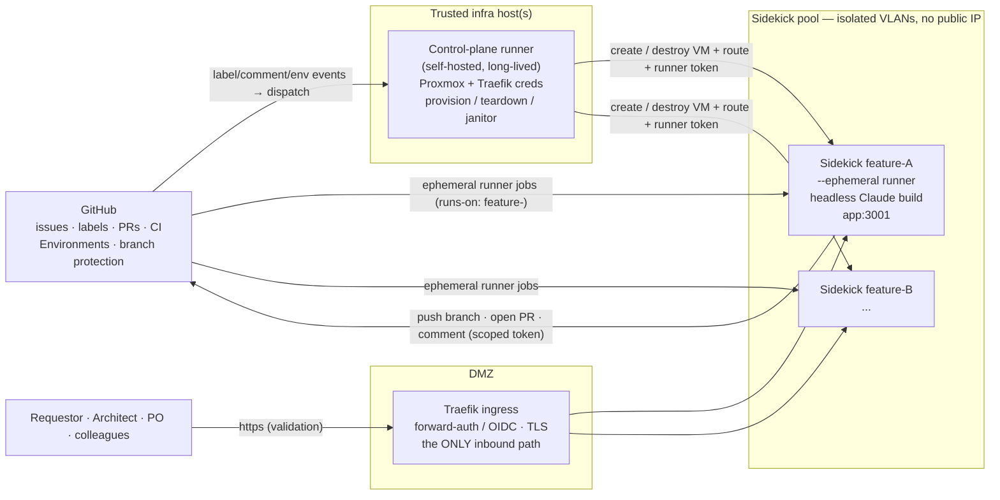
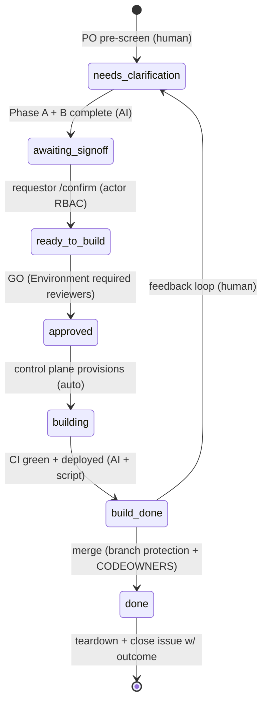

# Operationalising the Definition of Ready — automation platform

**Status: design — not yet built.** This describes the system that *runs* the [Definition of Ready](definition-of-ready.md) process at scale (multiple features, multiple people, multiple infrastructures, in parallel), and a work breakdown to build it end-to-end. No component here exists yet.

## Goals & principles

- **Scale & parallelism.** Many features in flight at once, across the team, on heterogeneous infrastructure (each colleague can host their own sidekicks).
- **GitHub is the single source of truth.** The tracking issue (labels = state, comments = trail, PR + CI = build/verify) is the database, queue, audit log, and message bus. No second datastore.
- **Gate the *actions*, not the labels.** Labels are bookkeeping; the consequential actions (start a build, merge) are gated by GitHub's *native* RBAC (Actions Environments with required reviewers; branch protection + CODEOWNERS). A mislabelled issue therefore cannot *cause* anything unsafe.
- **Least privilege by construction.** AI-generated code only ever executes on a disposable, network-isolated sidekick. The credentials that can touch the hypervisor/Traefik live only on a separate trusted control plane and never reach a sidekick.
- **Deterministic where possible.** Infra lifecycle, deploy, teardown, tests = scripts (reproducible). AI only where judgment/generation is genuinely needed (interview, probe, build, docs).
- **No new orchestration product unless it earns it.** Code-defined GitHub Actions (in-repo, reviewable, and the only place you get native RBAC gates) over a GUI tool like n8n — reach for n8n only if non-engineers will own the flows.

## Topology

## The state machine & how each transition is really enforced

| Transition | Enforcement mechanism | Type |
|---|---|---|
| → needs-clarification | PO pre-screen; bot creates the tracking issue | human |
| needs-clarification → awaiting-signoff | bot, after Phase A interview + Phase B probe complete | AI |
| awaiting-signoff → ready-to-build | `/confirm` command, actor validated == requestor/assignee | RBAC (actor) |
| ready-to-build → **approved (GO)** | **Actions Environment with required reviewers = PO/architect team** — pauses the build job until approved in the GitHub UI | **native RBAC gate** |
| approved → building | control-plane runner provisions the sidekick — can only fire *after* the environment approval | auto |
| building → build-done | build job green + deployed to the sidekick URL | AI + script |
| build-done → **merged / done** | **branch protection + CODEOWNERS required review** on the PR | **native RBAC gate** |
| build-done → needs-clarification | feedback comment re-opens the loop | human |
| any illegal label jump | **guard Action reverts it + comments** | reconciler |

The two rows in bold are the real safety gates. Everything else is convenience the guard keeps tidy — because the *actions* (build, merge) are independently gated, a wrong label can't produce an unapproved build or merge.

## Security model
- **Credential separation = the role boundary.** Control plane holds Proxmox + Traefik creds (never copied to a sidekick). A sidekick gets only a GitHub token scoped to **push branches / open PRs / comment — NOT merge, NOT move `approved`/`ready-to-build`** — plus a Claude key, injected at provision, destroyed at teardown.
- **Public-repo runner hardening (IdentityAtlas is public).** Self-hosted runners on a public repo are a documented footgun. Required mitigations: ephemeral + network-isolated sidekick; org setting "require approval for all outside collaborators' workflows"; build workflows trigger **only** from the internal label-gated flow, never from fork `pull_request` events.
- **Network isolation.** Each sidekick on its own segment: internet egress for npm/GitHub/Anthropic; **no lateral** reach to the hypervisor, control plane, or other sidekicks; **no public IP** — the only inbound path is Traefik.
- **Proxy-terminated auth.** Traefik does authN (forward-auth/OIDC or allowlist), the app behind runs auth-off. Safe **only** because the sidekick carries synthetic demo data and is unreachable except via Traefik. Real data would require defence-in-depth (auth on the resource too).

## Control-plane worker contract (for the hypervisor session to build)
- `provision(featureId, branch) → { sshTarget, publicUrl }` — clone the golden VM template, attach to an isolated VLAN, inject the scoped GitHub token + Claude key, register a Traefik route `feature-<id>.dev.<domain>`, register an `--ephemeral` GitHub runner labelled `feature-<id>`, return the SSH target + URL. **Idempotent.**
- `teardown(featureId)` — deregister the route + runner, destroy VM + disks, revoke tokens.
- **TTL janitor** — reap any sidekick older than N hours so a crashed build can't leak a VM.
- **Golden template** — Docker, git, runner agent, hardening pre-baked, so provision is fast and identical every time.

---

## Work breakdown (what to build, end-to-end)

Grouped by workstream; `[owner]` = which session/role builds it.

### A. Infra / sidekick lifecycle  `[hypervisor session]`
- **A1** Golden sidekick VM template (Docker + git + ephemeral-runner agent + hardening).
- **A2** `provision()` script (per contract above) — incl. ephemeral-runner registration with `feature-<id>` label.
- **A3** `teardown()` script.
- **A4** TTL janitor for orphaned sidekicks.
- **A5** Per-sidekick network isolation (isolated VLAN, egress-only, no lateral, no public IP).
- **A6** Traefik ingress: per-feature route, TLS, forward-auth/OIDC gate.
- **A7** Control-plane runner: long-lived self-hosted runner on a trusted host holding Proxmox + Traefik creds; runs A2–A4 on dispatch.

### B. GitHub state machine & gating  `[repo]`
- **B1** Define the label set (the states) + colours/descriptions.
- **B2** Guard Action (reconciler): allowed-edge table + precondition checks + actor-role checks; reverts illegal transitions with a comment.
- **B3** Actions **Environment** (`go`) with required reviewers = PO/architect team — gates the build job.
- **B4** Branch protection + CODEOWNERS for merge (extend what exists).
- **B5** Slash-command handler (`/confirm`, `/approve`, `/feedback`) validated against actor identity; moves labels via the bot.
- **B6** Tracking-issue bootstrap: bot creates the issue with the DoR structure (intent, scope, decisions register, ACs, form-artifact sections).

### C. Orchestration / dispatch  `[repo]`
- **C1** Dispatcher workflow(s): `on: issues.labeled` / environment-approved / issue-comment → decide next step → trigger the right job.
- **C2** AI-step jobs on the sidekick (via the ephemeral runner): Phase A interview, Phase B probe, build, test, docs — all interacting through issue comments.
- **C3** Consolidated-packet posting + reply parsing (AI posts the batched Q&A packet as a comment; parse human answers / commands).
- **C4** Build job (`runs-on: [self-hosted, feature-<id>]`): implement, run fixture-AC tests, load demo data, open PR `Closes #N`, report ACs + green run, move label to build-done.
- **C5** Budget + timeout guard on AI loops (a runaway can't burn a sidekick indefinitely).

### D. Human interface / observability  `[repo / light UI]`
- **D1** Dashboard: GitHub **Projects** board keyed on the labels (kanban across features + team). Start here — likely zero custom code.
- **D2** *(optional, later)* thin web form that renders the consolidated packet and posts answers as a comment.
- **D3** Notifications: GitHub mentions native; optional Slack bridge.

### E. Security / governance  `[repo + infra]`
- **E1** Credential separation (control-plane creds vs. sidekick scoped token).
- **E2** Public-repo runner hardening (fork-PR restriction, outside-collaborator approval, ephemeral-only).
- **E3** Audit: every transition logged by the bot as an issue comment.
- **E4** Role→team mapping: GitHub teams for requestor / architect / designer / PO, wired to Environment reviewers + CODEOWNERS.

### Suggested build order (prove, then harden, then scale)
1. **B1 + B2 + D1** — formalise labels, the guard, and the board. Prove the FSM by driving it by hand.
2. **A1–A7 + A5/A6** — the deterministic infra lifecycle + isolation + Traefik (highest reproducibility payoff, no AI risk).
3. **B3 + B4 + B5 + E1–E4** — land the *real* gates and security **before** anything runs unattended.
4. **C1–C5 + ephemeral runners** — wire dispatch + AI-on-sidekick.
5. **Pool + queue (`queued` state) + D2/D3** — scale to parallel + polish the interface.

## Open decisions (to pin before/while building)
- Sidekick **pool cap** per host / org, and the `queued`-state behaviour when full.
- AI-loop **budget / timeout** values.
- Exact **GitHub teams** for each role and their mapping to Environment reviewers + CODEOWNERS.
- Whether the guard **reverts** illegal transitions or just **flags** them for a human (start with revert).
- Domain scheme for per-feature URLs (`feature-<id>.dev.<domain>`) and the OIDC provider for Traefik forward-auth.
