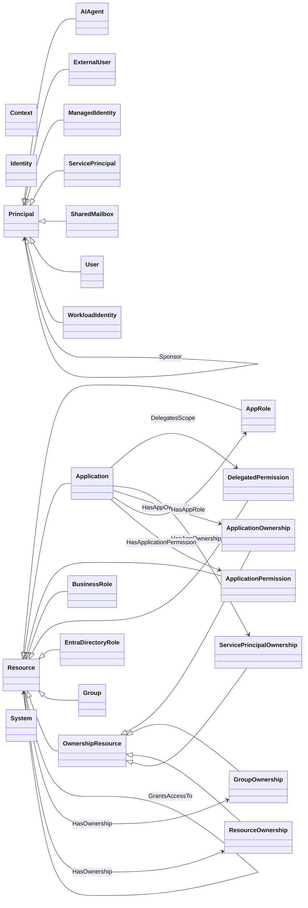

# Core Model Reference

!!! info "Generated page"
    Generated from [`ontology/core.ttl`](https://github.com/Fortigi/IdentityAtlas/blob/main/ontology/core.ttl) by `npm run ontology:generate` in `app/api`.
    Do not edit it by hand: CI fails when it differs from the ontology. How to change the model:
    [Maintaining the Core Ontology](../contributing/maintaining-the-ontology.md).

Ontology `https://identityatlas.io/ontology`, version `1.0.0`. Namespace `https://identityatlas.io/ontology#` (prefix `ia:`).
Download the Turtle file for Protégé, a triple store or any RDF/OWL tool: [core.ttl](https://raw.githubusercontent.com/Fortigi/IdentityAtlas/main/ontology/core.ttl).

A column is identified by the property of the same name: `Principals.accountEnabled` is
`ia:accountEnabled` (`https://identityatlas.io/ontology#accountEnabled`). One property serves every core table
that has a column of that name; its `rdfs:domain` lists them. Why the model looks like this, and what is not
in it: [Core Ontology](../architecture/core-ontology.md).

## Type hierarchy and relationship types

<!-- BEGIN GENERATED: ontology core-classes -->

<!-- END GENERATED: ontology core-classes -->

## Node tables

### Contexts

`ia:Context` · Node table · A grouping of one kind of entity — a department, an OU, a tag, a cluster, a logical application. Synced, generated by a plugin, or manual. contextType is an open vocabulary.

Written by the ingest API as `contexts`.

Identifier: `id` (uuid) — the instance IRI, not a property.

| Column | Property | SQL type | Values / references | Description |
|---|---|---|---|---|
| `contextType` | `ia:contextType` | text |  | What kind of grouping this is (Department, OrgUnit, Tag, Cluster, LogicalApplication, …). An open vocabulary. |
| `createdAt` | `ia:createdAt` | timestamp with time zone |  | When the context row was created. |
| `createdByUser` | `ia:createdByUser` | text |  | The analyst who created a manual context. |
| `description` | `ia:description` | text |  | Free-text description. |
| `directAssignmentCount` | `ia:directAssignmentCount` | integer |  | Stored count of Direct (resource, holder) pairs over the resources in this context. |
| `directMemberCount` | `ia:directMemberCount` | integer |  | Stored count of direct members. |
| `displayName` | `ia:displayName` | text |  | Human-readable name. On IdentityMembers a copy of the account name. |
| `eligibleAssignmentCount` | `ia:eligibleAssignmentCount` | integer |  | Stored count of Eligible (resource, holder) pairs over the resources in this context. |
| `extendedAttributes` | `ia:extendedAttributes` | jsonb |  | Source-specific attributes that have no column of their own. |
| `externalId` | `ia:externalId` | text |  | The object's id in its source system. |
| `holderCount` | `ia:holderCount` | integer |  | Stored count of distinct holders over the resources in this context. |
| `indirectAssignmentCount` | `ia:indirectAssignmentCount` | integer |  | Stored count of Indirect (resource, holder) pairs over the resources in this context. |
| `lastCalculatedAt` | `ia:lastCalculatedAt` | timestamp with time zone |  | When the stored counts were last recalculated. |
| `ownerUserId` | `ia:ownerUserId` | text |  | Whatever the source calls the owner of the grouping (free text, resolved to a principal for display). |
| `parentContextId` | `ia:parentContextId` | uuid | → Contexts | The parent context in the tree. Ingest alias: `parentExternalId`. |
| `resourceCount` | `ia:resourceCount` | integer |  | Stored count of resources in this context. |
| `scopeSystemId` | `ia:scopeSystemId` | integer | → Systems | The system a synced or generated context is scoped to. |
| `sourceAlgorithmId` | `ia:sourceAlgorithmId` | uuid |  | The context-algorithm (ContextAlgorithms.id) that generated the context. ContextAlgorithms is outside the core model. |
| `sourceInstanceKey` | `ia:sourceInstanceKey` | text |  | Distinguishes several trees generated by one plugin on one system. |
| `sourceRunId` | `ia:sourceRunId` | uuid |  | The plugin run that generated the context. |
| `targetType` | `ia:targetType` | text | `Identity`, `Resource`, `Principal`, `System` | Which kind of node the context groups. |
| `totalMemberCount` | `ia:totalMemberCount` | integer |  | Stored count of members including sub-contexts. |
| `updatedAt` | `ia:updatedAt` | timestamp with time zone |  | When the row was last written by the ingest (full-sync reconcile cutoff). |
| `userRenamed` | `ia:userRenamed` | boolean |  | An analyst renamed this generated context; re-runs keep the name. |
| `userReparented` | `ia:userReparented` | boolean |  | An analyst moved this generated context; re-runs keep the placement. |
| `variant` | `ia:variant` | text | `synced`, `generated`, `manual` | How the context came to exist. |

### Identities

`ia:Identity` · Node table · A real person, aggregated from one or more accounts (principals) through IdentityMembers.

Written by the ingest API as `identities`.

Identifier: `id` (uuid) — the instance IRI, not a property.

| Column | Property | SQL type | Values / references | Description |
|---|---|---|---|---|
| `accountCount` | `ia:accountCount` | integer |  | Number of accounts linked to this person. |
| `accountTypes` | `ia:accountTypes` | jsonb |  | The account categories this person holds. |
| `analystNotes` | `ia:analystNotes` | text |  | Free-text analyst notes on the person. |
| `analystVerified` | `ia:analystVerified` | boolean |  | An analyst has verified this person. |
| `city` | `ia:city` | text |  | The person's city. |
| `companyName` | `ia:companyName` | text |  | Company name. |
| `country` | `ia:country` | text |  | The person's country. |
| `department` | `ia:department` | text |  | Department name as a plain attribute (organisational placement itself is a Context). |
| `displayName` | `ia:displayName` | text |  | Human-readable name. On IdentityMembers a copy of the account name. |
| `email` | `ia:email` | text |  | E-mail address. |
| `employeeId` | `ia:employeeId` | text |  | Employee number. |
| `extendedAttributes` | `ia:extendedAttributes` | jsonb |  | Source-specific attributes that have no column of their own. |
| `givenName` | `ia:givenName` | text |  | Given name. |
| `hrAccountId` | `ia:hrAccountId` | text |  | The HR record id the person is anchored on. |
| `isHrAnchored` | `ia:isHrAnchored` | boolean |  | The person is anchored on an HR record. |
| `jobTitle` | `ia:jobTitle` | text |  | Job title. |
| `linkConfidence` | `ia:linkConfidence` | integer |  | Account Linking confidence score; NULL for crawler-sourced links. |
| `linkSignals` | `ia:linkSignals` | jsonb |  | The signals Account Linking matched on. |
| `linkedAt` | `ia:linkedAt` | timestamp with time zone |  | When Account Linking last linked the person. |
| `managerIdentityId` | `ia:managerIdentityId` | uuid | → Identities | The manager as a PERSON. Ingest alias: `managerIdentityExternalId`. |
| `officeLocation` | `ia:officeLocation` | text |  | The person's office. |
| `orphanStatus` | `ia:orphanStatus` | text |  | **Retired.** Orphan-ness is the generated Orphaned Accounts context now; the column is kept in the schema for compatibility. |
| `primaryPrincipalId` | `ia:primaryPrincipalId` | uuid | → Principals | The person's primary account. |
| `surname` | `ia:surname` | text |  | Surname. |

### Principals

`ia:Principal` · Node table · An account in a source system: a user, service principal, managed identity, AI agent, guest, shared mailbox …

Written by the ingest API as `principals`.

Identifier: `id` (uuid) — the instance IRI, not a property.

`principalType` accepts exactly these values:

| Value | Class | Meaning |
|---|---|---|
| `AIAgent` | `ia:AIAgent` | An AI agent (Copilot Studio, Azure OpenAI, a custom bot) that holds access as its own account. |
| `ExternalUser` | `ia:ExternalUser` | A guest / B2B account from another organisation. |
| `ManagedIdentity` | `ia:ManagedIdentity` | A system- or user-assigned identity attached to a cloud resource. |
| `ServicePrincipal` | `ia:ServicePrincipal` | The service principal of an application registration. |
| `SharedMailbox` | `ia:SharedMailbox` | A shared, room or equipment mailbox account. |
| `User` | `ia:User` | An interactive human user account. |
| `WorkloadIdentity` | `ia:WorkloadIdentity` | A federated-credential identity used by a workload (a pipeline, a Kubernetes service account). |

| Column | Property | SQL type | Values / references | Description |
|---|---|---|---|---|
| `accountEnabled` | `ia:accountEnabled` | boolean |  | Whether the account can sign in. On IdentityMembers a copy taken when the link was made. |
| `companyName` | `ia:companyName` | text |  | Company name. |
| `createdDateTime` | `ia:createdDateTime` | timestamp with time zone |  | When the object was created in the source (PrincipalRelationships: when the row was created). |
| `deletedAt` | `ia:deletedAt` | timestamp with time zone |  | Soft-delete tombstone: set when the source stopped reporting the row; NULL while live. |
| `department` | `ia:department` | text |  | Department name as a plain attribute (organisational placement itself is a Context). |
| `displayName` | `ia:displayName` | text |  | Human-readable name. On IdentityMembers a copy of the account name. |
| `email` | `ia:email` | text |  | E-mail address. |
| `employeeId` | `ia:employeeId` | text |  | Employee number. |
| `extendedAttributes` | `ia:extendedAttributes` | jsonb |  | Source-specific attributes that have no column of their own. |
| `externalId` | `ia:externalId` | text |  | The object's id in its source system. |
| `givenName` | `ia:givenName` | text |  | Given name. |
| `jobTitle` | `ia:jobTitle` | text |  | Job title. |
| `managerId` | `ia:managerId` | uuid | → Principals | The manager's ACCOUNT. Ingest alias: `managerExternalId`. |
| `photo` | `ia:photo` | bytea |  | Profile photo (sent base64 to the ingest). |
| `photoContentType` | `ia:photoContentType` | text |  | MIME type of the photo. |
| `photoFetchedAt` | `ia:photoFetchedAt` | timestamp with time zone |  | When the photo was last fetched; set with a NULL photo means "has none". |
| `principalType` | `ia:principalType` | text | `User`, `ServicePrincipal`, `ManagedIdentity`, `WorkloadIdentity`, `AIAgent`, `ExternalUser`, `SharedMailbox` | The kind of account. On Principals it selects the subclass; on ResourceAssignments it is a denormalised copy of the holder's type. |
| `riskScore` | `ia:riskScore` | integer |  | Latest risk score, denormalised from RiskScores. |
| `riskTier` | `ia:riskTier` | text |  | Latest risk tier, denormalised from RiskScores. |
| `surname` | `ia:surname` | text |  | Surname. |
| `systemId` | `ia:systemId` | integer | → Systems | The system that sourced the row. |
| `updatedAt` | `ia:updatedAt` | timestamp with time zone |  | When the row was last written by the ingest (full-sync reconcile cutoff). |

### Resources

`ia:Resource` · Node table · Anything that grants access — a group, a directory role, an app role, a permission — and also a business role (governance construct).

Written by the ingest API as `resources`.

Identifier: `id` (uuid) — the instance IRI, not a property.

`resourceType` is an open vocabulary — any value is accepted. These are the values Identity Atlas itself relies on:

| Value | Class | Meaning |
|---|---|---|
| `AppRole` | `ia:AppRole` | One app role of an application (one resource per application + appRoleId). |
| `Application` | `ia:Application` | An enterprise application (service principal) as a resource. Grants nothing by itself; parent of its app roles and permissions. |
| `ApplicationOwnership` | `ia:ApplicationOwnership` | (ia:OwnershipResource) The owners of an app registration — they can add a credential and act as the app. |
| `ApplicationPermission` | `ia:ApplicationPermission` | One app-only (admin-consented) permission a service principal holds on another API. |
| `BusinessRole` | `ia:BusinessRole` | A governance construct (Entra access package, Omada / midPoint business role). Contains the resources it grants; hidden from the matrix by default. |
| `DelegatedPermission` | `ia:DelegatedPermission` | One OAuth2 delegated scope granted to a client application on an API (one resource per client, API and scope). |
| `EntraDirectoryRole` | `ia:EntraDirectoryRole` | One Entra directory role (id = roleDefinitionId); extendedAttributes holds its allowedResourceActions. |
| `Group` | `ia:Group` | A security or Microsoft 365 group. The effective-access engine expands membership through it. |
| `GroupOwnership` | `ia:GroupOwnership` | (ia:OwnershipResource) The owners of an Entra group. |
| `ResourceOwnership` | `ia:ResourceOwnership` | (ia:OwnershipResource) The owners of a resource loaded by the SQL connector; the owned resource's own type is in extendedAttributes.ownedResourceType. |
| `ServicePrincipalOwnership` | `ia:ServicePrincipalOwnership` | (ia:OwnershipResource) The owners of an enterprise application's service principal. |

| Column | Property | SQL type | Values / references | Description |
|---|---|---|---|---|
| `capabilityId` | `ia:capabilityId` | text |  | Generated from extendedAttributes.capabilityId for the effective-access engine. |
| `catalogId` | `ia:catalogId` | uuid |  | The governance catalog (GovernanceCatalogs.id) a business role belongs to. GovernanceCatalogs is outside the core model. |
| `createdDateTime` | `ia:createdDateTime` | timestamp with time zone |  | When the object was created in the source (PrincipalRelationships: when the row was created). |
| `deletedAt` | `ia:deletedAt` | timestamp with time zone |  | Soft-delete tombstone: set when the source stopped reporting the row; NULL while live. |
| `description` | `ia:description` | text |  | Free-text description. |
| `displayName` | `ia:displayName` | text |  | Human-readable name. On IdentityMembers a copy of the account name. |
| `enabled` | `ia:enabled` | boolean |  | Whether the system or resource is enabled. |
| `extendedAttributes` | `ia:extendedAttributes` | jsonb |  | Source-specific attributes that have no column of their own. |
| `externalId` | `ia:externalId` | text |  | The object's id in its source system. |
| `governanceResource` | `ia:governanceResource` | boolean |  | The resource is a governance construct that governs other access (business roles). |
| `isHidden` | `ia:isHidden` | boolean |  | Hidden from the default views. |
| `mail` | `ia:mail` | text |  | Mail address of a mail-enabled resource. |
| `modifiedDateTime` | `ia:modifiedDateTime` | timestamp with time zone |  | When the object was last modified in the source (PrincipalRelationships: when the row was last modified). |
| `resourceType` | `ia:resourceType` | text | open vocabulary | The kind of resource (open vocabulary). On Resources it selects the subclass; on ResourceAssignments it is a denormalised copy used to partition reconciles. |
| `riskScore` | `ia:riskScore` | integer |  | Latest risk score, denormalised from RiskScores. |
| `riskTier` | `ia:riskTier` | text |  | Latest risk tier, denormalised from RiskScores. |
| `systemId` | `ia:systemId` | integer | → Systems | The system that sourced the row. |
| `targetNodeId` | `ia:targetNodeId` | text |  | Generated from extendedAttributes.targetNodeId: the node a capability resource applies to. |
| `updatedAt` | `ia:updatedAt` | timestamp with time zone |  | When the row was last written by the ingest (full-sync reconcile cutoff). |
| `visibility` | `ia:visibility` | text |  | Visibility as the source reports it (Public / Private for groups). |

### Systems

`ia:System` · Node table · A connected authorization source (Entra ID, Omada, a SQL database, a CSV feed …). Principals, resources and synced contexts belong to one system.

Written by the ingest API as `systems`.

Identifier: `id` (integer) — the instance IRI, not a property.

| Column | Property | SQL type | Values / references | Description |
|---|---|---|---|---|
| `assignmentTypes` | `ia:assignmentTypes` | jsonb |  | **Unused.** Meant to list the assignment types a system emits. Nothing reads or writes it. |
| `description` | `ia:description` | text |  | Free-text description. |
| `directorySystemId` | `ia:directorySystemId` | integer | → Systems | The directory system whose principals this system references but does not own (Azure RM -> Entra ID). |
| `displayName` | `ia:displayName` | text |  | Human-readable name. On IdentityMembers a copy of the account name. |
| `enabled` | `ia:enabled` | boolean |  | Whether the system or resource is enabled. |
| `extendedAttributes` | `ia:extendedAttributes` | jsonb |  | Source-specific attributes that have no column of their own. |
| `lastSyncDateTime` | `ia:lastSyncDateTime` | timestamp with time zone |  | When the system was last synced. |
| `resourceTypes` | `ia:resourceTypes` | jsonb |  | **Unused.** Meant to list the resource types a system emits. Nothing reads or writes it. |
| `syncEnabled` | `ia:syncEnabled` | boolean |  | Whether the system is synced. |
| `systemType` | `ia:systemType` | text |  | The connector kind (EntraID, Omada, CSV, …). Together with tenantId the system key. |
| `tenantId` | `ia:tenantId` | text |  | The tenant / instance the system connects to. |

## Edge tables

### ContextMembers

`ia:ContextMember` · Edge table · Membership of an identity, principal, resource or system in a context. memberType says which table memberId points at.

Written by the ingest API as `context-members`.

Edge: `contextId` → `memberId`.

| Column | Property | SQL type | Values / references | Description |
|---|---|---|---|---|
| `addedAt` | `ia:addedAt` | timestamp with time zone |  | When the member was added. |
| `addedBy` | `ia:addedBy` | text | `sync`, `algorithm`, `analyst` | Who added the member. |
| `contextId` | `ia:contextId` | uuid | → Contexts | The context. Ingest alias: `contextExternalId`. |
| `memberId` | `ia:memberId` | uuid | → Identities / Resources / Principals / Systems | The member; memberType names its table. Ingest alias: `memberExternalId`. |
| `memberType` | `ia:memberType` | text | `Identity`, `Resource`, `Principal`, `System` | Which kind of node memberId is. |

### IdentityMembers

`ia:IdentityMember` · Edge table · Links a person (identity) to one of their accounts (principal), from a crawler or from Account Linking.

Written by the ingest API as `identity-members`.

Edge: `identityId` → `principalId`.

| Column | Property | SQL type | Values / references | Description |
|---|---|---|---|---|
| `accountEnabled` | `ia:accountEnabled` | boolean |  | Whether the account can sign in. On IdentityMembers a copy taken when the link was made. |
| `accountType` | `ia:accountType` | text |  | Account category detected by Account Linking (Admin, Guest, Service, Shared, Secondary, …). |
| `accountTypePattern` | `ia:accountTypePattern` | text |  | The naming pattern that classified accountType. |
| `analystOverride` | `ia:analystOverride` | text |  | An analyst's verdict on a link (confirmed / rejected / moved); Account Linking honours it on every run. |
| `displayName` | `ia:displayName` | text |  | Human-readable name. On IdentityMembers a copy of the account name. |
| `hrIndicators` | `ia:hrIndicators` | jsonb |  | Signals that made this account look HR-authoritative. |
| `hrScore` | `ia:hrScore` | integer |  | How strongly this account looks like the HR record. |
| `identityId` | `ia:identityId` | uuid | → Identities | The person. On ResourceAssignments set instead of principalId for person-level assignments. Ingest alias: `identityExternalId`. |
| `isHrAuthoritative` | `ia:isHrAuthoritative` | boolean |  | This account is the HR-authoritative one. |
| `isPrimary` | `ia:isPrimary` | boolean |  | This is the person's primary account. |
| `linkConfidence` | `ia:linkConfidence` | integer |  | Account Linking confidence score; NULL for crawler-sourced links. |
| `linkSignals` | `ia:linkSignals` | jsonb |  | The signals Account Linking matched on. |
| `principalId` | `ia:principalId` | uuid | → Principals | The account. On ResourceAssignments NULL when identityId is set; on PrincipalRelationships the subject that HAS the owner / sponsor. Ingest alias: `principalExternalId`, `userExternalId`. |

### PrincipalRelationships

`ia:PrincipalRelationship` · Edge table · A responsibility link between two accounts: relatedPrincipalId is the Owner / Sponsor OF principalId.

Written by the ingest API as `principal-relationships`.

Edge: `principalId` → `relatedPrincipalId`.

`relationshipType` accepts exactly these relationship types:

| Value | Property | From → to | Meaning |
|---|---|---|---|
| `Owner` | `ia:owner` | ia:Principal → ia:Principal | The object is an owner of the subject (typically of an AI agent or service principal). |
| `Sponsor` | `ia:sponsor` | ia:Principal → ia:Principal | The object is a sponsor of the subject (typically of a guest account). |

| Column | Property | SQL type | Values / references | Description |
|---|---|---|---|---|
| `createdDateTime` | `ia:createdDateTime` | timestamp with time zone |  | When the object was created in the source (PrincipalRelationships: when the row was created). |
| `extendedAttributes` | `ia:extendedAttributes` | jsonb |  | Source-specific attributes that have no column of their own. |
| `externalId` | `ia:externalId` | text |  | The object's id in its source system. |
| `modifiedDateTime` | `ia:modifiedDateTime` | timestamp with time zone |  | When the object was last modified in the source (PrincipalRelationships: when the row was last modified). |
| `principalId` | `ia:principalId` | uuid | → Principals | The account. On ResourceAssignments NULL when identityId is set; on PrincipalRelationships the subject that HAS the owner / sponsor. Ingest alias: `principalExternalId`, `userExternalId`. |
| `relatedPrincipalId` | `ia:relatedPrincipalId` | uuid | → Principals | The owner / sponsor. Ingest alias: `relatedPrincipalExternalId`. |
| `relationshipType` | `ia:relationshipType` | text | `Owner`, `Sponsor` | The relationship type: one of the ia:typeValue of the properties stored in this edge table. |
| `systemId` | `ia:systemId` | integer | → Systems | The system that sourced the row. |
| `updatedAt` | `ia:updatedAt` | timestamp with time zone |  | When the row was last written by the ingest (full-sync reconcile cutoff). |

### ResourceAssignments

`ia:ResourceAssignment` · Edge table · Who holds what: one account (principalId) or one person (identityId) — exactly one of the two — holds one resource, Direct / Indirect / Eligible, optionally governed.

Written by the ingest API as `resource-assignments`, `resource-assignments-identity`.

Edge: `principalId` or `identityId` → `resourceId`.

| Column | Property | SQL type | Values / references | Description |
|---|---|---|---|---|
| `assignmentStatus` | `ia:assignmentStatus` | text |  | The source system's own status word for the assignment. |
| `assignmentType` | `ia:assignmentType` | text | `Direct`, `Indirect`, `Eligible` | How the access is held. |
| `complianceState` | `ia:complianceState` | text |  | The source system's compliance verdict for the assignment. |
| `deletedAt` | `ia:deletedAt` | timestamp with time zone |  | Soft-delete tombstone: set when the source stopped reporting the row; NULL while live. |
| `effect` | `ia:effect` | text | `allow`, `deny`, `eligible`, `notset` | What the assignment does to effective access. |
| `expirationDateTime` | `ia:expirationDateTime` | timestamp with time zone |  | When the assignment expires. |
| `extendedAttributes` | `ia:extendedAttributes` | jsonb |  | Source-specific attributes that have no column of their own. |
| `governed` | `ia:governed` | boolean |  | The row is governance intent (a business-role / access-package assignment) rather than observed access. Part of the key. |
| `identityId` | `ia:identityId` | uuid | → Identities | The person. On ResourceAssignments set instead of principalId for person-level assignments. Ingest alias: `identityExternalId`. |
| `origin` | `ia:origin` | text | `Automatic`, `Requested`, `Discovered` | Where the assignment came from, as the source records it. Optional. |
| `originDetail` | `ia:originDetail` | text |  | The source's own word for the origin. |
| `policyId` | `ia:policyId` | uuid |  | The assignment policy (AssignmentPolicies.id) behind a governed assignment. AssignmentPolicies is outside the core model. |
| `principalId` | `ia:principalId` | uuid | → Principals | The account. On ResourceAssignments NULL when identityId is set; on PrincipalRelationships the subject that HAS the owner / sponsor. Ingest alias: `principalExternalId`, `userExternalId`. |
| `principalType` | `ia:principalType` | text |  | The kind of account. On Principals it selects the subclass; on ResourceAssignments it is a denormalised copy of the holder's type. |
| `propagationScope` | `ia:propagationScope` | text | `self`, `descendants`, `selfAndDescendants` | Where along a containment hierarchy the assignment applies. |
| `resourceId` | `ia:resourceId` | uuid | → Resources | The resource that is held. Ingest alias: `resourceExternalId`. |
| `resourceType` | `ia:resourceType` | text |  | The kind of resource (open vocabulary). On Resources it selects the subclass; on ResourceAssignments it is a denormalised copy used to partition reconciles. |
| `state` | `ia:state` | text |  | The source system's state word for the assignment (for example Delivered). |
| `systemId` | `ia:systemId` | integer | → Systems | The system that sourced the row. |
| `updatedAt` | `ia:updatedAt` | timestamp with time zone |  | When the row was last written by the ingest (full-sync reconcile cutoff). |

### ResourceRelationships

`ia:ResourceRelationship` · Edge table · A typed link from a parent resource to a child resource.

Written by the ingest API as `resource-relationships`.

Edge: `parentResourceId` → `childResourceId`.

`relationshipType` accepts exactly these relationship types:

| Value | Property | From → to | Meaning |
|---|---|---|---|
| `Contains` | `ia:contains` | ia:Resource → ia:Resource | The child is part of the parent: a business role's granted resources, a scope inside a scope. Holding the parent reaches the child. |
| `DelegatesScope` | `ia:delegatesScope` | ia:Application → ia:DelegatedPermission | A client application and a delegated permission it was granted. |
| `GrantsAccessTo` | `ia:grantsAccessTo` | ia:Resource → ia:Resource | Holding the parent implies access to the child. Emitted by the CSV and SQL connectors and the demo dataset; no built-in crawler uses it. |
| `HasAppOwnership` | `ia:hasAppOwnership` | ia:Application → ia:ServicePrincipalOwnership / ia:ApplicationOwnership | Same meaning as hasOwnership, for applications. A separate value only so the group-owner full sync cannot reconcile app-owner links away. |
| `HasAppRole` | `ia:hasAppRole` | ia:Application → ia:AppRole | An application and one of its app roles. |
| `HasApplicationPermission` | `ia:hasApplicationPermission` | ia:Application → ia:ApplicationPermission | A client application and an app-only permission it holds. |
| `HasOwnership` | `ia:hasOwnership` | ia:Resource → ia:GroupOwnership / ia:ResourceOwnership | An owned resource and the ownership resource whose holders are its owners (Entra groups, SQL-connector resources). |

| Column | Property | SQL type | Values / references | Description |
|---|---|---|---|---|
| `childResourceId` | `ia:childResourceId` | uuid | → Resources | The child (target) resource. Ingest alias: `childExternalId`. |
| `extendedAttributes` | `ia:extendedAttributes` | jsonb |  | Source-specific attributes that have no column of their own. |
| `parentResourceId` | `ia:parentResourceId` | uuid | → Resources | The parent (source) resource. Ingest alias: `parentExternalId`. |
| `relationshipType` | `ia:relationshipType` | text | `Contains`, `GrantsAccessTo`, `HasAppRole`, `DelegatesScope`, `HasApplicationPermission`, `HasOwnership`, `HasAppOwnership` | The relationship type: one of the ia:typeValue of the properties stored in this edge table. |
| `roleName` | `ia:roleName` | text |  | The role the child plays inside the parent (for example the access-package resource role). |
| `roleOriginSystem` | `ia:roleOriginSystem` | text |  | Where that role is defined. |
| `systemId` | `ia:systemId` | integer | → Systems | The system that sourced the row. |
| `updatedAt` | `ia:updatedAt` | timestamp with time zone |  | When the row was last written by the ingest (full-sync reconcile cutoff). |

## Value lists

### Assignment effect

`ia:AssignmentEffect` — What an assignment does to effective access (read by the effective-access engine). Used by `ResourceAssignments.effect`.

| Value | Individual | Meaning |
|---|---|---|
| `allow` | `ia:AssignmentEffect_allow` | A concrete grant. |
| `deny` | `ia:AssignmentEffect_deny` | An explicit deny. |
| `eligible` | `ia:AssignmentEffect_eligible` | Potential access only; excluded from effective answers. |
| `notset` | `ia:AssignmentEffect_notset` | Neither grants nor denies. |

### Assignment origin

`ia:AssignmentOrigin` — Where an assignment came from, as the source records it. Optional. Used by `ResourceAssignments.origin`.

| Value | Individual | Meaning |
|---|---|---|
| `Automatic` | `ia:AssignmentOrigin_Automatic` | Assigned by a rule or birthright policy. |
| `Requested` | `ia:AssignmentOrigin_Requested` | Assigned through an access request. |
| `Discovered` | `ia:AssignmentOrigin_Discovered` | Found on the target system without a recorded reason. |

### Assignment type

`ia:AssignmentType` — How an assignment is held. Only these three values exist; ownership, governance and source detail are modelled elsewhere. Used by `ResourceAssignments.assignmentType`.

| Value | Individual | Meaning |
|---|---|---|
| `Direct` | `ia:AssignmentType_Direct` | Held directly: a membership, a directly assigned app role, an OAuth2 grant, an ownership. |
| `Indirect` | `ia:AssignmentType_Indirect` | Inherited through another resource (an app role held via a group, a nested group). Stored, not inferred. |
| `Eligible` | `ia:AssignmentType_Eligible` | Granted but not active (PIM-eligible): can be activated. |

### Context variant

`ia:ContextVariant` — How a context came to exist. Used by `Contexts.variant`.

| Value | Individual | Meaning |
|---|---|---|
| `synced` | `ia:ContextVariant_synced` | Ingested from a source system. |
| `generated` | `ia:ContextVariant_generated` | Emitted by a context-algorithm plugin. |
| `manual` | `ia:ContextVariant_manual` | Curated by an analyst (tags included). |

### Entity kind

`ia:EntityKind` — The kind of node a context groups (targetType) or a context member is (memberType). Used by `ContextMembers.memberType`, `Contexts.targetType`.

| Value | Individual | Meaning |
|---|---|---|
| `Identity` | `ia:EntityKind_Identity` | Members are identities. |
| `Resource` | `ia:EntityKind_Resource` | Members are resources. |
| `Principal` | `ia:EntityKind_Principal` | Members are principals. |
| `System` | `ia:EntityKind_System` | Members are systems. Note: memberId is a uuid and Systems.id an integer, so a System member row cannot reference a system by id. |

### Membership source

`ia:MembershipSource` — Who put a member into a context. Used by `ContextMembers.addedBy`.

| Value | Individual | Meaning |
|---|---|---|
| `sync` | `ia:MembershipSource_sync` | A crawler. |
| `algorithm` | `ia:MembershipSource_algorithm` | A context-algorithm plugin. |
| `analyst` | `ia:MembershipSource_analyst` | An analyst, by hand. |

### Propagation scope

`ia:PropagationScope` — Where along a containment hierarchy an assignment applies. Used by `ResourceAssignments.propagationScope`.

| Value | Individual | Meaning |
|---|---|---|
| `self` | `ia:PropagationScope_self` | Only at the assigned resource. |
| `descendants` | `ia:PropagationScope_descendants` | Only below the assigned resource. |
| `selfAndDescendants` | `ia:PropagationScope_selfAndDescendants` | At the assigned resource and everything below it (the default). |
