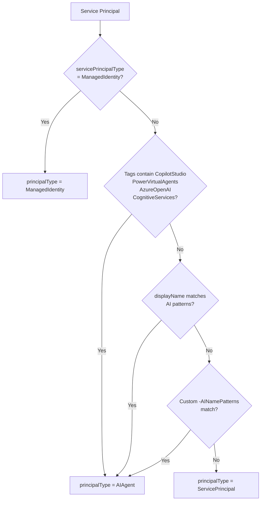

# AI Agent Identities

## The Challenge

AI agent identities appear automatically as organizations adopt Azure OpenAI, Copilot Studio, Logic Apps with AI calls, and custom agent frameworks. These non-human identities accumulate permissions automatically — often without explicit governance review.

Identity Atlas treats AI agent identities as first-class citizens: syncing them into the Principals table with dedicated `principalType` values, tracking their invocation activity, and scoring them with agent-specific risk signals.

## How AI Agents Are Detected

`Sync-FGServicePrincipal` auto-classifies each service principal:



```powershell
# Sync all service principals (auto-classified)
Sync-FGServicePrincipal

# Skip the thousands of built-in Microsoft first-party SPs
Sync-FGServicePrincipal -ExcludeFirstPartyMicrosoft

# Add custom AI detection patterns for your org
Sync-FGServicePrincipal -AINamePatterns @('(?i)contoso.*agent', '(?i)mycompany.*copilot')
```

## principalType Values for Non-Human Identities

| principalType | Covers | Example |
|---|---|---|
| `ManagedIdentity` | Azure resource-attached (system or user-assigned) | Azure OpenAI resource, Logic App, Function App |
| `AIAgent` | AI agents detected by tags or name patterns | Copilot Studio agents, custom GPT wrappers, Azure AI Hub |
| `WorkloadIdentity` | Federated credential identities | GitHub Actions pipeline, AKS workload |
| `ServicePrincipal` | Other app registration SPs | Enterprise applications, integrations |

## Activity Tracking for Agents

AI agents don't "sign in" — they invoke tools and access resources. Import invocation data from Azure Monitor, APIM, or Copilot Studio analytics:

```powershell
Sync-FGCSVAgentActivity -FilePath ".\exports\copilot-invocations.csv"
```

CSV format (semicolon-delimited):

```
principalId;resourceId;lastActivityDateTime;activityCount;activityType;extendedAttributes
<agent-guid>;<resource-guid>;2026-03-15T14:00:00Z;142;Invocation;{"modelVersion":"gpt-4o","orchestratorType":"Copilot Studio"}
```

Supported `activityType` values: `Invocation`, `ToolCall`, `DataAccess`, `ExternalCall`

## Risk Scoring for Agents

Non-human principals are scored differently from human users:

| Signal | Score | Applies To |
|---|---|---|
| No human in the loop | +8 | All non-human principals |
| AI agent (autonomous, no MFA) | +5 | AIAgent |
| Managed identity (persists for resource lifetime) | +3 | ManagedIdentity |
| Active production workload (uses resources actively) | +5 bonus | All non-human |
| Ghost app role (zero active sign-ins for this resource) | +5 | EntraAppRole resources |

Agent classifiers (generated by `New-FGRiskClassifiers`) detect patterns like:

- Agents with mail/inbox access
- Agents attached to internet-facing or external-calling services
- Managed identities with application-level permissions

!!! info "No stale sign-in penalty for non-human principals"
    The stale sign-in and never-signed-in checks that apply to human users are replaced with production workload detection for non-human principals.

## Querying AI Agent Risk

```sql
SELECT p.displayName, p.principalType, rs.riskScore, rs.riskTier
FROM Principals p
JOIN RiskScores rs ON rs.entityId = p.id AND rs.entityType = 'Principal'
WHERE p.principalType IN ('AIAgent', 'ManagedIdentity', 'ServicePrincipal', 'WorkloadIdentity')
  AND p.ValidTo = '9999-12-31 23:59:59.9999999'
ORDER BY rs.riskScore DESC;
```
