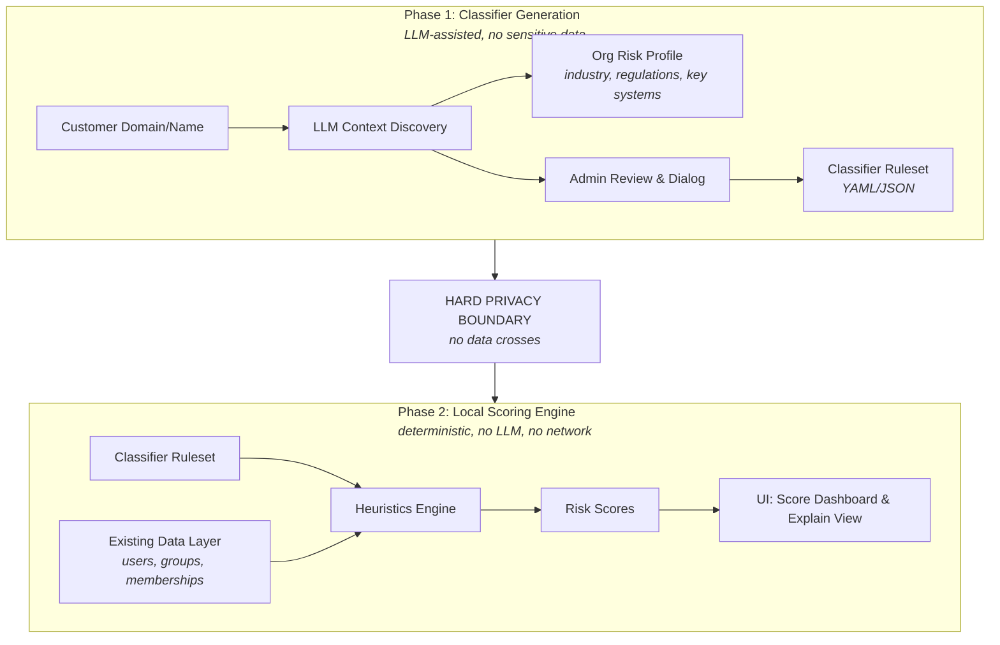
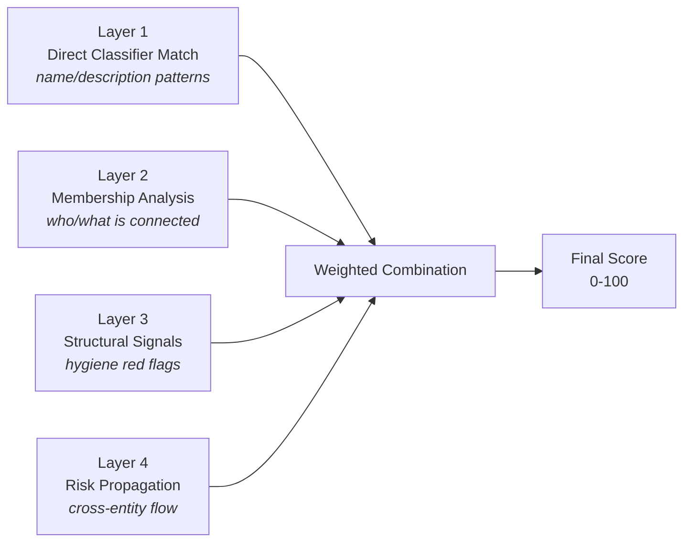
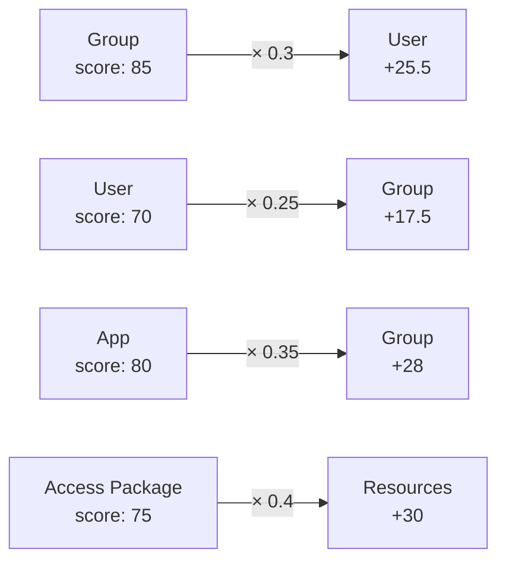
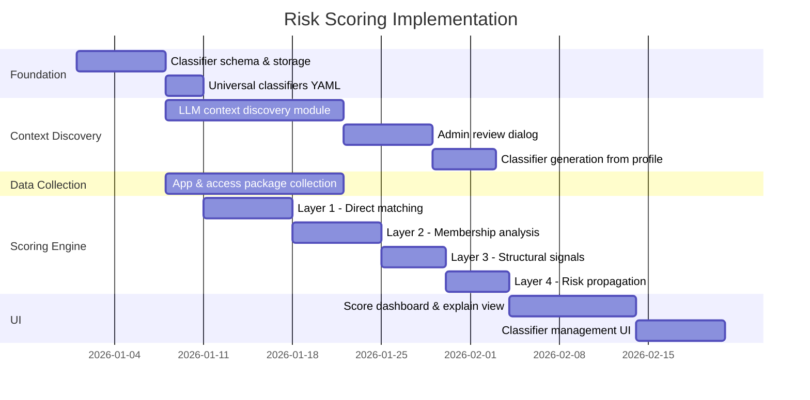

# Risk Scoring Engine — Design

This document describes the design and architecture of the identity risk scoring engine. For usage instructions, see [Overview](overview.md). For classifier details, see [Classifiers](classifiers.md).

---

## Design Principles

1. **No sensitive data leaves the environment.** The LLM only helps generate detection rules (classifiers). It never sees actual group names, user names, or membership data.
2. **Organizational context drives classification.** A bank needs different classifiers than a port authority or a hospital.
3. **Heuristic engine, not LLM inference.** The actual scoring runs locally as a deterministic weighted rule engine — fast, auditable, explainable, and privacy-safe.
4. **Transparent and tunable.** Every score must be explainable: "this group scored 87 because it matched classifier X (60pts) + contains a Global Admin (20pts) + is assigned to a high-risk app (7pts)."

### Scale Context

Typical large environment: ~5,000 users, ~10,000 groups, ~350,000 direct and indirect assignments. The heuristics engine handles this efficiently in-memory without external API calls.

---

## Architecture Overview



---

## Phase 1: Organizational Context & Classifier Generation

### Step 1.1 — Customer Context Discovery

**Input:** Customer domain name or organization name (e.g., "portofrotterdam.com")

**Process:** Use LLM with web search to research the organization and build an organizational risk profile.

**Research targets:**

- What does the organization do? (industry, sector, sub-sector)
- What regulations apply? (NIS2, DORA, SOX, HIPAA, Wbni, DNB supervision, etc.)
- What are their critical business processes?
- What key systems/platforms are publicly known?
- What is their organizational structure?
- What security frameworks do they likely follow?
- What are typical critical roles/titles in this industry?

**Output:** An organizational risk profile:

```yaml
customer_profile:
  name: "Havenbedrijf Rotterdam N.V."
  domain: "portofrotterdam.com"
  industry: "critical-infrastructure"
  sub_industry: "port-authority"
  country: "NL"

  regulations:
    - id: "nis2"
      name: "NIS2 Directive"
      relevance: "Essential entity - port operator"
    - id: "wbni"
      name: "Wet Beveiliging Netwerk- en Informatiesystemen"
      relevance: "Critical infrastructure designation"

  critical_business_processes:
    - "Vessel traffic management and port safety"
    - "Terminal operations and logistics coordination"
    - "Customs and border security integration"

  known_systems:
    - name: "HaMIS"
      type: "Harbor Master Information System"
      criticality: "critical"

  critical_roles:
    - title_patterns: ["havenmester", "harbor.?master"]
      rationale: "Legally responsible for port safety"

  risk_domains:
    - domain: "safety"
      weight: 1.0
    - domain: "security"
      weight: 0.95
    - domain: "operational"
      weight: 0.8
```

### Step 1.2 — Admin Review Dialog

After context discovery, the admin can:

- Confirm or correct industry classification and regulatory landscape
- Add missing systems that aren't publicly known
- Add critical roles/titles specific to this organization
- Adjust risk domain weights
- Have a dialog with the LLM to refine

### Step 1.3 — Classifier Generation

Based on the finalized profile, generate classifiers combining:

1. **Universal classifiers** (ship with the tool as defaults — always applicable)
2. **Industry classifiers** (generated based on industry/sub-industry)
3. **Organization-specific classifiers** (generated from the customer research)
4. **Admin-added custom classifiers**

---

## Classifier Schema

```yaml
version: "1.0"
customer: "portofrotterdam.com"

universal_classifiers:
  groups:
    - id: "univ-domain-admins"
      category: "privilege-tier0"
      name_patterns: ["domain.?admin", "domein.?beheer", "DA[-_\\s]", "tier.?0"]
      description_patterns: ["domain.?admin", "full.?control.?directory"]
      base_score: 95
      rationale: "Direct domain administration — Tier 0 asset"

  users:
    - id: "univ-c-suite"
      category: "high-value-target"
      title_patterns: ["CEO", "CFO", "CTO", "CISO", "directeur", "bestuurder"]
      base_score: 85
      rationale: "C-suite accounts are primary targets for BEC and account takeover"

  apps:
    - id: "univ-high-graph-permissions"
      category: "overprivileged-app"
      permission_patterns: ["Mail.ReadWrite.All", "Directory.ReadWrite.All"]
      base_score: 80
      rationale: "Application-level permissions enabling broad tenant data access"

industry_classifiers:
  groups:
    - id: "port-vts-access"
      category: "critical-infrastructure"
      industry: "port-authority"
      name_patterns: ["VTS", "vessel.?traffic", "VTMS", "radar", "AIS"]
      base_score: 90
      rationale: "Vessel Traffic Service systems — safety-critical infrastructure"
```

---

## Phase 2: Heuristics Scoring Engine

### Scoring Layers



#### Layer 1 — Direct Classifier Match

For each entity, iterate through all applicable classifiers. Apply regex matching on name and description fields.

- Case-insensitive regex patterns
- Support Dutch and English terms
- Match against: `displayName`, `description`, `mail`, `mailNickname`
- For users: also `jobTitle`, `department`, `userPrincipalName`
- Take the highest matching classifier's `base_score` (don't add — avoid double-counting)

#### Layer 2 — Membership/Relationship Analysis

**For groups:**

- Contains members who hold privileged directory roles → +15-25 points
- Contains C-suite members (by title match) → +10-15 points
- Contains service accounts → +5 points
- Contains external/guest members → +5-10 points

**For users:**

- Number of privileged role assignments → weighted score
- Number of group memberships vs. departmental average → outlier detection
- Member of any group scoring >80 → inherits partial risk
- Direct app role assignments to high-risk apps → +10-20 points

**For access packages:**

- Aggregated risk of contained resources
- Approval policy strictness (auto-approve = +20, single approver = +10, multi-stage = +0)
- Review frequency (no review = +15, annual = +10, quarterly = +0)

#### Layer 3 — Structural/Hygiene Signals

**For groups:**

- Nesting depth > 3 levels → +5-10 points
- No description set → +3 points
- No owner set → +5 points
- Excluded from Conditional Access → +10 points

**For users:**

- Account enabled but no sign-in in 90+ days → +10 points
- No MFA registered → +15 points
- Password never expires → +5 points

#### Layer 4 — Cross-Entity Risk Propagation



Risk flows between connected entities with decay. Propagation uses only pre-propagation scores to prevent feedback loops.

### Final Score Calculation

```
final_score = min(100, (
    0.50 × direct_classifier_score +
    0.20 × membership_score +
    0.10 × structural_score +
    0.20 × max_propagated_score
))
```

### Risk Tiers

| Tier | Score Range | Label | Color |
|------|-------------|-------|-------|
| 1 | 80-100 | Critical | Red |
| 2 | 60-79 | High | Orange |
| 3 | 40-59 | Medium | Yellow |
| 4 | 20-39 | Low | Blue |
| 5 | 1-19 | Minimal | Gray |
| — | 0 | None | White |

---

## Data Requirements

### Graph API Endpoints

```
# Enterprise Applications (Service Principals)
GET /servicePrincipals

# App Role Assignments
GET /servicePrincipals/{id}/appRoleAssignedTo

# App Registrations (API permissions, credentials)
GET /applications

# Delegated permissions
GET /oauth2PermissionGrants

# Directory Role Assignments
GET /roleManagement/directory/roleAssignments

# Conditional Access Policies
GET /identity/conditionalAccess/policies

# Access Packages & Policies
GET /identityGovernance/entitlementManagement/accessPackages
GET /identityGovernance/entitlementManagement/assignmentPolicies
```

---

## Implementation Sequence



---

## Technical Notes

### Matching Strategy

- **Regex** for structured patterns (e.g., `domain.?admin`)
- **Token-based matching** for multi-word patterns (split on `-`, `_`, ` `, `.`)
- **Synonym expansion** for Dutch/English: `admin` ↔ `beheerder`, `firewall` ↔ `brandmuur`

### Performance

At 10,000 groups with ~50 classifiers, pattern matching is trivially fast (< 1 second). Membership analysis with 350K assignments needs efficient graph traversal — build an adjacency list in memory. Risk propagation converges in 2-3 iterations.

### Scoring Stability

Propagation can create feedback loops (A scores high because of B, B because of A). Prevent by:

- Running direct + membership + structural scoring first (these are stable)
- Running propagation as a separate pass using only pre-propagation scores
- Never propagating a propagated score
