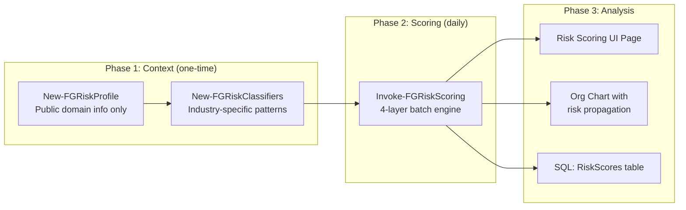
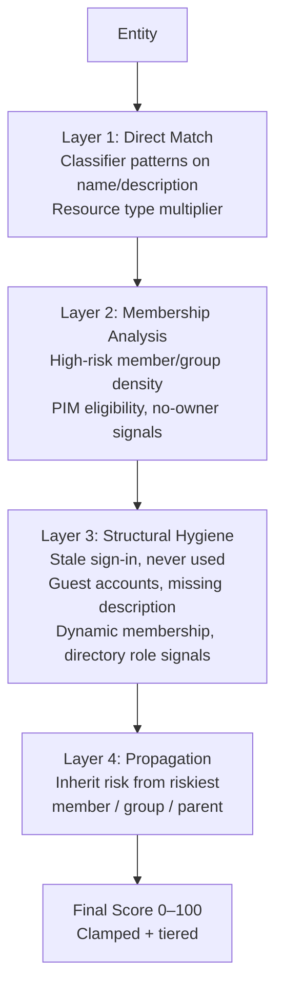

# Identity Risk Scoring

!!! warning "v5 status"
    In v5, risk scoring is driven from the UI (Admin > Risk Scoring). The PowerShell risk scoring functions (`Invoke-FGRiskScoring`, `New-FGRiskProfile`, `New-FGRiskClassifiers`) in `tools/riskscoring/` are **stubbed** and return "not yet implemented in v5". The in-browser wizard and the Node.js scoring engine (`app/api/src/riskscoring/engine.js`) are the active implementation path.

## Overview

Identity Atlas includes a universal risk scoring engine that assigns risk scores (0–100) to all entity types — Principals, Resources (including BusinessRoles), OrgUnits, and Identities. All scoring runs on your own infrastructure — no sensitive identity data is ever sent to external services.

## Three-Phase Architecture



**Phase 1** (one-time setup):

```powershell
New-FGRiskProfile -Domain "yourcompany.com" -LLMProvider Anthropic -LLMApiKey $key -ConfigFile '.\Config\mycompany.json'
New-FGRiskClassifiers -ConfigFile '.\Config\mycompany.json'
```

**Phase 2** (run after each sync):

```powershell
Invoke-FGRiskScoring -ConfigFile '.\Config\mycompany.json'
```

**Phase 3** (analysis):

- UI: Risk Scoring page, Org Chart
- SQL: `SELECT entityId, entityType, riskScore, riskTier FROM RiskScores ORDER BY riskScore DESC`
- Fast filter: `riskScore` and `riskTier` columns are denormalized onto Principals and Resources

## 4-Layer Scoring Engine



Each layer adds points; the final score is clamped to 0–100.

## Scoring by Entity Type

| Entity Type | Layer 1 | Layer 2 | Layer 3 | Layer 4 |
|---|---|---|---|---|
| **Principal (User)** | Classifier matches on name/title/UPN | Group count, PIM eligibility, high-risk group density | Stale sign-in (90/180d), never signed in, guest account, active high-privilege usage | Riskiest group membership |
| **Principal (AI Agent/SP)** | Agent classifier matches on name | Group count, high-risk resource density | No-human-in-loop penalty, type-specific bonus, active production workload detection | Riskiest resource membership |
| **Resource** | Classifier + resourceType multiplier | High-risk member density, PIM-eligible members, no owner | No description, dynamic membership, directory role signals, ghost app roles | Riskiest member |
| **BusinessRole** (Resource) | Classifier matches | High-risk assignee density | No review configured, missed reviews, no auto-removal | Aggregate contained resource risk |
| **OrgUnit** | Name/dept classifiers, hierarchy position | Aggregate principal risk | Size extremes (tiny/huge), no manager, high external ratio | Parent OrgUnit risk |
| **Identity** | Account count, multi-system | Highest-risk linked principal | Orphaned accounts, low confidence, not verified | Critical/High principal propagation |

## Risk Tiers

| Tier | Score | Action |
|------|-------|--------|
| Critical | 80–100 | Requires immediate attention |
| High | 60–79 | Should be reviewed soon |
| Medium | 40–59 | Monitor regularly |
| Low | 20–39 | Low concern |
| Minimal | 1–19 | Negligible |
| None | 0 | No signals detected |

## Analyst Overrides

Analysts can adjust any entity's score by −50 to +50 points with a required justification:

- Via UI: Risk Scoring page → click Override button
- Overrides are stored in `RiskScores` and preserved across re-scoring runs
- Override history is preserved across re-scoring runs

## Data Privacy

!!! success "No sensitive data leaves your infrastructure"
    - **Phase 1 only** contacts an LLM — sends only public organizational context (domain, industry, known systems)
    - **No identity data** (user names, email addresses, group memberships) is ever sent to external services
    - All scoring runs locally against your SQL database
    - Supported LLM providers: Anthropic Claude (default: `claude-sonnet-4-20250514`), OpenAI (default: `gpt-4o`)

## RiskScores Table

```sql
-- Top risky principals
SELECT p.displayName, p.principalType, rs.riskScore, rs.riskTier,
       rs.directScore, rs.membershipScore, rs.structuralScore, rs.propagatedScore
FROM Principals p
JOIN RiskScores rs ON rs.entityId = p.id AND rs.entityType = 'Principal'
WHERE p.ValidTo = '9999-12-31 23:59:59.9999999'
ORDER BY rs.riskScore DESC;

-- All entity types together
SELECT entityId, entityType, riskScore, riskTier
FROM RiskScores
ORDER BY riskScore DESC;
```
