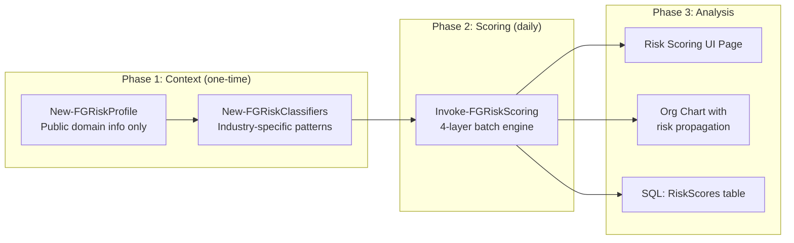
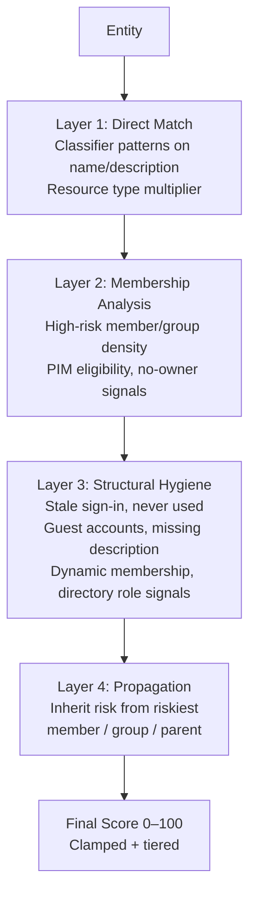

# Identity Risk Scoring

!!! warning "v5 status"
    In v5, risk scoring is driven from the UI (Admin > Risk Scoring). The PowerShell risk scoring functions (`Invoke-FGRiskScoring`, `New-FGRiskProfile`, `New-FGRiskClassifiers`) in `tools/riskscoring/` are **stubbed** and return "not yet implemented in v5". The in-browser wizard and the Node.js scoring engine (`app/api/src/riskscoring/engine.js`) are the active implementation path.

## Overview

Identity Atlas includes a universal risk scoring engine that assigns risk scores (0–100) to all entity types — Principals, Resources (including BusinessRoles), OrgUnits, and Identities. All scoring runs on your own infrastructure — no sensitive identity data is ever sent to external services.

## Three-Phase Architecture


```mermaid
flowchart LR
    subgraph Phase1["Phase 1: Context (one-time)"]
        A["New-FGRiskProfile\nPublic domain info only"] --> B["New-FGRiskClassifiers\nIndustry-specific patterns"]
    end
    subgraph Phase2["Phase 2: Scoring (daily)"]
        B --> C["Invoke-FGRiskScoring\n4-layer batch engine"]
    end
    subgraph Phase3["Phase 3: Analysis"]
        C --> D[Risk Scoring UI Page]
        C --> E["Org Chart with\nrisk propagation"]
        C --> F[SQL: RiskScores table]
    end
```

**Phase 1** (one-time setup):

```powershell
New-FGRiskProfile -Domain "yourcompany.com" -LLMProvider Anthropic -LLMApiKey $key -ConfigFile '.\Config\mycompany.json'
New-FGRiskClassifiers -ConfigFile '.\Config\mycompany.json'
```

**Phase 2** (run after each sync):

```powershell
Invoke-FGRiskScoring -ConfigFile '.\Config\mycompany.json'
```

**Phase 3** (analysis):

- UI: Risk Scoring page, Org Chart
- SQL: `SELECT entityId, entityType, riskScore, riskTier FROM RiskScores ORDER BY riskScore DESC`
- Fast filter: `riskScore` and `riskTier` columns are denormalized onto Principals and Resources

## 4-Layer Scoring Engine


```mermaid
flowchart TD
    E[Entity] --> L1["Layer 1: Direct Match\nClassifier patterns on name/description\nResource type multiplier"]
    L1 --> L2["Layer 2: Membership Analysis\nHigh-risk member/group density\nPIM eligibility, no-owner signals"]
    L2 --> L3["Layer 3: Structural Hygiene\nStale sign-in, never used\nGuest accounts, missing description\nDynamic membership, directory role signals"]
    L3 --> L4["Layer 4: Propagation\nInherit risk from riskiest\nmember / group / parent"]
    L4 --> S["Final Score 0–100\nClamped + tiered"]
```

Each layer adds points; the final score is clamped to 0–100.

## Scoring by Entity Type

| Entity Type | Layer 1 | Layer 2 | Layer 3 | Layer 4 |
|---|---|---|---|---|
| **Principal (User)** | Classifier matches on name/title/UPN | Group count, PIM eligibility, high-risk group density | Stale sign-in (90/180d), never signed in, guest account, active high-privilege usage | Riskiest group membership |
| **Principal (AI Agent/SP)** | Agent classifier matches on name | Group count, high-risk resource density | No-human-in-loop penalty, type-specific bonus, active production workload detection | Riskiest resource membership |
| **Resource** | Classifier + resourceType multiplier | High-risk member density, PIM-eligible members, no owner | No description, dynamic membership, directory role signals, ghost app roles | Riskiest member |
| **BusinessRole** (Resource) | Classifier matches | High-risk assignee density | No review configured, missed reviews, no auto-removal | Aggregate contained resource risk |
| **OrgUnit** | Name/dept classifiers, hierarchy position | Aggregate principal risk | Size extremes (tiny/huge), no manager, high external ratio | Parent OrgUnit risk |
| **Identity** | Account count, multi-system | Highest-risk linked principal | Orphaned accounts, low confidence, not verified | Critical/High principal propagation |

## Risk Tiers

| Tier | Score | Action |
|------|-------|--------|
| Critical | 90–100 | Requires immediate attention |
| High | 70–89 | Should be reviewed soon |
| Medium | 40–69 | Monitor regularly |
| Low | 20–39 | Low concern |
| Minimal | 1–19 | Negligible |
| None | 0 | No signals detected |

## Analyst Overrides

Analysts can adjust any entity's score with a required justification. The adjustment must be a whole number between −50 and +50, and the justification must be 3–500 characters:

- Via UI: Risk Scoring page → click Override button
- Overrides are stored in `RiskScores` and preserved across re-scoring runs
- Override history is preserved across re-scoring runs

## Configuring the AI provider

The AI provider is configured in **Admin → LLM Settings**. Three providers are supported:

| Provider | `provider` value | Default model | Notes |
|---|---|---|---|
| Anthropic | `anthropic` | `claude-sonnet-4-6` | API key required |
| OpenAI | `openai` | `gpt-4o` | API key required |
| Azure OpenAI | `azure-openai` | _(deployment name required)_ | Also requires endpoint URL and deployment name |

Once you enter the API key and click **Test**, IdentityAtlas verifies the connection and populates the model dropdown from the provider's API. The key is stored encrypted in the built-in secrets vault — it is never stored as plain text.

For Azure OpenAI the endpoint must be a valid Azure OpenAI hostname (`*.openai.azure.com`, `.us`, or `.cn`). The deployment name is the name you gave the deployment in Azure, not the underlying model name.

## Data Privacy

!!! success "No identity data ever leaves your infrastructure"
    - **Phase 1 only** contacts an LLM — the prompt contains only public organisational context: the domain name, optional organisation name, optional free-text hints you type, and any text you paste from internal documents.
    - **No identity data** — no user names, email addresses, group names, or access assignments — is ever sent to the AI provider.
    - All scoring (matching classifiers against your data) runs locally against your database with no network calls.

**What is sent to the AI, exactly:**

| What | Example |
|---|---|
| Domain name | `contoso.com` |
| Organisation name (optional) | `Contoso Ltd` |
| Free-text hints (optional) | `We operate in the Netherlands under NIS2` |
| Text from URLs you add (optional) | Scraped text from public or internal pages |

Nothing else. The AI generates regex patterns from this context; those patterns are then stored locally and applied against your data entirely on-premises.

**Provider security comparison:**

| Provider | Data stays in your region? | Used for AI training? |
|---|---|---|
| Anthropic API | No — routed to `api.anthropic.com` | Depends on your plan. Paid API plans include a no-training clause; verify your agreement. |
| OpenAI API | No — routed to `api.openai.com` | Consumer tier: opt-out required in account settings. Enterprise agreement: excluded by contract. |
| Azure OpenAI | Yes — stays within your Azure subscription | No — Microsoft Azure terms contractually exclude customer prompts from model training. |

For regulated environments or when in doubt, use **Azure OpenAI**: the data stays within your Azure tenant and training exclusion is contractual by default.

## RiskScores Table

```sql
-- Top risky principals
SELECT p.displayName, p.principalType, rs.riskScore, rs.riskTier,
       rs.directScore, rs.membershipScore, rs.structuralScore, rs.propagatedScore
FROM Principals p
JOIN RiskScores rs ON rs.entityId = p.id AND rs.entityType = 'Principal'
WHERE p.ValidTo = '9999-12-31 23:59:59.9999999'
ORDER BY rs.riskScore DESC;

-- All entity types together
SELECT entityId, entityType, riskScore, riskTier
FROM RiskScores
ORDER BY riskScore DESC;
```
