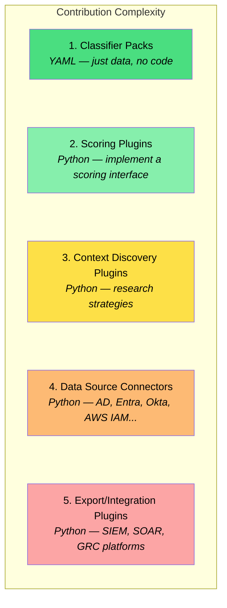

# Plugin Architecture & Open Source Strategy

This document extends the [risk scoring design](design.md) with a plugin architecture designed for open-source community contribution. The guiding principle: **make the knowledge shareable, not just the code.**

---

## Community Value Proposition

Commercial IGA vendors (SailPoint, Saviynt, Microsoft) all have proprietary risk scoring. There is no open-source tool that lets identity practitioners:

1. Collectively build and share classification knowledge across industries
2. Contribute detection methods without exposing organizational data
3. Reuse each other's work across engagements and customers

Think of the model as: **Sigma rules, but for identity risk.**

---

## Plugin Levels

Five extension points, ordered from easiest to most complex:



---

## 1. Classifier Packs

**The most important contribution type.** Zero code required — just YAML files.

### Structure

```yaml
# classifiers/community/banking-nl.yaml
pack:
  id: "banking-nl"
  name: "Dutch Banking Sector"
  version: "1.2.0"
  description: "Classifiers for Dutch banks under DNB/ECB supervision"
  author: "contributor-handle"
  license: "Apache-2.0"
  industries: ["banking", "financial-services"]
  regions: ["NL", "EU"]
  tags: ["DNB", "DORA", "PSD2", "SWIFT"]
  extends:
    - "universal"
    - "financial-services"
  engine_version: ">=1.0.0"

classifiers:
  groups:
    - id: "bank-nl-swift-ops"
      category: "critical-infrastructure"
      name_patterns: ["swift", "sag", "alliance.?lite", "payment.?gateway"]
      base_score: 90
      rationale: "SWIFT-related groups — interbank payment infrastructure"
      references:
        - "https://www.swift.com/myswift/customer-security-programme-csp"
      mitre_attack: ["T1078"]

  users:
    - id: "bank-nl-mlro"
      category: "regulatory-role"
      title_patterns: ["MLRO", "money.?laundering.?reporting", "wwft.?officer"]
      base_score: 75
      rationale: "Wwft/AML reporting officer — regulatory accountability"
```

### Community Registry

```
classifiers/
├── universal/
│   └── universal.yaml
├── industry/
│   ├── banking/
│   │   ├── banking-general.yaml
│   │   ├── banking-nl.yaml
│   │   ├── banking-swift.yaml
│   │   └── banking-trading.yaml
│   ├── healthcare/
│   │   ├── healthcare-general.yaml
│   │   ├── healthcare-nl.yaml
│   │   └── healthcare-epic.yaml
│   ├── critical-infrastructure/
│   │   ├── port-authority.yaml
│   │   ├── energy.yaml
│   │   └── ot-scada-general.yaml
│   ├── government/
│   │   ├── government-nl.yaml
│   │   └── municipality-nl.yaml
│   └── education/
│       └── university-nl.yaml
├── compliance/
│   ├── nis2.yaml
│   ├── dora.yaml
│   ├── gdpr.yaml
│   └── iso27001.yaml
└── technology/
    ├── sap.yaml
    ├── microsoft-365.yaml
    └── azure-infrastructure.yaml
```

### Pack Composition

An admin selects which packs to activate. Packs can extend each other. The engine merges them with precedence: **organization-specific > industry > compliance > technology > universal**. When two classifiers match the same entity, the highest score wins.

### Contributing a Pack

1. Fork the repo
2. Create a YAML file following the schema
3. Run the built-in validator: `idrisk validate classifiers/my-pack.yaml`
4. Submit a PR

---

## 2. Scoring Plugins

For contributors who want to add new **detection logic** beyond pattern matching.

### Plugin Interface

```python
class ScoringPlugin(ABC):

    @property
    @abstractmethod
    def id(self) -> str: ...

    @property
    @abstractmethod
    def name(self) -> str: ...

    @property
    @abstractmethod
    def description(self) -> str: ...

    @property
    @abstractmethod
    def version(self) -> str: ...

    @property
    def entity_types(self) -> List[EntityType]:
        return list(EntityType)

    @property
    def default_weight(self) -> float:
        return 0.5

    @abstractmethod
    def score(self, entity: dict, context: 'ScoringContext') -> Optional[ScoreContribution]:
        """Score a single entity. Return None if no opinion."""
        pass
```

### Example Plugins

#### Toxic Access Combinations

Detects users who hold group memberships that together create separation-of-duty violations.

```python
class ToxicCombinationsPlugin(ScoringPlugin):
    """
    Example: A user in both "AP-Invoice-Approve" and "AP-Payment-Execute"
    can both approve and execute payments — classic SoD violation.
    """
    id = "toxic-combinations"
    name = "Toxic Access Combinations"
    version = "1.0.0"
    entity_types = [EntityType.USER]
    default_weight = 0.7

    default_toxic_pairs = [
        {
            "name": "Payment SoD",
            "group_a_patterns": ["invoice.?approv", "payment.?approv"],
            "group_b_patterns": ["payment.?execut", "payment.?release"],
            "severity": 85,
            "rationale": "Can both approve and execute payments"
        },
        {
            "name": "User Lifecycle SoD",
            "group_a_patterns": ["user.?creat", "account.?provision"],
            "group_b_patterns": ["access.?approv", "role.?assign"],
            "severity": 70,
            "rationale": "Can both create accounts and grant them access"
        }
    ]
```

#### Other Plugin Ideas

| Plugin | Entity Types | Detects |
|--------|-------------|---------|
| **Shadow IT Detector** | Groups | Groups created by non-IT users, mail-enabled, no IT owner, no governance |
| **Orphaned Access** | Groups, Apps | Groups with no owner (last owner left), disabled app owners, apps granting access to disabled groups |
| **Blast Radius Calculator** | Users, Groups | Impact scope of compromise — how many systems reachable, how many users affected |
| **Stale Privileged Access** | Users | Privileged access with no recent use — Global Admin with no sign-in for 60 days |
| **Naming Convention Anomaly** | Groups, Users | Entities that deviate from observed naming patterns — statistical anomaly detection |

### Plugin Discovery

```
plugins/
├── builtin/
│   ├── classifier_matcher.py      # Layer 1
│   ├── membership_analyzer.py     # Layer 2
│   ├── structural_analyzer.py     # Layer 3
│   └── risk_propagation.py        # Layer 4
├── community/
│   ├── toxic_combinations.py
│   ├── shadow_it_detector.py
│   └── blast_radius.py
└── custom/
    └── my_org_specific_scorer.py
```

---

## 3. Context Discovery Plugins

Extend how the system researches organizations in Phase 1.

```python
class DiscoveryPlugin(ABC):

    @abstractmethod
    async def discover(self, customer_domain: str, customer_name: str,
                       existing_profile: dict) -> DiscoveryResult:
        """Research the organization and return findings."""
        pass
```

### Example Discovery Plugins

| Plugin | Data Sources | Discovers |
|--------|-------------|-----------|
| **KvK Lookup** | Dutch Chamber of Commerce API | Legal entity type, SBI codes, employee count, subsidiaries |
| **Regulatory Mapper** | Web, regulation databases | Applicable regulations (NIS2, DORA, NEN 7510, BIO) |
| **Annual Report Analyzer** | Web | Business segments, technology platforms, risk disclosures |
| **Tender Scanner** | TenderNed, TED (EU) | Technology purchases, migration projects, security tools |

---

## 4. Data Source Connectors

Allow the tool to collect identity data from sources beyond AD/Entra ID.

```python
class DataSourceConnector(ABC):

    @abstractmethod
    async def collect(self, config: dict) -> CollectionResult:
        """Collect entities and return normalized data."""
        pass

    @abstractmethod
    def get_required_permissions(self) -> List[str]:
        """Permissions needed (displayed during setup)."""
        pass
```

### Planned Connectors

| Category | Connectors |
|----------|-----------|
| **Builtin** | Entra ID, Active Directory, Entra Governance |
| **Community** | Okta, AWS IAM, Google Workspace, PingIdentity, SailPoint IIQ, CyberArk |

All connectors output a normalized entity model so scoring plugins work regardless of source.

---

## 5. Export/Integration Plugins

Output risk scores to other platforms:

| Category | Exports |
|----------|---------|
| **Builtin** | CSV, Excel, JSON |
| **Community** | Microsoft Sentinel (watchlists), Splunk (lookup tables), ServiceNow CMDB, TopDesk, Power BI |

---

## Plugin Manifest

Every plugin ships with a manifest:

```yaml
plugin:
  id: "toxic-combinations"
  name: "Toxic Access Combinations"
  version: "1.0.0"
  type: "scoring"
  author: "github-handle"
  license: "Apache-2.0"

  requires:
    entity_types: ["user", "group"]
    data_fields: ["group.members", "user.memberships"]

  config_schema:
    type: object
    properties:
      toxic_pairs_file:
        type: string
      severity_threshold:
        type: number
        default: 50

  default_enabled: true
  default_weight: 0.7
```

---

## Contribution Guidelines

| Type | Skill Needed | Review Process |
|------|-------------|----------------|
| Classifier pack | YAML + domain knowledge | Peer review for quality/accuracy |
| Toxic combination rules | Domain knowledge | Peer review |
| Scoring plugin | Python + identity knowledge | Code review + tests required |
| Discovery plugin | Python + API knowledge | Code review + tests |
| Data source connector | Python + platform API | Code review + extensive testing |
| Core engine changes | Deep architecture knowledge | Maintainer review |

### Classifier Quality Standards

Community classifier packs should:

- Include clear rationale for every classifier
- Include references (links to regulations, vendor docs, best practices)
- Use tested regex patterns (no overly broad matches)
- Include both English and local-language variants where applicable
- Not include any organization-specific data
- Be reviewed by at least one practitioner from the relevant industry

---

## Implementation Priority

### Phase A: Core + Classifiers (MVP)

1. Core engine with plugin interfaces
2. Universal classifier pack
3. Entra ID + AD connectors
4. CLI for scoring + export
5. Basic CSV/JSON export

### Phase B: Intelligence Layer

6. LLM-assisted context discovery
7. 3-5 industry classifier packs
8. 3-5 community scoring plugins
9. Plugin scaffold tooling

### Phase C: Community & Integration

10. Web UI for plugin/classifier management
11. Community plugin registry
12. Export plugins (Sentinel, Power BI)
13. Synthetic data generator for testing

### Phase D: Multi-Platform

14. Okta connector
15. AWS IAM connector
16. Cross-platform correlation
17. Multi-source risk aggregation
