# Syncing from Entra ID

Identity Atlas provides deep integration with Microsoft Entra ID (Azure AD). The Entra ID crawler fetches data from the Microsoft Graph API and posts it to the Ingest API — no direct database access required.

---

## How It Works

In v5, sync is **API-driven**. The crawler script (`tools/crawlers/entra-id/Start-EntraIDCrawler.ps1`) runs inside the worker container (or standalone) and:

1. Authenticates to Microsoft Graph using credentials from the config file or the Crawlers admin page
2. Fetches each entity type via the Graph API
3. POSTs the data to the Ingest API on the web container
4. The web container validates, deduplicates, and persists the data to PostgreSQL

This architecture means the worker container has **no database driver** — all persistence flows through the API.

---

## Running a Sync

### Via the UI (recommended)

Navigate to **Admin → Crawlers** and configure an Entra ID crawler. The wizard walks you through:

1. Enter your Tenant ID, Client ID, and Client Secret
2. Validate permissions (the wizard checks each required Graph permission)
3. Select which entity types to sync
4. Configure optional identity filters and custom attributes
5. Set a schedule (or run immediately)

### Via the command line

```powershell
.\tools\crawlers\entra-id\Start-EntraIDCrawler.ps1 `
    -ApiBaseUrl "http://localhost:3001/api" `
    -ApiKey "fgc_abc123..." `
    -ConfigFile ".\setup\config\mycompany.json"
```

### Crawler flags

| Flag | Default | Purpose |
|------|---------|---------|
| `-SyncPrincipals` | On | Sync user principals |
| `-SyncServicePrincipals` | Off | Sync managed identities, AI agents, and service principals |
| `-SyncResources` | On | Sync groups, directory roles, app roles |
| `-SyncAssignments` | On | Sync group memberships, owners, eligible members |
| `-SyncGovernance` | On | Sync catalogs, access packages, policies, reviews |
| `-SyncContexts` | On | Sync calculated department contexts |
| `-SyncPim` | Off | Sync PIM eligible members |
| `-RefreshViews` | On | Refresh SQL views after sync |
| `-CustomUserAttributes` | Empty | Extra Graph attributes to capture for users |
| `-CustomGroupAttributes` | Empty | Extra Graph attributes to capture for groups |
| `-IdentityFilter` | None | Filter which users are treated as identities |

---

## What Gets Synced

```mermaid
flowchart TD
    EntraID[Entra ID] --> U[Users → Principals]
    EntraID --> SP[Service Principals → Principals]
    EntraID --> G[Groups → Resources]
    EntraID --> DR[Directory Roles → Resources]
    EntraID --> AR[App Roles → Resources]
    EntraID --> GM[Group Members → ResourceAssignments\nDirect]
    EntraID --> GE[PIM Eligible → ResourceAssignments\nEligible]
    EntraID --> GO[Group Owners → ResourceAssignments\nOwner]
    EntraID --> CAT[Catalogs → GovernanceCatalogs]
    EntraID --> AP[Access Packages → Resources\nresourceType=BusinessRole]
    EntraID --> APA[AP Assignments → ResourceAssignments\nassignmentType=Governed]
    EntraID --> APR[AP Resource Scopes → ResourceRelationships\nrelationshipType=Contains]
    EntraID --> APP[AP Policies → AssignmentPolicies]
    EntraID --> APQ[AP Requests → AssignmentRequests]
    EntraID --> APV[AP Reviews → CertificationDecisions]
```



---

## Required Graph API Permissions

| Permission | Purpose |
|---|---|
| `User.Read.All` | Read all users |
| `Group.Read.All` | Read all groups |
| `GroupMember.Read.All` | Read group memberships |
| `Directory.Read.All` | Read directory data |
| `EntitlementManagement.Read.All` | Read business roles, catalogs, and assignments |
| `AccessReview.Read.All` | Read certification review decisions |
| `Application.Read.All` | Read service principals and app role assignments |
| `AuditLog.Read.All` | Read sign-in and audit events |
| `PrivilegedEligibilitySchedule.Read.AzureADGroup` | Read PIM group eligibility schedules |

!!! tip
    The in-browser wizard validates all these permissions automatically — it shows a green/red checklist of which ones are granted.

---

## Schema Evolution

The Ingest API adds columns to existing tables without dropping or recreating them. Any attribute returned by the Graph API can be captured:

- **Core attributes** get dedicated SQL columns (indexed, filterable)
- **All remaining attributes** are stored in the `extendedAttributes` JSON column

To capture additional Graph attributes, add them via `-CustomUserAttributes` or `-CustomGroupAttributes` on the crawler, or configure them in the UI wizard.
