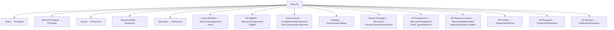

# Syncing from Entra ID

Identity Atlas provides deep integration with Microsoft Entra ID (Azure AD). The Entra ID crawler fetches data from the Microsoft Graph API and posts it to the Ingest API — no direct database access required.

---

## How It Works

In v5, sync is **API-driven**. The crawler script (`tools/crawlers/entra-id/Start-EntraIDCrawler.ps1`) runs inside the worker container (or standalone) and:

1. Authenticates to Microsoft Graph using credentials from the config file or the Crawlers admin page
2. Fetches each entity type via the Graph API
3. POSTs the data to the Ingest API on the web container
4. The web container validates, deduplicates, and persists the data to PostgreSQL

This architecture means the worker container has **no database driver** — all persistence flows through the API.

---

## Running a Sync

### Via the UI (recommended)

Navigate to **Admin → Crawlers** and configure an Entra ID crawler. The wizard walks you through:

1. Enter your Tenant ID, Client ID, and Client Secret
2. Validate permissions (the wizard checks each required Graph permission)
3. Select which entity types to sync
4. Configure optional identity filters and custom attributes
5. Set a schedule (or run immediately)

### Via the command line

```powershell
.\tools\crawlers\entra-id\Start-EntraIDCrawler.ps1 `
    -ApiBaseUrl "http://localhost:3001/api" `
    -ApiKey "fgc_abc123..." `
    -ConfigFile ".\setup\config\mycompany.json"
```

### Crawler flags

| Flag | Default | Purpose |
|------|---------|---------|
| `-SyncPrincipals` | On | Sync user principals |
| `-SyncServicePrincipals` | Off | Sync service principals, managed identities, and AI agents (classified by type) |
| `-SyncResources` | On | Sync groups |
| `-SyncAssignments` | On | Sync group memberships and owners |
| `-SyncGovernance` | On | Sync catalogs, access packages, policies, reviews |
| `-SyncContexts` | On | Sync calculated department contexts |
| `-SyncPim` | Off | Sync PIM-eligible group memberships |
| `-SyncDirectoryRoles` | Off | Sync Entra directory roles plus their active and PIM-eligible role assignments |
| `-SyncAppRoles` | Off | Sync enterprise-app app-role assignments (direct, and expanded from groups) |
| `-SyncOAuth2Grants` | Off | Sync per-user OAuth2 delegated-permission (consent) grants |
| `-SyncAppPermissions` | Off | Sync app-only (admin-consented) API permissions held by service principals, managed identities, and AI agents |
| `-SyncAppOwners` | Off | Sync app-registration and service-principal owners (fetched per app — slow on large tenants) |
| `-SyncPrincipalRelationships` | Off | Sync AI-agent owners and guest-account sponsors |
| `-SyncSignInLogs` | Off | Sync per-(user, app) last activity from sign-in logs (window set by `-SignInLogsDays`, default 7) |
| `-RefreshViews` | On | Refresh SQL views after sync |
| `-CustomUserAttributes` | Empty | Extra Graph attributes to capture for users |
| `-CustomGroupAttributes` | Empty | Extra Graph attributes to capture for groups |
| `-AINamePatterns` | Empty | Extra display-name regex patterns that classify a service principal as an AI agent |
| `-IdentityFilter` | None | Filter which users are treated as identities |

### Which toggles to enable

The defaults (users, groups, memberships, governance, contexts) cover core role-mining. The service-principal and application toggles are **off by default** — they add Graph calls, and several fetch per-object so they get slower as the tenant grows. Enable them by what you want to see:

| You want to see… | Enable | Cost |
|---|---|---|
| Non-human identities (SPs, managed identities, AI agents) | `-SyncServicePrincipals` | Low — bulk endpoints |
| Privileged access via Entra directory roles (active + PIM-eligible) | `-SyncDirectoryRoles` | Low–moderate |
| PIM-eligible group memberships | `-SyncPim` | High on large tenants — a per-group `$filter` call |
| Who can use which enterprise app (app-role assignments) | `-SyncAppRoles` | Moderate |
| Per-user consent grants to apps | `-SyncOAuth2Grants` | Moderate |
| App-only API permissions held by SPs / managed identities / agents | `-SyncAppPermissions` | High — fetched per service principal |
| Who owns apps / SPs (can add a credential and impersonate the app) | `-SyncAppOwners` | High — fetched per app |
| AI-agent owners and guest-account sponsors | `-SyncPrincipalRelationships` | Low–moderate — only over agents + guests |

`-SyncServicePrincipals` is the prerequisite for meaningful `-SyncAppPermissions` and `-SyncPrincipalRelationships` output (both operate on service principals), and it's where AI-agent classification happens — add `-AINamePatterns` to catch agents your naming convention flags that the built-in patterns miss.

---

## What Gets Synced


```mermaid
flowchart TD
    EntraID[Entra ID] --> U[Users → Principals]
    EntraID --> SP[Service Principals → Principals]
    EntraID --> G[Groups → Resources]
    EntraID --> DR[Directory Roles → Resources]
    EntraID --> AR[App Roles → Resources]
    EntraID --> GM[Group Members → ResourceAssignments\nDirect]
    EntraID --> GE[PIM Eligible → ResourceAssignments\nEligible]
    EntraID --> GO[Group Owners → GroupOwnership Resource\nDirect ResourceAssignment]
    EntraID --> CAT[Catalogs → GovernanceCatalogs]
    EntraID --> AP[Access Packages → Resources\nresourceType=BusinessRole]
    EntraID --> APA[AP Assignments → ResourceAssignments\nDirect, governed=true]
    EntraID --> APR[AP Resource Scopes → ResourceRelationships\nrelationshipType=Contains]
    EntraID --> APP[AP Policies → AssignmentPolicies]
    EntraID --> APQ[AP Requests → AssignmentRequests]
    EntraID --> APV[AP Reviews → CertificationDecisions]
```

---

## Required Graph API Permissions

Grant these as **Application** permissions (not Delegated) on the App Registration the crawler authenticates as, then grant tenant-wide admin consent in the Azure Portal under **App Registrations → API Permissions**. Creating the App Registration itself is standard Entra administration and is not covered here.

| Permission | Purpose |
|---|---|
| `User.Read.All` | Read all users |
| `Group.Read.All` | Read all groups |
| `GroupMember.Read.All` | Read group memberships |
| `Directory.Read.All` | Read directory data |
| `EntitlementManagement.Read.All` | Read business roles, catalogs, and assignments |
| `AccessReview.Read.All` | Read certification review decisions |
| `Application.Read.All` | Read service principals and app role assignments |
| `AuditLog.Read.All` | Read sign-in and audit events |
| `PrivilegedEligibilitySchedule.Read.AzureADGroup` | Read PIM group eligibility schedules |

!!! tip
    The in-browser wizard validates all these permissions automatically — it shows a green/red checklist of which ones are granted.

---

## Schema Evolution

The Ingest API adds columns to existing tables without dropping or recreating them. Any attribute returned by the Graph API can be captured:

- **Core attributes** get dedicated SQL columns (indexed, filterable)
- **All remaining attributes** are stored in the `extendedAttributes` JSON column

To capture additional Graph attributes, add them via `-CustomUserAttributes` or `-CustomGroupAttributes` on the crawler, or configure them in the UI wizard.
