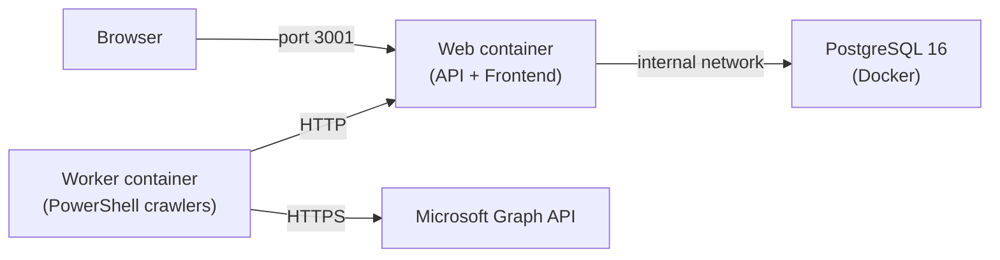

# Local Development with Docker

Identity Atlas includes a Docker Compose setup that runs a complete local stack — PostgreSQL 16 + the UI backend (serving the built frontend) + a PowerShell worker — with no cloud subscription required. This is useful for development, testing, and demos.

## Prerequisites

- [Docker Desktop](https://www.docker.com/products/docker-desktop/) (or any Docker Engine + Compose v2)
- A browser (the in-browser wizard handles all configuration)

## Architecture



The PostgreSQL port `5432` is exposed to the host for direct database access during development. The worker container has no database driver — it talks to the web container's API for everything (job pickup, data ingestion, progress reporting).

## Start the Stack

```bash
docker compose up -d
```

This starts:

| Service | What it does |
|---|---|
| `postgres` | PostgreSQL 16 Alpine (persisted in `postgres_data` volume) |
| `web` | Runs database migrations on startup, builds frontend + starts Express API; auth disabled by default |
| `worker` | PowerShell container that polls for crawler jobs and executes them |

Wait for the health check to pass (~10 seconds), then open **http://localhost:3001**.

The UI will show an empty matrix until you load demo data or run a sync.

!!! warning "Auth is disabled in local mode"
    `AUTH_ENABLED=false` is set by default in `docker-compose.yml`. The amber warning banner will appear in the UI — this is expected.

## Run a Sync

Open `http://localhost:3001/#admin?sub=crawlers` and use the in-browser wizard:

- **Demo Data** — one-click synthetic dataset, no Graph credentials required
- **Microsoft Graph** — paste tenant ID, client ID, client secret; the wizard validates the credentials, lets you pick which object types to sync, and runs the crawler in the worker container
- **CSV Import** — folder picker uploads CSV files (Omada / SailPoint exports) directly into the worker

The worker runs every minute and picks up queued jobs. Live progress is shown on the Crawlers page.

## Stopping and Resetting

```bash
# Stop the stack (data persists in the postgres_data volume)
docker compose down

# Stop and delete all data (full reset)
docker compose down -v
```

## Building the Image Manually

The `app/api/Dockerfile` does a multi-stage build: builds the React frontend in stage 1, then copies the compiled output into the Express backend in stage 2. Both are served by the same Node.js process on port 3001.

```bash
# Build from the app/ directory
docker build -f app/api/Dockerfile -t identity-atlas-web ./app

# Or use docker compose to build all services
docker compose build
```

### Frontend-only dev container

For frontend-only development with hot reload:

```bash
docker build -t identity-atlas-frontend ./app/ui
docker run -p 5173:5173 -v $(pwd)/app/ui/src:/app/src identity-atlas-frontend
```

This mounts `src/` from your host for live reload while the container watches for changes.

## Environment Variables

Override any setting in `docker-compose.yml` by creating a `.env` file in the repo root or setting environment variables before running `docker compose`:

| Variable | Default | Description |
|---|---|---|
| `AUTH_ENABLED` | `false` | Enable/disable Entra ID auth |
| `AUTH_CLIENT_ID` | — | App registration client ID (required if auth enabled) |
| `AUTH_TENANT_ID` | — | Entra ID tenant ID (required if auth enabled) |
| `POSTGRES_DB` | `identity_atlas` | PostgreSQL database name |
| `POSTGRES_USER` | `identity_atlas` | PostgreSQL username |
| `POSTGRES_PASSWORD` | `identity_atlas_local` | PostgreSQL password |
| `PORT` | `3001` | Backend port |

!!! tip "Enabling auth locally"
    Set `AUTH_ENABLED=true`, `AUTH_CLIENT_ID`, and `AUTH_TENANT_ID` in `docker-compose.yml` to test with real Entra ID login. Ensure `http://localhost:3001` is added as a redirect URI in your app registration.
