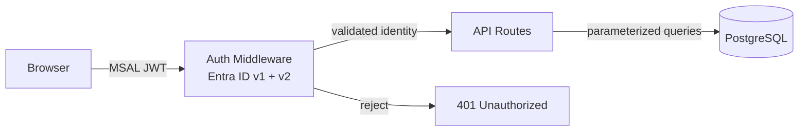

# Role Mining UI

## Overview

The Role Mining UI is a web application that visualizes your synced permission data. It is the primary way most users interact with Identity Atlas data. Built with React, Vite, Tailwind CSS, and TanStack Table v8, the UI runs in the Docker stack alongside the API (the `web` container) and is optionally protected by Entra ID authentication.

**URL after starting the stack:** `http://localhost:3001` (or whatever host you map port 3001 to).

---

## Pages

The navigation bar has two groups of tabs:

- **Always visible:** Matrix, Users, Resources, Systems, Business Roles, Sync Log, Admin
- **Optional (hidden by default):** Risk Scores, Identities, Org Chart

Optional tabs are enabled per-user via the settings dropdown (click the user avatar in the top-right corner).

The **Admin** page contains sub-tabs: **Crawlers** (configure and schedule data sync), **Performance** (backend metrics), and **Auth** (authentication settings).

---

### Matrix View

The core visualization — an interactive resource × user permission matrix.

- **Rows** = resources (groups, roles, app permissions)
- **Columns** = users / principals

#### Cell Badges

Each cell shows all membership types that apply, side by side:

| Badge | Meaning |
|-------|---------|
| `D` | Direct member |
| `I` | Indirect (transitive) member |
| `E` | Eligible (PIM) member |
| `O` | Owner |

Cells with multiple types show all badges. Owner (`O`) memberships appear in separate rows suffixed with `(Owner)` — ownership is a fundamentally different relationship from membership.

#### Business Role Columns (SOLL View)

When the IST/SOLL toggle is set to **SOLL**, the matrix adds columns for each business role that governs user-resource assignments. Each business role gets a distinct color from a 15-color palette. Cells managed by multiple business roles show a count badge.

#### Staircase Sort

The default row order groups rows by their leftmost business role bucket, creating a visual staircase pattern that makes governed assignments easy to identify. Unmanaged resources appear at the bottom. The staircase order is the default; it can be overridden by dragging rows manually.

#### IST/SOLL Toggle

| Mode | Shows |
|------|-------|
| All | Every assignment |
| IST (unmanaged) | Assignments not covered by any business role |
| SOLL (governed) | Assignments governed by at least one business role |

#### User Limit Slider

Defaults to 25 users. The limit is applied at the SQL level — increasing it fetches more users from the database. Use a higher value for large environments, but expect slower load times.

#### Drag-and-Drop Row Reordering

Rows can be reordered manually by dragging. The custom order persists in versioned `localStorage` per browser.

#### Excel Export

Exports the full matrix with:

- Business-role-colored cell backgrounds
- Rich-text multi-type badge labels (D / I / E)
- Multi-business-role notes where applicable
- Business role columns positioned next to users, matching the on-screen layout

#### Filter System

Filters appear as pills in the toolbar above the matrix.

- **Server-side (SQL WHERE):** Department, job title, user tag — applied before data is sent to the browser
- **Client-side:** Resource name, membership type

!!! tip
    Use server-side filters to reduce the dataset when working with large environments. Client-side filters are instant but only apply to already-loaded rows.

---

### Users Page

Browse all synced principals with pagination, search, tagging, and attribute filtering.

- **Search** by display name or UPN
- **Filter** by any attribute column or tag
- **Tag management:** create colored tags, assign/remove from selected users, bulk-tag by filter

---

### Resources Page

Browse all synced resources (groups, directory roles, app roles, etc.) with pagination.

- **Resource Type filter:** EntraGroup, EntraDirectoryRole, EntraAppRole, and others
- **System filter:** restrict to a specific connected system
- **Tag management:** same as the Users page

---

### Systems Page

Card-based view of all connected authorization systems.

Each card shows:

- Resource count and assignment count
- Last sync timestamp
- Resource types and assignment types present
- Owner management — assign or remove team owners per system

---

### Business Roles Page

Browse all business roles from any IGA platform (Entra Access Packages, Omada Business Roles, SailPoint Access Profiles, etc.).

- **Search** by name or catalog
- **Filter** by category or uncategorized
- **Category assignment:** assign exactly one category per business role — this drives Matrix column ordering

---

### Business Role Detail Page

Clicking any business role name opens a detail tab. Multiple detail tabs can be open simultaneously; each has a close button. The URL hash (`#business-role:<id>`) is bookmarkable.

The detail tab contains collapsible sections:

| Section | Content |
|---------|---------|
| Assignments | Active users with email address and assigned date |
| Resource Assignments | Groups and resources included, with Member / Owner role badges |
| Assignment Policies | Auto-assigned vs. request-based policies with scope and filter rules |
| Certification Reviews | Review decisions with auto-review indicator |
| Pending Requests | Outstanding requests with requestor details |
| Version History | Audit history diffs — every change since first sync |

!!! note
    The **Review Status** field differentiates "Not required" (no review configured) from "Pending first review" (review configured but no instance has run yet).

---

### Sync Log

Displays recent sync operations from the `GraphSyncLog` table:

- Timestamps (start and end)
- Entity type synced
- Row counts (inserted, updated, deleted)
- Duration in seconds

---

### Risk Scores *(optional)*

!!! warning "Prerequisite"
    This tab requires `Invoke-FGRiskScoring` to have been run at least once.

- Score bars (0–100) with tier badge per entity
- Supported entity types: Principals, Resources, Business Roles, OrgUnits, Identities
- Per-layer score breakdown:

| Layer | Description |
|-------|-------------|
| Direct | Classifier pattern matches on the entity itself |
| Membership | Risk inherited from high-risk group memberships |
| Structural | Hygiene signals — stale accounts, no sign-in, etc. |
| Propagated | Risk propagated from related entities |

**Risk Tiers:**

| Tier | Score Range |
|------|-------------|
| Critical | 90–100 |
| High | 70–89 |
| Medium | 40–69 |
| Low | 20–39 |
| Minimal | 1–19 |
| None | 0 |

**Analyst Overrides:** Adjust a score by −50 to +50 with a required justification. Overrides are stored in the `RiskScores` table for audit.

**Classifier Matches:** Expand any entity to see exactly which regex patterns triggered its score.

---

### Identities *(optional)*

Account correlation results — real persons linked across multiple accounts and systems. Requires `Invoke-FGAccountCorrelation` to have been run.

---

### Org Chart *(optional)*

Manager hierarchy visualization with risk propagation.

- Hybrid layout: horizontal at the root level, vertical-indented for deeper levels
- Department boxes are color-coded by the maximum risk tier in their subtree
- Click a department box to open a detail page with all members and their risk scores

---

### Performance *(Admin sub-tab)*

Available under Admin > Performance. Enabled by default (`PERF_METRICS_ENABLED=true`); set `PERF_METRICS_ENABLED=false` to disable.

Backend performance metrics collected via a ring buffer (1000 entries).

| Section | Content |
|---------|---------|
| Endpoint Summary | P50 / P95 / P99 latencies per API route |
| Recent Requests | Last N requests with per-SQL-query timing breakdown |
| Slowest Requests | Top outliers across all captured requests |
| Export | Download full ring buffer as JSON for offline analysis |

Per-request `Server-Timing` headers are also emitted, visible in the browser DevTools **Network** panel.

---

## Tagging System

Tags are user-defined colored labels that can be assigned to users or resources.

- Multiple tags per entity are allowed
- Tags are available as filters on the Users, Resources, and Matrix pages
- Stored in `GraphTags` and `GraphTagAssignments` tables (auto-created on first use)

Common examples: `VIP`, `Finance`, `Contractors`, `Service Accounts`

---

## Category System

Categories label business roles to drive grouping and ordering.

!!! important
    Each business role can have **only one category**. This enforces clean, non-overlapping groupings.

- Categories drive Matrix column ordering: sorted first by category name, then by assignment count within each category; uncategorized business roles appear at the end
- Category boundaries in the Matrix view are marked with thicker borders and a colored indicator stripe
- Stored in `GovernanceCategories` and `GovernanceCategoryAssignments` tables (auto-created on first use)

Common examples: `Identity`, `Office 365`, `Security`, `Finance Systems`

---

## User Preferences

Click the user avatar in the top-right corner to open the settings dropdown. Toggle switches control which optional tabs are visible.

- Preferences are stored per-user in the `GraphUserPreferences` table (auto-created)
- Users are identified by their Entra ID Object ID (`oid` claim)
- In no-auth mode (`-NoAuth`), preferences are stored under the key `anonymous`

---

## Security

| Control | Detail |
|---------|--------|
| Authentication | Entra ID JWT (v1 + v2 token support); optional `-NoAuth` for demos |
| No-auth warning | Visible amber banner displayed to all users when auth is disabled |
| Rate limiting | 30 requests/min per IP on pre-auth endpoints |
| Security headers | Helmet: CSP, HSTS, X-Frame-Options, Referrer-Policy |
| SQL injection | All queries parameterized — no string interpolation anywhere |
| Error responses | Generic messages only — SQL schema details are never exposed |
| Role-based access | Optional: set `AUTH_REQUIRED_ROLES` to restrict by app role |
| Tenant validation | Token tenant ID is validated against the configured `AUTH_TENANT_ID` |
