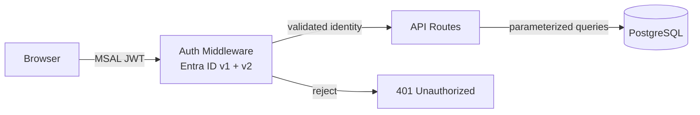

# Role Mining UI

## Overview

The Role Mining UI is a web application that visualizes your synced permission data. It is the primary way most users interact with Identity Atlas data. Built with React, Vite, Tailwind CSS, and TanStack Table v8, the UI runs in the Docker stack alongside the API (the `web` container) and is optionally protected by Entra ID authentication.

**URL after starting the stack:** `http://localhost:3001` (or whatever host you map port 3001 to).

---

## Pages

The app opens to the **Dashboard** landing page — not the Matrix. From there the navigation bar has two groups of tabs:

- **Always visible:** Dashboard, Matrix, Principals (Users), Resources, Business Roles, Contexts, Admin
- **Optional (hidden by default):** Systems, Logs (the Sync Log), Risk Scores, Identities

Optional tabs are enabled per-user via the settings dropdown (click the user avatar in the top-right corner). **Risk Scores** and **Identities** are additionally feature-gated — they only appear in the settings list when their server-side feature flag (`riskScoring` / `accountLinking`) is enabled. The **Admin** tab is hidden from users with no `admin.*` permission.

!!! note
    The **Org Chart** tab no longer exists. Manager-hierarchy views are now generated Contexts — see [Contexts](#contexts) below.

### Dashboard

The default landing page. It has an **Overview** tab (headline counts and a "configure a crawler" call-to-action when the database is empty) and a **Trends** tab (time-series charts from daily snapshots). See [Dashboard](dashboard.md) for details.

### Admin sub-tabs

The **Admin** page groups all administrative surfaces. Each sub-tab is permission-gated (a user only sees the ones they may use):

| Sub-tab | Purpose |
|---------|---------|
| **Crawlers** | Add, configure, schedule, and run identity-data crawlers |
| **Plugins** | Context plugins — configured trees and ad-hoc runs |
| **Account Linking** | Rules for linking orphan accounts to existing identities |
| **Risk Scoring** | Risk profile, classifiers, and the risk-scoring feature toggle |
| **LLM Settings** | Configure the LLM provider used by risk scoring |
| **Performance** | API and SQL performance metrics |
| **Authentication** | Single sign-on and role / permission management |
| **Data** | Export / import curated data and clean the database |
| **Updates** | Automatic updates and version history |
| **About** | License, version, and software bill of materials |

---

### Matrix View

The core visualization — an interactive resource × subject permission matrix.

- **Rows** = resources (groups, roles, app permissions)
- **Columns** = subjects (user accounts or correlated identities)

The matrix starts empty: you first scope it with the **Filter Wizard** (see below). The row/column axes can also be swapped with the orientation toggle.

#### Cell Badges

Each cell shows all membership types that apply, side by side:

| Badge | Meaning |
|-------|---------|
| `D` | Direct member |
| `I` | Indirect (transitive) member |
| `E` | Eligible (PIM) member |

Cells with multiple types show all badges. Ownership is its own resource (`resourceType='GroupOwnership'`) shown as a normal row, so an owner appears as a `Direct` membership on that ownership resource rather than a separate badge.

#### Business Role Columns (Governed View)

When the toggle is set to **Governed**, the matrix adds columns for each business role that governs user-resource assignments. Each business role gets a distinct color from a 15-color palette. Cells managed by multiple business roles show a count badge.

#### Staircase Sort

The default row order groups rows by their leftmost business role bucket, creating a visual staircase pattern that makes governed assignments easy to identify. Unmanaged resources appear at the bottom. The staircase order is the default; it can be overridden by dragging rows manually.

#### Governed / Non-governed / Gaps Toggle

A view-time toggle in the matrix toolbar (formerly the IST/SOLL toggle):

| Mode | Shows |
|------|-------|
| All | Every assignment |
| Governed | Assignments governed by at least one business role |
| Non-governed | Assignments not covered by any business role |
| Gaps | Where a business role would grant access but the assignment is missing |

This toggle is part of a saved matrix, so it round-trips through save/load.

#### Filter Wizard (matrix scoping)

There is no user-limit slider or department filter pills. You scope the matrix through a 3-step modal wizard (**Create matrix** / **Adjust matrix**), opened automatically on first visit and re-openable from the toolbar's **Adjust filter** button:

1. **Setup** — pick the subject type (**User accounts** = one Principal per column, or **Identities** = one correlated person per column, unioning across their accounts) and the orientation (resources-as-rows vs. subjects-as-rows).
2. **Subjects** — narrow which users/identities appear, using include/exclude conditions built from **Contexts** (e.g. an org-unit or tag context, optionally including descendants) or **attribute** filters (any column value). Includes are AND'd; excludes negate.
3. **Resources** — narrow which resources appear, using the same context/attribute conditions, plus an optional **Include inherited access** checkbox.

A **live summary** at the bottom shows counts as you tweak — subjects matched / total, resources matched / total, and the resulting assignment count — with warnings when a matrix grows large and a hard block on an oversized flat (per-subject) grid.

#### Roll-up by Attribute

Instead of a per-subject grid, the columns can be **rolled up** by an attribute (e.g. department) or by a **Manager Hierarchy** context tree. A rolled-up cell shows a count (or percentage) of the subjects in that group who hold the resource. Roll-ups are aggregated on the server, so they load at any size. A **Content** step lets you choose what the roll-up shows: resources + business-role columns, resources only, or business roles only. You can also fold individual attribute groups into a single count column right in the matrix.

#### Saved Matrices

A fully-scoped matrix (filter + orientation + governed-state toggle) can be saved by name. Saved matrices are **org-wide** — any user can load, rename, or delete any saved matrix — and are managed from the **Saved matrices** dropdown at the top of the wizard.

#### Orientation Toggle

The matrix can be rotated so that subjects are the rows and resources are the columns (`rows-as-subjects`), which is easier to read when there are few resources and many subjects. Set it in the wizard's Setup step.

#### Drag-and-Drop Row Reordering

Rows can be reordered manually by dragging. The custom order persists in versioned `localStorage` per browser.

#### Excel Export

Exports the full matrix with:

- Business-role-colored cell backgrounds
- Rich-text multi-type badge labels (D / I / E)
- Multi-business-role notes where applicable
- Business role columns positioned next to users, matching the on-screen layout

---

### Principals (Users) Page

Browse all synced principals (accounts) with pagination, search, tagging, and attribute filtering.

- **Search** by display name or UPN
- **Filter** by any attribute column or tag
- **Tag management:** assign/remove tags (Tag Contexts — see [Tagging System](#tagging-system)) from selected users, bulk-tag by filter

---

### Resources Page

Browse all synced resources (groups, directory roles, app roles, etc.) with pagination.

- **Resource Type filter:** Group, EntraDirectoryRole, AppRole, and others
- **System filter:** restrict to a specific connected system
- **Tag management:** same as the Principals (Users) page

---

### Filtering by references (relationships)

The **Add filter** dropdown on the Users and Resources pages lists reference
fields — a row's relationships — alongside its ordinary attribute columns, and
you filter them exactly the same way: pick the field, pick a value. No separate
control.

- **Reference fields** include *Owners* and *Sponsors* (on AI agents / service
  principals / guests), *Manager* and *Direct reports* (on users), *Owns agents*
  (the inverse of ownership), and *Members* and *Owners* (on groups/resources).
- **Values are counts**, so you can answer "how many": **None (0)**, **Any (1 or
  more)**, **Exactly 1**, **2 or more**, **3 or more**. Single-valued references
  (a manager) offer only *None*/*Any*. For example, filter AI Agents by
  *Owners = None (0)* to find every agent with no accountable owner, or Groups by
  *Members = None (0)* to find empty groups.
- **Only relationships that actually have data in the current view are listed** —
  the same dynamic behaviour as attribute filters. *Manager* won't appear on the
  AI-Agents sub-tab, and *Owners* won't appear on the ordinary Users tab.
- Reference filters combine with attribute filters and with **bulk-tag by
  filter**, so you can tag every matching row in one action.

Member counts include all assignment types (direct, indirect and eligible), and
accounts that have been removed (soft-deleted) are not counted.

---

### Systems Page

Card-based view of all connected authorization systems.

Each card shows:

- Resource count and assignment count
- Last sync timestamp
- Resource types and assignment types present
- Owner management — assign or remove team owners per system

---

### Business Roles Page

Browse all business roles from any IGA platform (Entra Access Packages, Omada Business Roles, SailPoint Access Profiles, etc.).

- **Search** by name or catalog
- **Filter** by category or uncategorized
- **Category assignment:** assign exactly one category per business role — this drives Matrix column ordering

---

### Business Role Detail Page

Clicking any business role name opens a detail tab. Multiple detail tabs can be open simultaneously; each has a close button. The URL hash (`#business-role:<id>`) is bookmarkable.

The detail tab contains collapsible sections:

| Section | Content |
|---------|---------|
| Assignments | Active users with email address and assigned date |
| Resource Assignments | Groups and resources included, with Member / Owner role badges |
| Assignment Policies | Auto-assigned vs. request-based policies with scope and filter rules |
| Certification Reviews | Review decisions with auto-review indicator |
| Pending Requests | Outstanding requests with requestor details |
| Version History | Audit history diffs — every change since first sync |

!!! note
    The **Review Status** field differentiates "Not required" (no review configured) from "Pending first review" (review configured but no instance has run yet).

!!! important
    Certifications are **read-only** in Identity Atlas. Review decisions are made in the source IGA platform and mirrored here for visibility — you do not conduct access reviews in-app.

---

### Sync Log

Displays recent sync operations from the `GraphSyncLog` table:

- Timestamps (start and end)
- Entity type synced
- Row counts (inserted, updated, deleted)
- Duration in seconds

---

### Risk Scores *(optional)*

!!! warning "Prerequisite"
    This tab requires `Invoke-FGRiskScoring` to have been run at least once.

- Score bars (0–100) with tier badge per entity
- Supported entity types: Principals, Resources, Business Roles, Identities
- Per-layer score breakdown:

| Layer | Description |
|-------|-------------|
| Direct | Classifier pattern matches on the entity itself |
| Membership | Risk inherited from high-risk group memberships |
| Structural | Hygiene signals — stale accounts, no sign-in, etc. |
| Propagated | Risk propagated from related entities |

**Risk Tiers:**

| Tier | Score Range |
|------|-------------|
| Critical | 90–100 |
| High | 70–89 |
| Medium | 40–69 |
| Low | 20–39 |
| Minimal | 1–19 |
| None | 0 |

**Analyst Overrides:** Adjust a score by −50 to +50 with a required justification. Overrides are stored in the `RiskScores` table for audit.

**Classifier Matches:** Expand any entity to see exactly which regex patterns triggered its score.

---

### Identities *(optional)*

Real persons linked across multiple accounts and systems. Accounts are attached either by a crawler's IdentityFilter or by **Account Linking** (see below), which runs on a schedule or on demand from the Admin area — no manual script step is required. Each linked account shows its `accountType` and link confidence, and an analyst can confirm or reject a link per account.

---

### Account Linking *(Admin sub-tab)*

Available under Admin > Account Linking. Configures the deterministic, dictionary-based engine that attaches orphan accounts (admin / guest / secondary) to existing identities — **no LLM**.

- **Editable dictionary** — weighted match signals (employeeId / email / email-prefix / graded name) and regex account-type rules.
- **Certainty slider** — the `linkThreshold`; raise it to require stronger evidence before an account is auto-linked.
- **Schedules + Run now** — schedule recurring runs or trigger one immediately; each run's progress and counts are shown.

Editing the config and starting runs requires the `admin.crawlers` permission. See [Account Linking](../architecture/account-linking.md).

---

### Contexts

Contexts are the unified data surface that replaced the former Org Chart, tag, and cluster tabs. A Context is a named grouping of Identities, Resources, Principals, or Systems, in one of three variants — **synced** (from a source system), **generated** (emitted by a context-algorithm plugin), or **manual** (curated by hand). Manager-hierarchy trees (the old Org Chart), resource clusters, tags, and business processes are all generated Contexts produced by plugins that register at startup.

Contexts are also first-class building blocks for Matrix scoping: any Context can be used as an include/exclude condition in the Filter Wizard.

See [Contexts](contexts.md) for the full guide.

---

### Performance *(Admin sub-tab)*

Available under Admin > Performance. Enabled by default (`PERF_METRICS_ENABLED=true`); set `PERF_METRICS_ENABLED=false` to disable.

Backend performance metrics collected via a ring buffer (1000 entries).

| Section | Content |
|---------|---------|
| Endpoint Summary | P50 / P95 / P99 latencies per API route |
| Recent Requests | Last N requests with per-SQL-query timing breakdown |
| Slowest Requests | Top outliers across all captured requests |
| Export | Download full ring buffer as JSON for offline analysis |

Per-request `Server-Timing` headers are also emitted, visible in the browser DevTools **Network** panel.

---

## Tagging System

Tags are user-defined colored labels that can be assigned to users or resources.

- Multiple tags per entity are allowed
- Tags are available as filters on the Principals, Resources, and Matrix pages (and as Filter Wizard conditions)
- Tags are **Contexts** with `contextType='Tag'` — they live in the unified `Contexts` / `ContextMembers` tables (the legacy `GraphTags` / `GraphTagAssignments` tables are gone, with backward-compat views retained). See [Contexts](contexts.md).

Common examples: `VIP`, `Finance`, `Contractors`, `Service Accounts`

---

## Category System

Categories label business roles to drive grouping and ordering.

!!! important
    Each business role can have **only one category**. This enforces clean, non-overlapping groupings.

- Categories drive Matrix column ordering: sorted first by category name, then by assignment count within each category; uncategorized business roles appear at the end
- Category boundaries in the Matrix view are marked with thicker borders and a colored indicator stripe
- Stored in `GovernanceCategories` and `GovernanceCategoryAssignments` tables (auto-created on first use)

Common examples: `Identity`, `Office 365`, `Security`, `Finance Systems`

---

## User Preferences

Click the user avatar in the top-right corner to open the settings dropdown. Toggle switches control which optional tabs are visible.

- Preferences are stored per-user in the `GraphUserPreferences` table (auto-created)
- Users are identified by their Entra ID Object ID (`oid` claim)
- In no-auth mode (`-NoAuth`), preferences are stored under the key `anonymous`

---

## Security

```mermaid
flowchart LR
    Browser -->|MSAL JWT| Auth[Auth Middleware\nEntra ID v1 + v2]
    Auth -->|validated identity| Routes[API Routes]
    Routes -->|parameterized queries| SQL[(PostgreSQL)]
    Auth -->|reject| Error[401 Unauthorized]
```

| Control | Detail |
|---------|--------|
| Authentication | Entra ID JWT (v1 + v2 token support); optional `-NoAuth` for demos |
| No-auth warning | Visible amber banner displayed to all users when auth is disabled |
| Rate limiting | 30 requests/min per IP on pre-auth endpoints |
| Security headers | Helmet: CSP, HSTS, X-Frame-Options, Referrer-Policy |
| SQL injection | All queries parameterized — no string interpolation anywhere |
| Error responses | Generic messages only — SQL schema details are never exposed |
| Role-based access | Optional: set `AUTH_REQUIRED_ROLES` to restrict by app role |
| Tenant validation | Token tenant ID is validated against the configured `AUTH_TENANT_ID` |
